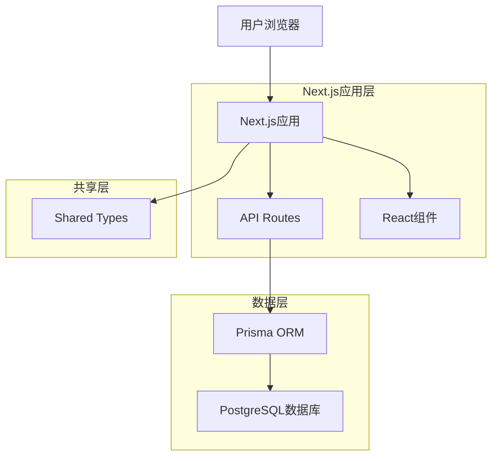

# Next.js架构重构共识文档

## 1. 明确的需求描述

### 1.1 核心需求
将现有的前后端分离图库管理应用重构为基于Next.js的统一应用架构，优先完成登录页面的迁移和改造。

### 1.2 具体目标
1. **登录功能迁移**：将现有React登录页面迁移到Next.js应用中
2. **认证API整合**：使用Next.js API Routes替代部分后端认证服务
3. **类型系统复用**：复用shared模块的TypeScript类型定义
4. **UI优化升级**：升级到TailwindCSS 4，优化用户体验
5. **架构简化**：减少部署复杂度，统一技术栈

## 2. 验收标准

### 2.1 功能验收标准
- [ ] **登录页面渲染**：页面正常加载，UI元素完整显示
- [ ] **表单交互**：用户名/密码输入，表单验证正常
- [ ] **认证流程**：登录请求成功，JWT Token正确生成和存储
- [ ] **错误处理**：网络错误、认证失败等异常情况正确处理
- [ ] **会话管理**：登录状态持久化，页面刷新后状态保持
- [ ] **路由保护**：未登录用户正确重定向到登录页面
- [ ] **安全性**：密码加密、Token安全存储、CSRF防护

### 2.2 技术验收标准
- [ ] **TypeScript支持**：无类型错误，类型定义完整
- [ ] **响应式设计**：移动端和桌面端适配良好
- [ ] **性能指标**：页面加载时间不超过现有实现
- [ ] **代码质量**：ESLint检查通过，代码结构清晰
- [ ] **兼容性**：与现有数据库和用户数据完全兼容

### 2.3 集成验收标准
- [ ] **数据库连接**：Prisma正常连接，用户数据读取正确
- [ ] **类型兼容**：shared模块类型定义正确导入使用
- [ ] **API兼容**：认证接口与现有客户端兼容
- [ ] **部署就绪**：Next.js应用可独立部署运行

## 3. 技术实现方案

### 3.1 架构设计



### 3.2 技术栈确认
- **前端框架**：Next.js 15.5.3 + React 19
- **样式系统**：TailwindCSS 4
- **类型系统**：TypeScript 5
- **数据层**：Prisma ORM + PostgreSQL
- **认证方案**：JWT + httpOnly Cookies
- **状态管理**：React Context API

### 3.3 目录结构设计

```
packages/pixishelf/
├── src/
│   ├── app/
│   │   ├── api/
│   │   │   └── auth/
│   │   │       └── login/
│   │   │           └── route.ts
│   │   ├── login/
│   │   │   └── page.tsx
│   │   ├── (protected)/
│   │   │   └── dashboard/
│   │   │       └── page.tsx
│   │   ├── layout.tsx
│   │   └── page.tsx
│   ├── components/
│   │   ├── ui/
│   │   └── auth/
│   │       └── LoginForm.tsx
│   ├── lib/
│   │   ├── auth.ts
│   │   ├── prisma.ts
│   │   └── utils.ts
│   ├── types/
│   │   └── index.ts
│   └── middleware.ts
└── prisma/
    └── schema.prisma
```

### 3.4 核心组件设计

#### 3.4.1 认证API (app/api/auth/login/route.ts)
- 接收POST请求，验证用户凭据
- 使用bcrypt验证密码
- 生成JWT Token
- 设置httpOnly Cookie
- 返回用户信息

#### 3.4.2 登录页面 (app/login/page.tsx)
- 服务端渲染的登录页面
- 集成LoginForm组件
- 处理认证状态重定向

#### 3.4.3 登录表单组件 (components/auth/LoginForm.tsx)
- 用户名/密码输入表单
- 客户端状态管理
- 表单验证和错误处理
- 加载状态显示

#### 3.4.4 认证中间件 (middleware.ts)
- JWT Token验证
- 路由保护逻辑
- 自动重定向处理

## 4. 技术约束

### 4.1 兼容性约束
- 必须与现有PostgreSQL数据库兼容
- 保持现有用户表结构不变
- JWT Token格式保持一致
- 密码加密方式不变（bcrypt）

### 4.2 安全约束
- 使用httpOnly Cookies存储Token
- 实现CSRF保护
- 密码传输加密
- 会话超时处理

### 4.3 性能约束
- 页面首次加载时间 < 2秒
- 登录响应时间 < 1秒
- 支持并发用户数不低于现有系统

## 5. 集成方案

### 5.1 数据库集成
- 复用现有Prisma schema配置
- 保持数据库连接字符串
- 迁移必要的Prisma客户端配置

### 5.2 类型系统集成
- 从shared模块导入认证相关类型
- 扩展Next.js特定的类型定义
- 保持类型定义的一致性

### 5.3 样式系统集成
- 迁移现有TailwindCSS配置
- 升级到TailwindCSS 4语法
- 保持设计系统一致性

## 6. 任务边界限制

### 6.1 包含范围
- 登录页面UI和交互逻辑
- 认证API Routes实现
- 基础的会话管理
- 路由保护中间件
- 必要的类型定义

### 6.2 不包含范围
- 其他业务页面迁移
- 复杂的状态管理重构
- 数据库结构变更
- 现有API服务的完全替换
- 高级认证功能（如2FA）

## 7. 实施策略

### 7.1 迁移策略
1. **渐进式迁移**：保持现有系统运行，逐步迁移功能
2. **功能对等**：确保迁移后功能不丢失
3. **向后兼容**：保持与现有数据和接口的兼容性
4. **测试驱动**：每个功能完成后立即测试验证

### 7.2 风险缓解
- 保留现有API服务作为备用方案
- 分阶段部署，支持快速回滚
- 充分的功能测试和集成测试
- 详细的文档记录变更内容

## 8. 质量保证

### 8.1 代码质量
- 遵循Next.js最佳实践
- 使用ESLint和Prettier代码规范
- TypeScript严格模式
- 组件化和模块化设计

### 8.2 测试策略
- 单元测试：核心认证逻辑
- 集成测试：API Routes功能
- E2E测试：完整登录流程
- 手动测试：UI交互和用户体验

### 8.3 文档要求
- API接口文档
- 组件使用文档
- 部署配置文档
- 故障排除指南

## 9. 确认的不确定性解决

### 9.1 认证策略 ✅
**决策**：使用自定义JWT实现，保持与现有系统兼容
**理由**：避免引入额外复杂性，保持迁移的可控性

### 9.2 API整合策略 ✅
**决策**：渐进式迁移，从认证API开始
**理由**：降低风险，支持逐步验证和调整

### 9.3 状态管理方案 ✅
**决策**：使用React Context API
**理由**：简单有效，符合Next.js应用模式

### 9.4 样式系统 ✅
**决策**：升级到TailwindCSS 4
**理由**：保持技术栈现代化，提升开发体验

## 10. 最终确认

本共识文档已明确：
- ✅ 具体的需求描述和验收标准
- ✅ 详细的技术实现方案
- ✅ 明确的技术约束和集成方案
- ✅ 清晰的任务边界限制
- ✅ 所有关键不确定性已解决

**状态**：已确认，可进入架构设计阶段

---

**文档版本**：v1.0  
**创建时间**：2024年  
**确认人**：SOLO Document  
**状态**：已确认