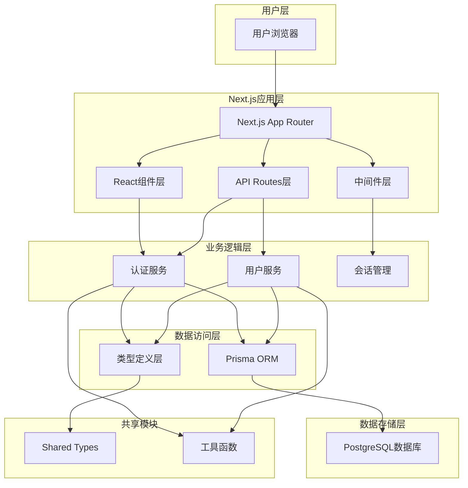
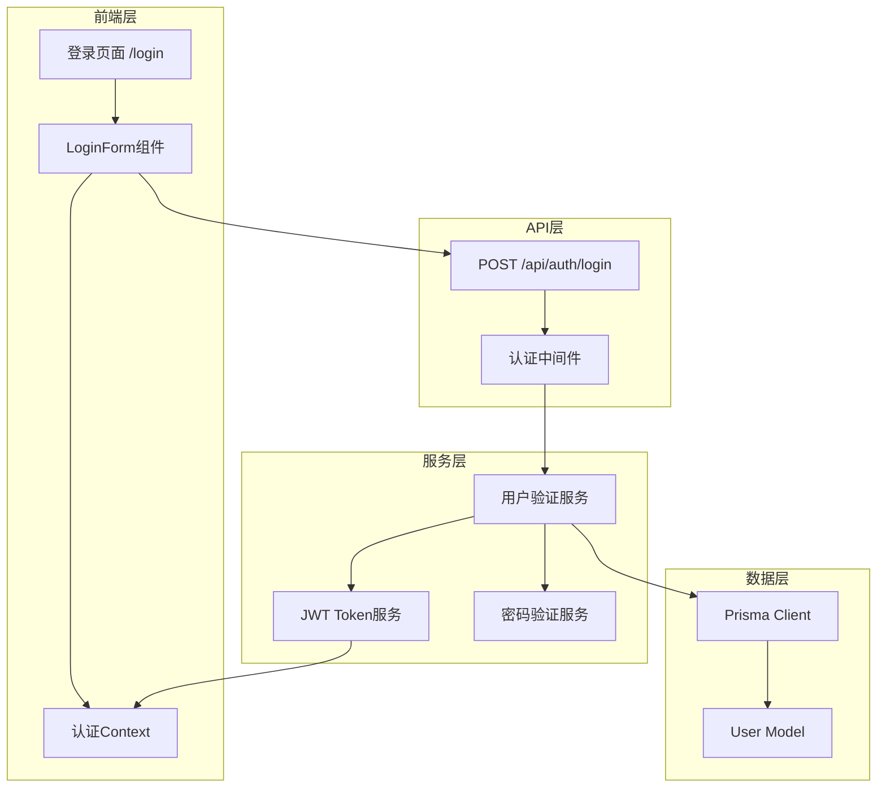
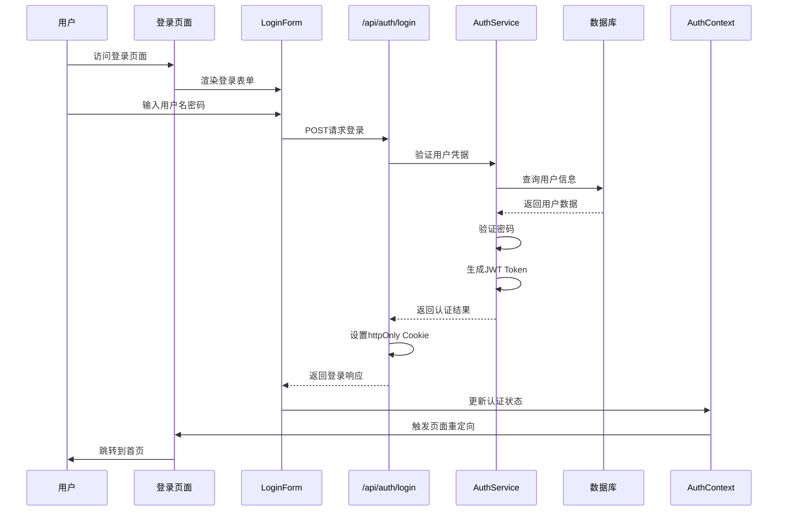
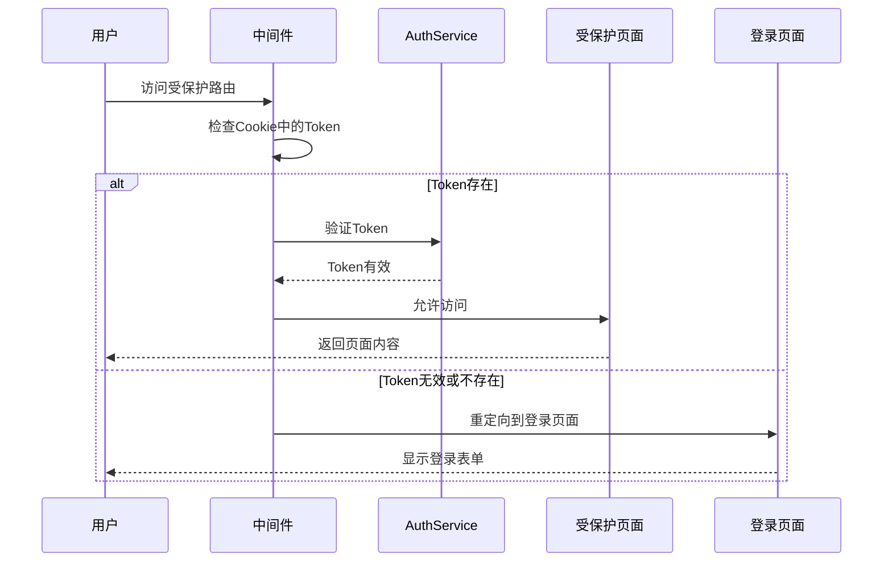
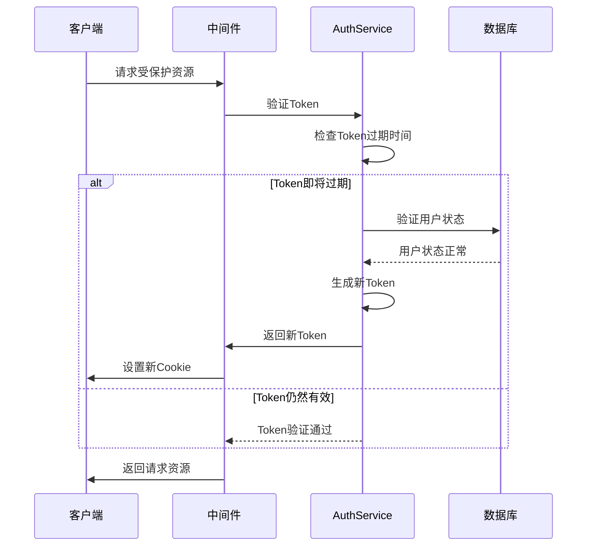

# Next.js架构重构设计文档

## 1. 系统架构设计

### 1.1 整体架构图



### 1.2 登录功能架构图



## 2. 分层设计和核心组件

### 2.1 表现层 (Presentation Layer)

#### 2.1.1 页面组件
- **登录页面** (`app/login/page.tsx`)
  - 服务端渲染的登录页面
  - 处理认证状态重定向
  - 集成SEO优化

- **根布局** (`app/layout.tsx`)
  - 全局样式和元数据
  - 认证状态提供者
  - 错误边界处理

#### 2.1.2 UI组件
- **LoginForm组件** (`components/auth/LoginForm.tsx`)
  - 用户名/密码输入表单
  - 客户端状态管理
  - 表单验证和错误处理
  - 加载状态显示

- **UI基础组件** (`components/ui/`)
  - Button, Input, Card等复用组件
  - 保持与现有设计系统一致

### 2.2 业务逻辑层 (Business Logic Layer)

#### 2.2.1 认证服务 (`lib/auth.ts`)
```typescript
interface AuthService {
  validateUser(username: string, password: string): Promise<User | null>
  generateToken(user: User): string
  verifyToken(token: string): Promise<User | null>
  hashPassword(password: string): Promise<string>
  comparePassword(password: string, hash: string): Promise<boolean>
}
```

#### 2.2.2 会话管理 (`lib/session.ts`)
```typescript
interface SessionManager {
  createSession(user: User): Promise<string>
  getSession(token: string): Promise<Session | null>
  destroySession(token: string): Promise<void>
  refreshSession(token: string): Promise<string>
}
```

### 2.3 API路由层 (API Routes Layer)

#### 2.3.1 认证API (`app/api/auth/login/route.ts`)
- 处理POST请求
- 用户凭据验证
- JWT Token生成
- httpOnly Cookie设置
- 错误响应处理

### 2.4 中间件层 (Middleware Layer)

#### 2.4.1 认证中间件 (`middleware.ts`)
- JWT Token验证
- 路由保护逻辑
- 自动重定向处理
- 会话刷新机制

### 2.5 数据访问层 (Data Access Layer)

#### 2.5.1 Prisma客户端 (`lib/prisma.ts`)
- 数据库连接管理
- 查询优化
- 连接池配置

#### 2.5.2 用户仓储 (`lib/repositories/user.ts`)
```typescript
interface UserRepository {
  findByUsername(username: string): Promise<User | null>
  findById(id: number): Promise<User | null>
  create(userData: CreateUserData): Promise<User>
  update(id: number, userData: UpdateUserData): Promise<User>
}
```

## 3. 模块依赖关系图

```mermaid
graph TD
    subgraph "页面层"
        A[app/login/page.tsx]
        B[app/layout.tsx]
    end
    
    subgraph "组件层"
        C[components/auth/LoginForm.tsx]
        D[components/ui/*]
    end
    
    subgraph "API层"
        E[app/api/auth/login/route.ts]
        F[middleware.ts]
    end
    
    subgraph "服务层"
        G[lib/auth.ts]
        H[lib/session.ts]
        I[lib/repositories/user.ts]
    end
    
    subgraph "数据层"
        J[lib/prisma.ts]
        K[prisma/schema.prisma]
    end
    
    subgraph "类型层"
        L[types/index.ts]
        M[@pixishelf/shared]
    end
    
    subgraph "工具层"
        N[lib/utils.ts]
        O[lib/constants.ts]
    end
    
    A --> C
    A --> B
    C --> D
    C --> E
    E --> F
    E --> G
    G --> H
    G --> I
    I --> J
    J --> K
    G --> L
    I --> L
    L --> M
    G --> N
    H --> N
    I --> O
```

## 4. 接口契约定义

### 4.1 API接口契约

#### 4.1.1 登录接口
```typescript
// POST /api/auth/login
interface LoginRequest {
  username: string
  password: string
}

interface LoginResponse {
  success: boolean
  user?: {
    id: number
    username: string
  }
  error?: string
}

// HTTP状态码
// 200: 登录成功
// 400: 请求参数错误
// 401: 认证失败
// 500: 服务器内部错误
```

#### 4.1.2 会话验证接口
```typescript
// GET /api/auth/me
interface UserInfoResponse {
  success: boolean
  user?: {
    id: number
    username: string
  }
  error?: string
}
```

### 4.2 组件接口契约

#### 4.2.1 LoginForm组件
```typescript
interface LoginFormProps {
  onSuccess?: (user: User) => void
  onError?: (error: string) => void
  redirectTo?: string
  className?: string
}

interface LoginFormState {
  username: string
  password: string
  isLoading: boolean
  error: string | null
}
```

#### 4.2.2 认证Context
```typescript
interface AuthContextValue {
  user: User | null
  isLoading: boolean
  login: (username: string, password: string) => Promise<void>
  logout: () => Promise<void>
  refreshUser: () => Promise<void>
}
```

### 4.3 服务接口契约

#### 4.3.1 认证服务
```typescript
interface AuthService {
  validateCredentials(username: string, password: string): Promise<User | null>
  generateAccessToken(user: User): string
  verifyAccessToken(token: string): Promise<User | null>
  createSession(user: User): Promise<Session>
  destroySession(sessionId: string): Promise<void>
}
```

## 5. 数据流向图

### 5.1 登录流程数据流



### 5.2 路由保护数据流



### 5.3 会话刷新数据流



## 6. 异常处理策略

### 6.1 前端异常处理

#### 6.1.1 组件级异常处理
```typescript
// LoginForm组件异常处理
interface ErrorState {
  type: 'validation' | 'network' | 'auth' | 'server'
  message: string
  field?: string
}

// 错误处理策略
const handleError = (error: Error): ErrorState => {
  if (error instanceof ValidationError) {
    return { type: 'validation', message: error.message, field: error.field }
  }
  if (error instanceof NetworkError) {
    return { type: 'network', message: '网络连接失败，请检查网络设置' }
  }
  if (error instanceof AuthError) {
    return { type: 'auth', message: '用户名或密码错误' }
  }
  return { type: 'server', message: '服务器内部错误，请稍后重试' }
}
```

#### 6.1.2 全局异常处理
```typescript
// app/layout.tsx中的错误边界
interface ErrorBoundaryState {
  hasError: boolean
  error?: Error
}

class AuthErrorBoundary extends Component<Props, ErrorBoundaryState> {
  static getDerivedStateFromError(error: Error): ErrorBoundaryState {
    return { hasError: true, error }
  }
  
  componentDidCatch(error: Error, errorInfo: ErrorInfo) {
    console.error('认证错误:', error, errorInfo)
    // 发送错误报告到监控系统
  }
}
```

### 6.2 API异常处理

#### 6.2.1 API Routes异常处理
```typescript
// app/api/auth/login/route.ts
export async function POST(request: Request) {
  try {
    const body = await request.json()
    
    // 输入验证
    if (!body.username || !body.password) {
      return NextResponse.json(
        { success: false, error: '用户名和密码不能为空' },
        { status: 400 }
      )
    }
    
    // 业务逻辑处理
    const user = await authService.validateCredentials(body.username, body.password)
    
    if (!user) {
      return NextResponse.json(
        { success: false, error: '用户名或密码错误' },
        { status: 401 }
      )
    }
    
    // 成功响应
    const token = authService.generateAccessToken(user)
    const response = NextResponse.json({
      success: true,
      user: { id: user.id, username: user.username }
    })
    
    response.cookies.set('auth-token', token, {
      httpOnly: true,
      secure: process.env.NODE_ENV === 'production',
      sameSite: 'strict',
      maxAge: 60 * 60 * 24 * 7 // 7天
    })
    
    return response
    
  } catch (error) {
    console.error('登录API错误:', error)
    
    if (error instanceof ValidationError) {
      return NextResponse.json(
        { success: false, error: error.message },
        { status: 400 }
      )
    }
    
    if (error instanceof DatabaseError) {
      return NextResponse.json(
        { success: false, error: '数据库连接失败' },
        { status: 500 }
      )
    }
    
    return NextResponse.json(
      { success: false, error: '服务器内部错误' },
      { status: 500 }
    )
  }
}
```

### 6.3 中间件异常处理

#### 6.3.1 认证中间件异常处理
```typescript
// middleware.ts
export async function middleware(request: NextRequest) {
  try {
    const token = request.cookies.get('auth-token')?.value
    
    if (!token) {
      return redirectToLogin(request)
    }
    
    const user = await authService.verifyAccessToken(token)
    
    if (!user) {
      return redirectToLogin(request)
    }
    
    // Token即将过期，刷新Token
    if (shouldRefreshToken(token)) {
      const newToken = authService.generateAccessToken(user)
      const response = NextResponse.next()
      response.cookies.set('auth-token', newToken, {
        httpOnly: true,
        secure: process.env.NODE_ENV === 'production',
        sameSite: 'strict',
        maxAge: 60 * 60 * 24 * 7
      })
      return response
    }
    
    return NextResponse.next()
    
  } catch (error) {
    console.error('中间件认证错误:', error)
    
    // 认证失败，重定向到登录页面
    return redirectToLogin(request)
  }
}

function redirectToLogin(request: NextRequest) {
  const loginUrl = new URL('/login', request.url)
  loginUrl.searchParams.set('redirect', request.nextUrl.pathname)
  return NextResponse.redirect(loginUrl)
}
```

### 6.4 数据库异常处理

#### 6.4.1 Prisma异常处理
```typescript
// lib/repositories/user.ts
export class UserRepository {
  async findByUsername(username: string): Promise<User | null> {
    try {
      return await prisma.user.findUnique({
        where: { username }
      })
    } catch (error) {
      if (error instanceof PrismaClientKnownRequestError) {
        if (error.code === 'P2002') {
          throw new DatabaseError('用户名已存在')
        }
      }
      
      if (error instanceof PrismaClientUnknownRequestError) {
        throw new DatabaseError('数据库查询失败')
      }
      
      throw new DatabaseError('数据库连接失败')
    }
  }
}
```

### 6.5 异常监控和日志

#### 6.5.1 错误日志记录
```typescript
// lib/logger.ts
interface LogContext {
  userId?: number
  sessionId?: string
  userAgent?: string
  ip?: string
  timestamp: Date
}

export class Logger {
  static error(message: string, error: Error, context?: LogContext) {
    const logEntry = {
      level: 'error',
      message,
      error: {
        name: error.name,
        message: error.message,
        stack: error.stack
      },
      context,
      timestamp: new Date().toISOString()
    }
    
    console.error(JSON.stringify(logEntry))
    
    // 发送到外部监控服务
    if (process.env.NODE_ENV === 'production') {
      // sendToMonitoringService(logEntry)
    }
  }
}
```

## 7. 安全设计

### 7.1 认证安全
- JWT Token使用强密钥签名
- httpOnly Cookie防止XSS攻击
- SameSite属性防止CSRF攻击
- Token过期时间合理设置
- 密码使用bcrypt加密存储

### 7.2 输入验证
- 前端表单验证
- 后端API参数验证
- SQL注入防护（Prisma ORM）
- XSS防护（输入转义）

### 7.3 会话管理
- 会话超时机制
- 并发会话限制
- 会话状态同步
- 安全登出处理

## 8. 性能优化

### 8.1 前端性能
- 组件懒加载
- 静态资源优化
- 代码分割
- 缓存策略

### 8.2 API性能
- 数据库查询优化
- 连接池配置
- 响应缓存
- 请求限流

### 8.3 部署优化
- Next.js静态生成
- CDN配置
- 压缩优化
- 监控告警

---

**文档版本**：v1.0  
**创建时间**：2024年  
**设计人**：SOLO Document  
**状态**：设计完成，待审核