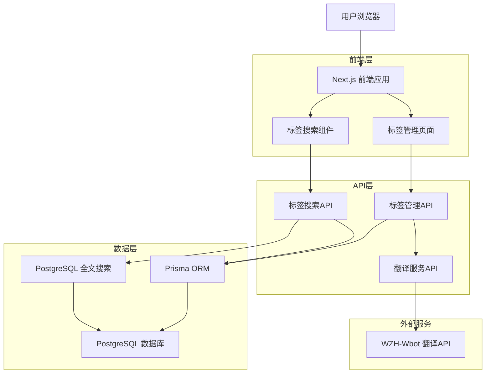
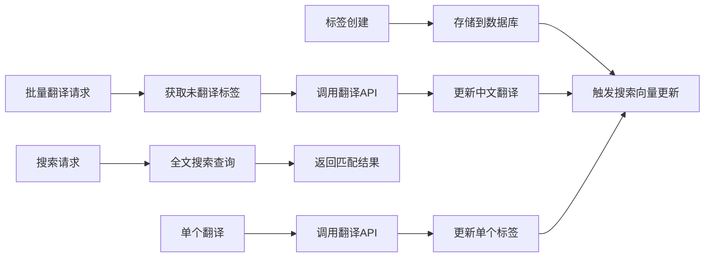
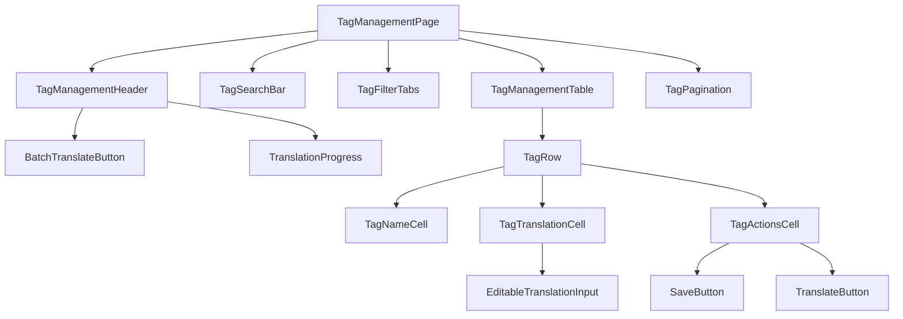

# 标签系统改造 - 技术架构设计文档

## 1. 架构设计

### 1.1 整体系统架构



### 1.2 数据流架构



## 2. 技术栈描述

- **前端**: React@18 + Next.js@14 + TypeScript + Tailwind CSS
- **后端**: Next.js API Routes + Prisma ORM
- **数据库**: PostgreSQL (支持全文搜索)
- **翻译服务**: WZH-Wbot API (基于 Google Gemini)
- **状态管理**: React Query + Zustand
- **UI组件**: Radix UI + Lucide Icons

## 3. 数据库设计

### 3.1 Prisma Schema 修改

```prisma
model Tag {
  id           Int          @id @default(autoincrement())
  name         String       @unique
  name_zh      String?      // 新增：中文翻译
  description  String?
  artworkCount Int          @default(0)
  createdAt    DateTime     @default(now())
  updatedAt    DateTime     @updatedAt
  artworkTags  ArtworkTag[]

  // 索引优化
  @@index([name])
  @@index([name_zh])
  @@index([artworkCount], map: "Tag_artworkCount_idx")
  
  // 全文搜索支持
  @@index([name, name_zh], type: Gin, map: "Tag_fulltext_idx")
}
```

### 3.2 全文搜索实现

```sql
-- 创建全文搜索索引
CREATE INDEX CONCURRENTLY tag_search_idx ON "Tag" 
USING GIN (to_tsvector('simple', COALESCE(name, '') || ' ' || COALESCE(name_zh, '')));

-- 创建触发器函数
CREATE OR REPLACE FUNCTION update_tag_search_vector()
RETURNS TRIGGER AS $$
BEGIN
    -- 更新搜索向量
    NEW.search_vector := to_tsvector('simple', 
        COALESCE(NEW.name, '') || ' ' || COALESCE(NEW.name_zh, '')
    );
    RETURN NEW;
END;
$$ LANGUAGE plpgsql;

-- 创建触发器
CREATE TRIGGER tag_search_vector_update
    BEFORE INSERT OR UPDATE ON "Tag"
    FOR EACH ROW EXECUTE FUNCTION update_tag_search_vector();
```

## 4. API 接口设计

### 4.1 标签管理相关API

#### GET /api/tags/management
获取标签管理列表（支持搜索和分页）

**请求参数:**
| 参数名 | 类型 | 必需 | 描述 |
|--------|------|------|------|
| page | number | 否 | 页码，默认1 |
| limit | number | 否 | 每页数量，默认30 |
| search | string | 否 | 搜索关键词 |
| filter | string | 否 | 筛选条件：all/translated/untranslated |

**响应格式:**
```typescript
interface TagManagementResponse {
  success: boolean
  data: {
    tags: Array<{
      id: number
      name: string
      name_zh: string | null
      artworkCount: number
      createdAt: string
      updatedAt: string
    }>
    pagination: {
      page: number
      limit: number
      total: number
      totalPages: number
    }
    stats: {
      totalTags: number
      translatedTags: number
      untranslatedTags: number
    }
  }
}
```

#### PUT /api/tags/[id]/translation
更新单个标签的中文翻译

**请求体:**
```typescript
{
  name_zh: string
}
```

**响应格式:**
```typescript
{
  success: boolean
  data: {
    id: number
    name: string
    name_zh: string
    updatedAt: string
  }
}
```

#### POST /api/tags/batch-translate
批量翻译标签

**请求体:**
```typescript
{
  tagIds?: number[]  // 可选，指定标签ID，不传则翻译所有未翻译的
  batchSize?: number // 可选，批次大小，默认20
}
```

**响应格式:**
```typescript
{
  success: boolean
  data: {
    taskId: string
    message: string
    estimatedCount: number
  }
}
```

#### GET /api/tags/translate-status/[taskId]
查询翻译任务状态

**响应格式:**
```typescript
{
  success: boolean
  data: {
    taskId: string
    status: 'pending' | 'running' | 'completed' | 'failed'
    progress: {
      total: number
      completed: number
      failed: number
    }
    startTime: string
    endTime?: string
    error?: string
  }
}
```

### 4.2 翻译服务集成

#### 翻译API封装
```typescript
interface TranslationService {
  translateText(text: string): Promise<TranslationResult>
  translateBatch(texts: string[]): Promise<TranslationResult[]>
}

interface TranslationResult {
  originalText: string
  translatedText: string
  usage: {
    promptTokens: number
    completionTokens: number
    totalTokens: number
  }
  success: boolean
  error?: string
}

interface WZHBotResponse {
  response: {
    translated_text: string
    usage: {
      prompt_tokens: number
      completion_tokens: number
      total_tokens: number
    }
  }
}
```

## 5. 前端组件架构

### 5.1 组件层次结构



### 5.2 状态管理设计

```typescript
// Zustand Store
interface TagManagementStore {
  // 状态
  tags: Tag[]
  loading: boolean
  pagination: PaginationInfo
  searchQuery: string
  filter: 'all' | 'translated' | 'untranslated'
  translationTasks: Map<string, TranslationTask>
  
  // 操作
  setTags: (tags: Tag[]) => void
  updateTag: (id: number, updates: Partial<Tag>) => void
  setLoading: (loading: boolean) => void
  setPagination: (pagination: PaginationInfo) => void
  setSearchQuery: (query: string) => void
  setFilter: (filter: string) => void
  addTranslationTask: (task: TranslationTask) => void
  updateTranslationTask: (taskId: string, updates: Partial<TranslationTask>) => void
}

// React Query Keys
export const tagQueryKeys = {
  all: ['tags'] as const,
  management: () => [...tagQueryKeys.all, 'management'] as const,
  managementList: (params: TagManagementParams) => 
    [...tagQueryKeys.management(), 'list', params] as const,
  translationStatus: (taskId: string) => 
    [...tagQueryKeys.all, 'translation-status', taskId] as const,
}
```

## 6. 翻译服务实现方案

### 6.1 翻译服务类设计

```typescript
class WZHBotTranslationService implements TranslationService {
  private readonly apiUrl = 'https://aify.api.ecylt.top'
  private readonly retryConfig = {
    maxRetries: 3,
    retryDelay: 1000,
    backoffMultiplier: 2
  }
  
  async translateText(text: string): Promise<TranslationResult> {
    return this.withRetry(() => this.callTranslationAPI(text))
  }
  
  async translateBatch(texts: string[], batchSize = 20): Promise<TranslationResult[]> {
    const batches = this.chunkArray(texts, batchSize)
    const results: TranslationResult[] = []
    
    for (const batch of batches) {
      const batchResults = await Promise.allSettled(
        batch.map(text => this.translateText(text))
      )
      
      results.push(...this.processBatchResults(batchResults))
      
      // 添加延迟避免API限流
      await this.delay(500)
    }
    
    return results
  }
  
  private async withRetry<T>(operation: () => Promise<T>): Promise<T> {
    let lastError: Error
    
    for (let attempt = 1; attempt <= this.retryConfig.maxRetries; attempt++) {
      try {
        return await operation()
      } catch (error) {
        lastError = error as Error
        
        if (attempt < this.retryConfig.maxRetries) {
          const delay = this.retryConfig.retryDelay * 
            Math.pow(this.retryConfig.backoffMultiplier, attempt - 1)
          await this.delay(delay)
        }
      }
    }
    
    throw lastError!
  }
  
  private async callTranslationAPI(text: string): Promise<TranslationResult> {
    const url = `${this.apiUrl}?text=${encodeURIComponent(text)}`
    
    const response = await fetch(url, {
      method: 'GET',
      headers: {
        'Accept': 'application/json',
        'User-Agent': 'PixiShelf-TagTranslation/1.0'
      },
      timeout: 10000
    })
    
    if (!response.ok) {
      throw new Error(`Translation API error: ${response.status} ${response.statusText}`)
    }
    
    const data: WZHBotResponse = await response.json()
    
    return {
      originalText: text,
      translatedText: data.response.translated_text,
      usage: {
        promptTokens: data.response.usage.prompt_tokens,
        completionTokens: data.response.usage.completion_tokens,
        totalTokens: data.response.usage.total_tokens
      },
      success: true
    }
  }
}
```

### 6.2 批量翻译任务管理

```typescript
class TranslationTaskManager {
  private tasks = new Map<string, TranslationTask>()
  
  async startBatchTranslation(
    tagIds: number[] | null,
    batchSize = 20
  ): Promise<string> {
    const taskId = this.generateTaskId()
    const task: TranslationTask = {
      id: taskId,
      status: 'pending',
      progress: { total: 0, completed: 0, failed: 0 },
      startTime: new Date().toISOString(),
      tagIds
    }
    
    this.tasks.set(taskId, task)
    
    // 异步执行翻译任务
    this.executeBatchTranslation(taskId, tagIds, batchSize)
      .catch(error => {
        this.updateTaskStatus(taskId, 'failed', { error: error.message })
      })
    
    return taskId
  }
  
  private async executeBatchTranslation(
    taskId: string,
    tagIds: number[] | null,
    batchSize: number
  ): Promise<void> {
    const task = this.tasks.get(taskId)!
    
    try {
      // 获取需要翻译的标签
      const tagsToTranslate = await this.getTagsToTranslate(tagIds)
      
      this.updateTaskProgress(taskId, {
        total: tagsToTranslate.length,
        completed: 0,
        failed: 0
      })
      
      this.updateTaskStatus(taskId, 'running')
      
      const translationService = new WZHBotTranslationService()
      const batches = this.chunkArray(tagsToTranslate, batchSize)
      
      for (const batch of batches) {
        await this.processBatch(taskId, batch, translationService)
      }
      
      this.updateTaskStatus(taskId, 'completed', {
        endTime: new Date().toISOString()
      })
      
    } catch (error) {
      this.updateTaskStatus(taskId, 'failed', {
        error: error instanceof Error ? error.message : 'Unknown error',
        endTime: new Date().toISOString()
      })
    }
  }
}
```

## 7. 性能优化方案

### 7.1 数据库优化

1. **索引策略**
   - 为 `name` 和 `name_zh` 字段创建复合索引
   - 使用 GIN 索引支持全文搜索
   - 为 `artworkCount` 创建索引支持排序

2. **查询优化**
   - 使用 PostgreSQL 的 `to_tsvector` 和 `to_tsquery` 进行全文搜索
   - 实现查询结果缓存
   - 使用连接池优化数据库连接

### 7.2 API性能优化

1. **缓存策略**
   - 使用 Redis 缓存热门标签查询结果
   - 实现标签搜索结果缓存
   - 缓存翻译结果避免重复调用

2. **并发控制**
   - 限制同时进行的翻译任务数量
   - 实现翻译API的速率限制
   - 使用队列管理批量翻译任务

### 7.3 前端性能优化

1. **虚拟化列表**
   - 对大量标签使用虚拟滚动
   - 实现懒加载和分页

2. **状态管理优化**
   - 使用 React Query 的缓存和后台更新
   - 实现乐观更新提升用户体验

## 8. 错误处理和监控

### 8.1 错误处理策略

1. **翻译API错误处理**
   - 网络超时重试机制
   - API限流处理
   - 降级策略（失败时跳过）

2. **数据库错误处理**
   - 事务回滚机制
   - 连接池错误恢复
   - 数据一致性检查

### 8.2 监控和日志

1. **翻译任务监控**
   - 任务执行状态跟踪
   - 成功率和失败率统计
   - 性能指标监控

2. **系统日志**
   - 翻译API调用日志
   - 错误日志和堆栈跟踪
   - 性能日志和慢查询监控

## 9. 部署和配置

### 9.1 环境变量配置

```env
# 翻译服务配置
TRANSLATION_API_URL=https://aify.api.ecylt.top
TRANSLATION_BATCH_SIZE=20
TRANSLATION_RETRY_COUNT=3
TRANSLATION_TIMEOUT=10000

# 数据库配置
DATABASE_URL=postgresql://...

# 缓存配置
REDIS_URL=redis://...
CACHE_TTL=3600
```

### 9.2 部署注意事项

1. **数据库迁移**
   - 使用 Prisma 迁移添加新字段
   - 创建全文搜索索引
   - 数据验证和清理

2. **服务部署**
   - 确保翻译API的网络连通性
   - 配置适当的超时和重试参数
   - 监控服务健康状态

这个架构设计确保了系统的可扩展性、性能和可维护性，同时提供了良好的用户体验和错误处理机制。