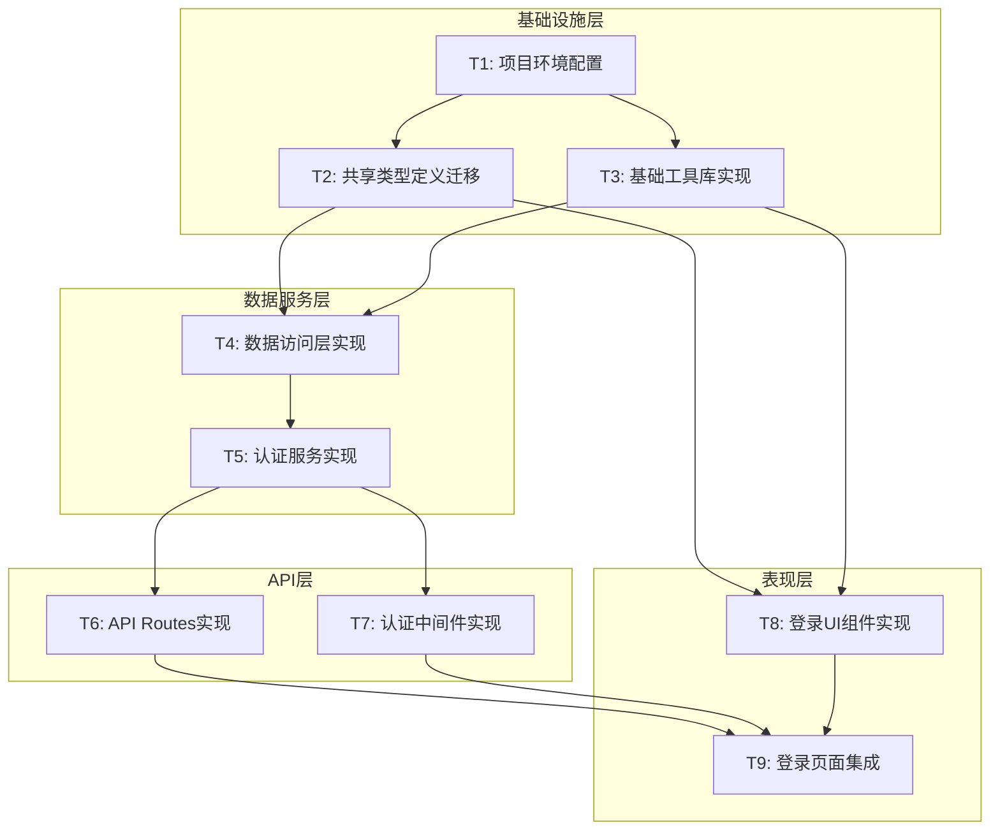

# Next.js架构重构任务分解文档

## 1. 任务概述

基于DESIGN_nextjs_refactor.md架构设计，将登录功能重构分解为8个原子任务，确保每个任务具有明确的输入输出契约、可独立验证且复杂度可控。

## 2. 任务依赖关系图

## 3. 原子任务详细定义

### T1: 项目环境配置

#### 输入契约
- **前置依赖**: 无
- **输入数据**: 现有pixishelf项目结构
- **环境依赖**: Node.js 22.18.0, pnpm包管理器

#### 输出契约
- **输出数据**: 配置完成的Next.js项目
- **交付物**:
  - 更新的package.json（添加必要依赖）
  - TailwindCSS 4配置文件
  - TypeScript配置优化
  - 环境变量配置文件
- **验收标准**:
  - [ ] 项目可正常启动（pnpm dev）
  - [ ] TypeScript编译无错误
  - [ ] TailwindCSS样式正常工作
  - [ ] 环境变量正确加载

#### 实现约束
- **技术栈**: Next.js 15.5.3, React 19, TailwindCSS 4, TypeScript 5
- **接口规范**: 保持与现有项目的兼容性
- **质量要求**: 配置文件清晰，注释完整

#### 依赖关系
- **后置任务**: T2, T3
- **并行任务**: 无

---

### T2: 共享类型定义迁移

#### 输入契约
- **前置依赖**: T1完成
- **输入数据**: packages/shared模块的类型定义
- **环境依赖**: 配置完成的Next.js项目

#### 输出契约
- **输出数据**: 迁移的类型定义文件
- **交付物**:
  - src/types/index.ts（核心类型定义）
  - src/types/auth.ts（认证相关类型）
  - src/types/api.ts（API接口类型）
- **验收标准**:
  - [ ] 所有认证相关类型正确导入
  - [ ] 类型定义与shared模块保持一致
  - [ ] TypeScript编译无类型错误
  - [ ] 类型导出路径正确配置

#### 实现约束
- **技术栈**: TypeScript 5
- **接口规范**: 保持与@pixishelf/shared的兼容性
- **质量要求**: 类型定义完整，文档注释清晰

#### 依赖关系
- **后置任务**: T4, T8
- **并行任务**: T3

---

### T3: 基础工具库实现

#### 输入契约
- **前置依赖**: T1完成
- **输入数据**: 现有web模块的工具函数
- **环境依赖**: 配置完成的Next.js项目

#### 输出契约
- **输出数据**: 基础工具函数库
- **交付物**:
  - src/lib/utils.ts（通用工具函数）
  - src/lib/constants.ts（常量定义）
  - src/lib/validators.ts（输入验证函数）
- **验收标准**:
  - [ ] 工具函数正常工作
  - [ ] 单元测试覆盖率>80%
  - [ ] 函数文档完整
  - [ ] 无外部依赖冲突

#### 实现约束
- **技术栈**: TypeScript 5, 可选择zod进行验证
- **接口规范**: 函数签名清晰，错误处理完善
- **质量要求**: 代码简洁，性能优化

#### 依赖关系
- **后置任务**: T4, T8
- **并行任务**: T2

---

### T4: 数据访问层实现

#### 输入契约
- **前置依赖**: T2, T3完成
- **输入数据**: 现有Prisma schema配置
- **环境依赖**: PostgreSQL数据库连接

#### 输出契约
- **输出数据**: 数据访问层实现
- **交付物**:
  - src/lib/prisma.ts（Prisma客户端配置）
  - src/lib/repositories/user.ts（用户数据仓储）
  - prisma/schema.prisma（复制的数据库模式）
- **验收标准**:
  - [ ] 数据库连接正常
  - [ ] 用户查询功能正常
  - [ ] 错误处理机制完善
  - [ ] 连接池配置优化

#### 实现约束
- **技术栈**: Prisma ORM, PostgreSQL
- **接口规范**: Repository模式，异步操作
- **质量要求**: 查询优化，异常处理完善

#### 依赖关系
- **后置任务**: T5
- **并行任务**: 无

---

### T5: 认证服务实现

#### 输入契约
- **前置依赖**: T4完成
- **输入数据**: 现有认证逻辑和JWT配置
- **环境依赖**: bcrypt, jsonwebtoken依赖

#### 输出契约
- **输出数据**: 完整的认证服务
- **交付物**:
  - src/lib/auth.ts（认证服务核心）
  - src/lib/session.ts（会话管理）
  - src/lib/crypto.ts（密码加密工具）
- **验收标准**:
  - [ ] 用户凭据验证正常
  - [ ] JWT Token生成和验证正常
  - [ ] 密码加密和比较正常
  - [ ] 会话管理功能完整

#### 实现约束
- **技术栈**: bcrypt, jsonwebtoken, TypeScript
- **接口规范**: 异步操作，错误处理完善
- **质量要求**: 安全性优先，性能优化

#### 依赖关系
- **后置任务**: T6, T7
- **并行任务**: 无

---

### T6: API Routes实现

#### 输入契约
- **前置依赖**: T5完成
- **输入数据**: 认证服务接口
- **环境依赖**: Next.js API Routes支持

#### 输出契约
- **输出数据**: 认证API端点
- **交付物**:
  - src/app/api/auth/login/route.ts（登录API）
  - src/app/api/auth/me/route.ts（用户信息API）
  - src/app/api/auth/logout/route.ts（登出API）
- **验收标准**:
  - [ ] POST /api/auth/login正常工作
  - [ ] GET /api/auth/me正常工作
  - [ ] POST /api/auth/logout正常工作
  - [ ] 错误响应格式正确
  - [ ] httpOnly Cookie设置正确

#### 实现约束
- **技术栈**: Next.js API Routes, TypeScript
- **接口规范**: RESTful API，JSON响应格式
- **质量要求**: 安全性验证，错误处理完善

#### 依赖关系
- **后置任务**: T9
- **并行任务**: T7, T8

---

### T7: 认证中间件实现

#### 输入契约
- **前置依赖**: T5完成
- **输入数据**: 认证服务接口
- **环境依赖**: Next.js中间件支持

#### 输出契约
- **输出数据**: 路由保护中间件
- **交付物**:
  - src/middleware.ts（认证中间件）
  - src/lib/middleware-utils.ts（中间件工具函数）
- **验收标准**:
  - [ ] 未认证用户正确重定向
  - [ ] 已认证用户正常访问
  - [ ] Token刷新机制正常
  - [ ] 路由匹配规则正确

#### 实现约束
- **技术栈**: Next.js Middleware, TypeScript
- **接口规范**: 中间件模式，异步处理
- **质量要求**: 性能优化，错误处理完善

#### 依赖关系
- **后置任务**: T9
- **并行任务**: T6, T8

---

### T8: 登录UI组件实现

#### 输入契约
- **前置依赖**: T2, T3完成
- **输入数据**: 现有登录页面设计
- **环境依赖**: TailwindCSS 4, React 19

#### 输出契约
- **输出数据**: 登录相关UI组件
- **交付物**:
  - src/components/auth/LoginForm.tsx（登录表单组件）
  - src/components/ui/Button.tsx（按钮组件）
  - src/components/ui/Input.tsx（输入框组件）
  - src/components/ui/Card.tsx（卡片组件）
  - src/contexts/AuthContext.tsx（认证上下文）
- **验收标准**:
  - [ ] 登录表单正常渲染
  - [ ] 表单验证正常工作
  - [ ] 错误状态正确显示
  - [ ] 加载状态正确显示
  - [ ] 响应式设计良好

#### 实现约束
- **技术栈**: React 19, TailwindCSS 4, TypeScript
- **接口规范**: React组件模式，Props类型定义
- **质量要求**: 用户体验优先，代码复用性高

#### 依赖关系
- **后置任务**: T9
- **并行任务**: T6, T7

---

### T9: 登录页面集成

#### 输入契约
- **前置依赖**: T6, T7, T8完成
- **输入数据**: API Routes, 中间件, UI组件
- **环境依赖**: 完整的Next.js应用环境

#### 输出契约
- **输出数据**: 完整的登录功能
- **交付物**:
  - src/app/login/page.tsx（登录页面）
  - src/app/layout.tsx（根布局更新）
  - src/app/page.tsx（首页重定向逻辑）
  - src/app/(protected)/dashboard/page.tsx（受保护页面示例）
- **验收标准**:
  - [ ] 登录流程完整工作
  - [ ] 认证状态正确管理
  - [ ] 路由保护正常工作
  - [ ] 错误处理机制完善
  - [ ] 用户体验流畅

#### 实现约束
- **技术栈**: Next.js App Router, React 19, TypeScript
- **接口规范**: Next.js页面组件模式
- **质量要求**: 功能完整性，性能优化

#### 依赖关系
- **后置任务**: 无（最终任务）
- **并行任务**: 无

## 4. 任务执行计划

### 4.1 执行顺序
1. **第一阶段（基础设施）**: T1 → T2, T3（并行）
2. **第二阶段（数据服务）**: T4 → T5
3. **第三阶段（API和UI）**: T6, T7, T8（并行）
4. **第四阶段（集成）**: T9

### 4.2 关键路径
T1 → T2 → T4 → T5 → T6 → T9

### 4.3 并行执行机会
- T2和T3可以并行执行
- T6、T7、T8可以并行执行

## 5. 风险评估和缓解策略

### 5.1 技术风险
- **风险**: TailwindCSS 4语法变更
- **缓解**: 提前验证样式兼容性，准备回退方案

- **风险**: Next.js API Routes与现有API不兼容
- **缓解**: 保持现有API服务运行，渐进式迁移

### 5.2 集成风险
- **风险**: 认证状态管理复杂性
- **缓解**: 充分测试各种认证场景

- **风险**: 数据库连接配置问题
- **缓解**: 复用现有Prisma配置，验证连接

## 6. 质量保证措施

### 6.1 代码质量
- 每个任务完成后进行代码审查
- 遵循TypeScript严格模式
- 使用ESLint和Prettier保持代码规范

### 6.2 测试策略
- 单元测试：核心业务逻辑
- 集成测试：API端点功能
- E2E测试：完整登录流程

### 6.3 文档要求
- 每个组件和函数都有完整的TypeScript类型定义
- 关键业务逻辑有详细注释
- API接口有完整的文档说明

## 7. 验收标准总览

### 7.1 功能验收
- [ ] 用户可以正常登录
- [ ] 登录状态正确持久化
- [ ] 未登录用户正确重定向
- [ ] 错误处理机制完善
- [ ] 会话管理功能正常

### 7.2 技术验收
- [ ] 所有TypeScript编译无错误
- [ ] 所有测试用例通过
- [ ] 代码覆盖率达到要求
- [ ] 性能指标满足要求
- [ ] 安全性检查通过

### 7.3 集成验收
- [ ] 与现有数据库正常连接
- [ ] 与shared模块类型兼容
- [ ] 部署配置正确
- [ ] 监控和日志正常工作

---

**文档版本**: v1.0  
**创建时间**: 2024年  
**任务负责人**: SOLO Document  
**状态**: 任务分解完成，待执行