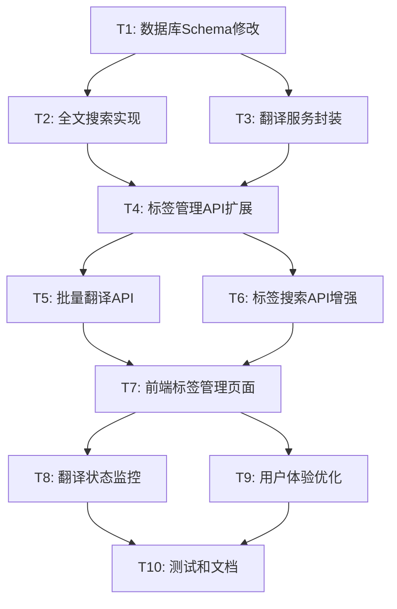

# 标签系统改造 - 任务分解文档

## 任务依赖关系图

## 原子任务详细定义

### T1: 数据库Schema修改
**优先级**: P0 (最高)
**预估工时**: 2小时
**复杂度**: 简单

#### 输入契约
- 现有的 Prisma schema.prisma 文件
- PostgreSQL 数据库连接

#### 输出契约
- 更新的 schema.prisma 文件，包含 name_zh 字段
- 成功执行的数据库迁移
- 新增的索引结构

#### 实现约束
- 使用 Prisma 迁移系统
- 确保向后兼容性
- name_zh 字段为可选 (nullable)

#### 验收标准
- [ ] schema.prisma 文件包含 name_zh 字段定义
- [ ] 数据库迁移成功执行
- [ ] 现有数据完整性保持
- [ ] 新字段索引创建成功

#### 具体实现步骤
1. 修改 `packages/pixishelf/prisma/schema.prisma`
2. 运行 `npx prisma migrate dev --name add_tag_name_zh`
3. 验证迁移结果

---

### T2: 全文搜索实现
**优先级**: P0
**预估工时**: 4小时
**复杂度**: 中等

#### 输入契约
- T1 完成的数据库结构
- PostgreSQL 支持全文搜索功能

#### 输出契约
- 全文搜索索引和触发器
- 搜索性能优化
- 中英文统一搜索能力

#### 实现约束
- 使用 PostgreSQL 原生全文搜索
- 支持中英文混合搜索
- 性能优化考虑

#### 验收标准
- [ ] 全文搜索索引创建成功
- [ ] 触发器自动更新搜索向量
- [ ] 中英文搜索功能正常
- [ ] 搜索性能满足要求 (<100ms)

#### 具体实现步骤
1. 创建自定义迁移文件
2. 添加全文搜索索引和触发器
3. 测试搜索功能和性能

---

### T3: 翻译服务封装
**优先级**: P1
**预估工时**: 3小时
**复杂度**: 中等

#### 输入契约
- WZH-Wbot API 接口文档
- API 调用限制和规范

#### 输出契约
- 翻译服务类 (TranslationService)
- 错误处理和重试机制
- 批量翻译支持

#### 实现约束
- TypeScript 实现
- 支持单个和批量翻译
- 包含重试和错误处理

#### 验收标准
- [ ] 翻译服务类实现完成
- [ ] 单个文本翻译功能正常
- [ ] 批量翻译功能正常
- [ ] 错误处理和重试机制有效
- [ ] 单元测试覆盖率 >80%

#### 具体实现步骤
1. 创建 `src/lib/services/translationService.ts`
2. 实现 WZHBotTranslationService 类
3. 添加错误处理和重试逻辑
4. 编写单元测试

---

### T4: 标签管理API扩展
**优先级**: P1
**预估工时**: 4小时
**复杂度**: 中等

#### 输入契约
- T1 完成的数据库结构
- 现有的标签API结构

#### 输出契约
- GET /api/tags/management 接口
- PUT /api/tags/[id]/translation 接口
- 完整的类型定义

#### 实现约束
- 遵循现有API设计模式
- 包含完整的错误处理
- 支持分页和筛选

#### 验收标准
- [ ] 管理列表API功能完整
- [ ] 单个翻译更新API正常
- [ ] 类型定义完整
- [ ] API文档更新
- [ ] 集成测试通过

#### 具体实现步骤
1. 创建 `src/app/api/tags/management/route.ts`
2. 创建 `src/app/api/tags/[id]/translation/route.ts`
3. 更新类型定义文件
4. 编写API测试

---

### T5: 批量翻译API
**优先级**: P1
**预估工时**: 5小时
**复杂度**: 复杂

#### 输入契约
- T3 完成的翻译服务
- T4 完成的基础API

#### 输出契约
- POST /api/tags/batch-translate 接口
- GET /api/tags/translate-status/[taskId] 接口
- 任务管理系统

#### 实现约束
- 异步任务处理
- 任务状态跟踪
- 错误恢复机制

#### 验收标准
- [ ] 批量翻译任务启动正常
- [ ] 任务状态查询功能完整
- [ ] 异步处理机制稳定
- [ ] 错误处理完善
- [ ] 性能测试通过

#### 具体实现步骤
1. 创建任务管理器类
2. 实现批量翻译API
3. 实现状态查询API
4. 添加任务持久化
5. 性能和压力测试

---

### T6: 标签搜索API增强
**优先级**: P1
**预估工时**: 3小时
**复杂度**: 中等

#### 输入契约
- T2 完成的全文搜索功能
- 现有的搜索API

#### 输出契约
- 增强的搜索API支持中英文
- 搜索性能优化
- 搜索结果排序优化

#### 实现约束
- 兼容现有搜索接口
- 支持中英文混合搜索
- 保持搜索性能

#### 验收标准
- [ ] 中英文搜索功能正常
- [ ] 搜索性能满足要求
- [ ] 搜索结果排序合理
- [ ] 向后兼容性保持

#### 具体实现步骤
1. 修改现有搜索API
2. 集成全文搜索功能
3. 优化搜索算法
4. 性能测试和调优

---

### T7: 前端标签管理页面
**优先级**: P2
**预估工时**: 6小时
**复杂度**: 复杂

#### 输入契约
- T4-T6 完成的API接口
- 现有的管理页面结构

#### 输出契约
- 完整的标签管理界面
- 翻译编辑功能
- 批量翻译操作界面

#### 实现约束
- 使用现有的UI组件库
- 响应式设计
- 良好的用户体验

#### 验收标准
- [ ] 标签列表显示正常
- [ ] 搜索和筛选功能完整
- [ ] 单个翻译编辑功能正常
- [ ] 批量翻译功能可用
- [ ] 响应式设计适配
- [ ] 用户体验流畅

#### 具体实现步骤
1. 设计组件结构
2. 实现标签管理表格
3. 添加翻译编辑功能
4. 实现批量翻译界面
5. 状态管理和数据流
6. 样式和交互优化

---

### T8: 翻译状态监控
**优先级**: P2
**预估工时**: 3小时
**复杂度**: 中等

#### 输入契约
- T5 完成的批量翻译API
- T7 完成的管理页面

#### 输出契约
- 实时翻译进度显示
- 任务状态监控界面
- 错误信息展示

#### 实现约束
- 实时状态更新
- 用户友好的进度显示
- 错误信息清晰

#### 验收标准
- [ ] 翻译进度实时更新
- [ ] 任务状态显示准确
- [ ] 错误信息展示清晰
- [ ] 用户可以取消任务

#### 具体实现步骤
1. 实现进度查询组件
2. 添加实时状态更新
3. 设计错误信息展示
4. 添加任务控制功能

---

### T9: 用户体验优化
**优先级**: P3
**预估工时**: 4小时
**复杂度**: 中等

#### 输入契约
- T7-T8 完成的基础功能
- 用户反馈和测试结果

#### 输出契约
- 优化的交互体验
- 性能优化
- 无障碍访问支持

#### 实现约束
- 保持功能完整性
- 提升用户体验
- 性能优化

#### 验收标准
- [ ] 页面加载速度优化
- [ ] 交互响应速度提升
- [ ] 无障碍访问支持
- [ ] 移动端适配优化

#### 具体实现步骤
1. 性能分析和优化
2. 交互体验改进
3. 无障碍访问实现
4. 移动端优化

---

### T10: 测试和文档
**优先级**: P3
**预估工时**: 4小时
**复杂度**: 简单

#### 输入契约
- 所有功能模块完成
- 系统集成测试环境

#### 输出契约
- 完整的测试套件
- 用户使用文档
- 开发者文档

#### 实现约束
- 测试覆盖率 >85%
- 文档完整清晰
- 部署指南详细

#### 验收标准
- [ ] 单元测试覆盖率达标
- [ ] 集成测试通过
- [ ] 用户文档完整
- [ ] 开发者文档详细
- [ ] 部署指南可用

#### 具体实现步骤
1. 编写单元测试
2. 执行集成测试
3. 编写用户文档
4. 编写开发者文档
5. 创建部署指南

## 风险评估和缓解策略

### 高风险项目
1. **T5: 批量翻译API** - 异步任务处理复杂
   - 缓解策略: 分阶段实现，先实现基础功能
   
2. **T7: 前端标签管理页面** - 用户体验要求高
   - 缓解策略: 原型设计，用户测试反馈

### 中风险项目
1. **T2: 全文搜索实现** - 数据库性能影响
   - 缓解策略: 性能测试，索引优化
   
2. **T3: 翻译服务封装** - 外部API依赖
   - 缓解策略: 错误处理，降级策略

## 资源需求

### 开发资源
- 后端开发: 18小时
- 前端开发: 13小时
- 测试和文档: 4小时
- **总计**: 35小时

### 技术资源
- PostgreSQL 数据库
- WZH-Wbot 翻译API访问
- 开发和测试环境

### 时间安排
- **第1周**: T1-T3 (基础设施)
- **第2周**: T4-T6 (API开发)
- **第3周**: T7-T9 (前端开发)
- **第4周**: T10 (测试和文档)

这个任务分解确保了每个任务都是原子性的、可独立验证的，并且有明确的依赖关系和验收标准。