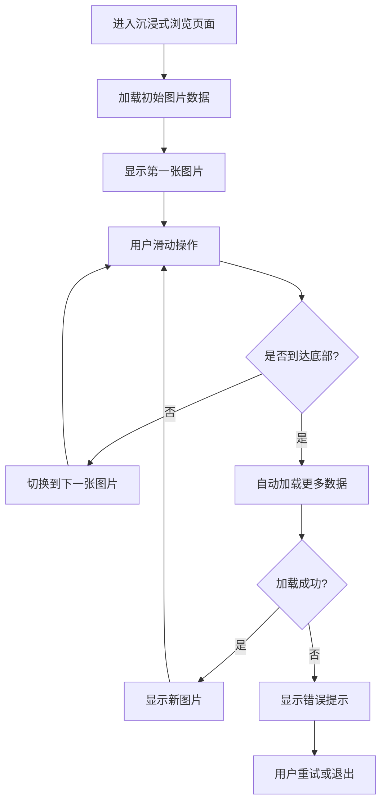

# 沉浸式图片浏览功能产品需求文档

## 1. Product Overview

本项目旨在为PixiShelf平台实现类似抖音/TikTok的沉浸式图片浏览功能，提供流畅的无限上下滑动体验。

- 核心目标：为用户提供沉浸式的图片浏览体验，支持无限滚动查看单张图片作品，提升用户粘性和浏览时长。
- 目标用户：移动端用户为主，PC端用户为辅，适用于所有希望快速浏览图片内容的用户。
- 市场价值：通过类似短视频的交互模式，提升图片内容的消费效率和用户体验，增强平台竞争力。

## 2. Core Features

### 2.1 Feature Module

本功能需求包含以下核心页面：

1. **沉浸式浏览页面**：全屏图片展示、垂直滑动切换、加载状态提示
2. **图片详情覆盖层**：作者信息、图片标题、操作按钮
3. **加载更多提示**：无限滚动加载提示、错误状态处理

### 2.2 Page Details

| Page Name | Module Name | Feature description |
|-----------|-------------|---------------------|
| 沉浸式浏览页面 | 图片展示容器 | 全屏显示单张图片，支持垂直方向滑动切换，自适应图片尺寸保持比例 |
| 沉浸式浏览页面 | 滑动控制器 | 支持触摸滑动、鼠标滚轮、键盘方向键操作，流畅的切换动画 |
| 沉浸式浏览页面 | 无限加载机制 | 滑动到底部自动加载更多图片，支持分页和缓存管理 |
| 图片详情覆盖层 | 作者信息展示 | 显示图片作者名称、用户名等基本信息 |
| 图片详情覆盖层 | 操作按钮组 | 提供点赞、收藏、分享等快捷操作入口 |
| 加载更多提示 | 加载状态指示 | 显示"加载中"、"继续滑动"等状态提示信息 |
| 加载更多提示 | 错误处理 | 网络错误、加载失败等异常情况的用户友好提示 |

## 3. Core Process

### 主要用户操作流程

用户进入沉浸式浏览页面后，可以通过垂直滑动（移动端触摸滑动、PC端鼠标滚轮或键盘方向键）来浏览图片。当滑动到当前加载内容的底部时，系统自动请求下一批图片数据并无缝加载。用户可以随时通过覆盖层的操作按钮进行点赞、收藏等交互。

## 4. User Interface Design

### 4.1 Design Style

- **主色调**：黑色背景(#000000)营造沉浸感，白色文字(#FFFFFF)确保可读性
- **次要色彩**：中性灰色(#404040)用于容器背景，半透明黑色(rgba(0,0,0,0.5))用于覆盖层
- **按钮样式**：圆角按钮设计，支持触摸友好的尺寸(最小44px)
- **字体设计**：系统默认字体，标题18px粗体，正文14px常规
- **布局风格**：全屏沉浸式设计，最小化UI元素干扰
- **图标风格**：使用Lucide React图标库，简洁线性风格

### 4.2 Page Design Overview

| Page Name | Module Name | UI Elements |
|-----------|-------------|-------------|
| 沉浸式浏览页面 | 主容器 | 全屏黑色背景，移动端100vw×100vh，PC端最大宽度420px居中显示 |
| 沉浸式浏览页面 | 图片展示区 | 图片居中显示，保持原始比例，支持contain模式适配 |
| 图片详情覆盖层 | 底部信息栏 | 半透明黑色背景，白色文字，左下角定位，包含作者信息 |
| 图片详情覆盖层 | 操作按钮 | 右侧垂直排列，圆形按钮，白色图标，半透明背景 |
| 加载提示 | 状态文字 | 居中显示，白色文字，简洁提示信息 |

### 4.3 Responsiveness

本功能采用移动端优先设计策略，在移动设备上提供全屏沉浸式体验。PC端通过限制容器最大宽度(420px)并居中显示来模拟移动端体验，同时启用鼠标滚轮和键盘操作以适配桌面端交互习惯。支持触摸交互优化，确保在各种设备上都能提供流畅的操作体验。