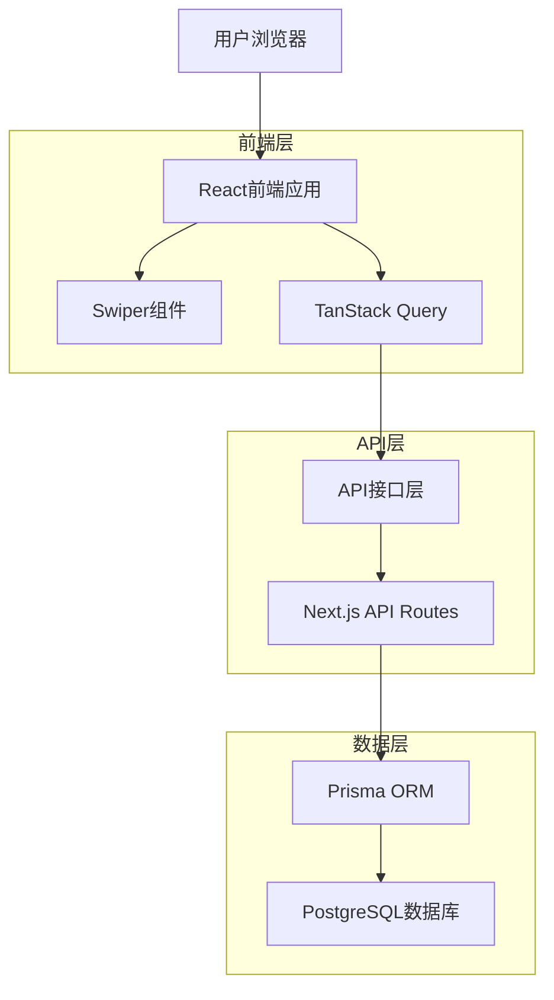
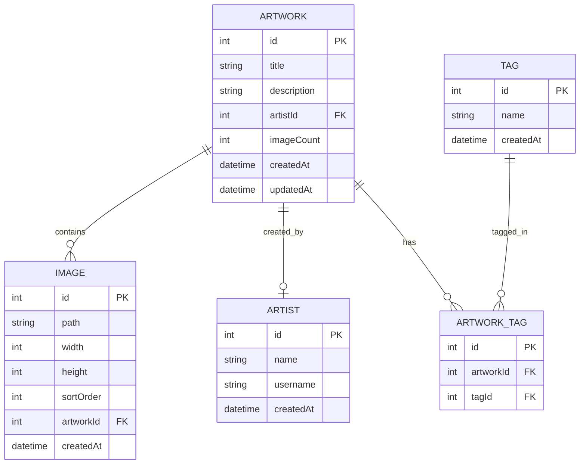

# 沉浸式图片浏览功能技术架构文档

## 1. Architecture design



## 2. Technology Description

- Frontend: React@19 + Next.js@15 + Swiper@11 + TanStack Query@5 + Tailwind CSS@4
- Backend: Next.js API Routes + Prisma@5
- Database: PostgreSQL (通过Prisma连接)

## 3. Route definitions

| Route | Purpose |
|-------|---------|
| /viewer | 沉浸式图片浏览主页面，提供全屏图片浏览体验 |
| /api/images/random | 随机获取单张图片作品的API接口，支持分页 |

## 4. API definitions

### 4.1 Core API

随机图片获取接口
```
GET /api/images/random
```

Request Parameters:
| Param Name| Param Type  | isRequired  | Description |
|-----------|-------------|-------------|-------------|
| page      | number      | false       | 页码，默认为1 |
| pageSize  | number      | false       | 每页数量，默认为10，最大100 |

Response:
| Param Name| Param Type  | Description |
|-----------|-------------|-------------|
| items     | ImageItem[] | 图片数据数组 |
| total     | number      | 总数量（用于无限滚动判断） |
| page      | number      | 当前页码 |
| pageSize  | number      | 每页数量 |
| nextPage  | number\|null | 下一页页码，无更多数据时为null |

ImageItem数据结构:
```typescript
interface ImageItem {
  id: number;
  title: string;
  description?: string;
  imageUrl: string; // 图片访问URL
  author: {
    id: number;
    name: string;
    username?: string;
  } | null;
  createdAt: string;
  tags: string[];
}
```

Example Response:
```json
{
  "items": [
    {
      "id": 1,
      "title": "美丽风景",
      "description": "一张美丽的风景照片",
      "imageUrl": "/api/v1/images/path/to/image.jpg",
      "author": {
        "id": 1,
        "name": "张三",
        "username": "zhangsan"
      },
      "createdAt": "2024-01-01T00:00:00.000Z",
      "tags": ["风景", "自然"]
    }
  ],
  "total": 1000,
  "page": 1,
  "pageSize": 10,
  "nextPage": 2
}
```

## 5. Data model

### 5.1 Data model definition



### 5.2 Data Definition Language

核心查询逻辑（基于现有Prisma Schema）:

```sql
-- 查询单张图片的作品数据（随机排序）
SELECT 
    a.id,
    a.title,
    a.description,
    a."createdAt",
    a."updatedAt",
    artist.id as artist_id,
    artist.name as artist_name,
    artist.username as artist_username
FROM "Artwork" a
LEFT JOIN "Artist" artist ON a."artistId" = artist.id
WHERE a."imageCount" = 1
ORDER BY RANDOM()
LIMIT $1 OFFSET $2;

-- 获取对应的图片路径
SELECT path, width, height, "sortOrder"
FROM "Image"
WHERE "artworkId" = ANY($1)
ORDER BY "sortOrder" ASC;

-- 获取作品标签
SELECT at."artworkId", t.name
FROM "ArtworkTag" at
JOIN "Tag" t ON at."tagId" = t.id
WHERE at."artworkId" = ANY($1);
```

## 6. Component Architecture

### 6.1 组件层次结构

```
src/
├── app/
│   └── viewer/
│       └── page.tsx                 # 沉浸式浏览页面
├── components/
│   └── immersive/
│       ├── ImmersiveImageViewer.tsx # 主要浏览组件
│       ├── ImageSlide.tsx           # 单张图片滑块组件
│       └── ImageOverlay.tsx         # 图片覆盖层组件
├── hooks/
│   └── useInfiniteImages.ts         # 无限滚动数据Hook
└── api/
    └── images/
        └── random/
            └── route.ts             # 随机图片API
```

### 6.2 核心组件设计

**ImmersiveImageViewer组件**:
- 职责：管理Swiper实例，处理滑动事件，协调数据加载
- Props：initialImages, onLoadMore, hasMore, isLoading
- 特性：支持垂直滑动、鼠标滚轮、键盘控制

**ImageSlide组件**:
- 职责：渲染单张图片，处理图片加载和错误状态
- Props：image, priority, onLoad, onError
- 特性：使用Next.js Image组件优化，支持懒加载

**ImageOverlay组件**:
- 职责：显示图片元信息和操作按钮
- Props：image, onLike, onBookmark, onShare
- 特性：半透明背景，响应式布局

**useInfiniteImages Hook**:
- 职责：管理无限滚动数据获取和缓存
- 返回：data, fetchNextPage, hasNextPage, isLoading, error
- 特性：使用TanStack Query的useInfiniteQuery

## 7. Performance Optimization

### 7.1 图片加载优化
- 使用Next.js Image组件进行自动优化
- 实现图片懒加载，只加载可见区域的图片
- 预加载前后各1张图片提升滑动体验
- 支持WebP格式自动转换

### 7.2 数据缓存策略
- TanStack Query自动缓存API响应
- 实现分页数据的增量加载
- 设置合理的缓存时间和失效策略

### 7.3 渲染性能
- Swiper虚拟化渲染，只渲染可见的滑块
- 使用React.memo优化组件重渲染
- 避免不必要的状态更新和计算

## 8. Error Handling

### 8.1 API错误处理
- 网络请求失败：显示重试按钮
- 数据格式错误：降级显示基本信息
- 服务器错误：友好的错误提示

### 8.2 图片加载错误
- 图片加载失败：显示占位符
- 图片格式不支持：提供下载链接
- 网络超时：自动重试机制

### 8.3 用户体验优化
- 加载状态指示器
- 骨架屏占位
- 平滑的错误状态转换