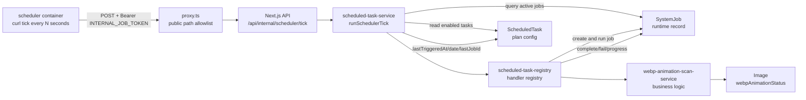
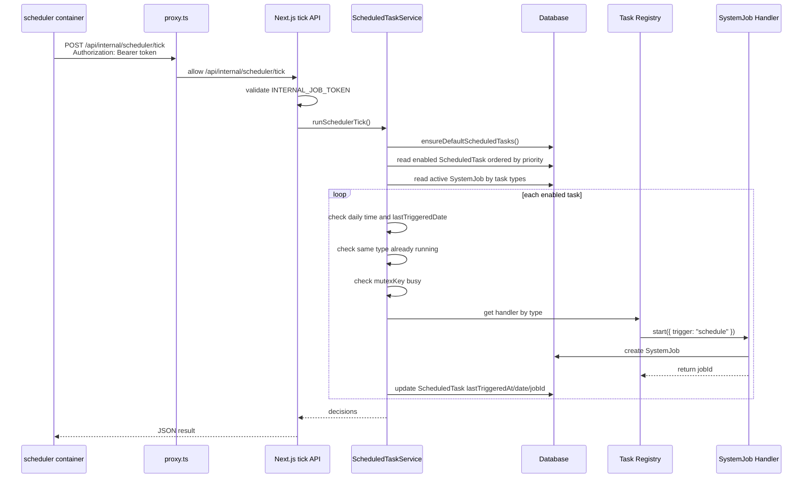
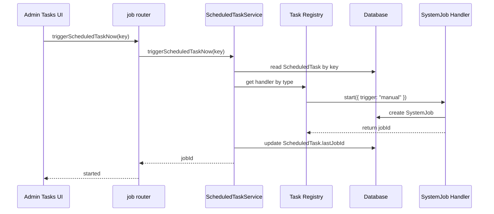
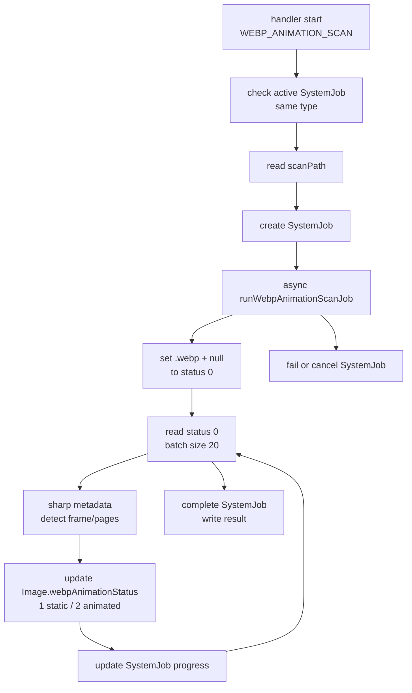

# PixiShelf 通用计划任务系统架构

本文说明 scheduler 容器、Next.js App、`ScheduledTask`、`SystemJob` 之间的职责边界和运行流转。

## 设计目标

- scheduler 容器只负责定时 tick，不访问数据库，不执行业务任务。
- Next.js App 负责鉴权、读取计划任务配置、判断是否到期、创建任务实例、执行业务逻辑。
- `ScheduledTask` 保存计划配置和最近触发信息。
- `SystemJob` 保存每一次实际运行的任务实例、状态、进度、结果和错误。
- 手动触发和定时触发共用同一套任务 handler，避免两套业务逻辑分叉。

## 核心组件



## 数据模型职责

### ScheduledTask

`ScheduledTask` 表示“计划配置”，不是运行记录。

典型字段：

- `key`: 计划任务唯一标识，例如 `webp_animation_scan`
- `type`: 对应业务任务类型，例如 `WEBP_ANIMATION_SCAN`
- `enabled`: 是否启用自动调度
- `scheduleMode`: v1 固定为 `DAILY`
- `time`: 每日执行时间，格式 `HH:mm`
- `timezone`: 时区，例如 `Asia/Shanghai`
- `priority`: 数字越小越先判断和触发
- `mutexKey`: 互斥组，例如 `media-maintenance`
- `lastTriggeredAt`: 最近一次自动触发时间
- `lastTriggeredDate`: 最近一次自动触发的本地日期，用于防止同一天重复触发
- `lastJobId`: 最近一次关联的 `SystemJob.id`
- `config`: 预留任务扩展配置

### SystemJob

`SystemJob` 表示“一次实际运行”。

它记录：

- 任务类型
- 当前状态：`PENDING`、`RUNNING`、`COMPLETED`、`FAILED`、`CANCELLING` 等
- 进度和进度文案
- 运行结果 `result`
- 错误信息 `error`
- 创建、开始、结束时间

同一个 `ScheduledTask` 可以对应很多次 `SystemJob`，但 `lastJobId` 只指向最近一次。

## 定时 tick 流程



### tick 决策规则

每次 tick 会按如下顺序处理：

1. 确保内置计划任务存在，例如 `webp_animation_scan`。
2. 查询所有 `enabled = true` 的 `ScheduledTask`。
3. 按 `priority asc, key asc` 排序。
4. 查询这些任务类型中正在运行的 `SystemJob`。
5. 对每个计划任务做判断：
   - 今日已经触发过：跳过，原因 `already_triggered`
   - 当前本地时间早于计划时间：跳过，原因 `not_due`
   - 同类型任务已有运行实例：跳过，原因 `already_running`
   - 同一 `mutexKey` 已有任务运行：跳过，原因 `mutex_busy`
   - 未注册 handler：跳过，原因 `missing_handler`
   - 通过所有检查：创建 `SystemJob` 并启动 handler
6. 返回本轮 tick 的 `triggered/skipped` 决策结果。

## 手动触发流程

后管“立即执行”不走时间判断，但仍然复用同一个 handler。



手动触发只更新 `lastJobId`，不更新 `lastTriggeredDate`。这样手动运行不会占用当天自动调度名额。

## WebP 动图扫描实例

`webp_animation_scan` 是当前第一种计划任务。



WebP 扫描结果写入 `Image.webpAnimationStatus`：

- `null`: 未纳入任务，通常是新入库或非 WebP
- `0`: 已确认是 WebP，等待识别
- `1`: 静态 WebP
- `2`: 动态 WebP

前端只在状态为 `2` 时展示 WebP 动图播放逻辑。

## Docker 部署关系

### 开发环境

`build/docker-compose.dev.yml` 默认只启动基础设施：

- `postgres`
- `imgproxy`
- `thumbor`

Next.js App 通常在宿主机运行：

```bash
cd packages/pixishelf
pnpm dev
```

开发环境 scheduler 是可选 profile：

```bash
cd build
docker-compose -f docker-compose.dev.yml --profile scheduler up -d scheduler
```

默认调用宿主机 Next.js：

```env
PIXISHELF_INTERNAL_URL=http://host.docker.internal:5430
```

### 生产环境

`build/docker-compose.deploy.yml` 中：

- `app` 是 Next.js 生产容器
- `scheduler` 每隔 `SCHEDULER_TICK_SECONDS` 调用 `http://app:5430/api/internal/scheduler/tick`
- `scheduler` 和 `app` 都通过 `env_file: .env` 读取同一份 `INTERNAL_JOB_TOKEN`

## 鉴权边界

`/api/internal/scheduler/tick` 需要两层处理：

1. `proxy.ts` 必须放行该路径，否则会被登录态校验提前拦截。
2. tick route 自己校验：

```http
Authorization: Bearer <INTERNAL_JOB_TOKEN>
```

因此该接口不是公开裸接口。它只是绕过用户登录态，改用内部服务 token 鉴权。

## 扩展新计划任务

新增任务时一般只需要：

1. 在 `scheduled-task-registry.ts` 增加任务定义：
   - `key`
   - `type`
   - `name`
   - `description`
   - `defaultTime`
   - `defaultPriority`
   - `mutexKey`
2. 实现 handler：
   - 创建对应 `SystemJob`
   - 执行业务逻辑
   - 更新进度
   - 完成、失败或取消任务
3. 注册到 `SCHEDULED_TASK_HANDLERS`。

scheduler 主流程不需要因为新增任务而修改。

## 设计取舍

- v1 只支持每日固定时间，不支持 cron 表达式。
- v1 支持 `priority + mutexKey`，不做复杂 DAG 依赖。
- scheduler 容器保持无状态，不直接访问数据库，避免和应用逻辑分叉。
- `ScheduledTask` 管配置，`SystemJob` 管运行实例，两者不互相替代。
