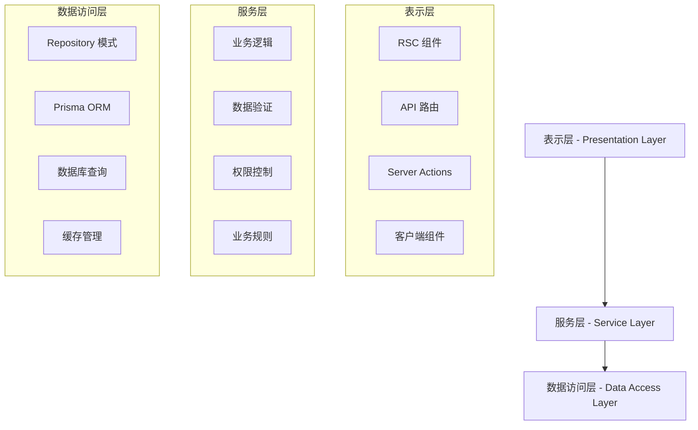

# PixiShelf 系统设计与目录结构规范

## 1. 概述

本文档定义了 PixiShelf 项目的系统设计原则和目录结构规范，基于 Next.js App Router 的分层架构模式，旨在确保代码的一致性、可维护性和可扩展性。

### 1.1 设计原则

- **分层架构 (Layered Architecture)**: 清晰的职责分离
- **DRY 原则 (Don't Repeat Yourself)**: 避免代码重复
- **关注点分离 (Separation of Concerns)**: 每层专注于特定职责
- **可测试性 (Testability)**: 便于单元测试和集成测试
- **可维护性 (Maintainability)**: 易于理解和修改

### 1.2 架构概览



## 2. 目录结构规范

### 2.1 整体目录结构

```
packages/pixishelf/src/
├── app/                        # Next.js App Router - 表示层
│   ├── (auth)/                # 路由组 - 认证相关页面
│   ├── (protected)/           # 路由组 - 需要认证的页面
│   ├── api/                   # API 路由
│   ├── globals.css            # 全局样式
│   ├── layout.tsx             # 根布局
│   ├── loading.tsx            # 全局加载组件
│   └── page.tsx               # 首页
├── components/                 # 可复用组件
│   ├── ui/                    # 基础 UI 组件
│   ├── admin/                 # 管理后台组件
│   ├── artwork/               # 作品相关组件
│   ├── auth/                  # 认证相关组件
│   └── common/                # 通用组件
├── lib/                       # 数据访问层 & 工具库
│   ├── repositories/          # Repository 模式
│   ├── prisma.ts             # Prisma 客户端
│   ├── auth.ts               # 认证工具
│   ├── utils.ts              # 通用工具函数
│   └── validators.ts         # 数据验证
├── services/                  # 服务层 - 业务逻辑
│   ├── artworkService.ts     # 作品业务逻辑
│   ├── userService.ts        # 用户业务逻辑
│   ├── tagService.ts         # 标签业务逻辑
│   └── scanner.ts            # 文件扫描服务
├── types/                     # TypeScript 类型定义
│   ├── api.ts                # API 相关类型
│   ├── core.ts               # 核心业务类型
│   ├── auth.ts               # 认证相关类型
│   └── index.ts              # 类型导出
├── hooks/                     # React Hooks
│   ├── useDebounce.ts        # 防抖 Hook
│   ├── useInfiniteScroll.ts  # 无限滚动 Hook
│   └── useClientOnly.ts      # 客户端专用 Hook
├── constants/                 # 常量定义
│   └── index.ts              # 应用常量
├── utils/                     # 工具函数
│   └── media.ts              # 媒体处理工具
└── middleware.ts              # Next.js 中间件
```

### 2.2 各层详细说明

#### 2.2.1 表示层 (app/)

**职责**:
- 处理 HTTP 请求和响应
- 用户界面渲染
- 路由管理
- 用户交互处理

**规范**:
- RSC 组件直接调用 Service 层
- API 路由仅处理请求解析和响应格式化
- 不包含复杂业务逻辑
- 统一错误处理

**示例结构**:
```
app/
├── (auth)/
│   └── login/
│       └── page.tsx           # 登录页面 (RSC)
├── (protected)/
│   ├── gallery/
│   │   └── page.tsx           # 画廊页面 (RSC)
│   └── artworks/
│       └── [id]/
│           └── page.tsx       # 作品详情页 (RSC)
└── api/
    ├── auth/
    │   └── login/
    │       └── route.ts       # 登录 API
    └── v1/
        ├── artworks/
        │   └── route.ts       # 作品列表 API
        └── tags/
            └── route.ts       # 标签 API
```

#### 2.2.2 服务层 (services/)

**职责**:
- 封装业务逻辑
- 数据验证和转换
- 权限控制
- 业务规则实现

**规范**:
- 每个服务对应一个业务域
- 方法命名清晰表达业务意图
- 统一错误处理机制
- 支持依赖注入和测试

**示例**:
```typescript
// services/artworkService.ts
export const artworkService = {
  /**
   * 获取已发布的作品列表
   * @param options 查询选项
   * @returns 作品列表
   */
  async getPublishedArtworks(options: {
    page?: number;
    limit?: number;
    sortBy?: 'createdAt' | 'imageCount';
    order?: 'asc' | 'desc';
    tags?: string[];
  }) {
    // 业务逻辑实现
    const { page = 1, limit = 20, sortBy = 'createdAt', order = 'desc' } = options;

    return artworkRepository.findMany({
      where: {
        imageCount: { gt: 0 },
        ...(options.tags && {
          artworkTags: {
            some: {
              tag: {
                name: { in: options.tags }
              }
            }
          }
        })
      },
      orderBy: { [sortBy]: order },
      take: limit,
      skip: (page - 1) * limit,
      include: {
        artist: true,
        artworkTags: {
          include: { tag: true }
        },
        images: {
          take: 1,
          orderBy: { sortOrder: 'asc' }
        }
      }
    });
  },

  /**
   * 创建新作品
   * @param data 作品数据
   * @returns 创建的作品
   */
  async createArtwork(data: CreateArtworkInput) {
    // 数据验证
    const validatedData = createArtworkSchema.parse(data);

    // 权限检查
    await this.checkCreatePermission();

    // 业务逻辑
    return artworkRepository.create(validatedData);
  }
};
```

#### 2.2.3 数据访问层 (lib/)

**职责**:
- 数据库交互
- 数据持久化
- 查询优化
- 缓存管理

**规范**:
- 使用 Repository 模式封装数据访问
- 统一的查询接口
- 类型安全的数据操作
- 支持事务处理

**示例**:
```typescript
// lib/repositories/artworkRepository.ts
export const artworkRepository = {
  async findMany(options: FindManyOptions) {
    return db.artwork.findMany(options);
  },

  async findById(id: number) {
    return db.artwork.findUnique({
      where: { id },
      include: {
        artist: true,
        artworkTags: {
          include: { tag: true }
        },
        images: {
          orderBy: { sortOrder: 'asc' }
        }
      }
    });
  },

  async create(data: CreateArtworkData) {
    return db.artwork.create({ data });
  },

  async update(id: number, data: UpdateArtworkData) {
    return db.artwork.update({
      where: { id },
      data
    });
  },

  async delete(id: number) {
    return db.artwork.delete({ where: { id } });
  }
};
```

## 3. Service 层设计模式

### 3.1 核心概念

Service 层是解决 RSC 和 API 路由代码重复问题的关键。它提供了统一的业务逻辑接口，可以被不同的表示层调用。

### 3.2 设计模式

#### 3.2.1 服务接口设计

```typescript
// 统一的服务接口
interface BaseService<T, CreateInput, UpdateInput> {
  findMany(options?: FindManyOptions): Promise<T[]>;
  findById(id: number): Promise<T | null>;
  create(data: CreateInput): Promise<T>;
  update(id: number, data: UpdateInput): Promise<T>;
  delete(id: number): Promise<void>;
}
```

#### 3.2.2 错误处理模式

```typescript
// 统一的错误类型
export class ServiceError extends Error {
  constructor(
    message: string,
    public code: string,
    public statusCode: number = 500
  ) {
    super(message);
    this.name = 'ServiceError';
  }
}

// 错误处理装饰器
export function handleServiceErrors<T extends any[], R>(
  target: any,
  propertyKey: string,
  descriptor: TypedPropertyDescriptor<(...args: T) => Promise<R>>
) {
  const originalMethod = descriptor.value!;

  descriptor.value = async function (...args: T): Promise<R> {
    try {
      return await originalMethod.apply(this, args);
    } catch (error) {
      if (error instanceof ServiceError) {
        throw error;
      }
      throw new ServiceError(
        'Internal service error',
        'INTERNAL_ERROR',
        500
      );
    }
  };
}
```

#### 3.2.3 依赖注入模式

```typescript
// 服务容器
class ServiceContainer {
  private services = new Map<string, any>();

  register<T>(name: string, service: T): void {
    this.services.set(name, service);
  }

  get<T>(name: string): T {
    const service = this.services.get(name);
    if (!service) {
      throw new Error(`Service ${name} not found`);
    }
    return service;
  }
}

export const container = new ServiceContainer();

// 注册服务
container.register('artworkService', artworkService);
container.register('userService', userService);
```

### 3.3 使用示例

#### 3.3.1 在 RSC 中使用

```tsx
// app/(protected)/gallery/page.tsx
import { artworkService } from '@/services/artworkService';

export default async function GalleryPage({
  searchParams
}: {
  searchParams: { page?: string; tags?: string }
}) {
  const page = parseInt(searchParams.page || '1', 10);
  const tags = searchParams.tags?.split(',') || [];

  // 直接调用 Service 层
  const artworks = await artworkService.getPublishedArtworks({
    page,
    tags
  });

  return (
    <div>
      <h1>画廊</h1>
      <ArtworkGrid artworks={artworks} />
    </div>
  );
}
```

#### 3.3.2 在 API 路由中使用

```typescript
// app/api/v1/artworks/route.ts
import { NextResponse } from 'next/server';
import { artworkService } from '@/services/artworkService';
import { ServiceError } from '@/lib/errors';

export async function GET(request: Request) {
  try {
    const { searchParams } = new URL(request.url);
    const page = parseInt(searchParams.get('page') || '1', 10);
    const tags = searchParams.get('tags')?.split(',') || [];

    // 同样调用 Service 层
    const artworks = await artworkService.getPublishedArtworks({
      page,
      tags
    });

    return NextResponse.json({
      data: artworks,
      success: true
    });
  } catch (error) {
    if (error instanceof ServiceError) {
      return NextResponse.json(
        { error: error.message, code: error.code },
        { status: error.statusCode }
      );
    }

    return NextResponse.json(
      { error: 'Internal Server Error' },
      { status: 500 }
    );
  }
}
```

#### 3.3.3 在 Server Action 中使用

```typescript
// app/actions/artwork.ts
'use server';

import { artworkService } from '@/services/artworkService';
import { revalidatePath } from 'next/cache';
import { redirect } from 'next/navigation';

export async function createArtworkAction(formData: FormData) {
  try {
    const title = formData.get('title') as string;
    const description = formData.get('description') as string;

    // 调用 Service 层
    const artwork = await artworkService.createArtwork({
      title,
      description
    });

    revalidatePath('/gallery');
    redirect(`/artworks/${artwork.id}`);
  } catch (error) {
    return {
      error: error instanceof Error ? error.message : 'Unknown error'
    };
  }
}
```

## 4. 代码组织规范

### 4.1 文件命名规范

#### 4.1.1 组件文件
- **React 组件**: PascalCase，如 `ArtworkCard.tsx`
- **页面组件**: `page.tsx`, `layout.tsx`, `loading.tsx`
- **API 路由**: `route.ts`

#### 4.1.2 服务和工具文件
- **Service 文件**: camelCase + Service 后缀，如 `artworkService.ts`
- **Repository 文件**: camelCase + Repository 后缀，如 `artworkRepository.ts`
- **工具文件**: camelCase，如 `utils.ts`, `validators.ts`
- **类型文件**: camelCase，如 `types.ts`, `api.ts`

#### 4.1.3 目录命名
- **功能目录**: kebab-case，如 `artwork-management`
- **路由组**: 括号包围，如 `(auth)`, `(protected)`
- **动态路由**: 方括号包围，如 `[id]`, `[...slug]`

### 4.2 导入导出规范

#### 4.2.1 导入顺序
```typescript
// 1. Node.js 内置模块
import { readFile } from 'fs/promises';

// 2. 第三方库
import { NextResponse } from 'next/server';
import { z } from 'zod';

// 3. 内部模块 (按层级顺序)
import { artworkService } from '@/services/artworkService';
import { artworkRepository } from '@/lib/repositories/artworkRepository';
import { ArtworkCard } from '@/components/artwork/ArtworkCard';
import { Button } from '@/components/ui/button';

// 4. 类型导入 (单独分组)
import type { Artwork, CreateArtworkInput } from '@/types/core';
import type { ApiResponse } from '@/types/api';
```

#### 4.2.2 导出规范
```typescript
// 优先使用命名导出
export const artworkService = {
  // ...
};

// 类型导出
export type { ArtworkService };

// 默认导出仅用于 React 组件和页面
export default function ArtworkCard() {
  // ...
}
```

#### 4.2.3 索引文件 (index.ts)
```typescript
// components/ui/index.ts
export { Button } from './button';
export { Card } from './card';
export { Input } from './input';

// types/index.ts
export type * from './core';
export type * from './api';
export type * from './auth';
```

### 4.3 类型定义规范

#### 4.3.1 接口命名
```typescript
// 数据模型接口
interface Artwork {
  id: number;
  title: string;
  description?: string;
}

// 输入类型
interface CreateArtworkInput {
  title: string;
  description?: string;
}

// 选项类型
interface FindArtworksOptions {
  page?: number;
  limit?: number;
  sortBy?: 'createdAt' | 'imageCount';
}

// API 响应类型
interface ApiResponse<T> {
  data: T;
  success: boolean;
  error?: string;
}
```

#### 4.3.2 泛型使用
```typescript
// 通用的分页响应
interface PaginatedResponse<T> {
  data: T[];
  pagination: {
    page: number;
    limit: number;
    total: number;
    totalPages: number;
  };
}

// 通用的服务方法
interface BaseService<T, CreateInput, UpdateInput> {
  findMany(options?: FindManyOptions): Promise<PaginatedResponse<T>>;
  findById(id: number): Promise<T | null>;
  create(data: CreateInput): Promise<T>;
  update(id: number, data: UpdateInput): Promise<T>;
}
```

## 5. 最佳实践指南

### 5.1 DRY 原则实践

#### 5.1.1 避免重复的查询逻辑
```typescript
// ❌ 错误示例：在多处重复查询逻辑
// app/gallery/page.tsx
const artworks = await db.artwork.findMany({
  where: { imageCount: { gt: 0 } },
  orderBy: { createdAt: 'desc' },
  include: { artist: true, images: true }
});

// app/api/v1/artworks/route.ts
const artworks = await db.artwork.findMany({
  where: { imageCount: { gt: 0 } },
  orderBy: { createdAt: 'desc' },
  include: { artist: true, images: true }
});

// ✅ 正确示例：抽离到 Service 层
// services/artworkService.ts
export const artworkService = {
  async getPublishedArtworks(options: GetArtworksOptions) {
    return artworkRepository.findMany({
      where: { imageCount: { gt: 0 } },
      orderBy: { createdAt: 'desc' },
      include: { artist: true, images: true },
      ...options
    });
  }
};
```

#### 5.1.2 复用业务逻辑
```typescript
// ✅ 在 Service 层统一业务逻辑
export const artworkService = {
  async validateArtworkAccess(artworkId: number, userId: string) {
    const artwork = await artworkRepository.findById(artworkId);
    if (!artwork) {
      throw new ServiceError('Artwork not found', 'NOT_FOUND', 404);
    }

    // 统一的权限检查逻辑
    if (artwork.isPrivate && artwork.userId !== userId) {
      throw new ServiceError('Access denied', 'FORBIDDEN', 403);
    }

    return artwork;
  }
};
```

### 5.2 关注点分离

#### 5.2.1 表示层职责
```typescript
// ✅ 表示层只处理 HTTP 和 UI 相关逻辑
export async function GET(request: Request) {
  try {
    // 1. 解析请求参数
    const { searchParams } = new URL(request.url);
    const options = parseSearchParams(searchParams);

    // 2. 调用 Service 层
    const result = await artworkService.getPublishedArtworks(options);

    // 3. 格式化响应
    return NextResponse.json({
      data: result,
      success: true
    });
  } catch (error) {
    // 4. 错误处理
    return handleApiError(error);
  }
}
```

#### 5.2.2 服务层职责
```typescript
// ✅ 服务层专注于业务逻辑
export const artworkService = {
  async getPublishedArtworks(options: GetArtworksOptions) {
    // 1. 参数验证
    const validatedOptions = validateGetArtworksOptions(options);

    // 2. 业务规则应用
    const queryOptions = this.buildQueryOptions(validatedOptions);

    // 3. 数据获取
    const artworks = await artworkRepository.findMany(queryOptions);

    // 4. 数据转换
    return this.transformArtworksForResponse(artworks);
  }
};
```

#### 5.2.3 数据访问层职责
```typescript
// ✅ 数据访问层只处理数据持久化
export const artworkRepository = {
  async findMany(options: FindManyOptions) {
    // 纯粹的数据库查询，不包含业务逻辑
    return db.artwork.findMany(options);
  },

  async findWithStats(options: FindManyOptions) {
    // 复杂查询的封装
    return db.artwork.findMany({
      ...options,
      include: {
        _count: {
          select: {
            images: true,
            artworkTags: true
          }
        }
      }
    });
  }
};
```

### 5.3 可测试性

#### 5.3.1 Service 层测试
```typescript
// tests/services/artworkService.test.ts
import { artworkService } from '@/services/artworkService';
import { artworkRepository } from '@/lib/repositories/artworkRepository';

// Mock Repository
jest.mock('@/lib/repositories/artworkRepository');
const mockArtworkRepository = artworkRepository as jest.Mocked<typeof artworkRepository>;

describe('ArtworkService', () => {
  beforeEach(() => {
    jest.clearAllMocks();
  });

  describe('getPublishedArtworks', () => {
    it('should return published artworks with default options', async () => {
      // Arrange
      const mockArtworks = [{ id: 1, title: 'Test Artwork' }];
      mockArtworkRepository.findMany.mockResolvedValue(mockArtworks);

      // Act
      const result = await artworkService.getPublishedArtworks({});

      // Assert
      expect(result).toEqual(mockArtworks);
      expect(mockArtworkRepository.findMany).toHaveBeenCalledWith({
        where: { imageCount: { gt: 0 } },
        orderBy: { createdAt: 'desc' },
        take: 20,
        skip: 0
      });
    });
  });
});
```

#### 5.3.2 API 路由测试
```typescript
// tests/api/artworks.test.ts
import { GET } from '@/app/api/v1/artworks/route';
import { artworkService } from '@/services/artworkService';

jest.mock('@/services/artworkService');
const mockArtworkService = artworkService as jest.Mocked<typeof artworkService>;

describe('/api/v1/artworks', () => {
  it('should return artworks list', async () => {
    // Arrange
    const mockArtworks = [{ id: 1, title: 'Test' }];
    mockArtworkService.getPublishedArtworks.mockResolvedValue(mockArtworks);

    const request = new Request('http://localhost/api/v1/artworks?page=1');

    // Act
    const response = await GET(request);
    const data = await response.json();

    // Assert
    expect(response.status).toBe(200);
    expect(data.success).toBe(true);
    expect(data.data).toEqual(mockArtworks);
  });
});
```

### 5.4 错误处理

#### 5.4.1 统一错误类型
```typescript
// lib/errors.ts
export class ServiceError extends Error {
  constructor(
    message: string,
    public code: string,
    public statusCode: number = 500,
    public details?: any
  ) {
    super(message);
    this.name = 'ServiceError';
  }
}

export class ValidationError extends ServiceError {
  constructor(message: string, details?: any) {
    super(message, 'VALIDATION_ERROR', 400, details);
    this.name = 'ValidationError';
  }
}

export class NotFoundError extends ServiceError {
  constructor(resource: string) {
    super(`${resource} not found`, 'NOT_FOUND', 404);
    this.name = 'NotFoundError';
  }
}
```

#### 5.4.2 错误处理中间件
```typescript
// lib/errorHandler.ts
import { NextResponse } from 'next/server';
import { ServiceError, ValidationError, NotFoundError } from './errors';

export function handleApiError(error: unknown): NextResponse {
  console.error('API Error:', error);

  if (error instanceof ValidationError) {
    return NextResponse.json(
      {
        error: error.message,
        code: error.code,
        details: error.details
      },
      { status: 400 }
    );
  }

  if (error instanceof NotFoundError) {
    return NextResponse.json(
      {
        error: error.message,
        code: error.code
      },
      { status: 404 }
    );
  }

  if (error instanceof ServiceError) {
    return NextResponse.json(
      {
        error: error.message,
        code: error.code
      },
      { status: error.statusCode }
    );
  }

  // 未知错误
  return NextResponse.json(
    {
      error: 'Internal Server Error',
      code: 'INTERNAL_ERROR'
    },
    { status: 500 }
  );
}
```

### 5.5 性能优化

#### 5.5.1 数据库查询优化
```typescript
// ✅ 使用 Repository 模式优化查询
export const artworkRepository = {
  async findManyWithPagination(options: PaginationOptions) {
    const [data, total] = await Promise.all([
      db.artwork.findMany({
        ...options,
        include: {
          artist: {
            select: { id: true, name: true } // 只选择需要的字段
          },
          images: {
            take: 1,
            orderBy: { sortOrder: 'asc' },
            select: { id: true, path: true } // 只选择需要的字段
          }
        }
      }),
      db.artwork.count({ where: options.where })
    ]);

    return {
      data,
      pagination: {
        page: options.page || 1,
        limit: options.limit || 20,
        total,
        totalPages: Math.ceil(total / (options.limit || 20))
      }
    };
  }
};
```

#### 5.5.2 缓存策略
```typescript
// lib/cache.ts
import { unstable_cache } from 'next/cache';

export const getCachedArtworks = unstable_cache(
  async (options: GetArtworksOptions) => {
    return artworkService.getPublishedArtworks(options);
  },
  ['artworks'],
  {
    revalidate: 300, // 5分钟缓存
    tags: ['artworks']
  }
);
```

## 6. 开发工作流

### 6.1 新功能开发流程

1. **需求分析**: 确定功能边界和业务规则
2. **类型定义**: 在 `types/` 目录定义相关类型
3. **Repository 层**: 实现数据访问逻辑
4. **Service 层**: 实现业务逻辑
5. **表示层**: 实现 UI 和 API
6. **测试**: 编写单元测试和集成测试
7. **文档**: 更新相关文档

### 6.2 代码审查清单

- [ ] 是否遵循分层架构原则
- [ ] 是否避免了代码重复
- [ ] 是否正确分离了关注点
- [ ] 是否包含适当的错误处理
- [ ] 是否包含必要的类型定义
- [ ] 是否遵循命名规范
- [ ] 是否包含单元测试
- [ ] 是否更新了相关文档

### 6.3 重构指南

当发现以下情况时，应考虑重构：

1. **代码重复**: 相同逻辑出现在多个地方
2. **职责混乱**: 一个文件/函数承担多个职责
3. **依赖混乱**: 层级之间的依赖关系不清晰
4. **测试困难**: 难以为某个功能编写单元测试
5. **维护困难**: 修改一个功能需要改动多个文件

## 7. 总结

本文档定义了 PixiShelf 项目的系统设计原则和目录结构规范。通过采用分层架构和 Service 层模式，我们能够：

1. **提高代码复用性**: 避免 RSC 和 API 路由的逻辑重复
2. **增强可维护性**: 清晰的职责分离使代码更易理解和修改
3. **提升可测试性**: 业务逻辑与框架解耦，便于单元测试
4. **保证一致性**: 统一的规范确保团队协作的一致性
5. **支持扩展性**: 良好的架构设计支持功能的持续扩展

正如文档中提到的："这种架构模式虽然在项目初期会增加一点文件结构上的'复杂性'，但随着应用规模的增长，它带来的清晰性、稳定性和可维护性收益是巨大的。"

所有开发者和 AI 助手在参与 PixiShelf 项目开发时，都应严格遵循本文档定义的规范，确保代码质量和项目的长期可维护性。