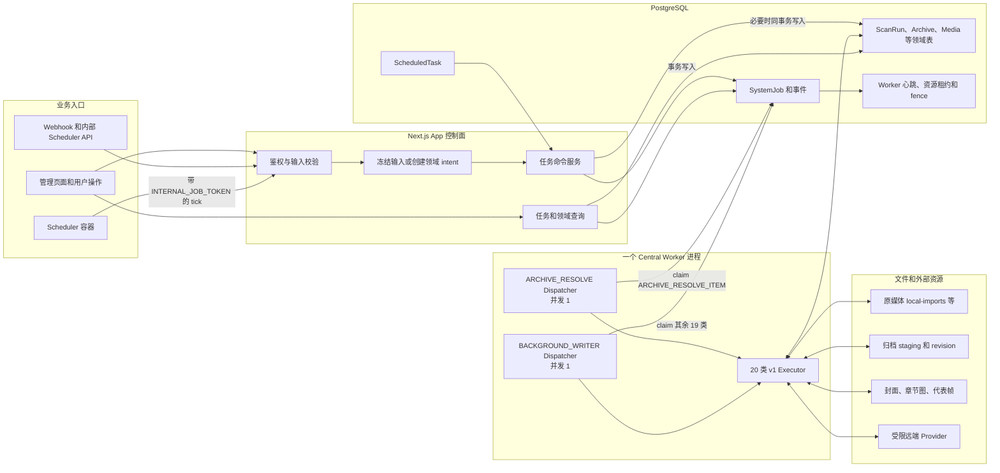
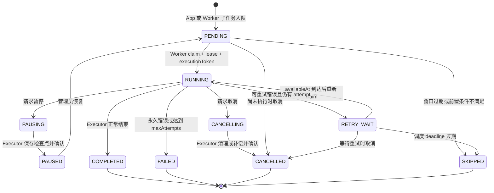
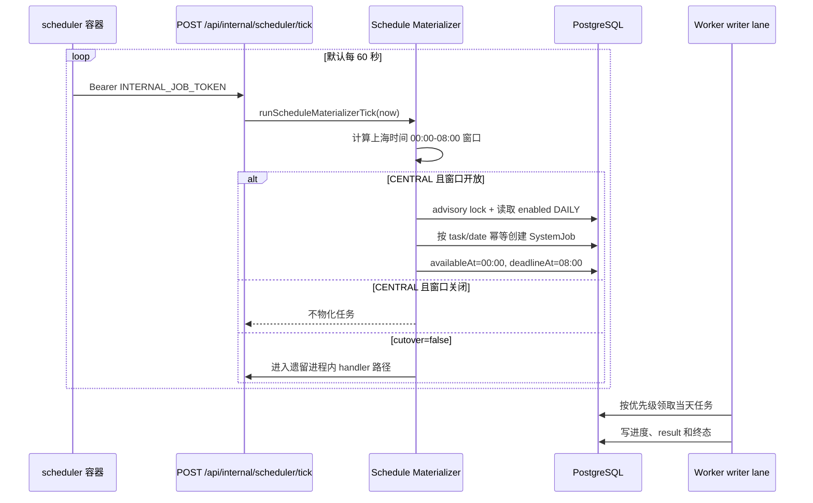
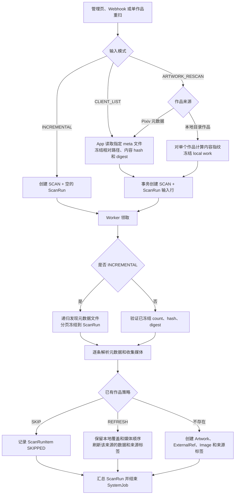
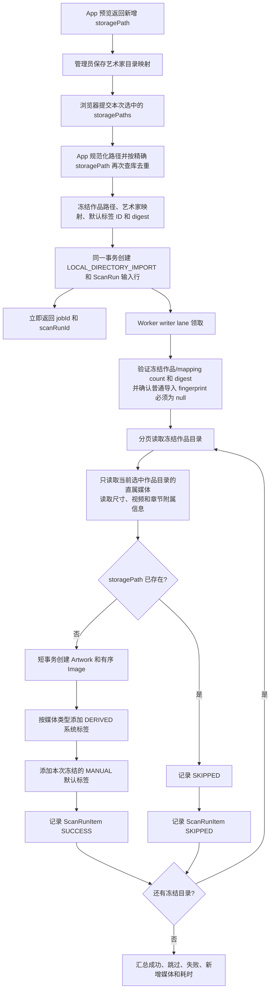
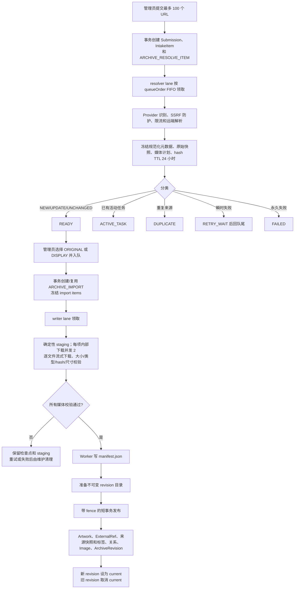
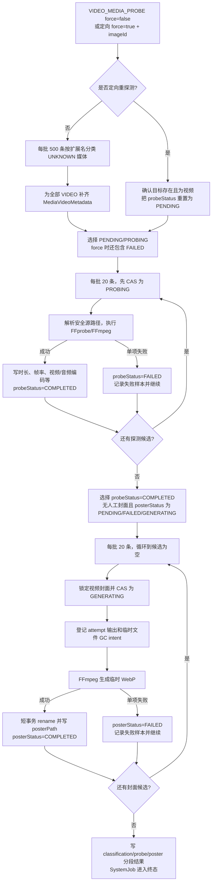
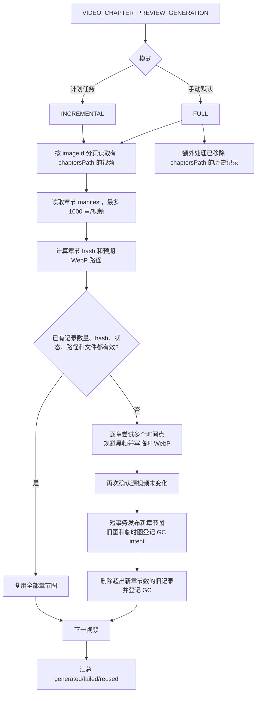
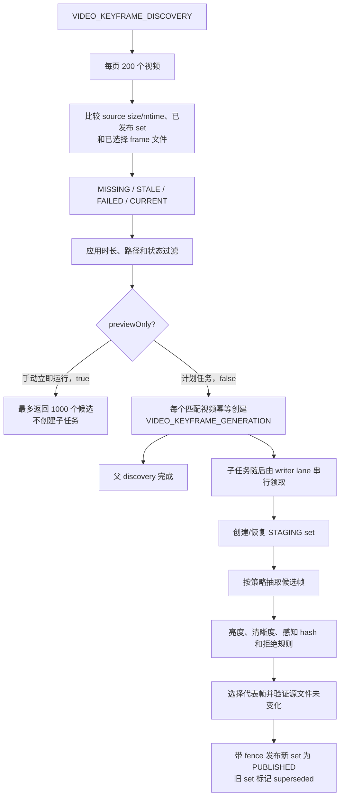
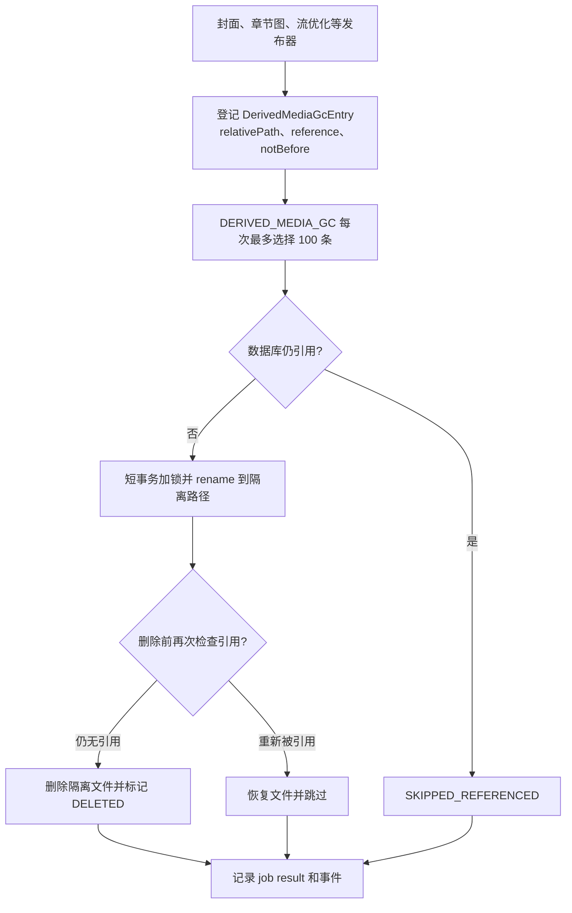

# 后台任务业务链路

本文按当前 `main` 分支解释任务计划和中央 Worker 实际做了什么，重点回答四个问题：任务从哪里产生、由谁执行、业务状态写到哪里、任务完成究竟代表什么。

精确字段和 payload 仍以 Prisma、Zod 和 TypeScript 为准。历史设计文档只解释重构过程，不作为当前行为依据。

## 先看结论

1. Next.js App 是控制面：鉴权、校验、冻结输入、创建任务和查询状态；稳态下不执行长任务。
2. PostgreSQL 的 `SystemJob` 是持久队列；Worker 从数据库 claim，不接收 App 的内存消息。
3. 一个 Worker 进程运行两个 Dispatcher：`ARCHIVE_RESOLVE` 固定并发 1，`BACKGROUND_WRITER` 固定并发 1。两条 lane 可以各执行一个任务；19 类 writer 任务之间全局串行。
4. 任务计划只负责创建 `SystemJob`。中央模式下页面中的 `HH:mm` 当前不决定释放时刻；所有已启用 DAILY 任务都在上海时间 `00:00-08:00` 窗口内物化，实际顺序由优先级决定。
5. `SystemJob=COMPLETED` 只说明该 Executor 按其契约结束。若任务按项目记录失败，或父任务只负责创建子任务，仍必须查看 `result`、子任务和领域状态。
6. 视频媒体探测和自动封面现在属于同一个 `VIDEO_MEDIA_PROBE` 工作流：先分类、探测，再在同一任务中处理全部待生成封面；批量封面不再拆成子任务，也没有 100 条封面上限。
7. 本地目录导入和归档是两条独立链路。本地导入只读 `local-imports` 中本次选中的目录；归档使用独立归档根目录、staging、revision 和 Worker 生成的 `manifest.json`，不会把归档 manifest 当成本地导入输入。

## 四层业务对象

不要只看一个状态判断整个业务是否完成。当前系统至少有四层状态：

| 层     | 代表对象                                                                                | 负责回答                                         | 不负责回答                   |
| ------ | --------------------------------------------------------------------------------------- | ------------------------------------------------ | ---------------------------- |
| 配置层 | `ScheduledTask`                                                                         | 哪些维护任务启用、优先级和配置是什么             | 今天的任务是否已经执行成功   |
| 执行层 | `SystemJob`、`SystemJobEvent`                                                           | 是否排队、由哪个 Worker 执行、是否重试/暂停/失败 | 每个作品、视频或文件是否成功 |
| 领域层 | `ScanRun`、`ScanRunItem`、`ArchiveIntakeItem`、`ArchiveImport`、`MediaVideoMetadata` 等 | 每个业务对象处理到了哪一步                       | Worker 是否还活着            |
| 文件层 | 原媒体、归档 revision、封面、章节图、代表帧、staging                                    | 最终文件是否存在且可读                           | 数据库是否已经发布引用       |

因此，典型排查顺序是：先看是否创建 `SystemJob`，再看 job 状态和事件，然后看领域行，最后验证文件和读取 URL。

## 总体流程图

这里的“一个 Worker”指一个容器和一个 Node.js 进程。两个 Dispatcher loop 共用进程、数据库连接和挂载；lane 是队列与 capability 隔离，不是操作系统权限隔离。

## 通用队列生命周期

### 从入队到终态

### Worker 如何领取

1. App 对 payload 做运行时校验，并按 job type 推导 lane；调用者不能自己把任务换到另一条 lane。
2. 入队事务写入 `SystemJob` 和 `job.queued` 事件。带幂等键的请求在 PostgreSQL advisory lock 下创建或复用。
3. 两个 Dispatcher 分别领取自己的 lane。领取 SQL 使用 `FOR UPDATE SKIP LOCKED`，先检查 lane 执行态和资源租约，再按优先级、可执行时间、创建时间排序。
4. `ARCHIVE_RESOLVE` 额外按收件 `queueOrder` 保证 FIFO；writer lane 在同一时间只执行一个任务。
5. claim 后写入 `workerId`、attempt、`executionToken`、lease 和 heartbeat。Executor 的进度、领域变更和终态都携带 fence。
6. Worker 周期性续租并读取暂停/取消 intent。旧 Worker 丢失 lease 后，即使继续运行，也不能通过 fence 提交新的领域终态。
7. 瞬时错误进入 `RETRY_WAIT`；Worker 重启或租约过期后由队列恢复。调度任务超过 `deadlineAt` 会变成 `SKIPPED/WINDOW_EXPIRED`。

### 优先级和执行窗口

| 来源            | 队列优先级                                   | 领取规则                                                       |
| --------------- | -------------------------------------------- | -------------------------------------------------------------- |
| `MANUAL`        | `0-99`                                       | 不受自动任务时窗限制，通常优先于计划任务                       |
| `SYSTEM` 子任务 | `100-999`                                    | 无 deadline 时可持续领取                                       |
| `SCHEDULE`      | 页面优先级小于 100 时映射为 `100 + priority` | 只在自动时窗中领取，超过 deadline 跳过                         |
| `RETRY`         | 沿用任务语义                                 | `availableAt` 到达后领取；有 deadline 的任务仍受 deadline 限制 |

队列存在优先级老化，避免低优先级任务永久饥饿。它不能改变 writer lane 全局串行这一事实：一个长时间 writer 任务仍会推迟后面的 writer 任务。

## 任务计划链路

### 实际调度流程

### 当前最容易误解的地方

- `ScheduledTask.time` 和页面显示的 `HH:mm` 仍可编辑，但中央 materializer 当前不读取该字段。
- 每个已启用 DAILY 任务当天只物化一次，唯一性是 `scheduledTaskId + scheduledForDate`。
- `defaultTime` 目前是界面默认值和历史配置，不是中央模式的实际 `availableAt`。
- 所有计划任务的实际 `availableAt` 都是当天 `00:00`，`deadlineAt` 都是 `08:00`；任务优先级决定顺序。
- `derived_media_gc_reconciliation` 只在周一物化，其余已启用任务每天物化。
- “立即运行”走 `MANUAL`，不要求任务已启用，也不受 `00:00-08:00` deadline 限制。
- 禁用任务只阻止未来物化。已经创建的当天 job 当前不会因为随后禁用而自动取消或跳过。
- `CENTRAL_DISPATCHER_CUTOVER_ENABLED=false` 会重新进入遗留 Next.js 进程内异步 handler。生产稳态必须是 App 和 Worker 的中央开关成对开启。

### 计划任务清单

“显示时间”来自注册表默认值；中央模式下请按上一节理解实际释放时刻。

| Key                                | 页面名称               | 显示时间 | 默认启用 | 优先级 | Worker 实际工作                                                  |
| ---------------------------------- | ---------------------- | -------: | -------- | -----: | ---------------------------------------------------------------- |
| `trigger_log_retention_cleanup`    | 清理触发器日志         |    02:00 | 是       |     10 | 分批删除超过 30 天的触发器维护日志                               |
| `archive_maintenance_reconcile`    | 修复归档维护状态       |    02:05 | 是       |     12 | 有界发现维护 intent，并创建按目标隔离的维护子任务                |
| `archive_intake_retention_cleanup` | 清理归档收件历史       |    02:15 | 是       |     15 | 删除超过 30 天的终态收件、批量历史、空 submission 和过期预览会话 |
| `scan_run_retention_cleanup`       | 清理扫描历史           |    02:30 | 否       |     20 | 删除超过 180 天的终态 ScanRun；另按类型只保留最近 100 条         |
| `webp_animation_scan`              | 识别图片动画           |    03:30 | 否       |     30 | 用内容识别 WebP/GIF/PNG/APNG 是静态图还是动图                    |
| `video_media_probe`                | 视频媒体探测与封面生成 |    04:00 | 否       |     40 | 媒体分类、FFprobe、自动封面批量生成                              |
| `video_chapter_preview_generation` | 生成视频章节截图       |    04:30 | 否       |     50 | 计划执行 `INCREMENTAL` 章节图校验和补齐                          |
| `video_keyframe_generation`        | 生成视频代表帧         |    05:00 | 否       |     60 | 发现缺失/过期/失败视频，并创建代表帧生成子任务                   |
| `derived_media_gc`                 | 清理派生媒体           |    05:30 | 否       |     70 | 每次最多处理 100 条已登记且到期的 GC intent                      |
| `derived_media_gc_reconciliation`  | 核对派生媒体目录       |    05:45 | 否       |     71 | 仅周一 dry-run，有界扫描最多 500 个 poster 目录项，不删除        |

## 20 类 Worker 任务

除 `ARCHIVE_RESOLVE_ITEM` 外，其他任务全部进入 `BACKGROUND_WRITER`。

| Job type                           | 主要入口                           | 是否计划任务 | 是否创建子任务 | 主要副作用                                                       |
| ---------------------------------- | ---------------------------------- | ------------ | -------------- | ---------------------------------------------------------------- |
| `SCAN`                             | 设置页扫描、Webhook、单作品重扫    | 否           | 否             | 发现/读取元数据，发布或刷新 Artwork、Image、来源标签，写 ScanRun |
| `LOCAL_DIRECTORY_IMPORT`           | 本地目录导入“开始导入”             | 否           | 否             | 读取已冻结目录，创建本地 Artwork、Image、默认标签和派生标签      |
| `MIGRATION`                        | 媒体目录迁移管理                   | 否           | 否             | 分阶段复制/移动媒体、校验、发布新路径、清理旧路径                |
| `PENDING_REPLACE`                  | 批量替换管理                       | 否           | 否             | DISCOVER/BATCH/RESTORE/CLEANUP，持久快照和备份后替换媒体         |
| `REFILL_META_SOURCE`               | 后台维护手动入口                   | 否           | 否             | 为缺少 `metaSource` 的旧作品查找对应元数据文件并补字段           |
| `MEDIA_DERIVED_TAG_SYNC`           | 后台维护手动入口                   | 否           | 否             | 重算 `media:webp`、`media:video`、`media:image` 派生标签关系     |
| `WEBP_ANIMATION_SCAN`              | 任务计划或立即运行                 | 是           | 否             | 内容探测并更新图片 mediaType/动画状态                            |
| `VIDEO_MEDIA_PROBE`                | 任务计划、立即运行、单视频重探测   | 是           | 否             | 分类、视频元数据探测、同任务批量生成自动封面                     |
| `VIDEO_POSTER_GENERATION`          | 单视频显式封面生成                 | 否           | 否             | 为一个视频生成并发布自动封面                                     |
| `VIDEO_CHAPTER_PREVIEW_GENERATION` | 任务计划或立即运行                 | 是           | 否             | 校验、生成、替换章节预览 WebP，登记旧文件 GC                     |
| `VIDEO_STREAMING_OPTIMIZATION`     | 视频播放/图片管理中的无损优化      | 否           | 否             | 对单个 MP4 做 faststart remux，失败时恢复原文件                  |
| `VIDEO_KEYFRAME_DISCOVERY`         | 任务计划、立即运行、代表帧批量入口 | 是           | 是             | 判断 MISSING/STALE/FAILED/CURRENT；计划模式创建生成子任务        |
| `VIDEO_KEYFRAME_GENERATION`        | discovery 或人工选中结果           | 否           | 否             | FFmpeg 抽帧、质量筛选并发布代表帧集合                            |
| `ARCHIVE_RESOLVE_ITEM`             | 归档收件新增/重试                  | 否           | 否             | 访问 Provider、冻结元数据和媒体计划、分类 READY 等状态           |
| `ARCHIVE_IMPORT`                   | READY 收件项批量入队               | 否           | 否             | 下载、校验、写 manifest、发布归档 revision 和 Artwork            |
| `ARCHIVE_MAINTENANCE`              | 计划 reconcile、归档删除/恢复/清理 | 是           | RECONCILE 会   | 清 staging、回收、恢复或永久清理归档                             |
| `ARCHIVE_INTAKE_RETENTION_CLEANUP` | 任务计划或立即运行                 | 是           | 否             | 只删除可丢弃的归档收件审计历史                                   |
| `SCAN_RUN_RETENTION_CLEANUP`       | 任务计划或立即运行                 | 是           | 否             | 删除符合保留策略的扫描审计历史                                   |
| `TRIGGER_LOG_RETENTION_CLEANUP`    | 任务计划或立即运行                 | 是           | 否             | 删除旧触发器日志                                                 |
| `DERIVED_MEDIA_GC`                 | 任务计划、立即运行或指定 intent    | 是           | 否             | 复核引用后隔离并删除已登记的派生媒体候选                         |

## Pixiv 扫描链路

### 入口与模式

- 管理页普通扫描和兼容的 full 非 force Webhook 创建 `INCREMENTAL`。
- Webhook `type=list` 创建 `CLIENT_LIST`，`force=false` 对已有来源使用 `SKIP`，`force=true` 仅刷新这份有界列表。
- 单作品重扫创建 `ARTWORK_RESCAN`。
- 新的破坏性 `FULL_RECONCILE` 已退役；历史活动任务仍可恢复执行，但 App 不再创建或人工重试该模式。

`ScanRun` 是扫描领域审计，不是第二套队列。`SystemJob` 管执行控制，`ScanRun` 管输入快照、逐项结果、作品/图片数量和耗时。

## 本地目录导入链路

### 预览阶段仍在 App 中

预览是只读发现，不创建 `SystemJob`：

1. 只进入 `<scanRoot>/local-imports`，第一层目录视为艺术家。
2. 对艺术家目录做深度优先遍历；任意子目录只要包含直属支持媒体，就形成作品候选。
3. 预先读取数据库中 `createdVia=LOCAL_DIRECTORY` 的 `storagePath`。命中已有作品路径后立即标为 existing，并停止深入该目录。
4. 读取艺术家目录映射，返回作品路径、状态和直属媒体数量；不把媒体文件名列表返回浏览器。
5. 限制为深度 12、目录项 100000、作品 10000；浏览器取消请求时中止遍历。

这意味着点击“扫描”仍可能遍历 `local-imports` 中未命中已有路径的目录，但点击“开始导入”不会再次全量遍历 391G 根目录。

### 点击开始导入后的流程

关键业务边界：

- 普通导入冻结的是“本次选择的目录列表”，不冻结目录内每个文件，也不计算媒体内容 SHA-256。
- Worker 不重新发现 `local-imports` 根目录，只读取冻结列表中每个作品目录的直属媒体。
- 单作品本地重扫是另一条 `SCAN/ARTWORK_RESCAN` 链路，会计算该作品目录的内容指纹，用于检测排队期间源文件变化。
- “本地目录导入默认标签”在 App 入队时冻结 ID，Worker 发布每个新作品时校验标签仍存在并以 `MANUAL` provenance 写入。
- `media:webp`、`media:video`、`media:image` 是依据作品媒体组成写入的 `DERIVED` 标签，和用户配置的默认标签不是一套语义。
- 任一冻结作品处理失败都会写 `ScanRunItem=FAILED`；本轮存在失败时整个 Executor 会进入失败/重试生命周期，不会把失败悄悄显示成完全成功。

## URL 归档链路

归档的完整页面和保留策略见[归档收件箱](../features/archive-intake.md)。这里强调它与 Worker 的业务流转。

重要边界：

- submission 只是审计分组，不是必须全部解析完才能继续的封闭批次。
- `ARCHIVE_RESOLVE_ITEM` 只做远端解析和数据库冻结，不写媒体目录；因此可以和一个 writer 任务并行。
- `ARCHIVE_IMPORT` 才下载媒体和发布归档，必须和扫描、本地导入、视频任务共用串行 writer lane。
- 归档 `manifest.json` 是 Worker 在归档 staging/revision 中生成的发布清单。它不会出现在普通 `local-imports` 发现链路中，也不会触发本地导入默认标签。
- 网络下载和 FFmpeg/文件流不放进长数据库事务。最终领域发布使用短 fenced transaction，避免失去 lease 的旧执行者发布结果。

### 归档维护

`ARCHIVE_MAINTENANCE` 有五种 action：

| Action            | 做什么                                                                |
| ----------------- | --------------------------------------------------------------------- |
| `RECONCILE`       | 有界发现到期 staging、孤立回收/恢复 intent 和到期回收站；只创建子任务 |
| `CLEAN_STAGING`   | 清理一个归档任务的持久 staging intent                                 |
| `TRASH_ARCHIVE`   | 把一个已发布归档移入回收区并推进领域状态                              |
| `RESTORE_ARCHIVE` | 在保留期内恢复一个回收归档                                            |
| `PURGE_ARCHIVE`   | 在路径和状态复核后永久删除到期归档及对应领域记录                      |

因此 `RECONCILE` 父 job 完成只表示发现和子任务物化完成，不表示所有文件维护已经完成。

## 视频探测与自动封面

### 一个 SystemJob 内的完整流程

### 状态含义和页面读取

| 字段           | 状态         | 含义                                               |
| -------------- | ------------ | -------------------------------------------------- |
| `probeStatus`  | `PENDING`    | 等待视频元数据探测                                 |
| `probeStatus`  | `PROBING`    | 当前执行正在探测；中断时会恢复或重置               |
| `probeStatus`  | `COMPLETED`  | 元数据可用，可以进入自动封面候选                   |
| `probeStatus`  | `FAILED`     | 本次探测失败；普通计划不重试它，force 重探测会纳入 |
| `posterStatus` | `PENDING`    | 等待自动封面                                       |
| `posterStatus` | `GENERATING` | 当前执行已取得生成所有权                           |
| `posterStatus` | `COMPLETED`  | 数据库已有 `posterPath`，页面可以生成 `posterUrl`  |
| `posterStatus` | `FAILED`     | 本次生成失败；下一次批量探测会再次处理             |

页面和主页不会根据“探测 job 完成”直接显示封面。读取链路要求 `posterStatus=COMPLETED` 且 `posterPath` 非空，随后生成 `/_video-posters/<path>?v=<updatedAt>`；文件再由派生媒体静态路径或 ImgProxy 返回。

当前实现的几个精确边界：

- 批量流程对候选每批取 20 条，但会循环到查询为空，不是最多处理 20 或 100 条。
- 批量流程不创建 `VIDEO_POSTER_GENERATION` 子任务；探测 job 只有在封面阶段结束后才完成。
- 非定向批量任务允许单视频 probe/poster 失败后继续，最终 job 可以是 `COMPLETED`，但 `result.probe.failed`、`result.poster.failed` 和 `failedSamples` 必须如实展示。
- 定向 `force=true + imageId` 重探测如果 probe 失败，会先进入该 job 的重试/失败流程，不继续为这个目标生成封面。
- 有 `manualPosterTimestamp` 的视频不会被自动封面覆盖。
- 批量候选不包含已经 `COMPLETED` 的封面，因此普通探测不巡检几千个历史封面文件是否仍存在。显式单视频封面 Executor 会检查目标 `COMPLETED` 文件是否缺失并重新生成。
- 已发布封面的旧路径、attempt 临时路径通过 `DerivedMediaGcEntry` 管理，不由视频探测直接扫描删除。

## 视频章节预览

`INCREMENTAL` 不是只看数据库状态：它会验证预期文件确实存在且是有效 WebP。单章节失败会进入结果统计并继续处理其他章节。

## 视频代表帧

代表帧是用于人工选择或后续能力的派生集合，不等于视频封面，也不会自动改写 `posterPath`。

父 `VIDEO_KEYFRAME_DISCOVERY=COMPLETED` 只表示发现和子任务创建完成。每个视频是否成功必须继续查看 `parentJobId` 指向该父任务的 `VIDEO_KEYFRAME_GENERATION` 以及 `MediaVideoKeyframeSet`。

## 派生媒体 GC

普通 GC 不会遍历整个派生媒体目录，只处理已经登记且到期的 intent。周一 reconciliation 是只读 dry-run：最多检查 500 个 poster 目录项并报告未跟踪候选，不创建 intent，也不删除文件。

## 其他维护和媒体写任务

### 动画图片识别

`WEBP_ANIMATION_SCAN` 先把符合扩展名且状态为空的记录每批 500 条初始化为 pending，再每批 20 条读取实际文件内容：WebP/GIF 通过 Sharp 页数判断，PNG/APNG 解析签名和 `acTL`。成功后更新动画状态和 `mediaType`；单项失败留在 pending，结果记录失败样本，后续运行会再次尝试。

### 媒体派生标签同步

`MEDIA_DERIVED_TAG_SYNC` 确保三个系统标签存在，然后每批 500 个作品查询媒体路径：有 WebP 加 `media:webp`，有视频加 `media:video`，没有视频加 `media:image`。它只维护 `DERIVED` 关系，不是本地导入默认标签配置。

### 元数据源补全

`REFILL_META_SOURCE` 每批读取 100 个 `metaSource=null` 且有 `externalId` 的作品，从首个媒体所在目录寻找 `<externalId>-meta.txt`，通过根目录和 realpath 校验后补写相对路径。文件缺失和不安全路径进入结果统计。

### 视频流优化

`VIDEO_STREAMING_OPTIMIZATION` 只接受单个 MP4 和 `REMUX_FASTSTART`。Worker 在源目录内创建任务专属临时/备份文件，完成 remux 和校验后再发布；暂停、取消或普通失败尽量恢复原视频。恢复失败会暂停为需要人工处理，而不是把可能损坏的状态标成普通完成。

### 迁移与批量替换

- `MIGRATION` 根据显式 artwork IDs、冻结查询上界或旧失败任务选择作品，为每个文件建立持久计划，先 staging 和校验，再短事务更新数据库路径，最后按 safety 配置清理旧源。逐项检查点支持暂停、重试和失败样本。
- `PENDING_REPLACE` 使用 `pending-replaces`、`.replace-work`、`replace-backups` 和 `completed-replaces` 四类目录。DISCOVER 冻结 manifest 和候选，BATCH 先备份并逐项替换，RESTORE 恢复指定项，CLEANUP 只清理已验证可删除的备份。它与 `local-imports`、归档 revision 都是不同目录协议。

## 父子任务和完成语义

| 父流程              | 子任务                                                  | 父任务 `COMPLETED` 表示                | 还必须检查                                 |
| ------------------- | ------------------------------------------------------- | -------------------------------------- | ------------------------------------------ |
| 视频探测与封面      | 无                                                      | 分类、探测和本轮全部自动封面候选已尝试 | `result` 中单项失败及 `MediaVideoMetadata` |
| 代表帧计划发现      | 每视频一个 `VIDEO_KEYFRAME_GENERATION`                  | 候选发现和子任务物化完成               | 所有 `parentJobId` 子任务和 keyframe set   |
| 归档维护 reconcile  | 每目标一个 `ARCHIVE_MAINTENANCE`                        | 维护 intent 发现和子任务物化完成       | CLEAN/TRASH/RESTORE/PURGE 子任务           |
| 归档收件 submission | 每 URL 一个独立 resolver job，但不是 SystemJob 父子关系 | submission 本身没有统一执行终态        | 每个 IntakeItem 和 currentSystemJobId      |
| 本地导入/扫描       | 无                                                      | Executor 已按 ScanRun 汇总结束         | ScanRun、ScanRunItem 和 job result         |

任务列表如果只显示父任务，会造成“父任务完成但业务还没完成”的误解。展示层应对代表帧和归档 reconcile 明确显示子任务汇总；视频探测应直接显示同一 result 内的 probe/poster 分段统计。

## 失败、暂停、取消和重试

- **暂停**：先把 job 置为 `PAUSING`；Executor 在安全检查点保存领域状态后确认 `PAUSED`。不是所有外部子进程都能在任意指令处立即停下。
- **取消**：排队任务可以直接取消；运行任务进入 `CANCELLING`，通过 AbortSignal 协作中止，再清理临时状态或登记 GC。
- **Worker 关闭**：可恢复 Executor 释放当前 execution，保留检查点；下一次 claim 使用新的 execution token。
- **重试**：只有可重试错误且 attempt 未耗尽时进入 `RETRY_WAIT`。永久路径错误、输入快照失效和明确前置条件不满足不会无限重试。
- **逐项失败**：视频批量探测、章节图、动画识别等任务会继续处理其他项目；是否让父 job 失败由各 Executor 契约决定，不能只用 `SystemJob.status` 推断零失败。
- **文件与数据库**：两者无法处于同一个数据库事务。当前实现使用 staging、短事务发布、fence、备份恢复和 GC intent 组合维持可恢复性。

## 当前已确认的设计风险

这些不是历史猜测，而是当前代码需要理解和后续决策的事实：

1. **时间配置漂移**：任务计划页面允许配置 `HH:mm`，中央调度不使用它。用户看到的时间和实际 `availableAt` 不一致。
2. **禁用不是撤销**：禁用计划不会处理当天已物化的 job；`DISABLED_BEFORE_START` 虽有契约值，当前 materializer/claim 链路没有据此跳过已创建任务。
3. **遗留执行分支仍存在**：cutover 关闭时，部分计划任务会退回 Next.js 进程内 detached work。配置错误可能重新引入请求进程生命周期问题。
4. **writer 头部阻塞**：扫描、本地导入、归档下载、FFmpeg、迁移、替换和维护共用一个 writer。安全性和串行一致性更强，但任一长任务都会推迟后续任务。
5. **父任务终态不统一**：代表帧 discovery 和归档 reconcile 的父完成不等于子完成；视频探测则把封面包含在同一个父任务内。查询和 UI 必须按任务类型解释。
6. **完成不一定等于零失败**：多个批处理 Executor 把逐项失败放进 result 后仍完成，用于避免一个坏文件阻断全库。管理页面必须展示失败数量和样本。
7. **历史已完成封面不由普通探测巡检**：自动探测只处理 `PENDING/FAILED/GENERATING`。数据库显示 `COMPLETED` 但文件被人工删除时，不会自动进入批量候选；需要显式单视频生成或新增独立的一致性核对策略。

## 运维定位矩阵

| 看到的现象                        | 先查什么                                                               | 常见含义                                      |
| --------------------------------- | ---------------------------------------------------------------------- | --------------------------------------------- |
| 点击后没有 `SystemJob`            | App/tRPC 响应、鉴权、cutover、输入冻结事务                             | 问题发生在控制面，Worker 尚未参与             |
| job 一直 `PENDING`                | Worker READY/capability、lane 是否有 RUNNING、`availableAt/deadlineAt` | 没有可用 Worker、writer 被占用或不在自动窗口  |
| job `RUNNING` 但进度不动          | heartbeat、lease、当前 stage、Worker 日志和外部进程                    | 可能在大目录 I/O、远端下载、FFmpeg 或等待事务 |
| job `RETRY_WAIT`                  | `errorCode`、attempt、availableAt、事件                                | 可重试错误，尚未达到下一次领取时间            |
| job `COMPLETED` 但有业务失败      | result 分段统计、ScanRunItem、MediaVideoMetadata、子任务               | Executor 采用逐项继续策略或父任务只物化子任务 |
| 视频页显示“封面待生成”            | `posterStatus`、`posterPath`、`manualPosterTimestamp`、实际文件/URL    | 页面读取领域状态，不读取 probe job 的完成状态 |
| 父任务完成但代表帧/归档维护未完成 | `parentJobId` 子任务                                                   | 父任务只完成 discovery/reconcile              |
| 文件存在但页面看不到              | 数据库发布引用、URL 构造、ImgProxy/静态路径                            | 文件层和领域层尚未一致发布                    |

## 代码导航

| 关注点                        | 当前事实源                                                                                       |
| ----------------------------- | ------------------------------------------------------------------------------------------------ |
| job 类型、lane、状态、payload | `packages/pixishelf-job-contracts/src/job-types.ts`、`payloads.ts`                               |
| 调度窗口和任务物化            | `packages/pixishelf/services/background-task/schedule-window.ts`、`schedule-materializer.ts`     |
| 计划任务注册和默认配置        | `packages/pixishelf/services/scheduled-task-registry.ts`                                         |
| App 入队、幂等和控制命令      | `packages/pixishelf/services/background-task/job-command-service.ts`、`manual-job-singleton.ts`  |
| claim、优先级、lease、fence   | `packages/pixishelf-job-runtime/src/queue-repository.ts`                                         |
| 双 Dispatcher 和 Worker 启动  | `packages/pixishelf-worker/src/main.ts`、`dispatcher.ts`                                         |
| 20 类 Executor 注册           | `packages/pixishelf-worker/src/create-worker-executor-registry.ts`、`production-capabilities.ts` |
| 扫描和本地导入                | `packages/pixishelf-job-executors/src/scan/`                                                     |
| 归档解析、下载、发布、维护    | `packages/pixishelf-job-executors/src/archive/`                                                  |
| 视频探测、封面和 GC           | `packages/pixishelf-job-executors/src/video-media/`                                              |
| 章节图和流优化                | `packages/pixishelf-job-executors/src/video-processing/`                                         |
| 代表帧                        | `packages/pixishelf-job-executors/src/video-keyframe/`                                           |

关联文档：

- [当前架构](./current-architecture.md)
- [归档收件箱](../features/archive-intake.md)
- [权限与接口边界](../security/access-control.md)
- [部署基线](../operations/deployment.md)
- [测试策略](../development/testing-strategy.md)
- [ADR-0003：统一后台任务 Worker](../adr/0003-unify-background-jobs-under-a-durable-single-worker.md)
- [ADR-0004：归档解析独立资源通道](../adr/0004-run-archive-resolution-in-a-separate-worker-lane.md)
