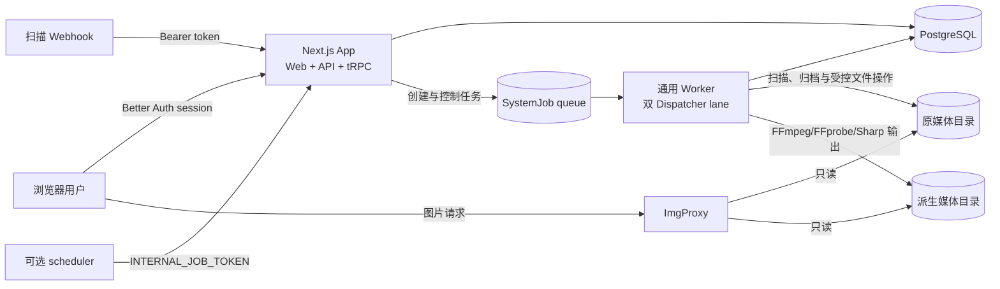
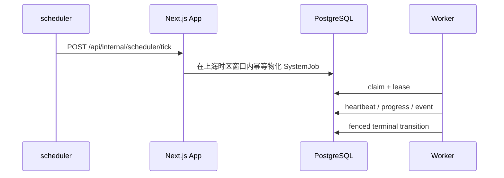

# PixiShelf 当前架构

本文只描述当前代码与部署基线。未来方案保留在 `draft` 功能规格或 ADR 中；历史切换过程保留在 `docs/archive/` 和 `docs/deployment/`，不得混入本文。

## 系统定位与边界

PixiShelf 是一个本地优先、单用户、单实例的个人媒体收藏系统。它负责导入或扫描本地收藏、维护作品与来源元数据、生成派生媒体，并提供检索、整理和浏览界面。目标用户、质量优先级和非目标以[产品基线](../product/product-baseline.md)为准。

当前部署边界：

- 一个 Next.js Web/API 实例；
- 一个 PostgreSQL 数据库；
- 一个能够领取任务的通用 Worker；
- 原媒体和派生媒体使用宿主机文件系统挂载；
- ImgProxy 只读访问媒体并提供图片转换；
- 可选 scheduler 定期调用 App 的内部接口；
- 一个通用 Worker 进程内运行归档解析与后台写入两个固定资源通道。

项目没有多租户、分布式 Worker 集群或 Kubernetes 运行承诺。

## 运行时组件



| 组件        | 当前职责                                                                         | 不负责                                  |
| ----------- | -------------------------------------------------------------------------------- | --------------------------------------- |
| Next.js App | 页面、Better Auth、tRPC/HTTP API、业务控制面、任务创建与状态读取                 | 生产稳态下不消费中央后台队列            |
| PostgreSQL  | 领域数据、认证会话、任务队列、租约、事件、审计和迁移历史                         | 不保存原媒体二进制                      |
| 通用 Worker | 按 lane 领取任务；串行解析 URL，并串行执行扫描、归档、迁移、替换、维护和视频派生 | 不执行 Prisma migration，不提供用户界面 |
| scheduler   | 周期性调用 `/api/internal/scheduler/tick`                                        | 不访问数据库，不执行业务任务            |
| ImgProxy    | 只读处理原图片和静态派生媒体                                                     | 不生成视频代表帧，不修改原媒体          |
| 文件系统    | 保存原媒体、归档 staging/发布目录和派生媒体                                      | 不替代数据库中的身份、状态和审计事实    |

## Workspace 责任与依赖

仓库由 `pnpm-workspace.yaml` 纳入 `packages/*`。主运行链与外围工具使用以下 workspace：

| Workspace                       | 责任                                                    |
| ------------------------------- | ------------------------------------------------------- |
| `@pixishelf/next`               | Next.js 主应用、API、tRPC、管理与浏览界面               |
| `@pixishelf/db`                 | Prisma Schema、migration、生成客户端和数据库守卫        |
| `@pixishelf/job-contracts`      | 后台任务类型、payload、DTO、错误码和媒体类型契约        |
| `@pixishelf/job-runtime`        | 队列仓储、Worker 心跳、生命周期和运行时协议             |
| `@pixishelf/job-executors`      | 归档、扫描、迁移、替换、维护和视频任务实现              |
| `@pixishelf/worker`             | 独立进程入口、配置、预检、健康服务和 Central Dispatcher |
| `@pixishelf/extension`          | Pixiv 浏览器侧采集/下载工作流                           |
| `@pixishelf/standalone-scanner` | 独立 Pixiv 元数据路径扫描服务                           |
| `@pixishelf/zip-convert`        | Pixiv zip/APNG 转换工具                                 |

核心依赖方向：

```mermaid
flowchart TD
  Next[@pixishelf/next] --> DB[@pixishelf/db]
  Next --> Contracts[@pixishelf/job-contracts]
  Next --> Executors[@pixishelf/job-executors]

  Worker[@pixishelf/worker] --> DB
  Worker --> Contracts
  Worker --> Runtime[@pixishelf/job-runtime]
  Worker --> Executors

  Executors --> DB
  Executors --> Contracts
  Executors --> Runtime
  Runtime --> Contracts

```

主应用通过 TypeScript path、Vitest alias 和 Next.js `transpilePackages` 直接解析三个 job workspace 的
`src/index.ts`，因此 Web 开发与生产构建不以这些包的 `dist` 为前置条件。共享包的生产源码使用显式
`.ts` 相对导入，TypeScript 5.9 的 `rewriteRelativeImportExtensions` 在独立构建时将其重写为 Node ESM
可执行的 `.js` 导入。独立 Worker 继续只从 DB、job 与 Worker workspace 构建，不复制主应用源码。
CI 先在无 `dist` 条件下构建 Web，再独立生成三个包的 `dist`/类型声明并打包 Worker，同时守住源码
消费与独立编译两种边界。

浏览器扩展、独立扫描器和 zip 转换器不参与主应用的运行时依赖图。它们通过浏览器、HTTP 或文件系统工作流与主系统外围协作。

## Web/API 请求链路

主应用代码直接位于 `packages/pixishelf/`，没有 `src/` 中间目录：

- `app/`：App Router 页面与 HTTP Route Handler；
- `server/routers/`：tRPC Router；
- `services/`：领域服务与任务控制面；
- `lib/`：认证、数据库入口、日志和基础设施适配；
- `schemas/`：运行时输入验证；
- `components/`、`hooks/`、`store/`：前端组件与状态。

用户通过 Better Auth 的数据库会话登录。当前部署中，已登录用户即实例管理员；敏感 tRPC 使用 `adminProcedure` 表达该边界。扫描 Webhook 与 scheduler 不使用浏览器会话，分别由 `SCAN_WEBHOOK_TOKEN` 和 `INTERNAL_JOB_TOKEN` 保护。

当前可以存在多个登录账户，但没有角色或租户隔离，所有账户属于同一个信任域。页面、HTTP、tRPC、Server Action、ImgProxy 和基础设施的具体执行层门禁见[权限与接口边界](../security/access-control.md)。

本地目录导入由预览和执行两个显式阶段组成。预览阶段遍历 `local-imports`、识别包含直属媒体的作品目录，并只查询本地目录导入来源的数据库路径来标记新增与已有作品；已有作品目录命中后立即停止向下读取。预览返回作品路径、状态和媒体数量，不返回媒体文件名列表，并受遍历深度、目录项总数和作品总数的服务端边界约束；服务端记录扫描耗时、遍历规模、剪枝数量和响应大小，浏览器请求取消后目录遍历也会尽快停止。开始导入时，浏览器只提交该次预览中的新增作品路径。App 校验路径、再次按精确路径去重，并把作品路径、艺术家映射和默认标签冻结到任务快照后立即入队。Worker 只读取快照列出的作品目录，不重新遍历 `local-imports` 根目录，也不计算媒体内容指纹。单作品重扫是独立链路，仍使用内容指纹检测扫描与执行之间的源文件变化。

`JWT_SECRET`/`JWT_TTL` 仍存在于环境模板和遗留依赖中，但当前浏览器登录与服务端会话由 Better Auth 负责，不能继续把系统描述为“基于 JWT 的无状态认证”。
`INIT_ADMIN_USERNAME`/`INIT_ADMIN_PASSWORD` 也只保留在环境模板中，当前首次账户由 `/login` 初始化 Action 创建。

## 归档收件与后台执行

生产稳态使用两段开关：

- `CENTRAL_DISPATCHER_CUTOVER_ENABLED=true`：App 只物化、创建和控制中央队列任务；
- `WORKER_DISPATCH_ENABLED=true`：通用 Worker 才会 claim 和执行任务。

两者必须成对管理。正常链路是：



生产稳态为 `true/true`；`false/false` 只用于暗启动和故障隔离。Worker 使用 PostgreSQL 队列、按 lane 的执行态唯一索引、资源租约和 lease token 围栏保证同 lane 单任务执行；并发数不提供环境变量配置。

归档收件箱位于 `/admin/archive/inbox`。一次提交可以包含最多 100 个 URL，活动收件项目上限为 1000；链接持久化后按 FIFO 在 `ARCHIVE_RESOLVE` 中逐条解析。已就绪项目可以在其余项目解析期间多选入队，每个作品创建或复用一个独立 `ARCHIVE_IMPORT`。`/admin/archive` 提供任务分页、筛选、明细和当前页批量控制。完整流程见[归档收件箱](../features/archive-intake.md)。

一个 Worker host 运行两个 Dispatcher loop：

| Lane                | 固定并发 | 工作范围                                                  |
| ------------------- | -------- | --------------------------------------------------------- |
| `ARCHIVE_RESOLVE`   | 1        | 仅 `ARCHIVE_RESOLVE_ITEM`，不写原媒体、派生媒体或 staging |
| `BACKGROUND_WRITER` | 1        | 其余 19 类 v1 job；所有媒体、扫描、迁移、替换和维护写操作 |

两个 lane 可以各运行一个任务，同一 lane 内不能并行。生产 capability audit 精确验证 20 项 job type、definition version 与 lane。归档解析主要等待 HTTP 和 PostgreSQL，writer 主要等待文件流、Sharp/libvips 与 FFmpeg 子进程；异步等待允许同一 Node.js 事件循环交替推进两项工作，但不构成纯 JavaScript CPU 并行承诺。

归档维护统一使用 writer lane 的 `ARCHIVE_MAINTENANCE`。每日 `02:05` 的 `RECONCILE` 发现到期 staging、孤立回收/恢复 intent 和到期回收站，为每个目标幂等创建 `CLEAN_STAGING`、`TRASH_ARCHIVE`、`RESTORE_ARCHIVE` 或 `PURGE_ARCHIVE` 子任务。每日 `02:15` 的 `ARCHIVE_INTAKE_RETENTION_CLEANUP` 清理超过 30 天的终态收件/批量历史及过期预览会话，不删除领域归档、作品或媒体。

Worker 启动前必须通过以下预检：

- 数据库 migration 和后台队列表结构满足要求；
- 原媒体、归档和派生媒体目录可读写；
- FFmpeg 与 FFprobe 可执行；
- 心跳间隔、租约和事务超时配置满足约束。

## 数据与存储边界

| 数据                     | 权威来源                   | 保护规则                                         |
| ------------------------ | -------------------------- | ------------------------------------------------ |
| 领域关系、任务和认证     | PostgreSQL / Prisma Schema | 只通过正式 migration 演进                        |
| 原媒体和已发布归档       | `PIXISHELF_DATA_PATH` 挂载 | 默认不得静默删除；高风险操作由 Worker 执行并记录 |
| 视频封面、章节图、代表帧 | `DERIVED_MEDIA_HOST_PATH`  | 可重建，但必须与数据库发布状态一致               |
| 图片变体与请求缓存       | ImgProxy                   | 非权威、可重新生成                               |

App 容器的原媒体挂载默认由 `PIXISHELF_APP_DATA_MOUNT_MODE=ro` 控制；归档收件只保存相对 staging 路径，实际挂载和可写预检由 Worker 负责。Worker 使用读写挂载，ImgProxy 始终只读。

数据库和文件系统构成一个一致性整体。归档和派生媒体先写 staging 或新 generation，验证完成后再通过短事务发布，不能把半成品暴露为当前数据。

## 构建、迁移与部署所有权

- Web 镜像由 `build/Dockerfile` 构建，启动入口执行 `prisma migrate deploy` 后启动 Next.js standalone 服务；
- Worker 镜像由 `build/worker.Dockerfile` 构建，不包含主应用源码，不执行 migration；
- `build/docker-compose.dev.yml` 默认启动 PostgreSQL、ImgProxy 和通用 Worker，App/scheduler 受 profile 控制；
- `build/docker-compose.deploy.yml` 的生产服务为 PostgreSQL、App、通用 Worker、scheduler 和 ImgProxy，不包含旧归档消费者。

当前操作流程见[部署基线](../operations/deployment.md)，镜像与挂载细节见 [Build 与部署](../../build/README.md)。
数据库与媒体的一致性检查点和恢复演练见[备份与恢复基线](../operations/backup-and-recovery.md)。

## 当前不变量

1. 外部来源引用不能定义本地 Artwork 身份。
2. 同一时间每个执行 lane 最多一个任务；只允许一个 resolver 和一个 writer，所有媒体写仍全局串行。
3. 通用 Worker 未通过 READY 和 capability 检查时不得恢复调度。
4. 生产 capability inventory 固定为 20 项 v1；任务类型、definition version 与 lane 必须精确匹配。
5. 普通启动和升级使用 `prisma migrate deploy`，不得用 `db:push` 替代 migration 历史。
6. 原媒体、派生媒体和数据库需要在一致时间点备份和恢复。
7. 网络下载、FFmpeg 和文件复制不得放在长数据库事务中。
8. 当前架构只描述已上线事实；未完成方案必须标为 `draft`。

## 关联决策与历史

- [产品基线](../product/product-baseline.md)
- [权限与接口边界](../security/access-control.md)
- [测试策略](../development/testing-strategy.md)
- [备份与恢复基线](../operations/backup-and-recovery.md)
- [ADR-0001：来源引用与本地身份分离](../adr/0001-separate-source-references-from-local-identity.md)
- [ADR-0002：持久 Worker 与原子归档发布](../adr/0002-use-a-durable-worker-and-atomic-archive-publication.md)
- [ADR-0003：统一后台任务 Worker](../adr/0003-unify-background-jobs-under-a-durable-single-worker.md)
- [ADR-0004：归档解析独立资源通道](../adr/0004-run-archive-resolution-in-a-separate-worker-lane.md)
- [归档收件箱](../features/archive-intake.md)
- [阶段 1–7 切换记录](../deployment/background-task-cutover-deployment.md)
- [旧系统设计](../archive/system-design-legacy.md)
- [旧调度架构](../archive/scheduler-architecture-legacy.md)
