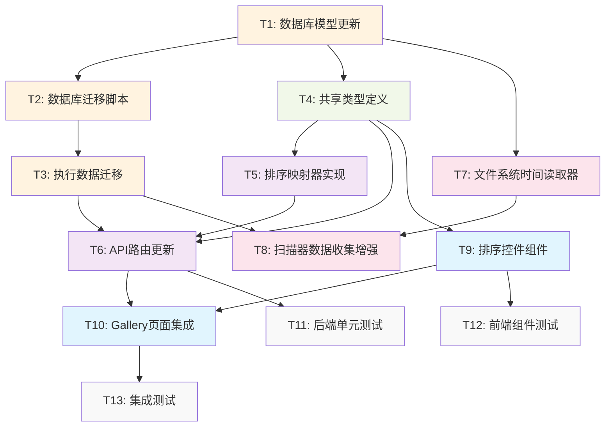

# TASK_artwork_sorting.md

## 任务原子化分解

基于DESIGN文档，将作品排序功能拆分为以下原子任务：

### 任务依赖图

## 原子任务详细定义

### T1: 数据库模型更新

**输入契约**
- 前置依赖：无
- 输入数据：现有 Prisma schema 文件
- 环境依赖：Prisma CLI 工具

**输出契约**
- 输出数据：更新后的 schema.prisma 文件
- 交付物：
  - `packages/api/prisma/schema.prisma` 更新
  - 新增字段：`directoryCreatedAt`, `imageCount`, `descriptionLength`
  - 新增索引：对应字段的数据库索引定义
- 验收标准：
  - ✅ Prisma schema 语法正确
  - ✅ 新字段类型定义正确
  - ✅ 索引定义符合性能要求
  - ✅ 与现有模型关系保持一致

**实现约束**
- 技术栈：Prisma ORM
- 接口规范：遵循现有 Prisma schema 约定
- 质量要求：向后兼容，不破坏现有关系

**依赖关系**
- 后置任务：T2, T4, T7
- 并行任务：无

---

### T2: 数据库迁移脚本

**输入契约**
- 前置依赖：T1 完成
- 输入数据：更新后的 Prisma schema
- 环境依赖：Prisma CLI, 数据库连接

**输出契约**
- 输出数据：数据库迁移文件
- 交付物：
  - 自动生成的迁移 SQL 文件
  - 数据初始化脚本（现有数据的字段填充）
- 验收标准：
  - ✅ 迁移脚本语法正确
  - ✅ 包含所有新字段的 ALTER TABLE 语句
  - ✅ 包含索引创建语句
  - ✅ 包含现有数据的初始化逻辑
  - ✅ 支持回滚操作

**实现约束**
- 技术栈：Prisma Migrate
- 接口规范：标准 SQL DDL 语句
- 质量要求：安全可回滚，不丢失数据

**依赖关系**
- 前置任务：T1
- 后置任务：T3
- 并行任务：无

---

### T3: 执行数据迁移

**输入契约**
- 前置依赖：T2 完成
- 输入数据：迁移脚本文件
- 环境依赖：数据库连接，备份机制

**输出契约**
- 输出数据：更新后的数据库结构和数据
- 交付物：
  - 数据库表结构更新完成
  - 现有数据字段初始化完成
  - 索引创建完成
- 验收标准：
  - ✅ 所有新字段成功添加
  - ✅ 现有数据的 `directoryCreatedAt` 初始化为 `createdAt`
  - ✅ `imageCount` 字段正确计算并填充
  - ✅ `descriptionLength` 字段正确计算并填充
  - ✅ 所有索引创建成功
  - ✅ 数据完整性验证通过

**实现约束**
- 技术栈：Prisma Migrate, PostgreSQL
- 接口规范：标准数据库操作
- 质量要求：零数据丢失，可回滚

**依赖关系**
- 前置任务：T2
- 后置任务：T6, T8
- 并行任务：无

---

### T4: 共享类型定义

**输入契约**
- 前置依赖：T1 完成
- 输入数据：更新后的数据库模型
- 环境依赖：TypeScript 编译环境

**输出契约**
- 输出数据：TypeScript 类型定义文件
- 交付物：
  - `packages/shared/src/types/api.ts` 更新
  - 新增 `SortOption` 类型
  - 更新 `ArtworksQuery` 接口
  - 更新 `Artwork` 接口（新增字段）
- 验收标准：
  - ✅ 所有排序选项类型定义正确
  - ✅ API 查询参数类型完整
  - ✅ 响应数据类型与数据库模型一致
  - ✅ TypeScript 编译无错误
  - ✅ 向后兼容现有类型

**实现约束**
- 技术栈：TypeScript
- 接口规范：遵循现有类型定义约定
- 质量要求：类型安全，向后兼容

**依赖关系**
- 前置任务：T1
- 后置任务：T5, T6, T9
- 并行任务：T2

---

### T5: 排序映射器实现

**输入契约**
- 前置依赖：T4 完成
- 输入数据：排序选项类型定义
- 环境依赖：Node.js 运行环境

**输出契约**
- 输出数据：排序映射器模块
- 交付物：
  - `packages/api/src/utils/sortMapper.ts` 新建
  - 排序选项到 Prisma orderBy 的映射逻辑
  - 排序选项验证函数
  - 默认排序处理逻辑
- 验收标准：
  - ✅ 所有8种排序选项映射正确
  - ✅ 无效排序选项的回退逻辑
  - ✅ 单元测试覆盖所有映射情况
  - ✅ 性能优化（避免重复计算）

**实现约束**
- 技术栈：TypeScript, Prisma
- 接口规范：纯函数设计，无副作用
- 质量要求：高性能，易扩展

**依赖关系**
- 前置任务：T4
- 后置任务：T6
- 并行任务：T7

---

### T6: API路由更新

**输入契约**
- 前置依赖：T3, T4, T5 完成
- 输入数据：
  - 更新后的数据库结构
  - 共享类型定义
  - 排序映射器
- 环境依赖：Fastify 服务器环境

**输出契约**
- 输出数据：更新后的 API 路由
- 交付物：
  - `packages/api/src/routes/artworks.ts` 更新
  - 新增 `sortBy` 查询参数处理
  - 集成排序映射器
  - 更新查询逻辑
  - 保持响应格式兼容性
- 验收标准：
  - ✅ 所有排序选项正常工作
  - ✅ 默认排序为 'newest'
  - ✅ 无效排序参数的错误处理
  - ✅ 与现有搜索、过滤功能兼容
  - ✅ API 响应时间 < 500ms（1000条记录）
  - ✅ 向后兼容（无 sortBy 参数时使用默认排序）

**实现约束**
- 技术栈：Fastify, Prisma, TypeScript
- 接口规范：RESTful API 设计
- 质量要求：高性能，向后兼容

**依赖关系**
- 前置任务：T3, T4, T5
- 后置任务：T10, T11
- 并行任务：T7

---

### T7: 文件系统时间读取器

**输入契约**
- 前置依赖：T1 完成
- 输入数据：文件系统路径
- 环境依赖：Node.js fs 模块

**输出契约**
- 输出数据：文件系统时间读取器模块
- 交付物：
  - `packages/api/src/utils/fsTimeReader.ts` 新建
  - 目录创建时间获取函数
  - 异常处理逻辑
  - 时间有效性验证
- 验收标准：
  - ✅ 正确获取目录 birthtime 或 ctime
  - ✅ 文件系统访问异常的优雅处理
  - ✅ 无效时间的回退逻辑
  - ✅ 跨平台兼容性（Windows/Linux/macOS）
  - ✅ 单元测试覆盖各种边界情况

**实现约束**
- 技术栈：Node.js, TypeScript
- 接口规范：异步函数设计
- 质量要求：健壮性，跨平台兼容

**依赖关系**
- 前置任务：T1
- 后置任务：T8
- 并行任务：T5, T6

---

### T8: 扫描器数据收集增强

**输入契约**
- 前置依赖：T3, T7 完成
- 输入数据：
  - 更新后的数据库结构
  - 文件系统时间读取器
- 环境依赖：扫描器运行环境

**输出契约**
- 输出数据：增强的扫描器模块
- 交付物：
  - `packages/api/src/services/scanner.ts` 更新
  - 集成文件系统时间读取
  - 新增字段的数据收集逻辑
  - 批量处理器的数据结构更新
- 验收标准：
  - ✅ 扫描时正确获取目录创建时间
  - ✅ 正确计算图片数量和描述长度
  - ✅ 新字段数据正确存储到数据库
  - ✅ 扫描性能不受显著影响
  - ✅ 错误处理和日志记录完善

**实现约束**
- 技术栈：Node.js, TypeScript, Prisma
- 接口规范：保持现有扫描器接口
- 质量要求：高性能，数据准确性

**依赖关系**
- 前置任务：T3, T7
- 后置任务：T13
- 并行任务：T9

---

### T9: 排序控件组件

**输入契约**
- 前置依赖：T4 完成
- 输入数据：排序选项类型定义
- 环境依赖：React 开发环境

**输出契约**
- 输出数据：排序控件 React 组件
- 交付物：
  - `packages/web/src/components/SortControl.tsx` 新建
  - 下拉选择器组件实现
  - 排序选项配置
  - 样式和交互逻辑
- 验收标准：
  - ✅ 所有排序选项正确显示
  - ✅ 选项分组显示（时间/名称/数量）
  - ✅ 响应式设计，移动端适配
  - ✅ 无障碍访问支持
  - ✅ 与现有 UI 风格一致
  - ✅ 组件单元测试覆盖

**实现约束**
- 技术栈：React, TypeScript, Tailwind CSS
- 接口规范：受控组件设计
- 质量要求：用户体验优先，性能优化

**依赖关系**
- 前置任务：T4
- 后置任务：T10, T12
- 并行任务：T8

---

### T10: Gallery页面集成

**输入契约**
- 前置依赖：T6, T9 完成
- 输入数据：
  - 更新后的 API 接口
  - 排序控件组件
- 环境依赖：React 应用环境

**输出契约**
- 输出数据：更新后的 Gallery 页面
- 交付物：
  - `packages/web/src/pages/Gallery.tsx` 更新
  - 集成排序控件
  - URL 状态管理逻辑
  - API 查询参数更新
- 验收标准：
  - ✅ 排序控件正确集成到页面布局
  - ✅ 排序状态通过 URL 参数管理
  - ✅ 排序变更时正确触发 API 请求
  - ✅ 页面刷新后排序状态保持
  - ✅ 与搜索、过滤功能无冲突
  - ✅ 加载状态和错误处理完善

**实现约束**
- 技术栈：React, React Query, React Router
- 接口规范：遵循现有页面组件模式
- 质量要求：用户体验流畅，状态管理清晰

**依赖关系**
- 前置任务：T6, T9
- 后置任务：T13
- 并行任务：无

---

### T11: 后端单元测试

**输入契约**
- 前置依赖：T6 完成
- 输入数据：更新后的 API 路由和排序逻辑
- 环境依赖：测试框架（Jest/Vitest）

**输出契约**
- 输出数据：后端单元测试套件
- 交付物：
  - `packages/api/src/routes/artworks.test.ts` 更新
  - `packages/api/src/utils/sortMapper.test.ts` 新建
  - `packages/api/src/utils/fsTimeReader.test.ts` 新建
- 验收标准：
  - ✅ 所有排序选项的测试用例
  - ✅ 无效参数的错误处理测试
  - ✅ 边界条件测试（空数据、大数据集）
  - ✅ 性能测试（查询响应时间）
  - ✅ 测试覆盖率 > 90%

**实现约束**
- 技术栈：Jest/Vitest, TypeScript
- 接口规范：遵循现有测试模式
- 质量要求：全面覆盖，快速执行

**依赖关系**
- 前置任务：T6
- 后置任务：T13
- 并行任务：T12

---

### T12: 前端组件测试

**输入契约**
- 前置依赖：T9 完成
- 输入数据：排序控件组件
- 环境依赖：前端测试框架（React Testing Library）

**输出契约**
- 输出数据：前端组件测试套件
- 交付物：
  - `packages/web/src/components/SortControl.test.tsx` 新建
  - 组件渲染测试
  - 用户交互测试
  - 状态变更测试
- 验收标准：
  - ✅ 组件正确渲染所有排序选项
  - ✅ 用户选择操作正确触发回调
  - ✅ 受控组件状态管理正确
  - ✅ 无障碍访问测试通过
  - ✅ 测试覆盖率 > 85%

**实现约束**
- 技术栈：React Testing Library, Jest/Vitest
- 接口规范：遵循现有组件测试模式
- 质量要求：用户行为驱动测试

**依赖关系**
- 前置任务：T9
- 后置任务：T13
- 并行任务：T11

---

### T13: 集成测试

**输入契约**
- 前置依赖：T10, T11, T12 完成
- 输入数据：完整的排序功能实现
- 环境依赖：端到端测试环境

**输出契约**
- 输出数据：端到端测试套件
- 交付物：
  - `packages/web/e2e/sorting.spec.ts` 新建
  - 完整用户流程测试
  - 性能基准测试
  - 兼容性测试
- 验收标准：
  - ✅ 用户可以成功切换所有排序选项
  - ✅ 排序结果正确显示
  - ✅ URL 状态正确同步
  - ✅ 与搜索、过滤功能兼容
  - ✅ 页面性能符合要求
  - ✅ 移动端功能正常

**实现约束**
- 技术栈：Playwright/Cypress
- 接口规范：真实用户场景测试
- 质量要求：稳定可靠，覆盖关键路径

**依赖关系**
- 前置任务：T10, T11, T12
- 后置任务：无
- 并行任务：无

## 任务复杂度评估

### 高复杂度任务（需要特别关注）
- **T3: 执行数据迁移** - 涉及生产数据，需要谨慎处理
- **T6: API路由更新** - 核心业务逻辑，影响面广
- **T8: 扫描器数据收集增强** - 复杂的文件系统操作

### 中复杂度任务
- **T1: 数据库模型更新** - 需要仔细设计索引策略
- **T10: Gallery页面集成** - 涉及多个状态管理
- **T13: 集成测试** - 需要覆盖多种场景

### 低复杂度任务
- **T2: 数据库迁移脚本** - 自动生成为主
- **T4: 共享类型定义** - 标准的类型定义
- **T5: 排序映射器实现** - 简单的映射逻辑
- **T7: 文件系统时间读取器** - 标准的文件操作
- **T9: 排序控件组件** - 标准的 React 组件
- **T11: 后端单元测试** - 标准的测试用例
- **T12: 前端组件测试** - 标准的组件测试

## 风险评估和缓解策略

### 高风险任务
1. **T3: 执行数据迁移**
   - 风险：数据丢失、服务中断
   - 缓解：完整备份、分阶段执行、回滚方案

2. **T8: 扫描器数据收集增强**
   - 风险：扫描性能下降、文件系统兼容性
   - 缓解：性能测试、跨平台测试、异常处理

### 中风险任务
1. **T6: API路由更新**
   - 风险：破坏现有功能、性能问题
   - 缓解：充分测试、渐进式部署

2. **T10: Gallery页面集成**
   - 风险：用户体验问题、状态管理复杂
   - 缓解：用户测试、状态管理简化

## 质量门控检查点

### 每个任务完成后的检查项
1. **功能完整性**：所有验收标准满足
2. **代码质量**：通过代码审查和静态分析
3. **测试覆盖**：单元测试和集成测试通过
4. **性能要求**：满足性能基准
5. **兼容性**：不破坏现有功能

### 里程碑检查点
1. **数据库层完成**（T1-T3）：数据结构和迁移验证
2. **后端API完成**（T4-T6）：API功能和性能验证
3. **前端UI完成**（T9-T10）：用户体验和交互验证
4. **全功能完成**（T11-T13）：端到端功能验证

## 预估工作量

### 开发时间估算（人日）
- T1: 0.5天
- T2: 0.5天
- T3: 1天
- T4: 0.5天
- T5: 1天
- T6: 2天
- T7: 1天
- T8: 2天
- T9: 1.5天
- T10: 1.5天
- T11: 1天
- T12: 0.5天
- T13: 1天

**总计：约13天**

### 关键路径
最长路径：T1 → T2 → T3 → T6 → T10 → T13（约6.5天）

### 并行执行优化
通过合理的任务并行，可以将总工期压缩到约8-10天。