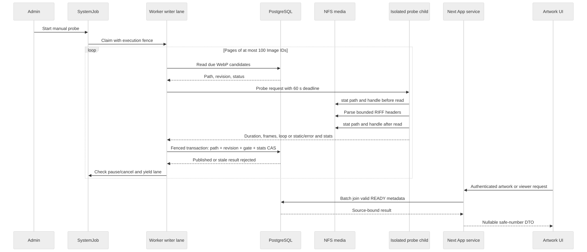

# WebP 动图时长探测方案

## 需求与边界

本期给本地 WebP 媒体保存一轮动画的时长、帧数和原文件循环次数，在作品详情与沉浸浏览的播放按钮上显示已播放比例。所有 WebP 均为候选，包括旧动画分类为静态、动态和未知的文件；探测直接解析 RIFF/WebP 头，静态结果持久记录为 `NOT_APPLICABLE`。GIF/APNG 格式在数据模型中预留，但本期不探测，也不改变原播放器。视频继续使用原有 `MediaVideoMetadata.duration`，动画时长不会写进视频字段。

目标环境为 i5-4210M、2 核 4 线程、12 GB DDR3；原媒体经 NFS 存在另一台 8 TB 机械盘 NAS，集合超过一万文件。后台任务默认人工启动，计划任务保持关闭。首次上线不自动回填、不做额外整文件哈希，也不让普通页面加载逐文件 `stat`。只有人工任务执行时读取候选文件；已完成且源证据未变的结果在数据库中跳过。

播放控制统一放在作品详情媒体的右下角：红色 capsule 按钮，白色 25% 透明度的进度填充，暂停/继续共用入口；不提供拖动和时间文字。真实暂停冻结当前帧和剩余时长并保留资源；离开当前媒体、下线或销毁时释放资源。数据缺失或失效时不伪造进度，播放器原有加载与兼容回退仍有效。

### 组件关系



[Mermaid 源文件](./diagrams/animation-duration-probe/components.mmd)

### 读取与发布时序



[Mermaid 源文件](./diagrams/animation-duration-probe/sequence.mmd)

### 数据模型



[Mermaid 源文件](./diagrams/animation-duration-probe/data-model.mmd)

## 数据与 API 契约

`ImageAnimationMetadata` 以 `imageId` 与 `Image` 一对一，删除 Image 时级联删除。`format` 预留 `WEBP/GIF/APNG`；`durationMs` 为 PostgreSQL `BIGINT`，一轮所有展示帧的时长总和，不乘循环次数；`frameCount` 为实际动画帧数；`loopCount=0` 表示无限循环；`timingPolicyVersion=1` 表示当前 0–10 ms 帧按 100 ms 计的策略。`status` 是 `PENDING/READY/NOT_APPLICABLE/FAILED`：执行期间仍为 PENDING，因此 Worker 中断后无需清除遗留 PROBING 状态。`probedAt`、`failureCode`、`attemptCount`、`nextRetryAt` 支持审计和有界重试。

源证据为 `sourcePath`、`sourceSize`、毫秒级 mtime/ctime、device/inode（若文件系统提供）、`sourceRevision` 与 `writeInProgress`。源版本由应用内部已知文件变更主动递增，与 `Image.updatedAt` 分离；后者也会因排序、分类和章节变化更新，不可作内容版本。任务使用前后文件状态比较、数据库源版本 CAS 和现有 Worker execution fence 共同阻止迟到结果发布。NFS 外部在同路径、同大小、保留全部时间与 inode 证据的替换无法由轻量方案识别；这不是内容级哈希保证。

API 在每个 `ArtworkImageResponseDto` 和 `ViewerMediaItem` 上返回必填且可空的 `animationMetadata`：

```ts
type AnimationMetadataDto = {
  format: 'WEBP' | 'GIF' | 'APNG'
  durationMs: number
  frameCount: number
  loopCount: number
  timingPolicyVersion: number
} | null
```

只有 `READY`、当前策略版本、未处于写入期、源路径仍等于 Image.path、数值有效且 `durationMs` 能安全转为 JavaScript number 时才非空。返回值不包含源绝对路径、文件统计、内部失败原因或 `BigInt`。列表、详情、随机浏览和邻近作品通过 Prisma 关系批量读取，避免每张图一次查询；已成功的页面读取不逐项访问 NFS。

## 任务与限流

独立任务类型 `ANIMATION_DURATION_PROBE` 运行于现有 `BACKGROUND_WRITER` lane，默认内部并发 1。数据库按 Image ID 升序分页，每页最多 100 个 WebP 候选；每个执行片先给已到期失败项最多 2 个优先名额，避免低 ID 重试被高 ID 页游标饿死，其余名额处理普通候选。每片总计最多 10 个文件或 5 秒，然后让出 lane 5 秒并继续检查取消/暂停。单文件最多 60 秒，最多 100,000 个 RIFF chunk，逻辑读取上限 64 MiB，以 4 KiB 缓存处理头部。这里的逻辑读取量是解析器请求字节数，不等于 NFS 物理读流量；解析失败途中可能没有完整测量，失败数单列为 `unmeasuredFailureAttempts`。

正常分批让行、失败项退避等待和源文件写入等待均保留任务 attempt，并以 INFO 调度事件记录下一次可领取时间；它们不会产生任务级失败错误。探测到的真实逐项失败仍记录在执行诊断中。探测子进程不可用属于真实资源问题，继续保留错误摘要；暂停和继续不改变已提交的探测检查点。

Parser 只读原媒体，不解码整帧、不上传或修改文件。按 WebP ANIM/ANMF 记录计算一轮帧时长；0–10 ms 帧按 100 ms，`loopCount=0` 按无限循环保存。静态 WebP 标记 `NOT_APPLICABLE` 后不再读；已成功且策略版本未变化的条目直接跳过。瞬时错误最多三次尝试，第一和第二次失败分别等待 1 分钟、10 分钟，第三次停止自动重试；永久格式错误直接终止自动重试。管理员可明确重试失败项，重置退避并递增发布版本。任务跨等待期不能把未到期候选遗漏为已完成；页游标与库存统计必须保持一致。仅剩 `writeInProgress` 候选时，任务进入 `WAITING_SOURCE_WRITE`，持久记录后让行约 10 分钟再检查，而非静默完成；异常遗留门禁须通过上传完成、替换回滚或人工核对处理，任务不会超时自动清除。

文件前后 stat 不一致时记录 `SOURCE_CHANGED` 瞬时失败，只保存失败码、不发布时长，按同一退避策略重试，并继续处理其他候选。应用内部写入先递增 revision，故旧探测发布会因 CAS 拒绝；站外变动只有前后 stat 证据，若两次观察间同名同证据替换则仍可能漏检。

## 源文件变更与恢复

- 本地同 ID 重扫和 Pixiv 同 ID 发布利用发现阶段已有 `lstat` 证据，比较路径、大小、mtime/ctime、device/inode。源证据变化时在 Image 更新事务内使动画结果变为 PENDING 并递增 revision；仅排序、标签、分类或章节变化不失效。发现阶段不额外读全文件哈希。
- 迁移同 ID 改路径时，发布路径的同一数据库事务使 WebP 结果失效；新 ID 的媒体自然因缺少一对一记录成为候选。删除旧 ID 会级联删除旧元数据。
- App 分块上传在截断或写入前登记 `writeInProgress`。各 chunk 保持门禁，普通上传只在最后一块完整校验后以捕获的 revision token 清除；异常或中断保留门禁，重试可重新取得版本。迟到的完成操作不能解除较新写入的门禁。
- 扫描可能在 chunk 间观察到暂时的文件大小。扫描比较会跳过活跃门禁；即使其读取到门禁开启前的旧状态，源失效 helper 也会在 Image 行锁下重查门禁，不递增当前 writer 的 revision，也不清除门禁。
- 替换会话在 init 搬移备份文件之前给仍存活的旧 Image 开门禁，final chunk 不解除会话门禁；commit 删除旧 Image 并创建新 ID，rollback 完整恢复旧媒体后用预先捕获的 token 清门禁。同一媒体目录的 init/commit/rollback、图片分块和章节文件写入共用原子目录锁；并发上传等待前一写入，取消的请求不会在排队后继续写。进程崩溃留下的锁不按时间自动夺取，恢复步骤见[备份与恢复](../operations/backup-and-recovery.md)。
- 备份 manifest 记录原文件名、创建时的 size/mtime/ctime/device/inode 证据，以及 `BACKING_UP/READY/ROLLING_BACK/COMMITTING` 阶段。上传仅在 `READY` 阶段继续，且原件同名文件必须已存在于备份中。init 中断后只能搬移身份仍匹配的未备份原件；rollback 删除新文件前核对每个原件，在真实 rename 后中断可依 `restoringFiles` 继续恢复。旧版仅记文件名的 manifest 无法证明未备份目标仍是原件，会保守拒绝自动恢复；缺失、损坏、备份符号链接、源证据变化或提交状态不明时也拒绝猜测回滚。`COMMITTING` 先于数据库提交落盘，因此不能单凭该标记判断提交成功，必须人工比对数据库与媒体。

文件系统写入和 PostgreSQL 事务不是一个原子提交。中断后门禁保守地保持无效结果，需要完成上传、替换回滚或人工核对并恢复；不得直接把旧 READY 结果重新显示。生产原媒体默认只读挂载的 App 中这些旧上传入口可能不可写，但代码仍需维护门禁，因为本地或改挂载部署可调用。

## 实施与上线顺序

1. 代码与数据：添加一对一表及索引、事务 helper、源写入门禁、任务契约/Executor、DTO 和播放 UI。保持计划任务关闭，旧库不自动批量建元数据行。
2. 隔离验证：Prisma validate/generate/typecheck；空库全部 migration deploy/status；事务测试覆盖源版本、Worker fence 接口、前后 stat、异常重试、级联删除与失败项人工重试；聚焦 App/Worker 测试、全量 lint/test/build、浏览器交互。
3. 发布前：依[备份与恢复基线](../operations/backup-and-recovery.md)建立数据库与原媒体的同一检查点，记录旧 App/Worker 镜像 digest 和回滚依据；先 `migrate deploy`，再成对升级 App/Worker 并核对 capability inventory。禁止 `db:push`。
4. 人工验收：先在真实 NAS 上抽样不少于 100 个 WebP，覆盖动态、静态、损坏、短帧、长循环、文件变更和撤销；观察单并发的任务耗时、NFS I/O、CPU/内存、暂停取消与 5 秒让行，再决定是否扩大至上万文件。未取得真实 NAS 证据时不得称发布验收通过。
5. 回滚：先停止探测任务；可回滚 App/Worker 镜像并保留新增一对一表和 migration 历史。若需恢复媒体或数据库，必须使用同一发布前检查点；仅回退数据库或仅恢复媒体可能使源证据与结果不一致。

## 本地验收记录

截至 2026-09-24，隔离 PostgreSQL `127.0.0.1:55439/probe_verify` 从空库部署全部 84 个 migration，新增表及索引成功；Prisma validate、generate、db 包 typecheck 与 migration status 均通过。DB 包完整测试 34 文件/144 项通过，含 PostgreSQL 事务源版本、门禁、退避、级联和新表启动检查；扫描的门禁聚焦测试 2 文件/11 项通过。隔离 PostgreSQL 的 Worker 全链测试 1300/1300 通过：DB 144、job contracts 82、runtime 107、executors 861、Worker 106；其中探测执行器 5/5 覆盖入队、领取、让行后再领取和失效 fence。Worker 链 typecheck 与生产构建通过。主 App 全量测试 2100 通过、129 条条件跳过，App typecheck、lint 与生产构建通过。此库只用于本地验证，不是生产数据库。

浏览器非性能用例 19/19 通过，后续节流和同 ID 资源身份变更也做了针对性回归。独立性能 benchmark 的 11,000 ms 门槛**未通过**：最终两次为 12,602.8 ms、11,400.8 ms，均 exit 1；同环境旧 HEAD 为 11,732 ms、新实现为 12,224.1 ms，均超过门槛；禁用 demo DOM 日志后的诊断为 12,372.1 ms，未证明日志引起回归。此前单次观察到 9,964.6 ms，不构成稳定通过证据，因此未改 demo 行为或放宽门槛。功能与构建检查通过不等于整体发布可用：性能门槛、真实 NAS 百样本、安卓真机及生产备份/镜像升级均尚未验收，不能用本地 fixture 替代。

## 独立审查补记（2026-09-24）

确认并修复 P1：原 manifest 只记名称。init 在写 manifest 后、搬走某原件前中断时，同名上传可覆盖它；rollback 随后会把新文件误当原件、清除 WebP 写入门禁。章节上传的规范文件写入和旧候选删除也可绕过替换会话。现在同目录写入串行，未备份原件禁止上传，章节写入遵守同一规则；恢复前验证文件身份和备份阶段。备份为符号链接、已变文件或未知提交状态时拒绝自动清理。恢复中断后可按持久 `restoringFiles` 继续真实文件 rename，避免 ctime 合法变化导致永远拒绝。

聚焦回归：替换会话、图片上传、章节上传、真实三路同目录并发、目录锁异常释放/超时/取消、错误流关闭、Windows junction 和分段 rollback 共 5 文件 38 项通过。父 agent 的最终 App 验收：lint 无警告和错误、typecheck 通过、全量测试 334 文件通过/20 文件跳过，2,114 项通过/129 项条件跳过（166.04 秒），production build 退出 0；构建仅有既有 `batch-import-service.ts:82` Turbopack 宽泛路径警告，无新增构建错误。Worker 依赖链 1,300 项通过是此前实施轮次的基线，本轮独立审查未重跑。独立阅读了 WebP 解析器及子进程时限、任务分页/重试/取消与发布 CAS、API DTO、播放器暂停/进度和 Worker 门禁，未确认其他 P0/P1。此审查没有真实 NAS、生产数据副本、Compose 升级或安卓真机证据；上段性能门槛失败仍是发布限制。

## 正常让行误报修复验收（2026-09-24）

真实动图时长任务 `cmuf49h3g0002y7bbw7z09ndf` 在正常持久批次让行后被暂停，数据库只读核对为 `PAUSED`、attempt 0/3、进度 51%、stage `YIELDING`，但旧 Worker 把 `RESOURCE_BUSY` 和固定英文让行文案写成任务错误，界面据此显示“失败诊断”。修复后的纯调度让行显式保留 attempt、清空任务错误并记录 INFO 事件；已有记录仅在任务类型、阶段、非失败状态、错误码及完整旧文案同时匹配时于读取侧过滤伪错误。真实资源错误和已经保存的逐项失败继续显示。此次没有修改该任务数据或解除暂停；管理员可按原有“继续”入口恢复，下一次领取会沿用持久检查点并清除旧错误列。

最终回归使用隔离 PostgreSQL 完整运行 Worker 依赖链，1,301 项通过、零跳过（DB 144、contracts 82、runtime 108、executors 861、Worker 106）；App 全量 2,119 项通过、129 项条件跳过。App 与 Worker 链 typecheck 均通过，App lint 为零错误零警告，App 生产构建退出 0。覆盖正常让行与真实 `RESOURCE_BUSY` 分离、暂停记录投影、诊断报告中的真实 ITEM 保留、让行后再次领取和 fence。以上为代码及隔离库验收，不改变前述性能 benchmark 未过门槛、真实 NAS 百样本、安卓真机与生产备份发布仍待验收的限制。
