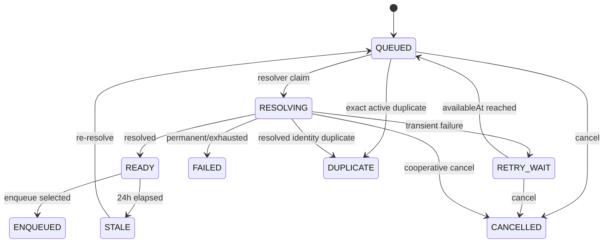

# PixiShelf 归档收件队列设计

> 决策于 2026-08-18 确认。本文件描述尚未实现的目标状态，不得用来解释当前部署行为。
> 当前 `/admin/archive` 仍是单链接同步解析流程；已上线事实以
> [当前架构](../architecture/current-architecture.md)、代码和 Prisma Schema 为准。

## 1. 结论

现有“输入一个 URL、等待同步解析、确认一个预览”的页面升级为一个可持续追加、可刷新恢复的
**归档收件队列**：

1. 管理员一次粘贴最多 100 个 URL，也可以在解析过程中继续追加；
2. URL 立即持久化并按 FIFO 顺序逐条解析，浏览器不等待远端解析完成；
3. 已解析项目逐条展示身份、更新判断、失败原因和质量选择；
4. 管理员可以随时多选已就绪项目并批量入队，不必等待整个提交完成；
5. 每个作品仍创建独立的 `ARCHIVE_IMPORT`，作品之间串行下载；
6. 任务管理页增加服务端分页、筛选和状态安全的批量控制。

解析与媒体写入仍由同一个 `pixishelf-worker` 容器执行，但使用两个固定并发为 1 的逻辑资源通道：

- `ARCHIVE_RESOLVE`：只解析 URL、远端元数据和媒体计划；
- `BACKGROUND_WRITER`：执行 `ARCHIVE_IMPORT` 以及现有扫描、迁移、维护和媒体写任务。

两个通道可以各执行一个任务；同一通道内不并行。该变化由
[ADR-0004](../adr/0004-run-archive-resolution-in-a-separate-worker-lane.md)约束。

## 2. 背景与当前问题

当前页面和接口都以单项为单位：

- 页面只有一个 URL 字符串和一个预览对象；
- `archive.preview` 同步等待 Provider 完成解析；
- `archive.enqueue` 只接受一个 preview token；
- 任务列表只读取最近若干条任务，操作和 pending 状态按单行组织；
- `archive.action`、项目重试和任务控制都是单项 contract。

对 E-Hentai 而言，解析不只是读取标题。Provider 可能需要串行抓取多个画廊分页才能冻结完整媒体计划。
因此单纯把页面改成多个输入框或从浏览器并发调用现有 `preview`，会继续让长请求依赖 Next.js
连接，并把远端限流压力留在 Web 进程。

当前 Central Dispatcher 还使用一个全局执行槽。只增加多个 `ARCHIVE_IMPORT` 能提高录入效率，
但不能让解析在下载过程中继续前进。目标设计只为无文件写入的归档解析增加一个隔离通道，不开放
通用可配置并行，也不允许两个媒体写任务同时运行。

## 3. 目标与非目标

### 3.1 目标

- 消除“必须等上一条解析完成才能添加下一条”的人工串行；
- 让排队、解析、重试、取消和结果在刷新、重启后保持可恢复；
- 保持解析 FIFO 和作品级归档下载 FIFO 可理解；
- 支持持续追加、部分成功、多选入队和逐项结果；
- 保持 Provider 身份去重、已有活动任务复用和归档 revision 语义；
- 保持媒体写入全局串行、staging 验证和原子发布不变量；
- 为后续增加 Provider、文件导入和更丰富筛选保留明确扩展点；
- 让批量命令、解析失败和 Worker 通道状态可观察、可审计。

### 3.2 非目标

- 不并行下载多个作品；
- 不改变单个 `ARCHIVE_IMPORT` 内当前最多 2 个媒体请求的策略；
- 不增加第二个 Worker 容器、Redis、RabbitMQ 或浏览器长连接；
- 不提供拖拽排序、插队或可配置解析并发；
- 不在本次提供“选择全部筛选结果”，只选择当前页；
- 不把批量回收站、恢复或永久删除并入任务批量控制；
- 不建立封闭、必须等待全部完成的传统批次工作流；
- 不长期保留旧单链接产品流程或引入长期功能开关；
- 不改变当前单实例、单信任域和管理员权限模型。

## 4. 信息架构

### 4.1 路由

| 路由                   | 责任                                                  |
| ---------------------- | ----------------------------------------------------- |
| `/admin/archive/inbox` | URL 追加、FIFO 解析状态、失败修正、选择和批量归档入队 |
| `/admin/archive`       | 归档任务分页、筛选、进度、明细和批量控制              |

两个页面都提供“添加链接”入口。旧页面中的单 URL 输入和单预览卡不再作为独立流程存在；输入一个 URL
也会进入同一个收件队列。

### 4.2 添加链接弹窗

弹窗只承担快速采集，不承载解析进度：

- 多行文本输入，按换行识别 URL；
- 每次最多接受 100 条；
- 显示总行数、有效 URL、无效行和本次完全重复数；
- 客户端预检用于即时反馈，服务端重新执行相同上限和 URL 校验；
- 提交成功后立即关闭，返回新增、重复、拒绝和当前活动容量摘要；
- 创建结果使用幂等键，重复点击或网络重试不得重复加入。

整个活动收件队列最多 1000 项。容量包括等待、解析、退避、就绪和过期但尚未处理的项目；
终态失败、取消、重复和已入队记录不占活动容量。

### 4.3 收件箱

收件箱使用以下视图：

- **待处理**：`QUEUED`、`RESOLVING`、`RETRY_WAIT`、`READY`、`STALE`；
- **失败**：`FAILED`；
- **已入队**：`ENQUEUED`；
- **已取消/重复**：`CANCELLED`、`DUPLICATE`。

待处理视图按真实 `queueOrder` 正序展示；终态视图按 `updatedAt` 倒序。每次添加生成
`ArchiveIntakeSubmission`，项目仍平铺在全局 FIFO 中，submission 只用于“本次加入”标签、筛选和审计，
不改变执行顺序。

页面的识别性元素是一条表达真实 FIFO 的“队列轨道”：左侧稳定显示顺序号，当前解析项显示克制的运行指示，
序号、耗时和状态使用等宽字形。结构必须服务于顺序理解，不增加与任务无关的装饰或通用 KPI 卡片。

### 4.4 任务页

任务页替换固定最近 N 条查询：

- 服务端 cursor 分页，默认每页 50 条；
- 支持状态、Provider、新建/更新、submission 和标题/URL 搜索；
- 默认按创建时间倒序；
- 支持当前页全选和明确的“已选择当前页 N 项”；
- 单行明细、图片检查点和现有领域操作继续可用。

URL 搜索可以使用服务端保存的规范化值，但列表、普通审计和批量结果默认只显示脱敏 URL。完整 Provider
locator 和 token 不得因为增加搜索功能而进入表格、日志或 Toast。

桌面端使用表格和 sticky 批量工具栏；窄视口使用卡片列表。所有复选框、菜单、弹窗和结果面板必须支持
键盘操作、可见 focus 和 reduced-motion。

## 5. 收件领域模型

### 5.1 ArchiveIntakeSubmission

一次点击“加入收件箱”创建一个 submission，建议字段：

| 字段                | 语义                     |
| ------------------- | ------------------------ |
| `id`                | 本次提交标识             |
| `idempotencyKey`    | 防止重复提交，数据库唯一 |
| `requestedByUserId` | 发起管理员               |
| `rawCount`          | 原始非空行数             |
| `acceptedCount`     | 创建的队列项数           |
| `invalidCount`      | 无效 URL 数              |
| `duplicateCount`    | 本次或活动队列重复数     |
| `createdAt`         | 提交时间                 |

submission 不拥有批次执行状态。汇总状态由关联项目实时计算，避免创建第二套会与项目状态漂移的生命周期。

### 5.2 ArchiveIntakeItem

每个被接受的输入拥有一个持久项目，建议字段分组：

| 分组     | 字段                                                                                |
| -------- | ----------------------------------------------------------------------------------- |
| 身份     | `id`、`submissionId`、`submittedUrl`、`normalizedUrlHash`、`queueOrder`             |
| 生命周期 | `status`、`attempts`、`availableAt`、`cancelRequestedAt`、`startedAt`、`finishedAt` |
| 解析结果 | `providerKey`、`externalId`、`canonicalUrl`、`resolvedSnapshot`、`metadataHash`     |
| 结果分类 | `resolutionKind`、`duplicateOfItemId`、`activeArchiveImportId`                      |
| 归档选择 | `selectedQuality`、`resolvedAt`、`expiresAt`、`archiveImportId`                     |
| 错误     | `errorCode`、`errorMessage`、`errorStage`、`retryable`                              |
| 审计     | `supersedesItemId`、`currentSystemJobId`、`createdAt`、`updatedAt`                  |

`resolutionKind` 与执行状态分离：

- `NEW`：新 Source Reference；
- `UPDATE`：已有归档且远端计划或元数据变化；
- `UNCHANGED`：已有归档且冻结快照没有变化；
- `ACTIVE_TASK`：同一 Provider 身份已有活动归档任务；
- `DUPLICATE_IDENTITY`：本收件队列已有相同 Provider 身份。

### 5.3 生命周期

状态规则：

- `RESOLVING` 同时最多一个；
- `READY` 的冻结解析结果有效 24 小时；
- `STALE` 保留最后一次标题和摘要，但不能入队；
- 瞬时错误最多自动尝试 3 次，使用退避和 jitter；
- 自动重试和手工重试都获得新的队尾 `queueOrder`；
- 无效 URL、不支持 Provider、SSRF 拒绝和确定的权限拒绝直接失败；
- “修改并重试”创建新项目并通过 `supersedesItemId` 关联原失败项，不改写审计历史；
- 取消当前解析时设置持久 intent，并通过 `AbortSignal` 停止后续分页或网络读取；
- 暂停队列只阻止领取下一项，不强制中断当前解析。

### 5.4 去重

去重分两层：

1. 提交前对 trim 后的完全相同 URL 去重，并在提交摘要中报告；
2. Provider 解析后按 `(providerKey, externalId)` 判定身份重复。

跨 submission 命中活动收件项时，在新 submission 下创建一个不执行解析的 `DUPLICATE` 审计项目，
并通过 `duplicateOfItemId` 引用首次项目。
同一 Provider 身份已有活动 `ArchiveImport` 时分类为 `ACTIVE_TASK`，不得创建第二个活动任务，UI 提供任务链接。
现有 ArchiveImport 的数据库 partial unique 约束仍是最终竞争保护，不能只依赖解析阶段检查。

## 6. 选择与入队

### 6.1 默认选择

选择状态是页面临时状态，刷新后根据下列规则重新计算：

| 分类          | 默认选择 | 行为                      |
| ------------- | -------- | ------------------------- |
| `NEW`         | 是       | 创建新归档                |
| `UPDATE`      | 是       | 明确提示将创建新 revision |
| `UNCHANGED`   | 否       | 可手动选择完整性刷新      |
| `ACTIVE_TASK` | 否       | 不可选，跳转现有任务      |
| 重复身份      | 否       | 不可选，跳转首次项目      |

批次默认质量为 `ORIGINAL`。项目允许覆盖为 `DISPLAY`，批量工具栏允许统一修改所选项质量。

### 6.2 批量入队事务

`enqueueSelected` 接受最多当前页可选择项和一个命令幂等键。服务端对每个项目执行：

1. 锁定 intake item；
2. 验证状态仍为 `READY` 且 `expiresAt` 未过期；
3. 重新检查活动 ArchiveImport 和 Source Reference；
4. 创建或复用独立的 `ArchiveImport`、`ArchiveImportItem` 与 `SystemJob`；
5. 将 intake item 原子更新为 `ENQUEUED` 并关联 `archiveImportId`。

批量命令不是 all-or-nothing 大事务。每项返回以下结果之一：

- `CREATED`
- `REUSED`
- `SKIPPED`
- `CONFLICT`
- `FAILED`

一个项目冲突不得回滚其他项目。重复命令必须返回同一持久操作结果，不得创建重复任务。

### 6.3 批量操作审计

增加 `ArchiveBulkOperation` 与 `ArchiveBulkOperationItem`，用于保存批量入队和任务控制的请求者、幂等键、
命令类型、目标、逐项结果和汇总计数。UI Toast 只显示摘要；结果面板从该审计读取详细成功、复用、跳过、
冲突和失败项目。操作记录按收件历史的 30 天策略保留。

## 7. Worker 执行通道

### 7.1 通道定义

`SystemJob` 增加显式 `executionLane`：

| 通道                | 允许任务                            | 固定并发 |
| ------------------- | ----------------------------------- | -------- |
| `ARCHIVE_RESOLVE`   | `ARCHIVE_RESOLVE_ITEM`              | 1        |
| `BACKGROUND_WRITER` | 现有全部任务，包括 `ARCHIVE_IMPORT` | 1        |

迁移将全部现有 SystemJob 回填为 `BACKGROUND_WRITER`。Executor 注册必须声明通道；生产 capability audit 同时验证
任务类型、definition version 和通道，防止一个写任务被误注册到解析通道。

### 7.2 Node.js 执行模型

同一个 Worker host 启动两个异步 Dispatcher loop。网络、Prisma、文件流、Sharp 和 FFmpeg 子进程在等待时
让出事件循环，因此一个解析任务和一个 writer 任务可以并发推进。设计不声称两个纯 JavaScript CPU
计算会真正并行；若未来测得 CPU 阻塞，必须先采样，再决定使用 `worker_threads` 或独立进程。

Worker 运行状态由单个 `currentExecution` 改为按 lane 管理。优雅停机顺序：

1. 两个通道同时停止 claim；
2. 分别等待当前任务完成或进入安全取消点；
3. drain 超时后向两个 Executor 传播 abort；
4. 写入最终 Worker heartbeat 并断开数据库。

任一 Dispatcher 的不可恢复基础设施错误终止整个 Worker 进程，由 Compose 重启；不得让一个失去 heartbeat
的半存活通道长期留在 READY 进程内。

### 7.3 Claim、租约和正确性

当前 `global/background-worker` 唯一资源租约拆成：

- `lane/archive-resolve`
- `lane/background-writer`

claim 事务必须：

- 只读取自身 lane 的可领取任务；
- 使用数据库锁跳过竞争行；
- 验证同 lane 没有有效运行租约；
- 写入 workerId、attempt、leaseToken 和过期时间；
- 继续以 CAS 所有权校验 heartbeat、进度和终态。

即使滚动部署或误启动第二个 Worker，每个 lane 仍最多运行一个任务。该设计不允许通过环境变量把并发数
提高到 2，也不允许第二个 writer lane。

### 7.4 FIFO 与优先级

解析 lane 按 intake item 的 `queueOrder` 严格 FIFO。退避中的项目只有到达 `availableAt` 后才重新进入队尾。

Writer lane 保留现有手动/计划任务优先级、运行窗口和 aging 规则。多个同优先级 `ARCHIVE_IMPORT` 按创建时间
依次执行；其他更高优先级后台任务仍可按现有队列规则先执行。这里的“作品逐个下载”不承诺归档任务排除
所有其他后台任务。

### 7.5 Provider 请求治理

解析和下载共享 Provider 级请求治理：

- Provider 声明允许 host、基础间隔、并发预算和错误策略；
- 下载媒体请求优先于新的解析请求；
- 429、509 和明确的 Retry-After 更新共享 penalty；
- 解析 lane 在预算不足时进入 `RETRY_WAIT`，不得忙轮询；
- 限流状态必须跨 Worker 重启和短暂滚动重叠保持有效，不能只存在于浏览器或单次请求内；
- Cookie、authorization、完整 locator 和 token 不进入日志、事件或普通审计。

具体 governor 表结构可以在实现切片中确定，但必须有 PostgreSQL 并发测试证明两个 lane 不会绕过同一
Provider 的预算。

## 8. API 与权限

所有收件写操作使用 `adminProcedure`；读取使用当前单信任域下的 `authProcedure`。即使两者当前运行能力相同，
也必须保留敏感管理语义。建议 tRPC 边界：

| Procedure                  | 类型     | 责任                                          |
| -------------------------- | -------- | --------------------------------------------- |
| `archiveInbox.create`      | mutation | 校验并创建 submission/items                   |
| `archiveInbox.list`        | query    | cursor、状态、submission、Provider 和搜索筛选 |
| `archiveInbox.summary`     | query    | 容量、等待、最老等待、失败和 pause 状态       |
| `archiveInbox.pause`       | mutation | 持久暂停解析                                  |
| `archiveInbox.resume`      | mutation | 恢复解析                                      |
| `archiveInbox.cancelMany`  | mutation | 取消合法状态项目                              |
| `archiveInbox.retryMany`   | mutation | 失败或过期项目重新排队                        |
| `archiveInbox.enqueueMany` | mutation | 批量创建或复用 ArchiveImport                  |
| `archive.listTasks`        | query    | 新 cursor 和筛选 contract                     |
| `archive.actionMany`       | mutation | 状态安全的任务批量控制                        |
| `archive.getBulkOperation` | query    | 查询持久批量结果                              |

服务端必须执行：

- 每次 100、活动 1000、当前页批量数量和 URL 长度上限；
- Zod payload 校验；
- Provider HTTPS allowlist、DNS/redirect/SSRF 和响应体上限；
- 幂等键、状态 CAS 和数据库唯一约束；
- 未授权零写入测试；
- 错误信息脱敏和安全日志字段。

## 9. 批量任务控制

首版支持：

- `PAUSE`
- `RESUME`
- `CANCEL`
- `RETRY`

工具栏按当前选择计算合法数量，例如“重试 3 项”。服务端仍逐项校验最新状态，只执行合法项目，其余返回
`SKIPPED` 或 `CONFLICT`。暂停、继续、重试不要求确认；批量取消必须显示目标数量并二次确认。

回收归档、恢复归档、永久清理和删除 staging 不进入此批量 contract。当前中央模式下这些操作还需要专门的
maintenance workflow，不能通过 UI 循环调用单项 action 伪装成已支持的批量能力。

## 10. 轮询、保留与可观察性

首版继续使用条件轮询，不引入 SSE/WebSocket：

- 收件箱存在活动状态时约 1.5 秒轮询摘要，项目列表可以使用较低频率；
- 没有活动状态时降低频率；
- mutation 成功后立即失效相关 query；
- 选择集合按稳定 item ID 保持，项目离开当前筛选后自动移除。

管理导航为“归档收件箱”显示等待和失败徽标。页面展示：

- 等待数量；
- 当前解析项目；
- 最老等待时长；
- 最近失败数量；
- 队列暂停状态；
- 两个 Worker lane 的 READY、RUNNING、DRAINING 或异常状态。

健康端点只暴露进程和 lane 就绪信息，不返回 URL、provider locator、数据库错误详情或凭据。

收件项目、submission 和 bulk operation 在终态 30 天后由现有 writer lane 的维护任务清理。清理只删除
操作历史和冻结预览，不删除 ArchiveImport、SystemJob、Artwork、ArchiveRevision 或媒体文件。

## 11. 迁移、切换与回滚

### 11.1 实施切片

开发和验证分为三个内部切片：

1. **基础设施**：Schema、job contract、lane-aware runtime、resolver Executor、恢复和并发测试；
2. **收件箱**：添加弹窗、队列 UI、解析控制、选择、质量和批量入队；
3. **任务管理**：分页、筛选、当前页多选、批量控制和结果面板。

这些是代码评审和验证边界，不是分批开放的产品阶段。

### 11.2 直接切换

三个切片全部完成后进行一次协调切换，不新增 `ARCHIVE_INBOX_ENABLED`：

1. 按备份与恢复基线建立数据库与媒体一致性检查点；
2. 停止旧 Worker claim，并确认没有执行中的 SystemJob；
3. 部署 cutover migration：回填现有 SystemJob 为 writer lane，同时把全局执行唯一索引替换为按 lane 唯一索引；
4. 立即部署同时支持两个 lane 和全部旧 job type 的 Worker；
5. 通过 READY、capability audit、lane claim 和恢复测试；
6. 部署新 App，新增收件箱路由并把 `/admin/archive` 切换为任务管理；
7. 删除旧单链接页面流程和只服务该流程的 tRPC contract；
8. 保留并继续执行已有 ArchiveImport/SystemJob，不把它们迁移成 intake item。

旧 `ArchivePreviewSession` 不转换为收件项目；切换时未确认的短期预览可以过期清理。切换发布不得同时执行
破坏性 Schema contract 或删除旧任务数据。

### 11.3 回滚边界

新增表和列采用 expand-first，但替换全局执行唯一索引属于协调切换点：migration 成功应用后即越过旧 Worker
回滚边界。旧 Worker 的启动预检要求旧全局索引，不能在该 migration 后重启或继续 claim。此时回滚必须：

- 停止 Worker claim；
- 保留 intake 和 SystemJob 数据；
- 回退 App 入口或部署兼容新 lane schema 的前向修复；
- 只有恢复切换前一致性检查点，或部署明确兼容新索引与 capability 的 Worker，才能恢复消费。

直接切换不等于无回滚设计；它只表示用户不会长期面对两套入口和功能开关。

## 12. 验证策略

### 12.1 单元与 contract

- URL 分行、trim、上限和完全重复；
- 默认选择与质量覆盖；
- 状态机合法/非法转换；
- 错误分类、退避、jitter 和三次尝试；
- snapshot 24 小时过期；
- bulk operation 逐项结果与幂等重放；
- lane capability 注册和 payload version；
- UI 当前页选择、mixed eligibility、轮询和结果面板。

### 12.2 PostgreSQL 集成

- 两个 Worker 进程竞争时每 lane 最多一个 RUNNING；
- resolve 和 writer 可以各运行一个；
- 两个 writer 或两个 resolver 永远不能同时运行；
- 旧 lease、过期 heartbeat、取消与终态 CAS 竞争；
- 严格 FIFO、退避队尾和暂停恢复；
- submission/create 与 enqueueMany 幂等；
- 不同 URL 解析为同一 Provider 身份；
- 已有活动 ArchiveImport 的 partial unique 竞争；
- Provider 请求预算在两个 lane 和滚动重叠时不被绕过。

### 12.3 Executor 与恢复

- Provider fixture 的多分页解析和 cooperative cancel；
- Worker 在 QUEUED、RESOLVING、READY 写入边界崩溃后的恢复；
- 一个 lane 失败时进程停机和 lease 恢复；
- 解析 lane 不获得媒体写能力；
- writer lane 继续维持 staging、manifest 和原子发布；
- 单作品内部媒体并发仍为 2，两个作品不并行。

### 12.4 权限与 UI

- 无 Session、无效 Session、有效 Session；
- 未授权 mutation 对数据库零写入；
- URL、locator、Cookie 和代理凭据不进入日志；
- 100/1000 上限由服务端执行；
- 键盘、多选、确认弹窗、窄视口和 reduced-motion；
- 30 天清理不触碰归档任务或媒体。

### 12.5 发布验收

以下全部满足才可直接切换：

- 连续添加时无需等待上一条解析完成；
- 刷新和 Worker 重启后 FIFO、attempt 和 pause 状态保持；
- 解析与一个 writer 任务可同时推进；
- 任意时刻最多一个作品执行归档下载；
- 已就绪项目可在其余项目解析期间入队；
- 部分失败不阻断其他项目，结果可查询和重试；
- 重复 URL、重复身份和重复命令不创建重复活动任务；
- 旧活动 ArchiveImport 正常完成；
- App、Worker、数据库和媒体的回滚检查点有记录；
- current 文档只在实现、迁移和运行验证完成后更新。

## 13. 文档演进

本文件是功能和实施规格；Provider、Revision、Manifest、原子发布、回收站和本地身份继续以
[多来源 URL 归档设计](./multi-source-url-archive.md)及相关 ADR 为设计基础。

实现完成前：

- 不修改 [当前架构](../architecture/current-architecture.md) 中的单全局执行槽事实；
- 不修改 [权限与接口边界](../security/access-control.md) 的当前路由矩阵；
- 不把 intake 字段写进 `current` 领域词汇作为已上线事实。

实现并验证后：

- 将 Worker lane、页面路由、tRPC 和权限矩阵写入 current 文档；
- 将精确字段和 enum 以 Prisma、Zod 和 TypeScript 为最终事实；
- 将本文件标为 `current` 或提炼成 current 功能说明；
- 归档旧单链接流程说明，避免两个“当前行为”并存。
