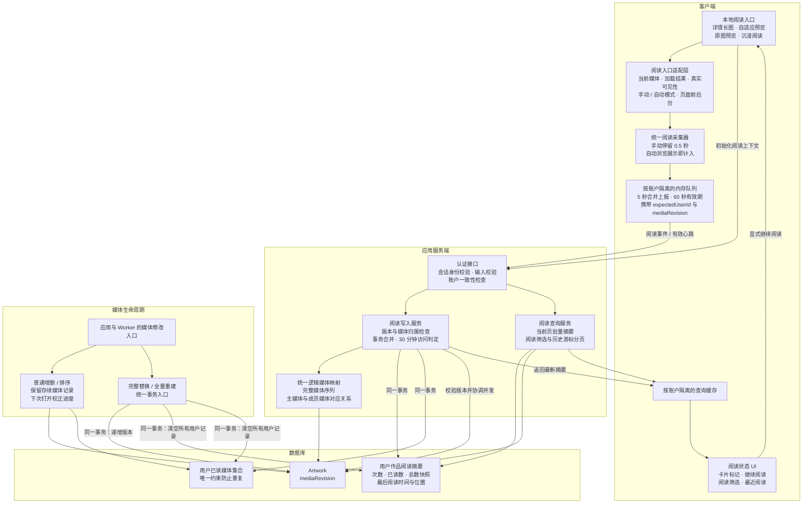

# 作品阅读记录与进度架构

本文是已确认并已据此实施的架构约束。当前保留 draft，尚未完成生产发布验收，不代表已在实际图库部署。架构图及其说明由主代理维护；实现、测试、功能文档与独立审查由 GPT-6-Sol（xhigh）子代理完成。实现与本图冲突时，先报告主代理裁决并修订架构，再继续相关工作。已执行的隔离验证、复跑依据与覆盖限制见[功能与验收记录](../features/artwork-reading.md)。

## 架构图

### 模块职责与依赖

- 阅读入口适配层只提供真实展示事实，统一采集器决定有效阅读；不得复制四套不同统计规则。
- 服务端基于认证会话决定归属，负责逻辑媒体映射、计次和持久化。客户端仅发送观察结果，不能提交最终次数或完成状态。
- 数据包承载数据库模型、共享阅读类型及跨 App/Worker 的完整重建失效事务工具；浏览器导入的类型/常量不得引入 Prisma 运行时。
- 应用阅读服务承载完整逻辑媒体映射与初始化、上报、摘要、历史查询。与现有媒体展示变换共用分组依据，避免两套 APNG/视频逻辑分叉。
- App 和 Worker 完整替换入口共同使用失效工具。统一顺序为锁定 Artwork、检查版本/媒体、修改阅读状态或执行重建；重建发布、版本递增和阅读清空必须在一个事务内完成。
- 已有作品的普通媒体增删、排序和移动也应在同一事务中先锁 Artwork，再写 Image，避免与阅读写入的外键/计数触发器产生反向锁序；普通变更只锁定，不清空阅读或递增重建版本。涉及多作品时按作品 ID 升序锁定，新建且尚未发布的作品不需要为不存在的并发阅读补锁。
- 列表使用批量摘要，不逐卡片查库，不为卡片加载完整媒体。只有阅读状态筛选启用时转换为稳定游标分页。

## 产品规则与不变量

1. 阅读数据按账户隔离，同账户跨设备共享。手动浏览需加载成功、前台且真实可见 500 ms；自动浏览在当前媒体成功展示时立即计入。后台、预加载、错误均不计入。
2. 同一作品连续 30 分钟无有效阅读活动后，新有效阅读增加一次次数。刷新、短时间返回、跨阅读模式和多设备合并。最后位置以服务端最后接受的有效位置为准。
   同账户多端报告允许乱序到达：仍在有效期内的 VIEW 必须合并已读成员，不能因 observedAt 早于现有 lastActiveAt 而丢弃。活动时间保持单调以免窗口回退；较早观察但后到的有效报告仍可更新最后位置。
3. 已读进度统计真实看过的不同逻辑媒体，不使用最大序号；视频和动画各视为一个展示项，不按播放时长或播放完成计数。
4. 分母是完整作品经过既有 APNG/视频合并后的逻辑序列，不能使用原始 Image 行数、折叠列表、适配预览过滤列表或虚拟视窗列表。
5. 每个逻辑媒体建立主媒体和成员 ID 映射。展示一组时保存现有成员；任一存续成员已读即视为该逻辑媒体已读；计数按组，恢复位置也通过成员映射。普通追加视频导致原 APNG 主项变化时仍保留有效阅读。
6. 未看：没有有效阅读；阅读中：有有效阅读且未覆盖全部快照媒体；已看完：快照总数大于零且全部看过。零媒体作品不能判为已看完。
7. 普通媒体增删和排序保留存续记录，下次打开校正摘要；此之前卡片及筛选可以沿用旧快照。初始化不产生 PV 或已读媒体。
8. 完整替换与全量重建立即清空所有用户的次数、已读集合及恢复位置，并递增 mediaRevision；包括仍可达的旧扫描全量重建入口，不为本功能改造其媒体 ID 保留策略。
9. 旧版本上报拒绝，不能更新事件版本重放；已删除媒体的迟到事件不能恢复记录。软删除保留，永久删除清理关联记录。
   同一批次按事件验证媒体归属；已删除或不属于当前作品的事件直接丢弃，不计次、不更新位置，同批仍存续的有效事件继续合并。全部事件失效时返回当前摘要且不产生阅读活动；作品版本冲突仍拒绝整批。
10. 普通打开从头开始，显式“继续阅读”才恢复。隐私遮罩仍记录。仅本地阅读入口，远程来源预览不计入。

## 数据与接口约束

### 数据

- Artwork 增加 mediaRevision，默认版本覆盖现有作品，无历史阅读回填。
- 用户作品阅读摘要：userId、artworkId、viewCount、已读逻辑数、总数快照、最后阅读时间、最后媒体身份及位置快照。userId/artworkId 唯一；建立按 userId、最后阅读时间、artworkId 的最近阅读索引。
- 用户已读媒体：userId、artworkId、mediaId 唯一；关联用户、作品、媒体，支持永久删除清理。仅按实际观察增长，不预建作品与用户笛卡尔积。
- 并发阅读通过统一事务锁和唯一约束合并，初始化与写入也需串行保护；不引入逐次访问流水、持久请求回执或离线队列。

### 接口与身份

使用现有 tRPC authProcedure 和 Zod。数据/契约代理先固定共享 DTO，随后各模块依据同一类型实施。

| 能力 | 输入与结果 |
| --- | --- |
| 初始化 | 作品身份与预期账户；返回 mediaRevision、完整逻辑媒体映射、摘要及恢复位置 |
| 批量上报 | 作品身份、mediaRevision、expectedUserId、有效媒体观察或心跳及事件时间；返回最新摘要 |
| 当前页摘要 | 当前页作品 ID 集合及 expectedUserId；返回当前认证账户的批量摘要，不逐卡片请求 |
| 最近阅读 | expectedUserId、时间/作品 ID 组合游标；每作品一条聚合记录 |
| 阅读筛选 | 与既有条件组合未看、阅读中、已看完；阅读筛选启用时使用游标 |

- expectedUserId 只是一致性前置条件，不是数据归属参数。与会话不一致时拒绝；查询缓存也必须按账户隔离，不能依靠前端异步退出效果防串号。
- context、report、summaries、history 均校验 expectedUserId，防止跨标签页 Cookie 已切换而本地会话尚未同步时，将新账户结果存入旧账户查询键。
- artwork.list、artwork.cardList、artwork.viewerFeed 在启用 readingStatus 时同样要求 expectedUserId 并核对会话，其查询键包含账户身份；没有阅读筛选的旧调用保持兼容。
- 队列按账户隔离，账户切换时清空/取消旧发送，忽略旧响应。服务端查询只使用认证用户，不允许读取任意用户阅读历史。
- 失效版本清空对应客户端旧队列并提示重新打开；禁止自动替换版本继续提交过期事件。

## 采集、队列与 UI

- 四个入口：详情长图、自适应预览、独立原图预览、沉浸阅读。独立原图预览补作品身份及版本上下文。
- 详情使用真实 inView 进入/退出信号，离开即取消计时和心跳；残留 currentMediaId 只能作为候选，不能证明仍在观看。视频也需明确成功展示/错误信号。
- 幻灯片同时要求当前 slide、ready、前台；弹层开启暂停底层采集。进入相邻预加载 slide 不算阅读。
- 5 秒合并上报；切作品、离开、pagehide 时尝试提交。有效前台展示期间每 60 秒心跳。
- 每批从观察开始至重试的总寿命最多 60 秒，过期丢弃。前台/网络恢复后重新观察，不复活旧事件。纯心跳只能延长已有且尚未超时的活动，不能创建首次阅读或新访问。
- “继续阅读”通过媒体身份定位并展开必要折叠；原媒体不存在时定位首个未读，否则开头。
- 卡片显示状态与进度；详情显示次数、进度和继续阅读；/reading-history 提供最近阅读聚合，接入桌面导航与移动端更多入口。
- 阅读状态筛选覆盖现有标题、首个有效创作者名（NULLS LAST）、图片数、有效作品日期、创建时间以及带种子的随机排序。游标包含实际返回排序值、稳定 ID、方向、排序种子及条件约束；边界作品退出候选集后仍能分页，不能再次查询边界行取得排序值。
- 普通未启用阅读筛选的分页不改。最近阅读使用 lastViewedAt DESC、artworkId DESC。
- 已加载列表只原位更新徽标，不能因自动 invalidation 立即移除或重排；显式刷新后再应用最新筛选。

## 实施分工与门禁

主代理仅维护本文架构、任务委派、依赖调度和架构裁决。全部具体执行代理使用 gpt-6-sol、xhigh；最多三个并发执行代理。共享文件指定单一负责人，所有代理保留他人改动。

1. 数据代理：模型、正式 migration、共享 DTO 和完整重建失效工具，以及单元验证；先发布契约交接。
2. 核心代理并行：服务端阅读/查询；客户端采集/账户隔离；App/Worker 媒体生命周期接入。
3. 入口/UI 代理：消费既定接口与采集器，完成四阅读入口、卡片、筛选、续读与历史页面。
4. 验证/文档代理：集成验证、规模性能、迁移演练、浏览器验收及权威文档同步。
5. 独立只读审查代理：检查实现与本文一致性及回归，问题退回对应实现负责人修复，通过后再交付。

### 验收矩阵

- 手动 500 ms 边界、自动立即记录、真实离屏、后台、覆盖弹层、错误、预加载。
- 30 分钟边界、刷新、模式切换、多端并发、重复请求、批次到期、心跳不可启动访问。
- 跳读、折叠、预览过滤、零媒体、APNG/视频分组改变、删除原恢复媒体。
- 跨标签页切账户、旧队列、旧响应、缓存/查询身份隔离。
- 增量变更、重建/恢复全入口、初始化与上报竞争、版本失效、重建与上报竞争、永久删除。
- 各阅读筛选和排序、空值、种子、边界行不再命中、连续翻页无跳项、徽标原位更新。
- 至少 50,000 作品并填充代表性阅读摘要与已读媒体集合，含大量未读、大量已读、大型作品、多账户；记录查询计划、耗时、请求量，不以空阅读表替代。
- 空库 migration 与已有库升级；受影响包测试；主应用 lint/typecheck/test/build（构建提升权限）、Worker 检查、浏览器验收、路径小写检查。只在隔离测试库和媒体 fixture 演练，不在真实图库做破坏性验证。

## 发布、恢复与非目标

正式发布前按备份手册取得数据库、媒体、配置的一致恢复点，执行 generate/deploy 并协调 App/Worker；禁止 db:push。本次实施不意味着自动部署生产实例。

Worker 的数据库就绪门禁必须要求 `20260924130000_add_artwork_reading_tracking` 已完成，并核验阅读表与 Artwork.mediaRevision 存在；缺少迁移或对象时不能进入 ready 后才在媒体重建中失败。

回滚保留新增表和字段，不执行破坏性反向 migration。旧版本期间暂停完整重建任务及旧 App 扫描/替换入口；若已发生重建，保存受影响作品 ID，重新升级前清空其阅读记录并递增版本。影响范围不明时先完成核对修复，再重新启用阅读功能，不能宣称旧记录仍有效。

不回填过去阅读；未看意味着没有系统记录。不增加手动标记/重置/批量修改、访问流水、统计仪表盘、播放秒级进度或完成判定、持久离线队列。接受强制关闭/断网丢失最后未提交批次。
