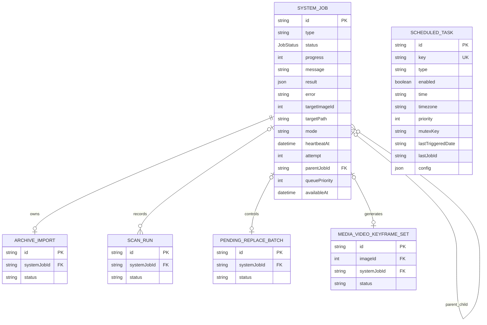
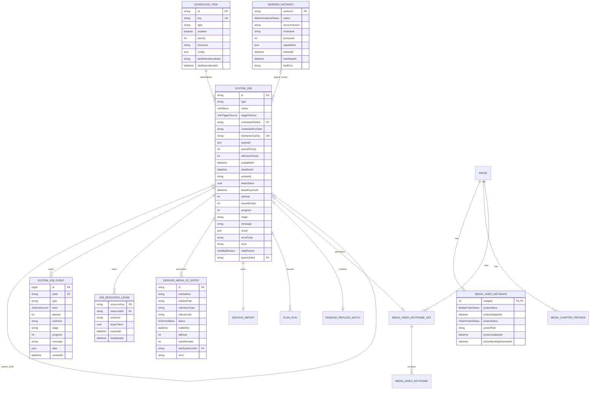

# PixiShelf 后台任务数据模型

> 状态：目标设计，采用向前兼容的增量迁移
> 关联文档：[架构设计](./background-task-architecture.md) · [运行手册](./background-task-runbook.md)

## 1. 建模原则

1. SystemJob 是所有后台执行的统一运行实例，不是任务定义。
2. ScheduledTask 是计划定义；一次计划可以产生多个 SystemJob。
3. SystemJobEvent 保存可审计的结构化时间线，不能拿进程日志代替。
4. JobResourceLease 是数据库正确性栅栏，部署副本数只是运维配置。
5. 领域进度继续留在强类型表中，例如 ArchiveImport、ScanRun 和 MediaVideoKeyframeSet。
6. payload 和 result 只保存任务边界输入/摘要，不保存大量逐条结果。
7. 所有文件删除先写 DerivedMediaGcEntry，再由 Worker 复核引用后执行。
8. 采用计划停机切换：旧任务全部进入终态后才升级。Schema 仍使用 additive migration，并保留旧列至少一个回滚周期，但不要求旧 Worker 与新 Worker 同时运行。
9. WorkerInstance 记录进程级在线状态；不能用“当前没有 RUNNING 任务”推断 Worker 健康，也不能把进程心跳当作任务执行租约。

## 2. 当前 ER

当前 SystemJob 已被多个领域复用，但 ScheduledTask.lastJobId 只是字符串缓存，没有数据库外键；事件、租约和 GC 意图也没有独立模型。



## 3. 目标 ER



## 4. SystemJob 字段字典

### 4.1 身份与来源

| 字段              | 类型             | 空值 | 默认值 | 说明                                                                       |
| ----------------- | ---------------- | ---- | ------ | -------------------------------------------------------------------------- |
| id                | String/cuid      | 否   | cuid   | 任务实例主键                                                               |
| type              | VarChar(80)      | 否   | —      | Registry 中稳定的任务类型；建议将现有 50 扩到 80                           |
| definitionVersion | Int              | 否   | 1      | 任务 payload/Executor 协议版本；旧历史任务回填为 0，新 Worker 不领取版本 0 |
| triggerSource     | JobTriggerSource | 否   | SYSTEM | MANUAL、SCHEDULE、SYSTEM、RETRY、LEGACY                                    |
| requestedByUserId | String           | 是   | null   | 手动触发者；系统任务为空。首期可只存标识，不强建 User 外键                 |
| scheduledTaskId   | String           | 是   | null   | 自动任务对应的 ScheduledTask                                               |
| scheduledForDate  | VarChar(10)      | 是   | null   | 计划所属本地日期，格式 YYYY-MM-DD                                          |
| idempotencyKey    | VarChar(180)     | 是   | null   | API、系统编排等场景的幂等键                                                |
| parentJobId       | String           | 是   | null   | 固定流水线的父任务或批次任务                                               |

### 4.2 输入与排队

| 字段              | 类型      | 空值     | 默认值  | 说明                                                                                                    |
| ----------------- | --------- | -------- | ------- | ------------------------------------------------------------------------------------------------------- |
| payload           | Json      | 是       | null    | 经任务 Schema 校验后的不可变输入快照                                                                    |
| queuePriority     | Int       | 否       | 100     | 基础优先级，越小越优先                                                                                  |
| effectivePriority | Int       | 否       | 100     | 包含等待老化的缓存优先级                                                                                |
| availableAt       | DateTime  | 兼容期是 | now     | 最早可领取时间，也承载重试退避；旧关键帧入口迁走前允许 null（旧语义为立即可领取），迁移完成后收紧为非空 |
| deadlineAt        | DateTime  | 是       | null    | 自动任务窗口截止；手动任务为空                                                                          |
| status            | JobStatus | 否       | PENDING | 统一状态机                                                                                              |
| maxAttempts       | Int       | 否       | 3       | 最大领取次数，按任务定义覆盖                                                                            |

### 4.3 执行租约

| 字段                 | 类型         | 空值 | 默认值 | 说明                            |
| -------------------- | ------------ | ---- | ------ | ------------------------------- |
| workerId             | VarChar(120) | 是   | null   | 当前所有者实例 ID               |
| leaseToken           | UUID         | 是   | null   | 每次 claim 生成的新栅栏令牌     |
| leaseExpiresAt       | DateTime     | 是   | null   | 租约到期时间                    |
| heartbeatAt          | DateTime     | 是   | null   | 最近成功续租时间；现有字段保留  |
| attempt              | Int          | 否   | 0      | 成功 claim 时递增；现有字段保留 |
| startedAt            | DateTime     | 是   | null   | 第一次进入 RUNNING 的时间       |
| lastAttemptStartedAt | DateTime     | 是   | null   | 当前/最近一次 attempt 开始时间  |
| finishedAt           | DateTime     | 是   | null   | 进入终态时间                    |
| cancelRequestedAt    | DateTime     | 是   | null   | 管理员请求取消时间              |
| pauseRequestedAt     | DateTime     | 是   | null   | 管理员请求暂停时间              |

### 4.4 进度、结果和错误

| 字段       | 类型          | 空值 | 默认值 | 说明                                   |
| ---------- | ------------- | ---- | ------ | -------------------------------------- |
| progress   | Int           | 否   | 0      | 0–100 的汇总进度                       |
| stage      | VarChar(80)   | 是   | null   | 稳定机器阶段，例如 PROBING、PUBLISHING |
| message    | Text          | 是   | null   | 面向管理员的当前状态                   |
| result     | Json          | 是   | null   | 小型汇总结果；现有字段保留             |
| errorCode  | VarChar(80)   | 是   | null   | 稳定错误码，用于重试策略与 UI          |
| error      | Text          | 是   | null   | 已截断、已脱敏的终态错误摘要           |
| skipReason | JobSkipReason | 是   | null   | SKIPPED 的结构化原因                   |
| skippedAt  | DateTime      | 是   | null   | 进入 SKIPPED 的时间                    |
| createdAt  | DateTime      | 否   | now    | 入队时间                               |
| updatedAt  | DateTime      | 否   | auto   | 最近变更时间                           |

### 4.5 兼容字段

| 当前字段      | 迁移处理                                                                      |
| ------------- | ----------------------------------------------------------------------------- |
| targetImageId | 切换期可同步写入 payload.imageId；新 Worker只读 payload，旧列保留一个回滚周期 |
| targetPath    | 切换期可同步写入 payload.relativePath；新 Worker重新校验路径后使用            |
| mode          | 切换期可同步写入 payload.mode；新 Worker只读版本化 payload                    |
| result        | 保留，只限制大小并定义每个任务的结果 Schema                                   |
| parentJobId   | 保留，用于父子工作流                                                          |
| queuePriority | 保留并统一语义                                                                |
| availableAt   | 保留并统一为可领取/重试时间                                                   |

## 5. ScheduledTask 字段字典

| 字段                 | 类型         | 状态                                     | 说明                                                     |
| -------------------- | ------------ | ---------------------------------------- | -------------------------------------------------------- |
| id                   | String/cuid  | 保留                                     | 主键                                                     |
| key                  | VarChar(80)  | 保留                                     | 稳定定义键                                               |
| type                 | VarChar(80)  | 扩容                                     | Registry 任务类型                                        |
| enabled              | Boolean      | 保留                                     | 是否每日物化                                             |
| scheduleMode         | ScheduleMode | 保留                                     | v1 仍为 DAILY                                            |
| priority             | Int          | 保留                                     | 创建 SystemJob 时复制为 queuePriority                    |
| timezone             | VarChar(50)  | 保留                                     | 用于 scheduledForDate；默认 Asia/Shanghai                |
| mutexKey             | VarChar(80)  | 兼容后删除                               | 全局并发 1 后不再承担正确性；Registry resourceScope 替代 |
| config               | Json         | 保留                                     | 任务配置，物化时复制到 payload.config                    |
| lastMaterializedAt   | DateTime     | 新增                                     | 最近一次成功创建任务实例时间                             |
| lastMaterializedDate | VarChar(10)  | 新增                                     | 最近一次物化的本地日期                                   |
| lastJobId            | String       | 兼容缓存                                 | 可继续作为 UI 快速缓存，最终由 relation 查询替代         |
| time                 | VarChar(5)   | 兼容后删除                               | 全局窗口启用后隐藏，不再控制单任务启动时刻               |
| lastTriggeredAt/date | 兼容后删除   | 双写到 materialized 字段，完成迁移后删除 |
| createdAt/updatedAt  | DateTime     | 保留                                     | 审计字段                                                 |

数据库关系：

- ScheduledTask 1 对多 SystemJob。
- 自动任务必须同时具有 scheduledTaskId 和 scheduledForDate。
- 唯一约束 scheduledTaskId + scheduledForDate 防止同一天重复物化。
- 手动任务不设置 scheduledTaskId/scheduledForDate，因此不受该唯一约束影响。

## 6. SystemJobEvent 字段字典

| 字段      | 类型                 | 空值 | 说明                                                                                                                                |
| --------- | -------------------- | ---- | ----------------------------------------------------------------------------------------------------------------------------------- |
| id        | BigInt autoincrement | 否   | 全局递增游标，前端通过 afterEventId 增量读取                                                                                        |
| jobId     | String               | 否   | 所属 SystemJob，级联删除                                                                                                            |
| type      | VarChar(50)          | 否   | QUEUED、CLAIMED、STARTED、STAGE_CHANGED、PROGRESS、RETRY_SCHEDULED、WARNING、COMPLETED、FAILED、CANCELLED、SKIPPED、LEASE_RECOVERED |
| level     | JobEventLevel        | 否   | INFO、WARN、ERROR                                                                                                                   |
| attempt   | Int                  | 否   | 事件发生时的 attempt                                                                                                                |
| workerId  | VarChar(120)         | 是   | Worker 事件记录所有者；API 控制事件为空                                                                                             |
| stage     | VarChar(80)          | 是   | 机器可读阶段                                                                                                                        |
| progress  | Int                  | 是   | 当时进度                                                                                                                            |
| message   | Text                 | 是   | 面向管理员的简短文案                                                                                                                |
| data      | Json                 | 是   | 小型结构化计数或错误码，不保存错误栈和大数组                                                                                        |
| createdAt | DateTime             | 否   | 事件时间                                                                                                                            |

事件不可在业务事务外“尽力而为”写入关键状态。claim、终态、重试、取消请求等事件应与 SystemJob 状态变更处于同一事务。普通进度事件允许失败后丢弃，不应导致任务失败。

## 7. JobResourceLease 字段字典

| 字段        | 类型         | 空值 | 说明                                       |
| ----------- | ------------ | ---- | ------------------------------------------ |
| resourceKey | VarChar(180) | 否   | 主键；v1 固定使用 global/background-worker |
| ownerJobId  | String       | 否   | 当前占用任务                               |
| workerId    | VarChar(120) | 否   | 当前 Worker                                |
| leaseToken  | UUID         | 否   | 必须与 SystemJob.leaseToken 一致           |
| expiresAt   | DateTime     | 否   | 到期后可恢复                               |
| heartbeatAt | DateTime     | 否   | 最近续租                                   |
| createdAt   | DateTime     | 否   | 首次创建                                   |
| updatedAt   | DateTime     | 否   | 最近更新                                   |

未来如恢复安全并行，可增加 media-root/write、derived-media/write 或 image/{id} 等资源键，而不改变 SystemJob 生命周期。但 v1 不开放并发配置，max concurrency 固定为 1。

### 7.1 WorkerInstance 字段字典

| 字段           | 类型                 | 空值 | 说明                                                                              |
| -------------- | -------------------- | ---- | --------------------------------------------------------------------------------- |
| workerId       | VarChar(120)         | 否   | 进程实例主键；同一进程生命周期内稳定                                              |
| status         | WorkerInstanceStatus | 否   | STARTING、READY、DEGRADED、STOPPING                                               |
| serviceVersion | VarChar(50)          | 否   | Worker 镜像/发布版本，用于兼容诊断                                                |
| hostname       | VarChar(255)         | 否   | 容器或主机名，不承担唯一性                                                        |
| processId      | Int                  | 否   | 进程 PID，仅用于诊断                                                              |
| capabilities   | Json                 | 是   | 已注册能力数组：`{ jobType, definitionVersions: number[] }[]`；不保存任意环境变量 |
| startedAt      | DateTime             | 否   | 本进程启动时间                                                                    |
| heartbeatAt    | DateTime             | 否   | 最近一次进程级心跳，默认每 30 秒更新                                              |
| lastError      | Text                 | 是   | 最近一次降级原因的截断摘要，不保存 Token/URL 凭据                                 |
| updatedAt      | DateTime             | 否   | 最近更新                                                                          |

`SystemJob.workerId` 与 `WorkerInstance.workerId` 是有意不建立外键的逻辑关联：任务历史必须在清理过期 WorkerInstance 后继续可读。WorkerInstance 只说明进程是否在线；真正允许执行和提交任务结果的仍是 `SystemJob + JobResourceLease + leaseToken` 栅栏。

### 7.2 MediaVideoMetadata Worker 增量字段

| 字段                   | 类型     | 空值 | 说明                                                                            |
| ---------------------- | -------- | ---- | ------------------------------------------------------------------------------- |
| probeStatus            | Enum     | 否   | 普通计划只消费 PENDING/PROBING；FAILED 仅由显式 force 重试                      |
| probeUpdatedAt         | DateTime | 是   | 最近探测状态变更                                                                |
| posterStatus           | Enum     | 否   | 封面领域 checkpoint                                                             |
| posterPath             | String   | 是   | 当前已发布封面的规范相对路径                                                    |
| posterUpdatedAt        | DateTime | 是   | 封面领域状态版本；用于子任务幂等键，不能由 backlog 游标写入改变                 |
| posterBacklogCheckedAt | DateTime | 是   | 最近一次检查或尝试物化时间；可空升级，按 null-first/最旧优先推进每批最多 100 条 |

`posterBacklogCheckedAt` 只控制有界发现进度，不代表封面生成成功。健康封面、成功创建/复用子任务，以及子任务入队失败的 poison 行都会按批次推进游标；失败会同时令父任务进入 retry。这样失败行不会永久阻塞后面的 backlog，队列轮转后又会重新访问它，不会被静默丢弃。

## 8. DerivedMediaGcEntry 字段字典

| 字段                | 类型          | 空值 | 说明                                                          |
| ------------------- | ------------- | ---- | ------------------------------------------------------------- |
| id                  | String/cuid   | 否   | 主键                                                          |
| mediaKind           | VarChar(50)   | 否   | VIDEO_POSTER、VIDEO_CHAPTER_PREVIEW、VIDEO_STREAMING_ARTIFACT |
| relativePath        | Text          | 否   | 派生媒体根目录下的规范相对路径                                |
| referenceType       | VarChar(50)   | 是   | 原引用模型                                                    |
| referenceId         | VarChar(120)  | 是   | 原引用记录 ID                                                 |
| reason              | VarChar(80)   | 否   | POSTER_REPLACED、CHAPTER_REMOVED、STREAMING_REMUX_BACKUP 等   |
| status              | GcEntryStatus | 否   | PENDING、PROCESSING、DELETED、SKIPPED_REFERENCED、FAILED      |
| notBefore           | DateTime      | 否   | 最早允许删除时间                                              |
| attempt             | Int           | 否   | 已处理次数                                                    |
| maxAttempts         | Int           | 否   | 默认 3                                                        |
| lastSystemJobId     | String        | 是   | 最近执行它的 GC 批次                                          |
| error               | Text          | 是   | 最后错误摘要                                                  |
| deletedAt           | DateTime      | 是   | 成功删除时间                                                  |
| createdAt/updatedAt | DateTime      | 否   | 审计字段                                                      |

mediaKind + relativePath 建唯一约束。再次出现同一路径的删除意图时使用 upsert 重置为 PENDING，并重新设置 notBefore；实际删除前始终查询当前数据库引用。

## 9. 枚举

### 9.1 JobStatus

| 值         | 含义                                 |
| ---------- | ------------------------------------ |
| PENDING    | 可排队但尚未领取                     |
| RUNNING    | 被有效租约所有者执行                 |
| PAUSING    | 已请求暂停，等待 Executor 建立检查点 |
| PAUSED     | 已停止执行，可恢复                   |
| CANCELLING | 已请求取消，等待清理                 |
| RETRY_WAIT | 可恢复失败，等待 availableAt         |
| COMPLETED  | 成功终态                             |
| FAILED     | 失败终态                             |
| CANCELLED  | 取消终态                             |
| SKIPPED    | 未执行终态，例如窗口结束             |

### 9.2 JobTriggerSource

- MANUAL：管理员或用户操作。
- SCHEDULE：每日计划物化。
- SYSTEM：父任务、维护策略或系统事件创建。
- RETRY：管理员显式重试生成的新实例；自动 attempt 内重试仍保留原 triggerSource。
- LEGACY：升级前遗留的历史记录，来源无法可靠推断；只用于查询和审计，不可被新 Worker claim。

### 9.3 JobSkipReason

- WINDOW_EXPIRED：自动窗口结束前未领取。
- DISABLED_BEFORE_START：任务定义在领取前被禁用。
- SUPERSEDED：被更新的同类任务替代。
- PRECONDITION_NOT_MET：前置数据不满足且策略选择跳过。

### 9.4 JobEventLevel

- INFO
- WARN
- ERROR

### 9.5 GcEntryStatus

- PENDING
- PROCESSING
- DELETED
- SKIPPED_REFERENCED
- FAILED

### 9.6 WorkerInstanceStatus

- STARTING：进程已注册，启动预检尚未完成。
- READY：预检通过，可参与 Dispatcher；Phase 2 preview 仅表示边界健康，不领取任务。
- DEGRADED：进程仍存活，但数据库、工具或挂载检查失败，不得 claim。
- STOPPING：已收到停机信号，readiness 立即关闭且不再 claim。

## 10. 全局运行策略配置

第一阶段复用现有 Setting 表，并通过 Zod DTO 提供强类型默认值。不要在业务代码中散落字符串读取。

| Setting key                      | 类型    | 默认值        | 说明                   |
| -------------------------------- | ------- | ------------- | ---------------------- |
| backgroundTaskTimezone           | string  | Asia/Shanghai | 自动窗口时区           |
| backgroundTaskWindowStart        | HH:mm   | 00:00         | 窗口开始               |
| backgroundTaskWindowEnd          | HH:mm   | 08:00         | 窗口结束               |
| backgroundTaskAgingMinutes       | integer | 30            | 等待多久提升一级优先级 |
| backgroundTaskLeaseSeconds       | integer | 120           | 全局和任务租约长度     |
| backgroundTaskHeartbeatSeconds   | integer | 30            | 续租间隔               |
| backgroundTaskEventRetentionDays | integer | 90            | 事件保留               |
| backgroundTaskJobRetentionDays   | integer | 365           | 终态任务保留           |

max concurrency 不作为可编辑 Setting 暴露；v1 固定为 1，避免界面配置绕过尚未验证的资源隔离。

## 11. 索引和约束

### 11.1 SystemJob

| 索引/约束                                                              | 用途                                                                              |
| ---------------------------------------------------------------------- | --------------------------------------------------------------------------------- |
| unique(idempotencyKey)                                                 | API 幂等；空值允许重复                                                            |
| unique(scheduledTaskId, scheduledForDate)                              | 每个每日计划只物化一次                                                            |
| unique expression index where status in (RUNNING, PAUSING, CANCELLING) | 数据库最终栅栏；全表最多一个执行态任务，Prisma Schema 无法表达，归 migration 所有 |
| index(status, effectivePriority, availableAt, createdAt)               | Dispatcher 领取                                                                   |
| index(status, deadlineAt)                                              | 窗口过期扫描                                                                      |
| index(status, leaseExpiresAt)                                          | 租约恢复                                                                          |
| index(type, status, createdAt)                                         | 类型队列与管理查询                                                                |
| index(parentJobId, status)                                             | 父子工作流                                                                        |
| index(scheduledTaskId, createdAt)                                      | 计划运行历史                                                                      |
| index(targetImageId, type, status)                                     | 兼容期单媒体去重                                                                  |
| check(progress between 0 and 100)                                      | 防止非法进度；Prisma migration 中手写                                             |
| check(attempt >= 0 and maxAttempts >= 1)                               | 防止非法重试策略                                                                  |

### 11.2 SystemJobEvent

- 主键 id 同时作为增量游标。
- index(jobId, id) 支持时间线。
- index(createdAt) 支持保留策略清理。
- 禁止把大 result、完整 stderr 或逐文件列表写入 data。

### 11.3 JobResourceLease

- resourceKey 主键保证同一资源只有一个所有者。
- index(ownerJobId) 支持终态释放和诊断。
- 续租必须同时匹配 ownerJobId、workerId、leaseToken，不能只按主键更新。

### 11.4 DerivedMediaGcEntry

- unique(mediaKind, relativePath) 用于 upsert 去重。
- index(status, notBefore, createdAt) 支持批量 claim。
- index(lastSystemJobId) 支持 GC 批次追踪。

### 11.5 WorkerInstance

- index(status, heartbeatAt) 用于后台页筛选可用和过期实例。
- 在线判定要求 `status=READY` 且 heartbeatAt 未超过两个心跳周期；不能用 Docker 副本数替代数据库执行栅栏。

### 11.6 MediaVideoMetadata Worker 查询

- probeStatus + imageId：支持探测任务按主键游标有界分页。
- probeStatus + manualPosterTimestamp + posterBacklogCheckedAt + imageId：由 `MediaVideoMetadata_poster_backlog_idx` 支持封面 backlog 的 null-first、最旧优先有界推进；显式短名称避免 PostgreSQL 63 字节标识符截断。
- 新增字段为可空且不回填；旧封面和图库引用保持不变，升级后由 Worker 逐批建立检查游标。

## 12. 原子操作

### 12.1 自动任务物化

在一个短事务中：

1. 读取启用的 ScheduledTask。
2. 按 scheduledTaskId + scheduledForDate upsert SystemJob。
3. 写 QUEUED 事件。
4. 更新 lastMaterializedAt/date。

Scheduler 重复 tick 不会重复创建实例。

### 12.2 Claim

在一个短事务中：

1. 串行化全局 claim。
2. 清理或恢复已过期的 global/background-worker 租约。
3. 过期自动任务标记 SKIPPED 并写事件。
4. 选择一个 status=PENDING、availableAt<=now、deadlineAt 为空或未过期的任务。
5. 生成 leaseToken，递增 attempt。
6. CAS 更新任务为 RUNNING。
7. upsert JobResourceLease。
8. 写 CLAIMED/STARTED 事件。

### 12.3 终态

完成事务必须满足：

- id 匹配。
- status 为 RUNNING、CANCELLING 或 PAUSING 中允许的来源状态。
- workerId、attempt、leaseToken 匹配。
- JobResourceLease 的 ownerJobId 和 leaseToken 匹配。

事务同时更新 SystemJob、写终态事件、释放资源租约。更新行数为 0 表示租约已丢失，Executor 结果必须丢弃，不能再次无条件更新。

### 12.4 重试恢复

- 可恢复错误：RUNNING → RETRY_WAIT，清空租约，availableAt 设置退避时间。
- 到达 availableAt：轻量维护把 RETRY_WAIT → PENDING。
- Worker 崩溃：租约过期后，如果 attempt < maxAttempts 则回到 PENDING；否则 FAILED。
- 管理员重试终态任务：创建新的 SystemJob，并通过 parentJobId 或 payload.retryOfJobId 关联旧任务，不修改旧终态历史。

## 13. 推荐 Prisma 轮廓

以下为字段方向，不是可直接执行的最终 migration；实现时应拆分为加表、旧历史标记、切换和约束收紧。

```prisma
model SystemJob {
  id                   String            @id @default(cuid())
  type                 String            @db.VarChar(80)
  definitionVersion    Int               @default(1)
  status               JobStatus         @default(PENDING)
  triggerSource        JobTriggerSource  @default(SYSTEM)
  scheduledTaskId      String?
  scheduledForDate     String?           @db.VarChar(10)
  idempotencyKey       String?           @unique @db.VarChar(180)
  payload              Json?
  queuePriority        Int               @default(100)
  effectivePriority    Int               @default(100)
  availableAt          DateTime?         @default(now())
  deadlineAt           DateTime?
  workerId             String?           @db.VarChar(120)
  leaseToken           String?           @db.Uuid
  leaseExpiresAt       DateTime?
  heartbeatAt          DateTime?
  attempt              Int               @default(0)
  maxAttempts          Int               @default(3)
  progress             Int               @default(0)
  stage                String?           @db.VarChar(80)
  message              String?           @db.Text
  result               Json?
  errorCode            String?           @db.VarChar(80)
  error                String?           @db.Text
  skipReason           JobSkipReason?
  skippedAt            DateTime?
  parentJobId          String?
  startedAt            DateTime?
  lastAttemptStartedAt DateTime?
  finishedAt           DateTime?
  cancelRequestedAt    DateTime?
  pauseRequestedAt     DateTime?
  createdAt            DateTime          @default(now())
  updatedAt            DateTime          @updatedAt

  scheduledTask ScheduledTask?    @relation(fields: [scheduledTaskId], references: [id], onDelete: SetNull)
  events        SystemJobEvent[]
  resourceLeases JobResourceLease[]

  @@unique([scheduledTaskId, scheduledForDate])
  @@index([status, effectivePriority, availableAt, createdAt])
  @@index([status, deadlineAt])
  @@index([status, leaseExpiresAt])
}

model SystemJobEvent {
  id        BigInt        @id @default(autoincrement())
  jobId     String
  type      String        @db.VarChar(50)
  level     JobEventLevel @default(INFO)
  attempt   Int           @default(0)
  workerId  String?       @db.VarChar(120)
  stage     String?       @db.VarChar(80)
  progress  Int?
  message   String?       @db.Text
  data      Json?
  createdAt DateTime      @default(now())
  job       SystemJob     @relation(fields: [jobId], references: [id], onDelete: Cascade)

  @@index([jobId, id])
  @@index([createdAt])
}

model JobResourceLease {
  resourceKey String    @id @db.VarChar(180)
  ownerJobId  String
  workerId    String    @db.VarChar(120)
  leaseToken  String    @db.Uuid
  expiresAt   DateTime
  heartbeatAt DateTime
  createdAt   DateTime  @default(now())
  updatedAt   DateTime  @updatedAt
  ownerJob    SystemJob @relation(fields: [ownerJobId], references: [id], onDelete: Cascade)

  @@index([ownerJobId])
}

model WorkerInstance {
  workerId       String               @id @db.VarChar(120)
  status         WorkerInstanceStatus @default(STARTING)
  serviceVersion String               @db.VarChar(50)
  hostname       String               @db.VarChar(255)
  processId      Int
  capabilities   Json?
  startedAt      DateTime             @default(now())
  heartbeatAt    DateTime             @default(now())
  lastError      String?              @db.Text
  updatedAt      DateTime             @updatedAt

  @@index([status, heartbeatAt])
  @@map("worker_instances")
}
```

## 14. 数据保留

| 数据                                | 默认策略                                                      |
| ----------------------------------- | ------------------------------------------------------------- |
| 活动 SystemJob                      | 永不自动删除                                                  |
| 终态 SystemJob                      | 保留 365 天；每类至少保留最近 100 条                          |
| SystemJobEvent                      | 保留 90 天；删除任务时级联删除                                |
| FAILED 任务摘要                     | 与 SystemJob 一致，不因事件清理而丢失 errorCode/error         |
| DerivedMediaGcEntry DELETED/SKIPPED | 保留 30 天                                                    |
| DerivedMediaGcEntry FAILED          | 保留至人工处理或 180 天                                       |
| WorkerInstance                      | READY/DEGRADED 过期 7 天后清理；STOPPING 保留 24 小时用于诊断 |
| Docker stdout 日志                  | 10 MB × 5/容器                                                |

清理任务采用稳定主键游标和小批量删除，每批建议不超过 500 条，批次之间释放事务。

## 15. 旧数据兼容规则

### 15.1 SystemJob 历史

- 升级前所有 PENDING、RUNNING、PAUSING、PAUSED、CANCELLING 必须为 0；发现任何一条都中止升级，不自动改状态。
- 终态 COMPLETED、FAILED、CANCELLED 原样保留。
- 旧记录回填 definitionVersion=0、triggerSource=LEGACY、effectivePriority=queuePriority。
- 不为旧任务伪造 SystemJobEvent；后台详情显示“升级前历史任务，无结构化时间线”。
- 新 Worker claim 条件明确排除 definitionVersion=0，因此旧历史永远不会被重新执行。

### 15.2 ScheduledTask

- enabled、priority、timezone 和 config 原样保留。
- lastTriggeredDate/At 复制到 lastMaterializedDate/At，防止切换当天重复物化。
- time 字段保留但新调度器不再使用；界面改为显示全局 00:00–08:00 窗口。
- 升级后全局 scheduler 默认保持 disabled，完成新 Worker健康检查后由管理员显式启用。

### 15.3 领域表和媒体文件

以下数据不做重写、不重新生成、不移动目录：

- Artwork、Image、Artist、Tag 等图库主数据。
- MediaVideoMetadata 中已经完成的探测和封面引用。
- MediaChapterPreview 中已经完成的预览。
- MediaVideoKeyframeSet 的 PUBLISHED 代际及其帧。
- ArchiveRevision、已发布 ArchiveImport 和现有 manifest。
- ScanRun、PendingReplaceBatch 等终态审计历史。
- 原始媒体目录和 derived-media 目录。

新 Worker必须继续使用相同数据库表名、相同媒体挂载和相同相对路径协议。把 Prisma Schema 移到 @pixishelf/db 只改变代码所有权，不创建新数据库、不重命名表，也不重置 \_prisma_migrations。

### 15.4 不完整领域状态

以下状态说明旧任务可能没有真正收口，升级前必须报告具体记录并停止：

| 模型                            | 阻断状态                                                                             |
| ------------------------------- | ------------------------------------------------------------------------------------ |
| SystemJob                       | PENDING、RUNNING、PAUSING、PAUSED、CANCELLING                                        |
| ArchiveImport                   | PENDING、RUNNING、PAUSED、CANCELLING                                                 |
| ArchiveImportItem               | DOWNLOADING                                                                          |
| ScanRun                         | RUNNING                                                                              |
| PendingReplaceBatch             | RUNNING、CANCELLING                                                                  |
| PendingReplaceItem              | STAGING、BACKING_UP、SWAPPING、COMMITTING、ROLLING_BACK、RESTORING、RESTORE_SWAPPING |
| MediaVideoMetadata.probeStatus  | PROBING                                                                              |
| MediaVideoMetadata.posterStatus | GENERATING                                                                           |
| MediaChapterPreview             | GENERATING                                                                           |
| MediaVideoKeyframeSet           | STAGING 且关联任务不是可确认的终态                                                   |
| MediaVideoKeyframe              | GENERATING                                                                           |
| ArchiveLifecycleState           | TRASHING、RESTORING                                                                  |

PENDING 的媒体探测、封面或章节领域记录只表示待处理数据，不等同于正在执行，可以保留。新任务以后会按 MISSING/STALE 策略处理它们。

异常活动状态不得由 migration 自动改成 COMPLETED。处理方式是先备份并输出 ID/路径清单，再按领域恢复规则选择继续旧任务、取消，或明确标为 FAILED；确认没有临时发布操作后才能重新执行预检。

### 15.5 GC 保护

- migration 不根据旧目录内容批量创建删除意图。
- 新 GC 只接收切换后发生的替换/删除事件。
- 第一次 reconciliation 只能 dry-run，输出数量和有限样例。
- 至少完成一次人工核对前，不允许自动删除升级前发现的孤儿文件。
- 宁可暂时保留无引用文件，也不冒险删除仍被旧记录使用的资源。

## 16. 迁移顺序

1. 停止 scheduler，等待并确认全部旧任务结束。
2. 执行只读预检；任何阻断状态都会令升级失败。
3. 备份 PostgreSQL 和媒体/派生媒体卷的关键清单。
4. 新增枚举、SystemJob 字段、SystemJobEvent、JobResourceLease、DerivedMediaGcEntry。
5. 将旧 SystemJob 终态记录标记为 definitionVersion=0、triggerSource=LEGACY。
6. 回填 effectivePriority=queuePriority、maxAttempts；不触碰媒体领域表的完成数据。
7. ScheduledTask 新增 relation 与 materialized 字段，并复制 lastTriggered 值。
8. 部署新的 @pixishelf/next、@pixishelf/worker 和共享包；不存在新旧 Worker 重叠运行。
9. scheduler 保持 disabled，执行数据库读取、文件抽样和一个低风险手动任务。
10. 验证通过后开启 scheduler；首次 GC 对账保持 dry-run。
11. 至少稳定运行一个发布周期、旧关键帧等执行入口全部迁走后，再单独 migration 将 availableAt 收紧为非空，并加入租约全有/全空、SKIPPED 一致性和 scheduledTaskId/scheduledForDate 成对约束。
12. 最后再删除废弃字段和旧内存消费者。
