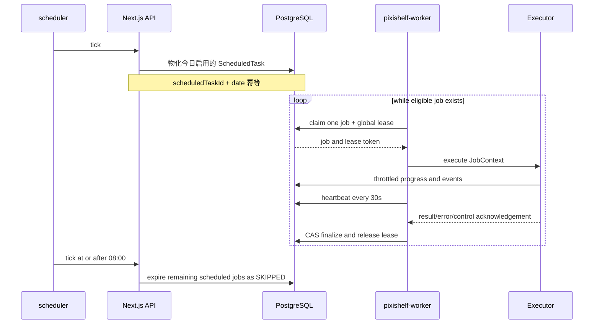
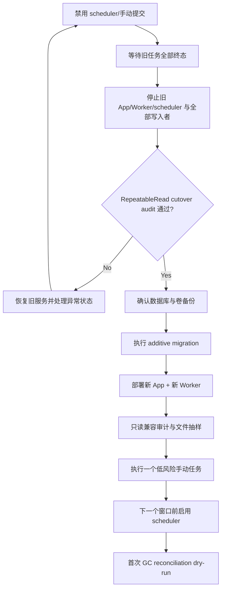

# PixiShelf 后台任务实施与运行手册

> 本文同时是重构执行计划和上线后的运维 Runbook。
> 关联文档：[架构设计](./background-task-architecture.md) · [数据模型](./background-task-data-model.md)

## 1. 目标运行基线

| 项目              | 目标值                                             |
| ----------------- | -------------------------------------------------- |
| Worker 服务       | pixishelf-worker，初期可保留 archive-worker 服务名 |
| Worker 副本数     | 1                                                  |
| 全局后台并发      | 1，代码和数据库双重保证                            |
| 自动任务时区      | Asia/Shanghai                                      |
| 自动运行窗口      | 00:00–08:00                                        |
| 手动任务          | 可在窗口外运行；不抢占当前任务                     |
| 心跳间隔          | 30 秒                                              |
| 租约长度          | 120 秒                                             |
| 默认最大 attempts | 3，可按任务覆盖                                    |
| 事件保留          | 90 天                                              |
| 任务汇总保留      | 365 天                                             |
| 容器日志          | stdout JSON，10 MB × 5                             |

## 2. 每日运行流程



计划任务的“触发成功”表示实例已持久化，不表示已经开始。后台页面必须分别展示排队时间、开始时间和结束时间。

## 3. 管理页面目标

### 3.1 信息层级

页面从上到下分为：

1. **运行总览**：Worker 健康、当前任务、队列数量、自动窗口和下一窗口。
2. **当前执行**：阶段、进度、已运行时间、最近心跳、暂停/取消操作。
3. **等待队列**：来源、基础/有效优先级、等待时间、窗口截止和跳过风险。
4. **任务目录**：启用、优先级、配置、手动执行入口。
5. **最近历史**：终态、耗时、结果摘要、事件时间线和重试。

### 3.2 页面状态

| 状态               | 页面行为                                     |
| ------------------ | -------------------------------------------- |
| Worker healthy     | 显示最近心跳和当前实例                       |
| Worker unavailable | 明确告警；仍允许入队，但提示不会立即执行     |
| PENDING            | 显示队列位置、等待时长、deadline             |
| RUNNING            | 自适应轮询并显示事件                         |
| RETRY_WAIT         | 显示错误码和下次可运行时间                   |
| PAUSING/CANCELLING | 禁止重复操作，显示等待 Executor 响应         |
| SKIPPED            | 显示 WINDOW_EXPIRED 等原因，不使用“失败”文案 |
| FAILED             | 显示可操作错误摘要、attempt 和“创建重试任务” |

### 3.3 前端拆分顺序

1. 先定义稳定的 JobSummary、JobDetail、JobEvent 和 TaskDefinitionView DTO。
2. 将 maintenance-card.tsx 中所有查询集中到 use-task-dashboard.ts。
3. 抽取 TaskStatusBadge、TaskProgress、TaskActions、TaskScheduleForm。
4. 将视频探测结果、代表帧配置等特有内容保留为 task-specific panel。
5. 用 Task Registry View Model 组合卡片，删除按任务复制的查询和状态判断。
6. 最后删除旧组件中的兼容分支，避免一次迁移同时改变 API 和展示。

通用组件不能直接引用具体任务 Mutation。TaskActions 只接收统一 command，如 cancel、pause、resume、retry 和 enqueue。

## 4. Executor 合同

每个后台任务实现统一 Executor：

```ts
interface JobExecutor<TPayload, TResult> {
  type: string
  payloadSchema: ZodType<TPayload>
  execute(context: JobContext<TPayload>): Promise<TResult>
}

interface JobContext<TPayload> {
  jobId: string
  attempt: number
  leaseToken: string
  payload: TPayload
  signal: AbortSignal
  setStage(stage: string, message: string): Promise<void>
  reportProgress(progress: number, message: string, data?: object): Promise<void>
  emitWarning(code: string, message: string, data?: object): Promise<void>
  checkpoint(data: object): Promise<void>
}
```

约束：

- Executor 不直接把 SystemJob 改成终态；统一 Lifecycle 负责。
- Executor 不自行启动后台 Promise。
- Executor 轮询、循环或外部进程必须响应 AbortSignal。
- 领域检查点写入领域表，不把大量明细写进 SystemJob.result。
- progress 必须单调不下降；重试后可从领域检查点推导恢复进度。
- 可恢复错误抛出带 errorCode 和 retryable=true 的类型化错误。
- 确定性错误不自动重试，例如非法路径、非视频文件、输入 Schema 不兼容。

## 5. 日志与事件

### 5.1 标准日志字段

每条 Worker info/warn/error 日志至少包含：

```text
timestamp
level
service
event
jobId
taskType
attempt
workerId
stage
durationMs
```

进度类日志可以增加 processedCount、totalCount、progress。错误日志增加 errorCode 和 stack；不得写入 Token、Cookie、密码、完整环境变量或未脱敏 URL。

推荐事件名：

- job.queued
- job.claimed
- job.started
- job.stage_changed
- job.progress
- job.retry_scheduled
- job.pause_requested
- job.paused
- job.cancel_requested
- job.cancelled
- job.completed
- job.failed
- job.skipped
- worker.lease_recovered
- gc.entry_deleted
- gc.entry_failed

### 5.2 节流

- 阶段变化、控制请求、重试和终态：始终记录。
- 普通进度：变化至少 5%，并且距上次进度事件至少 30 秒。
- 心跳：不写 info 日志、不写事件。
- 单个文件成功：仅 debug。
- 单个文件失败：warn，并在 result 中只保留有限样例；完整逐条失败放领域明细表。

### 5.3 轮转

生产环境优先输出 stdout，由 Docker json-file 负责轮转：

```yaml
logging:
  driver: json-file
  options:
    max-size: 10m
    max-file: '5'
```

app、pixishelf-worker 和 scheduler 使用相同上限。默认 Logger 在生产输出 JSON 且不使用 ANSI colorize；开发环境可以保留易读格式。

当前 migrationLogger 同时写 logs/migration.log 且未设置 maxsize/maxFiles。迁移时二选一：

1. 推荐：只输出 stdout，以 jobId 关联 SystemJob 和事件。
2. 必须保留文件时：使用支持日期/大小轮转的 Transport，限制总文件数并压缩旧文件。

不要为每个 job 单独创建日志文件；大量小文件会增加清理和检索成本。

### 5.4 数据库历史清理

- 每日创建 JOB_EVENT_RETENTION_CLEANUP 和 SYSTEM_JOB_RETENTION_CLEANUP。
- 每批按 id 删除不超过 500 条。
- 活动状态和被活动 parent/领域记录引用的任务永不删除。
- 先清事件，再清 SystemJob。
- 删除结果作为任务汇总和事件记录，避免清理任务完全不可见。

## 6. 视频任务性能策略

### 6.1 视频探测

- 按 imageId 稳定游标和有限批次读取。
- 仅处理 MISSING、STALE 或显式 force 的目标。
- 为源文件保存 size + mtime 指纹；指纹未变且上次成功时跳过。
- 不再把所有 FAILED 无条件重置为 PENDING。
- 将失败分类为 TRANSIENT_PROCESS_ERROR、SOURCE_MISSING、INVALID_MEDIA、TIMEOUT 等。
- ffprobe 每文件设置默认 60 秒超时，stdout/stderr 均限制大小。
- 批量进度写入节流，不按每个文件更新 SystemJobEvent。

### 6.2 视频封面

- 从视频探测中拆为独立子任务。
- 只处理封面 MISSING、STALE、FAILED_RETRYABLE 或 force。
- 生成到临时文件，验证后原子发布。
- 替换旧 posterPath 时写 DerivedMediaGcEntry。
- 不在生成任务入口调用目录级 cleanupOrphanedPosters。
- 单视频 FFmpeg 默认超时 5 分钟；取消先发送温和终止，超时后强制结束。

### 6.3 章节预览与代表帧

- 保留源指纹、staging、published 和检查点语义。
- 失败不能删除上一套可读 published 结果。
- 关键帧发现只入队缺失/过期目标。
- 统一接入全局 Dispatcher 后，删除独立消费循环，但不删除领域检查点。
- FFmpeg 线程数设置安全上限；全局任务单并发不等于允许单个 FFmpeg 使用所有 CPU。

### 6.4 MP4 优化

- 删除 Next.js 内存 processorPromise/rerunRequested 消费模型。
- enqueue 只写 PENDING SystemJob。
- Executor 复用现有临时文件、恢复和原子替换服务。
- 服务重启由统一租约恢复，不再把中断任务直接一律判定失败。

### 6.5 派生媒体 GC

- 每日小批量处理已登记删除意图。
- notBefore 默认延迟至少 1 小时。
- 删除前重新验证数据库引用。
- 每周 reconciliation 默认 dry-run，只输出差异数量和有限样例。
- 大目录使用流式迭代或分页，不一次性构造完整文件列表。

## 7. 故障处理

### 7.1 Worker 不在线

判断：

- 没有 RUNNING 任务时，读取 WorkerInstance：必须为 READY 且 heartbeatAt 不早于 60 秒前。
- 有 RUNNING 任务时，看 heartbeatAt 和 JobResourceLease.expiresAt。
- `/livez` 只证明进程事件循环存活；`/readyz`、WorkerInstance 和任务租约分别表示就绪、进程心跳与执行所有权，三者不能混用。

处理：

1. 检查 pixishelf-worker 容器状态和最近日志。
2. 检查数据库连接、SCAN_PATH、派生媒体挂载和 FFmpeg/FFprobe。
3. 重启 Worker；不要手工把任务改为 COMPLETED。
4. 租约过期后，统一恢复器会重排可恢复任务。
5. 如果 attempt 已耗尽，任务进入 FAILED，由管理员创建重试实例。

### 7.2 任务看似卡住

1. 查看最近 heartbeatAt；心跳正常说明 Executor 仍持有租约。
2. 查看最后 SystemJobEvent.stage。
3. 查看 Worker 日志中的同一 jobId。
4. 外部进程超时策略会中止 FFmpeg/FFprobe；不要直接删除临时文件。
5. 需要停止时使用取消操作，等待 CANCELLING → CANCELLED。
6. 超过租约且 Worker 已失联时，重启 Worker 触发恢复。

### 7.3 队列在 08:00 后仍有任务

- 自动任务应变为 SKIPPED/WINDOW_EXPIRED。
- 手动任务 deadlineAt 为空，可以继续等待或执行。
- 08:00 前已 RUNNING 的自动任务允许软完成。
- 若自动 PENDING 未被跳过，检查 scheduler tick、时区配置和 deadlineAt 数据。

### 7.4 磁盘快速增长

1. 检查 Docker 日志轮转是否为 10 MB × 5。
2. 检查 migration.log 是否仍在无上限写入。
3. 查看 DerivedMediaGcEntry 的 PENDING/FAILED 数量。
4. 运行 GC reconciliation dry-run。
5. 确认 staging、失败归档和旧关键帧代际的保留策略。
6. 任何手工删除前先导出 dry-run 清单并确认数据库无引用。

### 7.5 重复任务或疑似双 Worker

1. 检查 JobResourceLease 中 global/background-worker 的 ownerJobId、workerId 和 expiresAt。
2. 检查部署是否错误扩容。
3. 只要租约 CAS 正常，第二个 Worker 不会执行另一个任务。
4. 如果出现两个有效 RUNNING，视为 P0：停止额外 Worker，保留数据现场，检查 claim 事务和约束。

## 8. 管理操作语义

| 操作               | 语义                                               |
| ------------------ | -------------------------------------------------- |
| 手动执行           | 创建新的 MANUAL SystemJob；不修改当天自动物化标记  |
| 取消 PENDING       | 直接进入 CANCELLED                                 |
| 取消 RUNNING       | 进入 CANCELLING；Executor 清理后确认 CANCELLED     |
| 暂停 PENDING       | 进入 PAUSED                                        |
| 暂停 RUNNING       | 进入 PAUSING；只有支持检查点的 Executor 才开放     |
| 恢复 PAUSED        | 回到 PENDING，重新参与全局排序                     |
| 重试 FAILED        | 创建新任务，保留旧任务终态和事件                   |
| 提升优先级         | 只影响下一次 claim，不抢占当前任务                 |
| 禁用 ScheduledTask | 不再物化未来实例；已存在实例按管理员选择取消或保留 |

不支持检查点的任务不展示“暂停”，只提供取消。取消不是立即强杀；UI 必须展示中间态。

## 9. 分阶段迁移计划

### Phase 0：契约与测试护栏

- 固化任务类型、状态机、错误类型、DTO 和 Executor 合同。
- 给现有 scheduled-task、job-service、关键帧和归档生命周期补充回归测试。
- 记录现有活动任务的恢复策略。

验收：不改运行行为，现有测试通过。

### Phase 1：增量 Schema

- 新增 SystemJob 字段、SystemJobEvent、JobResourceLease、DerivedMediaGcEntry。
- 增加索引和宽松空值字段。
- 旧终态任务回填 definitionVersion=0、triggerSource=LEGACY。
- 回填 effectivePriority 和 maxAttempts。
- 不修改图库、已发布归档和派生媒体领域数据。

验收：迁移可在生产数据副本上完成；Prisma validate/generate 通过；媒体表计数和关键引用迁移前后相同。

### Phase 2：独立运行时边界

- 新建独立 @pixishelf/db、@pixishelf/job-contracts、@pixishelf/job-runtime 和 @pixishelf/worker workspace 边界。
- 将完整 Prisma schema/migrations 历史原样移动到 @pixishelf/db，不创建新库、不重置 `_prisma_migrations`。
- @pixishelf/worker 拥有自己的 package.json、tsconfig、测试和 Dockerfile。
- 删除 Worker 对 packages/pixishelf 源码、tsconfig 和路径别名的依赖。
- 增加 WorkerInstance 空闲心跳、启动预检、`/livez`、`/readyz` 和 SIGTERM drain 骨架。
- 新 Worker 作为普通 `worker` 服务暗启动，但保持 `WORKER_DISPATCH_ENABLED=false`，只做预检、健康检查和实例心跳，不与旧 archive-worker 争抢领域状态。

验收：不改变任务执行行为；Worker 镜像不复制 Next.js 包；DB 包可独立 generate/validate/typecheck/test，Contracts/Runtime/Worker 可独立 typecheck/test/build；数据库 migration status 无漂移；空闲心跳与停机状态可验证。

### Phase 3：统一 Lifecycle、API 和 Central Worker

Phase 3 先以默认关闭的双开关交付内核：`CENTRAL_DISPATCHER_CUTOVER_ENABLED=false` 保持旧控制面行为，`WORKER_DISPATCH_ENABLED=false` 禁止新 Worker claim。归档与关键帧 Executor 先随新镜像暗装，但旧 archive-worker 仍是生产消费者；因为两枚开关是全局边界，只有全部旧入口和 Executor 迁移完成后，才可在同一次部署中停止旧 archive-worker 并同时开启两个开关。禁止在只有部分 capability 时提前开启，也禁止只开启其中一个形成双消费、无人消费或未支持任务积压。

- 实现 job-command-service、job-query-service、job-lifecycle 和事件服务。
- 所有新状态变更使用 workerId + attempt + leaseToken CAS。
- 新 Router 使用 adminProcedure 和共享 Zod payload，UI 兼容读取旧汇总字段并开始写事件。
- 将 archive-worker 主入口演进为 pixishelf-worker。
- 引入 Central Dispatcher 和 global/background-worker 租约。
- 归档、关键帧先接入统一 claim，不再 Promise.all 启动独立消费者。
- 部署副本数保持 1。

验收：取消/完成竞争、租约丢失、事件事务测试通过；误启动两个通用 Worker 时仍只有一个有效 RUNNING；暗启动阶段旧 archive-worker 继续消费且通用 Worker 不 claim，最终全量切换提交再从生产 compose/CI 停用旧 archive-worker。

### Phase 4：迁移维护与媒体任务

建议顺序：

1. 历史清理任务（已暗装）。
2. 元数据补全和标签同步（已暗装）。
3. WebP 动画识别（已暗装）。
4. 视频探测、独立封面和派生媒体 GC（已暗装）。
5. 章节预览（已暗装）。
6. MP4 优化（已暗装）。
7. 扫描、本地导入、迁移和批量替换（Phase 5 已暗装）。

每迁移一个任务：

- enqueue 只创建 PENDING。
- 添加 Executor 适配器。
- central=true 的路由和队列适配不得进入旧 IIFE/内存消费者；暗发布阶段保留 central=false 的 legacy 实现用于生产和回滚，最终原子切换稳定后再删除。
- 增加重启恢复、取消和终态 CAS 测试。

“已暗装”表示代码、Registry、镜像依赖和测试已经交付，不表示生产流量已经切到新 Worker。Phase 5 的 Registry 已精确锁定 17 个 v1 capability，两个全局开关仍保持 false；全部 capability 必须在最终原子切换前一起通过发布门禁。

#### 扫描、迁移与批量替换切换门禁

- `/app/data` 必须以读写方式挂载，启动 preflight 必须拒绝只读原始媒体目录。
- Worker READY 后执行只读审计；命令会只查询最近 60 秒心跳的 READY 实例，并精确比较 17 项 v1
  capability。实例缺失、重复、字段非法或清单错配都会脱敏报错并以非零状态退出：

  ```powershell
  docker compose -f docker-compose.deploy.yml exec worker node dist/capability-audit.cjs
  if ($LASTEXITCODE -ne 0) { throw 'Worker capability audit failed' }
  ```

- 扫描和本地导入只读取冻结输入；迁移和批量替换只从持久阶段检查点恢复，不从请求现场重新推断。
- 批量替换恢复/清理只接受 producer 生成的备份与 pending 目录身份，并在任何文件操作前执行 case-fold 路径互异检查。
- 高风险 PostgreSQL 集成测试必须与其他 Executor 使用同一个测试库 URL 串行执行，避免全局执行槽测试互相争用。

#### 视频探测、封面与派生媒体 GC 切换门禁

- `derived_media_gc` 定义默认关闭；只能在全局切换同时启用
  `CENTRAL_DISPATCHER_CUTOVER_ENABLED=true` 与 `WORKER_DISPATCH_ENABLED=true` 后，再由管理员启用该计划。
- 每日计划 payload 固定为 `{dryRun:false,reconcile:false}`，只消费已经登记且到期的
  `DerivedMediaGcEntry`，不会扫描整个封面目录。
- 首次目录 reconciliation 由管理员手动触发，payload 固定为 `{dryRun:true,reconcile:true}`；先核对
  `reconciliationScanned` 与 `untrackedCandidates`，不得把 reconciliation 与每日实际删除混为同一模式。
- 单图重探测在切换后必须落成带 `imageId`、`force=true` 的 `VIDEO_MEDIA_PROBE`；切换前仍走旧同步服务。
  禁止只开启 Worker 或只开启 Next 控制面，否则会形成旧请求执行与新队列执行重叠、或任务无人消费的窗口。
- 视频探测每次最多检查 100 条最旧封面状态；全库缺文件发现只允许走显式、有界、默认 dry-run 的
  reconciliation，不能恢复“每次 probe 遍历整个派生目录”的旧行为。

验收：central/legacy 路由反例通过；GC 引用胜出、取消恢复、stale fence、101--1000 显式 ID 分块测试通过；
启用计划前确认不存在旧 `VIDEO_MEDIA_PROBE` 活动任务，启用后首个每日任务必须为非 dry-run 且不执行 reconciliation。

### Phase 5：调度窗口

- Scheduler 从“到点启动”改为“窗口内幂等物化”。
- 加入 scheduledTaskId + scheduledForDate 唯一约束。
- UI 用全局窗口替代每任务 time 编辑。
- 08:00 过期处理写 SKIPPED 事件。

验收：重复 tick、不同时区边界、跨日、08:00 截止测试通过。

### Phase 6：前端拆分

- 上线统一 dashboard/query。
- 抽取通用组件和 hooks。
- 加入事件时间线和 Worker 健康。
- 删除 maintenance-card.tsx 与 video-keyframe-section.tsx 中重复协议逻辑。

验收：每种状态、键盘操作、错误、空队列和移动端布局都有组件测试。

### Phase 7：GC 与日志治理

- 发布 DerivedMediaGcEntry 增量清理。
- 视频封面任务删除启动时全量孤儿扫描。
- 增加每周 reconciliation dry-run。
- Logger 改为生产 JSON stdout。
- Docker 日志统一 10 MB × 5，修复 migration.log 无界增长。
- 增加 WorkerInstance 保留清理：STOPPING 超过 24 小时、READY/DEGRADED 心跳超过 7 天后分批删除。

验收：替换/删除/重新引用竞态测试、路径穿越测试、日志轮转配置检查通过。

### Phase 8：清理兼容代码

- 停止双写 targetImageId/targetPath/mode。
- 删除旧 ScheduledTask.time/lastTriggered 语义。
- 删除旧互斥数组、独立循环和 Next.js 内存队列。
- 删除只服务旧 UI 的 Router。

这一阶段单独发布，确保前一版本仍可回滚。

## 10. 验证清单

### 10.1 数据与生命周期

- 同一 ScheduledTask 同一天只能物化一个自动实例。
- 两个 Worker 并发 claim 只有一个成功。
- 过期 lease 的旧 Worker 无法 complete。
- RUNNING 与 cancel 竞争不会从 CANCELLED 回到 COMPLETED。
- RETRY_WAIT 到期才重新排队。
- 08:00 后自动待执行任务全部 SKIPPED。
- 手动任务不受 deadline 影响。
- parent/child 汇总不丢失子任务错误。

### 10.2 外部进程

- ffprobe/ffmpeg 超时后无残留子进程。
- SIGTERM 时 Worker 停止 claim，新任务不启动。
- 当前 Executor 在宽限期内检查点或取消；超时后租约自然恢复。
- stderr/stdout 大量输出不会撑爆内存。

### 10.3 GC

- 正在被引用的文件永远不删除。
- 路径穿越被拒绝。
- 替换引用产生 GC 意图。
- 同一路径重复意图被去重。
- 删除失败有限重试并可在后台看到。
- reconciliation 默认不删除。

### 10.4 UI

- 列表只建立一个 dashboard 查询。
- 活动、排队、空闲使用不同轮询频率。
- 状态不仅依赖颜色。
- 图标按钮有可访问名称。
- 破坏性操作有确认和中间态。
- 事件通过 afterEventId 增量加载，不反复获取全量历史。

### 10.5 建议命令

数据库与 Web 包从窄到宽执行：

```powershell
pnpm --filter @pixishelf/db db:generate
pnpm --filter @pixishelf/db db:validate
pnpm --filter @pixishelf/db test
pnpm --filter @pixishelf/next lint
pnpm --filter @pixishelf/next test
pnpm --filter @pixishelf/next build
```

Worker 包执行：

```powershell
pnpm --filter @pixishelf/worker... typecheck
pnpm --filter @pixishelf/worker... test
pnpm --filter @pixishelf/worker... build
docker build -f build/worker.Dockerfile --target production -t pixishelf-worker .
```

生产 build 按仓库约定使用允许文件系统/子进程的执行环境。最后执行：

```powershell
rg --files packages/pixishelf | rg '[A-Z]'
```

确保没有引入违反 kebab-case 规则的路径。

## 11. 计划停机升级

本项目不要求旧 Worker 与新 Worker 滚动共存。生产升级采用明确停机窗口，前提是旧任务全部结束。目标是升级后功能可用，并且不重写、不删除、不重新生成既有图库和媒体。

### 11.1 旧数据兼容结论

| 旧数据                          | 升级处理                      | 风险                            |
| ------------------------------- | ----------------------------- | ------------------------------- |
| Artwork、Image、Artist、Tag     | 原样使用                      | 无表名/主键变更                 |
| 已完成的视频探测/封面           | 原样使用现有字段与 posterPath | 不批量重探测、不重新生成        |
| 已完成章节预览                  | 原样使用 previewPath          | 不移动文件                      |
| PUBLISHED 代表帧                | 原样使用 set/frame/path       | 不重新发布                      |
| 已发布 ArchiveRevision/manifest | 原样使用                      | 不重建归档                      |
| 终态 SystemJob                  | 保留，标记 LEGACY + version 0 | 新 Worker不领取，事件时间线为空 |
| ScheduledTask                   | 保留 enabled/priority/config  | time 被全局窗口替代             |
| 原始媒体卷                      | 挂载到相同容器路径            | 不搬迁、不改名                  |
| derived-media 卷                | 挂载到相同容器路径            | 首次 GC 只 dry-run              |

拆出 @pixishelf/db 时必须携带原 migration 目录和 \_prisma_migrations 历史。禁止创建新的空数据库、重新 baseline 或通过 db push 猜测生产差异。

### 11.2 停机前预检

先在旧服务仍在线时完成排空准备，然后停止全部写入者：

1. 禁用 scheduler，防止产生新的自动任务。
2. 停止管理员手动提交任务。
3. 等待当前任务完成或明确取消。
4. 停止旧 App、旧 Worker 和 scheduler 进程，确认没有其他脚本或实例会写入数据库。
5. 在所有写入者保持停止的情况下运行最终只读 cutover audit；只有通过后才能备份和执行 migration。

audit 必须确认以下阻断计数全部为 0：

| 检查                | 阻断状态                                                                             |
| ------------------- | ------------------------------------------------------------------------------------ |
| SystemJob           | PENDING、RUNNING、PAUSING、PAUSED、CANCELLING                                        |
| ArchiveImport       | PENDING、RUNNING、PAUSED、CANCELLING                                                 |
| ArchiveImportItem   | DOWNLOADING                                                                          |
| ScanRun             | RUNNING                                                                              |
| PendingReplaceBatch | RUNNING、CANCELLING                                                                  |
| PendingReplaceItem  | STAGING、BACKING_UP、SWAPPING、COMMITTING、ROLLING_BACK、RESTORING、RESTORE_SWAPPING |
| 视频探测            | PROBING                                                                              |
| 视频封面            | GENERATING                                                                           |
| 章节预览            | GENERATING                                                                           |
| 代表帧              | GENERATING；无法与终态任务对应的 STAGING set                                         |
| 归档生命周期        | TRASHING、RESTORING                                                                  |

audit 输出每类数量和有限 ID/数据库记录中的路径样例，并以非零退出码阻止部署。路径字段可能是绝对路径，audit 输出必须按部署日志的敏感信息权限保存，不能公开分发。它只能读取，不能自动“修复”状态。

从已安装 pnpm 依赖的部署 checkout 进入 `packages/pixishelf`，显式提供目标数据库的 `DATABASE_URL` 后执行（命令不会输出该 URL）：

```bash
pnpm background-task:cutover-audit
pnpm background-task:cutover-audit --sample-limit 50
```

当前生产 app stage 不包含 `tsx`，因此不要假设能直接在运行中的 app 容器内执行该命令。默认每类最多输出 20 个样例；`--sample-limit` 只接受 1 到 100 的整数。命令把全部 `count` 和 `findMany` 查询放在一个 PostgreSQL `RepeatableRead` 事务快照内，并输出带 `schemaVersion` 的 JSON。退出码 `0` 表示没有阻断记录，`2` 表示发现阻断记录，`1` 表示参数、配置或数据库错误。部署流程必须只接受退出码 `0`；事务快照不能替代停写要求，最终 audit 期间所有旧写入者必须保持停止。

如果发现异常：

- 不继续 migration。
- 不把记录自动改成 COMPLETED。
- 保存 ID、路径、临时文件和关联任务清单。
- 优先重新启动旧服务完成或取消任务。
- 无法继续时，使用该领域的专用恢复脚本标记 FAILED/回滚 staging；恢复脚本必须保留上一套 published 数据。
- 再次执行 audit，直到全部通过。

### 11.3 备份

至少准备：

- PostgreSQL 一致性备份。
- PIXISHELF_DATA_PATH 的文件清单、容量和关键 manifest 备份。
- DERIVED_MEDIA_HOST_PATH 的文件清单；数据量允许时做卷级快照。
- 当前环境变量、Compose 文件、镜像 tag 和 migration 版本。
- 迁移前各核心表行数和已发布媒体引用数。

### 11.4 正式切换



具体顺序：

1. 停止旧 App、旧 Worker、scheduler 和其他数据库写入脚本。
2. 在所有写入者停止后执行最终 cutover audit；发现阻断则终止升级并回到旧服务处理。
3. audit 通过后确认数据库与媒体卷备份。
4. 应用 additive migration；不删除旧列，不修改媒体路径。
   本阶段会回填 `availableAt` 并设置新记录默认值，但仍允许旧关键帧入口写入 `NULL`；不要在本次切换中手工收紧为 `NOT NULL`。
5. 旧终态 SystemJob 标记为 LEGACY/version 0。
6. 部署新 App 和新 Worker，scheduler 继续关闭。
7. 新 Worker启动时验证 Schema 版本、数据库、FFmpeg/FFprobe 和三个可读写媒体目录。
8. 运行只读 post-migration audit，比较迁移前后核心表计数和已发布引用。
   同时检查旧 `system_jobs` 的 progress、attempt、maxAttempts 和 definitionVersion；本次 migration 的四个历史表 CHECK 使用 `NOT VALID`，创建时不会扫描未触碰的历史行，但会拒绝非法的新插入，也会拒绝任何仍不满足约束的旧行更新。旧值审计通过后通过独立 migration 执行 `VALIDATE CONSTRAINT`。
9. 抽样读取原图、封面、章节预览、代表帧和归档 manifest。
10. 手动提交一个低风险清理或只读扫描任务，验证入队、claim、事件、日志和终态。
11. 再验证一个小范围媒体任务，不做全量扫描。
12. 在下一个 00:00–08:00 窗口前显式开启 scheduler。
13. 第一次 GC reconciliation 保持 dry-run，人工确认后才开启增量删除。

如果第 4 步由 `prisma migrate deploy` 执行，且 `20260814091000_add_background_task_queue_schema` 的 guard 意外失败，显式事务会回滚全部 0910 DDL 和回填，但 Prisma 会保留一条 failed migration，后续直接重跑会报 `P3009`。先保持全部写入者停止完成第 1 步；如阻断项必须由旧服务处理，可恢复旧版本，处理完成后再次停止全部写入者，再执行后续步骤：

1. 先用只读 SQL 确认 `system_jobs.definitionVersion`、`system_job_events`、`job_resource_leases` 和 `derived_media_gc_entries` 均不存在；任一对象存在都不得执行 `resolve`，应先按事故流程核对实际迁移边界。
2. 排空或恢复 guard 报告的阻断项，再重新运行最终 cutover audit。
3. audit 通过后执行：
   `pnpm --filter @pixishelf/db exec prisma migrate resolve --rolled-back 20260814091000_add_background_task_queue_schema --schema prisma/schema.prisma`
4. 再执行 `prisma migrate deploy`。不得将失败记录标记为 `--applied`，也不得绕过 guard 手工补列。

严格的 `availableAt NOT NULL`、任务租约字段全有/全空、`SKIPPED` 字段一致性和计划字段成对约束属于兼容清理阶段。只有旧执行入口全部迁走、完成一个稳定发布周期并确认无需回滚后，才能通过独立 migration 加入这些约束。

### 11.5 新 Worker 的旧数据规则

- claim 必须要求 definitionVersion >= 1；历史 version 0 只读。
- 新任务只使用版本化 payload，不从旧历史任务推断待执行工作。
- PENDING 的媒体领域状态可以保留，但只有管理员或新 ScheduledTask 创建新 SystemJob 后才会处理。
- PUBLISHED/COMPLETED 数据永远优先于 staging/failed 数据，恢复或清理不得覆盖上一套可读结果。
- 新 Worker不执行“首次启动全量修复”。
- 新 Worker不在启动时扫描并删除孤儿文件。
- 未知 task type、未知 payload version 进入 FAILED_UNSUPPORTED，不尝试猜测。

### 11.6 回滚

- 当前发布只做 additive migration，旧列至少保留一个发布周期。
- 新 Worker冒烟失败时保持 scheduler 关闭并停止新 Worker。
- 如果尚未执行新写任务，可直接恢复旧镜像。
- 如果已经执行新任务，先导出这些 jobId、事件和文件变更清单，再决定是否回滚应用；不能假定旧 Worker理解新任务。
- 数据库和媒体回滚使用升级前备份，不运行反向 destructive migration。
- 删除旧字段、旧任务入口和旧 migration 兼容只能在后续独立发布完成。

## 12. 值班检查

日常只需关注：

- Worker 最近心跳是否小于 2 分钟。
- 是否存在 leaseExpiresAt 已过期但仍为 RUNNING 的任务。
- FAILED/RETRY_WAIT 是否短时间激增。
- 08:00 后是否仍有带 deadlineAt 的 PENDING。
- DerivedMediaGcEntry FAILED 是否增长。
- 容器日志占用是否符合轮转上限。
- 最长任务耗时是否显著偏离历史基线。
