# Multi-source URL archive design

Decision status: accepted on 2026-08-11. Implementation details in this document may still describe a target state and must not override current code.

> 演进说明：本文保留 Provider、来源身份、revision、manifest、原子发布和归档生命周期的基础设计。
> 已上线的持续追加、持久解析、批量入队和双 Worker 资源通道见
> [归档收件箱](../features/archive-intake.md)；原实施规格保留在
> [归档收件队列设计](./archive-intake-queue.md)。本文其余内容仍是多来源归档的分阶段草案。

## Summary

PixiShelf will add a source-independent URL archive path with E-Hentai as the first provider. An administrator pastes one gallery or image-page URL, reviews normalized metadata and quality, then confirms a durable background Archive Import. The worker downloads and validates ordered media in staging, writes a self-contained manifest, and publishes the Artwork only after the complete revision is ready.

The design deliberately does not extend the Pixiv-shaped scanner with more site-specific branches. Provider-specific URL, metadata, authentication, pagination, and media-link behavior lives behind one provider seam; archive orchestration, storage, revisions, curation protection, and publication stay provider-independent.

Domain language is defined in [CONTEXT.md](../../CONTEXT.md). The two governing architectural decisions are [separating source references from local identity](../adr/0001-separate-source-references-from-local-identity.md) and [using a durable worker with atomic publication](../adr/0002-use-a-durable-worker-and-atomic-archive-publication.md).

## Goals

- Import a supported work from one pasted URL without requiring a separate downloader.
- Preserve ordered media, normalized metadata, raw source metadata, checksums, and revision history.
- Add later providers without changing archive orchestration or reintroducing global external-ID assumptions.
- Resume interrupted work without exposing partial Artworks.
- Preserve local edits and tag provenance during source refreshes.
- Rebuild catalog state from archived directories when PostgreSQL state is lost.
- Keep existing Pixiv scans, local directory imports, manual creation, browsing, and media delivery working during migration.

## Non-goals for the first E-Hentai release

- ExHentai, private galleries, or account Cookie management.
- Paid archive acquisition, torrent acquisition, or collection-page crawling.
- Browser-extension request forwarding or browser automation.
- Per-provider proxy UI, PAC, and SOCKS configuration. Standard `HTTPS_PROXY`/`HTTP_PROXY` and the
  archive-specific `ARCHIVE_HTTPS_PROXY` override are supported by the server transport.
- The original E-Hentai release did not include multiple URLs in one submission. The accepted next iteration is
  specified in [Archive intake queue design](./archive-intake-queue.md).
- Scheduled remote update checks.
- Disk-space preflight or storage quotas. `ENOSPC` is reported as a recoverable task failure.
- Immediate migration of the existing Pixiv filesystem scanner into the URL provider model.

## Current constraints

- `Artwork.externalId` is globally unique, so equal numeric IDs from different sites collide.
- `Artwork.source` combines provider and creation method.
- Web creation, batch creation, and local directory import generate `e_{artworkId}_{sevenDigitSuffix}` as a local identifier.
- The historical migration that introduced `Artwork.source` defaulted all existing rows to `PIXIV_IMPORTED`, so `source = PIXIV_IMPORTED` alone is not trustworthy migration evidence.
- Pixiv scan creation relies on the Prisma source default and Pixiv rescan looks up by global `externalId`.
- The current scan and local-import task paths are request-bound or process-local; only the video optimization queue already demonstrates claim, heartbeat, attempt, and stale recovery.
- The production Web container mounts the primary media root read-only by default and runs Prisma migrations before starting Next.js.

## Architecture

```mermaid
flowchart LR
    A["Admin submits URL"] --> B["Provider registry"]
    B --> C["Provider resolve"]
    C --> D["Preview and confirmation"]
    D --> E["ArchiveImport PENDING"]
    E --> F["Worker claim and heartbeat"]
    F --> G["Staging and item checkpoints"]
    G --> H["Validation and manifest"]
    H --> I["Short publication lock"]
    I --> J["Atomic file move and database commit"]
    J --> K["Published Artwork"]
```



### Provider seam

The external provider seam is intentionally small:

```ts
interface ArchiveProvider {
  resolve(url: string, context: ResolveContext): Promise<ResolvedArchive>
  openMedia(item: ResolvedMedia, context: DownloadContext): Promise<RemoteMedia>
}
```

`resolve` owns URL normalization, canonical source identity, source metadata, replacement relationships, ordered durable media locators, and preview warnings. `openMedia` resolves or refreshes an individual media download at execution time; short-lived direct URLs are not durable identity.

Provider selection is based on an explicit HTTPS host allowlist. A provider implementation receives its HTTP transport and clock rather than creating them, so tests can use deterministic adapters at the same seam. The first production adapter is E-Hentai; test adapters make the seam real before a second remote provider is added.

### Archive module interface

UI and routers call one archive module rather than providers, storage, and job tables separately:

```ts
interface ArchiveModule {
  preview(url: string): Promise<ArchivePreview>
  enqueue(input: ConfirmedArchiveInput): Promise<ArchiveTaskRef>
  getTask(taskId: string): Promise<ArchiveTaskView>
  requestAction(taskId: string, action: ArchiveTaskAction): Promise<ArchiveTaskView>
}
```

The interface guarantees URL validation, idempotent task selection, durable state before returning from `enqueue`, and explicit actions for pause, resume, cancel, retry, quality fallback, update publication, and staging deletion. Provider selection, retry policy, file layout, locking, and transaction ordering remain implementation details.

## Data model changes

### Artwork

Add:

- `storageKey`: nullable, immutable, unique local storage identity; existing valid `e_...` values are copied here.
- `createdVia`: immutable Creation Method such as `PIXIV_SCAN`, `URL_ARCHIVE`, `LOCAL_DIRECTORY`, or `MANUAL_CREATE`.
- `deletedAt`: nullable soft-delete timestamp.
- local-override state sufficient to prevent source refresh from overwriting an intentionally edited title or description.

`Artwork` remains the visible source-independent catalog aggregate. Existing `externalId` and `source` remain temporarily for compatibility and are removed only after all readers and writers have migrated.

### ArtworkExternalRef

Store:

- `artworkId`;
- string `providerKey`, initially `pixiv` or `e-hentai`;
- provider-scoped `externalId`;
- canonical URL and the provider locator needed to refresh it;
- latest fetch time and normalized metadata hash.

The invariant is `UNIQUE(providerKey, externalId)`. Provider locators such as an E-Hentai gallery token are stored for refresh but redacted from logs, notifications, and ordinary audit views.

### ArtworkSourceSnapshot

Append a snapshot when the normalized or raw source metadata hash changes. A snapshot records provider schema version, normalized metadata, raw JSON, fetch time, and its source reference. Full HTML pages are not retained.

### ArchiveImport and ArchiveImportItem

`ArchiveImport` owns the provider key, submitted and canonical locators, requested and selected quality, lifecycle status, counters, staging location, warning or decision state, related `SystemJob`, and eventually published Artwork and revision IDs.

`ArchiveImportItem` owns page order, durable page locator, expected filename and media facts, attempts, status, staged path, downloaded byte count, dimensions, SHA-256, and last classified error. An expired direct-media URL is refreshed through `openMedia` instead of being treated as identity.

`SystemJob` continues to own queue claiming, attempts, heartbeat, cancellation requests, and stale recovery. `ScanRun` remains long-term task audit rather than the source of resume state.

### ArchiveRevision and relationships

Each publication creates an immutable `ArchiveRevision` with a manifest path and media snapshot. One revision is current. When the same provider identity changes, additions can extend a revision candidate, while changed or removed media is preserved under the previous revision until the administrator confirms publication.

Provider replacement chains create separate Artworks and explicit `ArtworkRelation` rows such as `REPLACES`; a new provider external ID never overwrites an older Artwork.

### Tags and provenance

`Tag` gains a non-empty namespace and is unique by `(namespace, name)`. Existing tags use `general`. E-Hentai namespaces such as `artist`, `group`, `language`, `parody`, and `female` remain distinct.

`ArtworkTag` records `SOURCE`, `MANUAL`, `DERIVED`, or `LEGACY` provenance and optionally the contributing source reference. Existing assignments become `LEGACY`. Refresh replaces only `SOURCE` assignments belonging to the refreshed source reference.

## Archive workflow

### Preview

1. Accept one gallery or image-page URL.
2. Validate HTTPS, allowlisted host, every redirect, resolved IP, timeout, and response-size limits.
3. Resolve image-page URLs to their containing gallery and canonical identity.
4. Fetch normalized and raw metadata and the ordered page plan.
5. Detect an active import, existing published source reference, replacement relationship, or update candidate.
6. Show title, cover, page count, source metadata, quality, update differences, and quota or fallback warnings.

Preview does not create an Artwork or start media downloads.

### Enqueue and execution

1. Confirmation transaction creates `ArchiveImport`, item checkpoints, and a `PENDING` SystemJob.
2. A dedicated worker claims one import, increments attempt count, and maintains heartbeat.
3. The worker downloads into a task-specific staging directory and commits each completed item checkpoint.
4. E-Hentai runs at one active gallery and at most two simultaneous media requests. It honors `Retry-After`, adds backoff and jitter, and pauses on classified 403, 429, or 509 responses instead of retrying aggressively.
5. Each media response must pass status, MIME, configured response-size, decode, dimensions, expected length when supplied, and SHA-256 validation.
6. Original quality is preferred. If it is unavailable or would require an unsupported account action, the task pauses for an explicit switch to display quality; there is no silent downgrade.
7. After every required item succeeds, the worker writes and verifies the manifest.
8. The worker fences the lease, atomically renames staging to an immutable import-specific revision directory, then commits catalog rows and the current revision in a second fenced transaction. The deterministic prepared directory makes either crash boundary idempotently resumable.

An Artwork is visible only after step 8.

### Pause, failure, and cancellation

- `PAUSED` retains staging until the user resumes or deletes it.
- `FAILED` and `CANCELLED` retain staging for seven days, allowing retry or explicit cleanup.
- Explicit and seven-day-expiry staging cleanup use the same durable path: a fenced transaction records `cleanupRequestedAt`, queue claiming is blocked while that intent exists, and the read-write worker idempotently removes staging and any unpublished prepared revision before resetting item checkpoints and clearing retention state.
- Worker restart recovery reclaims stale running jobs from durable checkpoints.
- `ENOSPC` is a classified recoverable failure; the design intentionally performs no disk-space preflight.
- Re-submitting a running identity returns the active task. Re-submitting a published identity opens repair or update preview.

### Updates and local curation

- A source refresh updates Source Snapshots but never overwrites a Local Override.
- Missing or corrupt local media can be repaired without creating a duplicate Artwork.
- Added remote pages create an update candidate.
- Changed or removed pages preserve the previous revision and require confirmation before the latest revision changes.
- Update checks are manual in the first release, either by re-submitting the URL or selecting `Check updates`.

## E-Hentai provider

The first release supports public `e-hentai.org/g/{gid}/{token}` gallery URLs and `/s/{pageToken}/{gid}-{page}` image-page URLs. It uses the official JSON API for gallery metadata and ordinary HTTP/HTML parsing for page and media discovery.

The provider maps one gallery to one Artwork with ordered media. Japanese title is the default display title when available; English or romanized titles remain searchable aliases. Uploader is preserved as source metadata and never mapped to Artist. `artist:*` and `group:*` remain namespaced tags.

Storage uses a creator bucket selected for each immutable revision:

1. exactly one `artist` tag: `artist--{safeName}`;
2. otherwise exactly one `group` tag: `group--{safeName}`;
3. multiple creators: `_multiple`;
4. no creator: `_unknown`.

The bucket is not remote identity. If source metadata changes it, the next revision is written to the new bucket while older immutable revisions remain at their original paths.

## Storage and manifest

```text
sources/
  e-hentai/
    artist--creator/
      1234567/
        revisions/
          revision-id/
            manifest.json
            media/
              0001-original-name.jpg
              0002-original-name.png
```

Staging resides on the same writable filesystem as the revision directory. Publication atomically renames staging into an import-specific immutable revision path, then a fenced database transaction switches the catalog's current revision. A crash before the database commit leaves a deterministic prepared directory that the same import can resume; it never overwrites the current revision. The Web container retains a read-only media mount; only the archive worker receives a read-write mount.

The manifest is self-contained and versioned. It includes provider identity and locator, canonical URL, titles and aliases, normalized metadata, category, uploader, namespaced tags, replacement relationships, revision identity, ordered media paths, original filenames, dimensions, sizes, hashes, source-page locators, and creation timestamps.

Local directory import detects a supported manifest and reconstructs source references, revisions, ordering, and metadata without contacting the provider. Directories without a manifest keep the existing local-import behavior.

## Deletion and trash

Deleting a published URL archive makes the read-only Web process commit a durable `TRASHING` intent and hide the Artwork. The read-write worker then moves every immutable revision (including revisions stored under older creator buckets) to `.trash/archive/<artwork-id>/<revision-id>` on the same filesystem. Restore similarly commits `RESTORING`; the worker moves every revision back and only then makes the Artwork visible. Both moves are idempotent; an independent wall-clock reconciler runs on worker startup and every 30 seconds even while another gallery is downloading, so a process crash cannot leave a visible Artwork whose media has disappeared. A trashed identity cannot be refreshed by a new URL import until it has been explicitly restored.

Trash is retained for seven days. Permanent cleanup only handles fully `TRASHED` Artworks and is a worker operation that never follows an unresolved or user-controlled path.

## Security

- Archive import is administrator-only and writes to the existing global library.
- Accept only registered provider HTTPS hosts.
- Validate every redirect and reject loopback, private, link-local, multicast, and cloud-metadata destinations after DNS resolution.
- When a configured HTTP(S) proxy uses Clash-style `198.18.0.0/15` synthetic DNS addresses, send the
  request through the proxy CONNECT tunnel; never treat that range as a generally public destination,
  and continue rejecting every other non-public address.
- Apply connect, header, body, and overall timeouts plus response-size limits.
- Sanitize every remote path segment and keep final paths under the resolved media root.
- Never log Cookie values, authorization headers, full gallery locators, or unredacted provider tokens.
- Keep the Web process read-only and isolate write access in the worker.
- Rotate and remove the hard-coded Pixiv session currently present in `packages/zip-convert/app.js` before release.

## Migration and rollout

### Release A: expand and classify

1. Add new tables, `storageKey`, Creation Method, provenance, soft deletion, and compatibility indexes.
2. Copy valid `e_{artworkId}_{sevenDigitSuffix}` values to `storageKey`; do not create a provider reference.
3. Preserve explicit `LOCAL_CREATED` and `LOCAL_IMPORT` classifications.
4. Treat non-null `storagePath` as strong local-directory evidence.
5. Create Pixiv source references only when a numeric ID is supported by strong Pixiv evidence such as a Pixiv or pximg URL, a Pixiv metadata path, or Pixiv-specific normalized fields.
6. Mark every remaining ambiguous row as Unknown Origin and report it without guessing.
7. Backfill existing tag assignments as `LEGACY`.
8. Keep legacy `source` and `externalId` columns and their readers.

The migration must include count and uniqueness assertions and produce an admin-readable classification report. Unknown Origin does not block E-Hentai imports, but provider-specific destructive actions skip unknown records.

### Release B: switch writers and readers

1. Make manual Web creation server-owned `MANUAL_CREATE`; remove optional source selection from the caller contract.
2. Generate `storageKey` in the same transaction as local Artwork creation.
3. Make local directory and batch creation write Creation Method and Storage Key explicitly.
4. Make Pixiv scan write its source reference explicitly rather than relying on a database default.
5. Make Pixiv rescan, force reset, external links, filters, and lookup paths use provider-scoped references.
6. Split UI filters into Source Provider and Creation Method.
7. Deploy the archive worker, provider module, and admin archive UI.

Legacy columns remain available for one stable compatibility release.

### Release C: contract

After verification shows no legacy reads or writes, remove the global `Artwork.externalId` uniqueness rule, then remove obsolete legacy fields in a later migration. Do not combine expansion and destructive cleanup in one release.

### Operator flow

1. Stop app, scheduler, and worker writes.
2. Create and validate a PostgreSQL dump outside the Compose volume.
3. Pull the new image.
4. Start the Web container; its existing entrypoint runs `prisma migrate deploy` before the standalone server.
5. After Web is healthy, review migration status and classification counts.
6. Start the independently built worker image and scheduler.
7. Confirm health, queue recovery, and representative Pixiv/local records before enabling URL import.

The Web entrypoint remains the sole migration owner. The worker image never contains Prisma CLI or migration behavior and starts only after Web is healthy, so the two processes cannot race. The Web image remains a Next.js standalone artifact; the independently built worker image contains compiled JavaScript plus its narrow runtime dependency set. Local non-container deployment continues to use `pnpm --filter @pixishelf/next db:deploy`.

## Admin interface

Add a dedicated Archive Imports page containing:

- single URL input and provider-aware preview;
- quality confirmation and source warnings;
- active queue, progress, pause, cancel, resume, retry, and staging cleanup;
- item-level classified failures;
- repair and update-difference preview;
- revision and replacement-chain history;
- redacted task audit;
- Unknown Origin migration report.

The existing Pixiv scan card remains separate.

## Verification strategy

### Migration fixtures

- explicit Pixiv numeric IDs with strong source evidence;
- local `e_...` identifiers mislabeled by the historical default;
- `LOCAL_CREATED`, `LOCAL_IMPORT`, null ID, unexpected non-numeric ID, and ambiguous numeric records;
- equal numeric external IDs across Pixiv and E-Hentai;
- legacy tags that must remain untouched by refresh.

### Provider contract tests

- gallery and image-page URL normalization;
- API metadata and representative saved HTML fixtures;
- pagination, title aliases, namespaced tags, replacement chains, expired media URLs, and classified HTTP errors;
- host, redirect, IP, timeout, and response-size security checks.

### Archive module tests

- enqueue idempotency and active-task reuse;
- checkpoint resume after worker termination;
- pause, fallback decision, cancellation, retention, and stale-job recovery;
- checksum mismatch and corrupt-image retry;
- publication lock scope and atomic visibility;
- manual field and tag preservation on refresh;
- update revision preservation and manifest round-trip import;
- soft deletion, trash restoration, and safe expiry cleanup.

Tests should exercise the archive module interface; internal provider, HTTP, filesystem, and clock seams use adapters or local stand-ins.

## Implementation slices

1. **Identity foundation**: schema expansion, safe classification migration, Storage Key, source-scoped lookups, creation-method filters, and migration report.
2. **Archive core**: provider registry, archive module, durable queue, worker lifecycle, staging, checksum manifest, and atomic publication.
3. **E-Hentai adapter**: URL normalization, official metadata API, saved-HTML parser, ordered media resolution, quality decisions, and conservative rate policy.
4. **Admin workflow**: preview, confirmation, task queue, item failures, pause/resume/cancel, update differences, and redaction.
5. **Preservation lifecycle**: revisions, manifest-based local recovery, Local Overrides, tag provenance, replacement relationships, soft deletion, and trash cleanup.
6. **Compatibility cleanup**: production verification followed by removal of legacy global-ID and mixed-source assumptions in a later release.

Each slice should keep the main app buildable and its narrow migration, module, and UI tests passing before the next slice begins.
