# Video Keyframe Generation

## Status

- Decision status: accepted
- Implementation status: the current Worker contains keyframe executors; migration-era details below still require consolidation before this can become a current architecture document
- Scope: representative still images extracted from videos; source videos remain read-only

## Context

PixiShelf already has three adjacent capabilities:

- `MediaVideoMetadata.poster*` stores one automatically generated poster.
- `MediaChapterPreview` stores one representative image for each external chapter.
- `VIDEO_STREAMING_OPTIMIZATION` remuxes MP4 files for fast start but does not create still images.

None of these represents a general, restart-safe collection of representative frames for an arbitrary video. The new feature must process a large backlog without tying long-running FFmpeg work to a Next.js request or replacing the existing poster and chapter-preview behavior.

## Goals

- Generate a small representative frame collection for every eligible video.
- Preserve source videos and the currently published frame collection until a replacement is complete.
- Support scheduled incremental discovery, preview-first filtered manual batches, and single-video actions.
- Keep job state durable in PostgreSQL and resume safely after worker or container restarts.
- Support pause, resume, cancel, retry, progress, warnings, and manual-priority queueing.
- Reuse the existing scheduler, `SystemJob`, and derived-media storage while running execution in the independent Central Dispatcher Worker.
- Expose published representative frames in the artwork detail player and immersive viewer without merging them into chapter data.

## Non-goals

- Re-encoding videos or inserting codec I-frames.
- Full-video scene-cut or concatenation-point detection.
- Replacing existing posters or chapter previews.
- Introducing Redis, BullMQ, or another queue service.

## Confirmed product policy

### Frame count

| Video duration                            | Published frame target |
| ----------------------------------------- | ---------------------: |
| Up to 10 minutes                          |                      6 |
| More than 10 minutes and up to 60 minutes |                     12 |
| More than 1 hour and up to 3 hours        |                     20 |
| More than 3 hours                         |                     30 |

The absolute maximum is 30 frames.

### Output

- Individual WebP files.
- Maximum width: 640 px, preserving aspect ratio.
- WebP quality: 80.
- A selected frame is not reused directly as the formal poster. PixiShelf records its timestamp and regenerates a 960 px WebP poster from the source video.

### Eligibility and invalidation

- All currently recognized video extensions are eligible if FFprobe can read them.
- A source fingerprint consists of file size and millisecond modification time.
- Missing output, a changed source fingerprint, or a changed policy version makes a video stale.
- The scheduled task has one global filter: minimum/maximum duration and included/excluded path prefixes.
- The default filter covers every missing or stale video, but automatic execution is disabled by default.

### Scheduling and queue limits

- Scheduled task key: `video_keyframe_generation`.
- Default time: `05:00`, timezone `Asia/Shanghai`, disabled by default.
- Scheduled execution persists a `PENDING` discovery request and automatically enqueues matching videos in the durable worker.
- Manual filtering first persists a preview-only discovery request. The worker returns a bounded candidate snapshot with image id, path, duration, status, and published count. No generation job is created until the administrator explicitly selects candidates and confirms them; confirmation persists a second discovery request scoped to those image ids.
- Neither HTTP requests nor scheduler ticks wait for scanning or FFprobe.
- At most 100 active keyframe jobs may exist.
- Automatic discovery may occupy at most 90 active positions, leaving 10 for manual work.
- A confirmed selection that exceeds currently free queue capacity persists its last processed image id and cumulative result, waits for capacity, and resumes from the remaining selected ids. Force mode never rescans the completed prefix.
- Manual jobs sort ahead of automatic jobs without interrupting the current frame extraction.
- The worker processes one video at a time and uses two FFmpeg threads by default. `KEYFRAME_FFMPEG_THREADS` may override the thread count.

## Architecture

```mermaid
flowchart LR
  Scheduler["Scheduler tick or administrator"]
  Discovery["Discovery and enqueue service"]
  Jobs["PostgreSQL SystemJob queue"]
  Host["pixishelf-worker Central Dispatcher"]
  Registry["Executor registry"]
  KeyframeExecutors["Discovery + generation executors"]
  Extractor["FFprobe + FFmpeg + Sharp"]
  Staging["Derived-media staging generation"]
  Published["Published keyframe set"]
  Admin["Admin tasks and media manager"]

  Scheduler --> Discovery --> Jobs
  Jobs --> Host --> Registry --> KeyframeExecutors
  KeyframeExecutors --> Extractor --> Staging --> Published --> Admin
```



The first implementation used two independently supervised loops in `archive-worker`; that host is now a migration-only compatibility consumer. The target implementation registers discovery and generation in the independent Central Dispatcher Worker. PostgreSQL fencing permits only one globally executing background job, even if two Worker containers are started accidentally.

The global execution lease replaces the former type-specific check for `VIDEO_MEDIA_PROBE` and `VIDEO_CHAPTER_PREVIEW_GENERATION`: keyframe extraction cannot overlap any other central background job. During dark launch `WORKER_DISPATCH_ENABLED=false`; the old archive consumer is removed only in the final all-task cutover.

## Data model

### `SystemJob` extensions

`SystemJob` remains the runtime queue and audit record. Both discovery and per-video generation use claim attempts, heartbeats, stale recovery, and retry backoff. Add:

- `parentJobId String?` and a self relation for batch aggregation.
- `queuePriority Int @default(100)`; manual jobs use a lower numeric value than automatic jobs.
- `availableAt DateTime?` for retry backoff.

New job types:

- `VIDEO_KEYFRAME_DISCOVERY`: short scheduler/manual discovery run.
- `VIDEO_KEYFRAME_GENERATION`: one durable job per video.

`mode` records `AUTO_INCREMENTAL`, `MANUAL_INCREMENTAL`, or `MANUAL_FORCE`.

### `MediaVideoKeyframeSet`

One row represents one source/policy generation:

- `id`, `imageId`, optional `systemJobId`
- state: `STAGING`, `PUBLISHED`, `FAILED`, or `CANCELLED`
- `sourceSize`, `sourceMtimeMs`, `policyVersion`
- `duration`, `targetCount`, `candidateCount`, `completedCandidates`, `publishedCount`
- `warning`, `error`, `createdAt`, `updatedAt`, `publishedAt`

Only one set per image may be `PUBLISHED`. A unique generation identifier is part of every storage path.

### `MediaVideoKeyframe`

One row is a durable candidate-frame checkpoint:

- `id`, `setId`, `candidateIndex`
- `captureTime`, `path`
- `status`: `PENDING`, `GENERATING`, `COMPLETED`, `REJECTED`, or `FAILED`
- quality metadata: luma, sharpness score, perceptual hash, rejection reason
- `selectedOrder Int?` for the final published subset
- timestamps and error

At the maximum of 30 published frames and a bounded candidate multiplier, per-frame rows remain small enough for direct PostgreSQL querying and make pause/resume straightforward.

### Poster selection

Extend `MediaVideoMetadata` with:

- `manualPosterTimestamp Float?`
- `manualPosterSourceSize BigInt?`
- `manualPosterSourceMtimeMs BigInt?`
- `manualPosterWarning String?`

The formal poster continues to use the existing `posterPath` and `posterUpdatedAt` fields.

## Storage layout

Add `VIDEO_KEYFRAME_STORAGE_ROOT` under derived media:

```text
derived-media/
  video/
    keyframes/
      <image-id>/
        <set-id>/
          000.webp
          001.webp
          ...
```

The public prefix is `/_video-keyframes/` and maps through ImgProxy to `/derived-media/video/keyframes/` using the existing safe derived-media path normalization.

FFmpeg writes to a temporary filename and the service validates quality there first. For compatibility with Docker Desktop bind mounts backed by Windows, accepted bytes are copied to the unpublished final filename and validated again before the frame checkpoint references that path; this avoids a platform-specific `rename()` window where the destination is temporarily missing. The database publishes a set only after every selected file exists. The prior published set remains readable until the transaction switches the published state. Old generation files are deleted after a successful switch. Failed staging data is retained for explicit retry/checkpoint recovery and is removed on cancellation or when a later retry invalidates that staging generation.

The durable worker also performs an hourly reference-based orphan sweep. Filesystem enumeration only produces cleanup candidates. Immediately before deleting each set, a short database transaction takes the keyframe queue advisory lock, rechecks active jobs and current set/frame references, and then deletes only that exact candidate. Published sets retain selected files only; staging and failed sets retain all checkpoint files. Files locked by another process are deferred to the next sweep.

Formal-poster publication and cleanup use a separate per-image PostgreSQL advisory lock. Manual selection first persists the desired timestamp, writes only a `.tmp.webp` during extraction, and atomically renames plus compare-and-swap publishes under that lock. Default one-second poster generation may claim and publish only while `manualPosterTimestamp` is null. Orphan cleanup ignores live temporary files and rechecks `posterPath` under the same image lock before deleting a formal candidate. Old formal-poster files are removed only after the publishing transaction has definitely committed, so a commit failure preserves the prior cover.

## Extraction algorithm

1. Resolve the image path inside the configured scan root and stat the source.
2. FFprobe the current source duration. Stored metadata is not reused because the source may have changed independently.
3. Select the target frame count from the duration table.
4. Build a bounded candidate timeline at roughly three times the target count, excluding exact start/end timestamps.
5. For each pending candidate:
   - check the job lease and pause/cancel state;
   - extract one 640 px WebP with FFmpeg using the configured thread limit;
   - validate the output with Sharp;
   - calculate brightness, a lightweight sharpness/entropy score, and a perceptual fingerprint;
   - persist the checkpoint.
6. Reject very dark/bright, low-information, or near-duplicate candidates.
7. Select the best spatially distributed candidates up to the target.
8. Publish any non-empty valid selection. When fewer than the target survive quality and duplicate checks, publish the usable subset with a warning; fail only when zero usable frames remain.
9. Stat the source again before publication. A changed source fingerprint invalidates the attempt and queues a retry.
10. If an existing manual poster fingerprint is stale, regenerate it at the saved timestamp while the job is still running. Publish it only if the saved timestamp has not changed concurrently.
11. Under the queue advisory lock, atomically complete the owning job and publish the set, then remove the prior generation.

Exact quality thresholds and the candidate multiplier are constants owned by a policy version. Changing them increments the version and makes existing sets stale without changing the source fingerprint.

## Durable worker semantics

### Claim and lease

- Claim under a PostgreSQL advisory transaction lock.
- Only one `VIDEO_KEYFRAME_GENERATION` job may run at once.
- Sort by `queuePriority`, `availableAt`, creation time, and id.
- Claim changes `PENDING` to `RUNNING`, increments `attempt`, and writes `heartbeatAt`.
- Heartbeat every 30 seconds; control state is polled between frames and at a short interval while FFmpeg runs.

### Pause and resume

- Pausing a pending job changes it directly to `PAUSED`.
- Pausing a running job changes the persisted control state to `PAUSING`; the worker terminates the active FFmpeg child, keeps completed candidate checkpoints, and acknowledges `PAUSED` only after it has exited the processing loop.
- Resume changes `PAUSED` to `PENDING` without clearing the staging set.
- Processing continues from the first incomplete candidate.

### Cancel

- Pending or paused jobs become `CANCELLED` immediately.
- Running jobs become `CANCELLING`; the worker terminates FFmpeg, removes the staging set and its files, and marks the job `CANCELLED`.
- A previous published set is never deleted by cancellation.

### Retry and recovery

- Recover stale `RUNNING` and `CANCELLING` leases after ten minutes without heartbeat.
- A short-lived output validation failure is retried inside the current processing step at 100 ms, 500 ms, and 2 seconds before it can consume a whole job attempt.
- A recoverable manual failure returns the job to `PENDING` for a short 5-second then 15-second backoff while `attempt < 3`; scheduled work retains the conservative 1-minute then 5-minute backoff to avoid infrastructure failure storms.
- Deterministic failures such as a non-video record, unusable duration, or zero usable quality frames fail immediately without another automatic attempt.
- After three attempts the job and staging set become `FAILED` in one ownership-checked transaction.
- Administrator retry reuses valid checkpoints when the source and policy fingerprints still match; otherwise it starts a new staging set.
- Starting a replacement staging generation removes older failed/cancelled generations for that video, bounding retained derived-media storage.

## Discovery and enqueueing

Scheduled discovery reads its normalized filter from `ScheduledTask.config` and persists that immutable request snapshot as a `PENDING` discovery job. The shared worker claims it, queries videos in stable id order, heartbeats while optional FFprobe work runs, and enqueues missing or stale targets until automatic capacity is reached. It completes its own `SystemJob` after recording discovered, enqueued, reused, filtered, and capacity-limited counts. A worker restart or stale lease returns discovery to `PENDING`, so an interrupted discovery cannot permanently hold the scheduler mutex.

Manual entry points:

- enqueue one image;
- enqueue explicit image ids from a table selection;
- enqueue a server-side filter snapshot;
- force regeneration;
- retry failed items.

All enqueue paths use the same transaction-level deduplication. One image may have only one active keyframe generation job.

## Administration UI

### Tasks page

- Add a keyframe task card alongside video probe, optimization, and chapter previews.
- Configure enabled state, time, duration limits, included paths, and excluded paths.
- Manual actions: preview pending candidates or the force-rebuild scope, select individual/all returned videos, confirm only the selected ids, and pause/resume/cancel generation.
- Automatic filter saving remains separate from the manual preview and confirmation flow.
- Show queue capacity, reserved manual capacity, running item, paused/pending counts, recent terminal jobs, warnings, and progress.

### Artwork media manager

- Add a keyframe action for every video, independent of container extension.
- Show current state and queue position.
- Open a keyframe panel with ordered thumbnails and capture timestamps.
- Actions: generate if stale, force rebuild, retry, pause/resume/cancel, and select as formal poster.
- Pending retries show their live remaining delay instead of only a generic waiting state.
- Selecting a frame regenerates the existing formal poster at 960 px. Failure preserves the prior poster and exposes a warning.

## Consumer video navigation

Chapter previews and representative frames remain separate domain objects, read endpoints, loading states, and failure states. They share only a presentation shell called **视频导航** in the artwork detail player and immersive viewer.

### Read contract

- Artwork and viewer media DTOs expose `hasKeyframes`, `keyframeCount`, and `keyframesUrl` as lightweight hints. Chapter fields remain unchanged.
- `GET /api/v1/media/:imageId/keyframes` independently returns the latest readable published keyframe set, ordered by `selectedOrder`, with capture time and derived-media URL.
- The endpoint stats the current source and compares its size/mtime fingerprint to the published set. A source mismatch, missing selected output, or no published set returns 404 so stale frames are not displayed.
- A policy-version mismatch alone does not hide the old published set while its replacement is pending.
- At most 30 keyframe metadata rows are returned in one response. Thumbnail bytes continue to load lazily through the existing Next Image/ImgProxy path.
- The route follows the same authenticated application boundary as chapter metadata. Derived image delivery keeps the existing ImgProxy access model.

### Presentation rules

- When both sources exist, the panel shows independent `章节 N 段` and `画面 N 张` tabs. The first open defaults to chapters and the selected tab is remembered for the current video.
- When only one source exists, the panel opens that source directly without tabs. When neither exists, no navigation entry is rendered.
- Keyframe cards contain only a 16:9 image and accurate capture time. Partial published sets are shown normally without surfacing administration warnings.
- Selecting either a chapter or keyframe seeks to its timestamp, preserves the current play/pause state, and keeps the panel open.
- The active keyframe is the nearest capture time to the current playback time; an exact tie selects the earlier frame.
- Existing chapter timeline markers and chapter previews are unchanged. Keyframes add no timeline markers and no progress-bar hover/drag preview.
- Chapter and keyframe requests fail independently. The failed tab shows its own error and retry action; opening the keyframe tab refreshes its metadata once, without polling.

### User-scroll priority

Chapter and keyframe rails share one active-item visibility policy in both players:

1. Wheel, touch, pointer, keyboard, or actual scroll input immediately suppresses programmatic positioning.
2. Playback-driven active-item changes during the interaction and the following 1000 ms do not move the rail.
3. After 1000 ms of inactivity, the current item is repositioned only if it is outside the visible viewport, using the smallest nearest-edge scroll.
4. If the active item is already visible, the rail remains unchanged.

## Security and integrity

- Resolve source paths with the existing scan-root path guard.
- Resolve output paths with the existing derived-media path guard.
- Pass FFmpeg arguments through `spawn`/`execFile`, never a shell.
- Bound stderr/stdout retained in memory.
- Set per-frame timeout and terminate the child process on cancellation, pause, timeout, or shutdown.
- Validate WebP output before committing a checkpoint.
- Recheck source size and mtime before publication.

## Deployment changes

- Install FFmpeg in `build/archive-worker.Dockerfile`.
- Mount source media at the existing archive storage path.
- Mount derived media read-write in the archive-worker service.
- Add `DERIVED_MEDIA_STORAGE_PATH=/app/.local-data/derived-media`.
- Add `KEYFRAME_FFMPEG_THREADS=2` with validation and a safe upper bound.
- Start the archive and keyframe worker loops from the same process entrypoint and shared abort controller.

## Implementation tasks

1. **Schema and migration**
   - Add job queue fields and self relation.
   - Add keyframe set/frame enums and models.
   - Add manual-poster metadata fields and indexes.
   - Generate a forward-only Prisma migration.
2. **Policy and derived-media routing**
   - Implement duration tiers, candidate timestamps, filter normalization, and source fingerprint helpers.
   - Add keyframe storage root and public/ImgProxy routing.
3. **Extraction and publication service**
   - Implement FFprobe, cancellable FFmpeg extraction, quality analysis, selection, checkpoints, and atomic publication.
   - Implement manual-poster regeneration.
4. **Durable queue and worker**
   - Implement enqueue, capacity reservation, deduplication, claim, heartbeat, pause/resume/cancel, retry, and stale recovery.
   - Add the keyframe worker loop to the archive-worker process host.
5. **Scheduler and APIs**
   - Register the default scheduled task and config schema.
   - Implement scheduled discovery plus manual single, explicit batch, force, retry, queue, and result endpoints.
6. **Administration UI**
   - Add task configuration and queue controls.
   - Add per-video state, keyframe panel, and formal-poster selection.
7. **Deployment and documentation**
   - Update Dockerfile, Compose files, `.env.example`, and scheduler architecture documentation.
8. **Consumer navigation**
   - Add the fingerprint-checked read endpoint and DTO summary fields.
   - Add the shared chapter/keyframe navigation shell to the artwork player and immersive viewer.
   - Add user-priority active-item scrolling shared by both rails.
9. **Verification**
   - Add policy, storage path, queue lifecycle, recovery, extraction command, API, and UI tests.
   - Run Prisma generation, targeted tests, lint, typecheck, package tests, and production build.

## Acceptance criteria

### Functional

- A video of each duration tier receives exactly the configured target when enough valid candidates exist.
- Any result with at least one usable frame publishes; a result below the target publishes with an explicit warning.
- Automatic discovery enqueues only missing or stale videos matching its configured filter.
- Manual filtering creates no generation job before the administrator previews, selects, and confirms candidates.
- Every explicitly confirmed candidate is eventually enqueued; capacity pressure keeps the durable discovery pending instead of silently dropping the unaccepted suffix.
- Manual single and batch work is ordered before automatic pending work.
- Automatic jobs cannot consume the ten reserved manual slots.
- Pause stops within the current candidate, preserves completed checkpoints, and resumes without regenerating them.
- Cancel removes only the unpublished staging generation and preserves the prior published generation.
- Worker restart recovers stale leases and resumes valid checkpoints.
- Source size/mtime or policy-version changes cause regeneration.
- Selecting a keyframe regenerates a 960 px formal poster; failure preserves the old poster.
- Existing poster and chapter-preview behavior remains unchanged.
- Artwork detail and immersive viewer expose separate chapter/keyframe tabs when both sources exist and default to chapters.
- Keyframe selection seeks without closing the panel or changing play/pause state.
- A changed source fingerprint or missing selected output hides the published keyframe set; a policy-only mismatch does not.
- User rail scrolling is never overridden during input or the following 1000 ms, and an offscreen active item is minimally restored afterward.

### Integrity and security

- A source path outside the scan root is rejected.
- A derived-media traversal path is rejected.
- A source changed during extraction cannot be published under its old fingerprint.
- A partially generated or invalid set never replaces a published set.
- FFmpeg cancellation, timeout, pause, and worker shutdown leave no running child process.

### Operations

- The scheduled task is present, disabled by default, and defaults to 05:00 Asia/Shanghai.
- The shared archive-worker container starts and supervises both loops.
- Keyframe extraction is single-concurrency and defaults to two FFmpeg threads.
- Queue, progress, warning, failure, pause, resume, cancel, and retry state are observable from the administration UI.

### Verification gates

- Prisma schema validation and client generation pass.
- New and affected unit/component tests pass.
- `pnpm --filter @pixishelf/next lint` passes.
- `pnpm --filter @pixishelf/next typecheck` passes.
- `pnpm --filter @pixishelf/next test` passes, or every unrelated pre-existing failure is documented.
- `pnpm --filter @pixishelf/archive-worker build` passes.
- `pnpm --filter @pixishelf/next build` passes with the required escalated execution environment.
- `rg --files packages/pixishelf | rg '[A-Z]'` returns no forbidden path introduced by this change.
