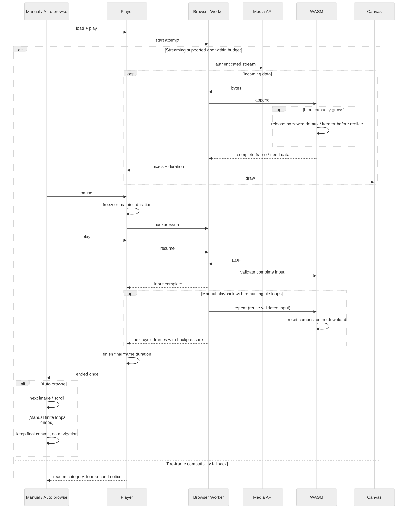

# WebP 流式播放器开发方案

## 需求与已确认决策

开发私有 workspace 包 `@pixishelf/webp-player`，默认接入 WebP 手动播放、作品详情自动滚动与适配预览自动轮播。收到完整首帧即可播放，不等待整个文件。GIF/APNG、视频保持原实现。没有构建或运行时启用开关，正常发布、更新镜像即可使用。

自动浏览下，同一媒体内暂停、设置、缩放、切后台保留当前帧与剩余时间，用户主动继续才恢复。切图、离屏卸载、切模式、关预览、退出或换作品释放；不保存跨刷新进度。自动浏览控制条负责暂停续播，动图小按钮明确为「停止本轮动图」，停止后本轮作为静态图浏览。

每张自动动图只播放一轮，末帧展示完且输入校验成功后通知推进；原文件循环次数不影响自动浏览。0–10ms 帧时长沿用当前规则解释为 100ms。缓冲不消耗播放时长，不跳过未展示帧追赶时间。

手动播放遵循原文件 ANIM 循环次数（0 为无限），使用同一 Worker 和 WASM 实例原地重置官方合成器，复用已验证的压缩输入及画布，不再次请求媒体、不缓存整段 RGBA。手动暂停沿用停止并恢复海报、再次点击从头播放的交互；自动浏览接管时创建新的单轮尝试。手动播放结束不会通知自动浏览推进。Canvas 带 `data-webp-player="wasm"`，首帧显示后 `data-frame-visible="true"`，海报 img 仍保留。

不改写归档，不新增数据库、API、服务端转码、远端代理、相邻动图预取、跨作品缓存、任意进度跳转或 npm 发布。正式浏览器验收为桌面 Chrome/Edge 与安卓 Chrome 真机。

## 架构

React 适配层负责海报、Canvas、按钮与自动浏览 store；独立 TypeScript 播放器负责时钟、状态和绘制；浏览器 Worker 负责同源媒体流、背压、WASM 生命周期；C 封装使用固定版本 libwebp 的部分 demux 和官方动画合成逻辑。

资源清单由全局 Zustand `useWebpPlayerStore` 管理，已校验版本及账号 ID 持久化到 sessionStorage，跨页面和刷新复用；不持久化请求 Promise、AbortController、媒体或认证凭证。并发初始化共用请求，组件卸载只取消自身初始化，不取消其他消费者的请求。读取失败允许后续重试；退出登录或账号变化重置缓存、取消旧请求并拒绝迟到响应。Worker/解码器初始化失败使对应资源版本失效，下次初始化重新取清单。HTTP 清单仍为 no-cache，版本化资源仍长期缓存。

`WebPAnimDecoder` 不能直接作为追加输入接口。采用 `WebPDemuxPartial`，仅解码完整帧。每次重建 demux 前释放旧 iterator，再为上一帧恢复迭代元数据；不让旧指针引用已释放的解析器。锁定上游版本的合成实现，保留许可证并与完整文件解码输出做差分测试。

媒体继续使用现有带版本参数的同源 API 与会话。SSR 不触碰浏览器 API；单线程 WASM 不依赖 SharedArrayBuffer、COOP/COEP 或 SIMD。Worker/WASM 使用同源版本化静态资源，禁止运行时 CDN。

### UML 类图

[Mermaid 源文件](./diagrams/webp-streaming-player/classes.mmd)

### UML 时序图

[Mermaid 源文件](./diagrams/webp-streaming-player/sequence.mmd)

### UML 状态图

[Mermaid 源文件](./diagrams/webp-streaming-player/states.mmd)

## 接口与生命周期

公开 `load(source)`、`play()`、`pause()`、`restart()`、`destroy()`、`getSnapshot()`、`subscribe()`；`load` 首帧可用后完成，不自动播放。加载中 `play` 登记意图，暂停冻结当前帧剩余时间，restart 新建尝试，destroy 幂等。事件为状态、首帧、完成、结构化错误；完成每次尝试最多一次。

状态包含 idle/loading/ready/playing/buffering/paused/ended/error/destroyed。完整下载前不承诺总帧数或总时长。流结束后验证 RIFF 长度与解析完成，截断不得报告 ended。网络失败需手动重试，不做自动 Range 重连。

播放实例身份由作品会话、模式、媒体资源版本、尝试号决定，暂停/继续/设置不能重建实例；store 的普通 revision 仅取消浏览驱动的旧调度。所有异步消息携带尝试身份，暂停/销毁后迟到事件不得推进。自动滚动 hook 的清理不得再顺带销毁需要续播的动图。

## 缓冲、内存与兼容

输入使用 response.body reader，媒体不调用 arrayBuffer/blob。压缩数据有上限，保留当前尝试的已接收字节；聚合小块后重建部分解析器。Worker 通过可转移缓冲给主线程，最多预解码两帧并回收输出缓冲；暂停/队列满时停止主动读取与解码，允许一次在途读取完成。

| 预算           | 移动    | 桌面    |
| -------------- | ------- | ------- |
| 压缩输入       | 32 MiB  | 64 MiB  |
| 画布像素       | 400 万  | 800 万  |
| WASM 堆        | 128 MiB | 256 MiB |
| 引擎受管总预算 | 192 MiB | 384 MiB |
| 预解码队列     | 2 帧    | 2 帧    |

预算包含 WASM 和输出缓冲、Canvas 估算，不等于浏览器进程总内存。真实头部尺寸与字节数为准。实例退出释放，不把 RGBA 全帧或媒体写入持久化缓存。

WASM/Worker/流能力不可用、初始化失败、超预算或 ICC/EXIF 元数据触发兼容回退，每次尝试最多一次。提示「当前使用兼容播放：完整加载后开始，暂停后将从头播放」。回退播放器不受新引擎预算保证。鉴权、网络、文件损坏走错误暂停；已经显示动画后内部错误不能自动突然从头播放。

## 实施阶段

1. **P0**：规格、接口、UML、合法与异常样本。
2. **P1**：固定 libwebp 1.6.0 / Emscripten 6.0.10 构建、C 封装、Worker、演示页；真实分块 HTTP 在余下文件被服务器暂扣时至少显示两帧。失败不接入应用。
3. **P2**：播放器时钟、暂停续播、背压、错误、预算、资源释放与差分测试。
4. **P3**：手动和两种自动浏览统一 WASM、文件循环次数、稳定实例身份、控制文案、旧播放器回退。
5. **P4**：CI/镜像打包、真实浏览器与安卓真机、文档、回滚证据。

工具链和来源校验固定，原生源码或工具链变化时预先编译并执行原生差分验证，将 WASM、解码器 JS、许可证及来源/产物 SHA-256 清单随仓库保存于 `prebuilt/libwebp-1.6.0/`。每次 dev/build 都校验 prebuilt，构建播放器与 Worker JS 后准备到 public；应用 Dockerfile 不再包含 Emscripten 阶段。普通 CI 不重编译 C，独立路径触发的 native 工作流验证产物可复现性。按用户确认直接默认启用，移除原启用变量及相关构建参数；兼容回退保留。回滚使用原应用镜像，无数据库或媒体恢复。

## 测试与完成标准

- 差分：有损/无损、透明、局部更新、偏移、清除、混合、单帧、短时长；任意网络分块、截断、非法尺寸/长度、预算边界及元数据回退。
- 时钟：暂停两秒无推进，继续消费原帧剩余时间；缓冲不计时；最后一帧和暂停竞争；一次 ended。
- 生命周期：StrictMode、旧消息、重试、跳过、切图、换作品、离屏、50 次创建销毁无残留 Worker/请求/缓冲。
- 应用：两种自动浏览真实联动、末张/循环、设置/缩放/后台不自行恢复、视频互斥、隐私 Canvas、回退一次及文案。
- 流式：真实 HTTP 暂扣后续字节至少两秒，释放前 Canvas 至少推进两帧；不能使用完整 buffer 延迟模拟。
- 性能：本地无网络瓶颈的 1080p/24fps/10 秒样本，播放不超过归一化时长 110%；记录设备、版本、冷/热资源、首帧与接收结束、解析/解码、缓冲和内存峰值。
- 工程：内部包 typecheck/test/build/test:browser；应用 lint/typecheck/test/提升权限 build；路径大小写、diff；生产静态资源/CSP/会话/反代流式冒烟。
- 未完成安卓真机、生产反代或镜像检查必须单列缺口，不用桌面移动视口替代，不自动生产部署。

## 实施证据

P0–P3 已实现，P4 工程构建已验证，代码已默认启用；正式发布验收仍有缺口，本 draft 不代表已上线。

### 代码落点

| 文件/目录                                                                                 | 职责                                                                |
| ----------------------------------------------------------------------------------------- | ------------------------------------------------------------------- |
| `packages/pixishelf-webp-player/native/`                                                  | 固定源码校验、部分输入 C ABI、官方合成器复用、原生差分与 ASan/UBSan |
| `packages/pixishelf-webp-player/src/worker.ts`                                            | 同源流、256 KiB / 50ms 小块聚合、两帧背压、取消                     |
| `packages/pixishelf-webp-player/src/player.ts`、`clock.ts`                                | 状态机、绘制、剩余时间、尝试隔离、一次完成                          |
| `packages/pixishelf-webp-player/scripts/`                                                 | 固定 Docker 工具链、bundle、哈希资源、演示服务、图表重建            |
| `packages/pixishelf/components/players/streaming-webp-surface.tsx`                        | React 实例生命周期、事件适配                                        |
| `packages/pixishelf/components/players/animated-webp-player.tsx`                          | 默认 WASM、海报、兼容回退、控制按钮                                 |
| `packages/pixishelf/store/use-artwork-auto-browse-store.ts` 与 `use-artwork-animation.ts` | 暂停保留占用，错误/离开释放，稳定尝试键                             |
| `build/Dockerfile`、`.github/workflows/ci.yml`                                            | 编译、交付资源和 CI 验证                                            |

### 2026-09-23 本机验证

- Windows x64，Intel i7-13700H、20 逻辑线程、64 GiB；Node 22.17.0。Docker 构建使用 Node 20。
- 固定 libwebp 1.6.0，源码 SHA-256 `e4ab7009bf0629fd11982d4c2aa83964cf244cffba7347ecd39019a9e38c4564`；Emscripten 6.0.10 镜像 digest 固定于 `native/toolchain.json`，日常应用构建不使用该镜像。
- 原生 ASan/UBSan 差分通过：空输入、按 1/7/127 字节喂入、有损/无损/透明/局部/清除/混合、短帧、截断、压缩预算。与官方完整输入解码逐帧像素一致。
- 包 typecheck、9 项单元测试、build 通过；真实 Edge 153.0.4234.48 和 Chrome 153.0.8010.53 各 11 项浏览器测试通过。真实 HTTP 先发两帧后暂扣 2.5 秒，释放前已推进到第二帧且进入缓冲；验证一次完成、暂停、鉴权、网络断流、截断、元数据/预算以及 50 次创建销毁。
- 合成 1080p/24fps（240 帧）无重负载并发时，Edge 9990.5ms，Chrome 9992.2ms。与主应用全量测试并发时曾达到 12446.8ms，超过门槛；因此不承诺高 CPU 压力下仍按原速播放。
- 主应用 lint、typecheck 通过；完整测试 330 文件、2067 项通过，20 文件、129 项 PostgreSQL 条件测试跳过。新增 8 项联动用真实播放器/时钟/React/store/两种驱动，仅替换 Worker 传输、Canvas、布局环境。
- 初版启用流式播放的提升权限 Next production build 和完整 Docker production 镜像构建通过；镜像 `pixishelf:webp-validation` 只用于本地验证，没有部署。无业务挂载、无网络的 UID 1001 容器验证资源哈希、WASM 字节码及许可证通过：版本 `72920e0b425f4d3e`，WASM 135801 字节。镜像构建因没有运行时认证环境而输出 Better Auth 配置警告，不把构建成功当作业务运行验收。
- UML 的 `.mmd` 与 `.svg` 均落盘，并渲染检查。路径大小写与 diff 检查通过。

### 预编译交付调整

- 解码器 JS/WASM、许可证与 manifest 已落盘到 `packages/pixishelf-webp-player/prebuilt/libwebp-1.6.0/`，合计约 145 KiB，随源码纳入版本管理。Git 不转换产物换行，格式化工具跳过该目录。
- 普通应用和镜像构建校验并复制 prebuilt，不读取本地 `dist/native`，不拉取 Emscripten、不编译 C。CI 原生复编译拆到按路径触发的 `webp-native.yml`。
- 新增 5 项校验测试覆盖产物损坏、源码过期、跨平台换行、工具链不匹配及许可证缺失，全部通过；包类型检查、9 项单元测试和 11 项 Edge 浏览器测试通过，1080p 合成样本播放耗时 9991.8ms。
- `build:native --check` 的原生差分、ASan/UBSan 与四个产物逐字节复编译对比通过；固定工具链非 root 编译探针通过。应用 lint、完整测试与开启开关的 Next production build 再次通过。
- 新生产镜像 `pixishelf:webp-prebuilt-validation` 构建通过，Docker 上下文排除本地 dist/cache/public 生成目录，构建仅使用 Node 基础镜像。离线 UID 1001 容器中的资源版本哈希、WASM SHA-256/字节码和许可证验证通过，资源版本仍为 `72920e0b425f4d3e`。没有部署或启动业务入口。

### 手动播放扩展验证

手动 WASM 扩展的本机验证：新增 7 项应用用例覆盖两个手动按钮入口、外部控制转单轮、兼容回退和格式/开关边界；与原播放器用例合计 29 项定向检查通过。原生 ASan/UBSan 增加多轮像素差分和有限循环终止检查，全部通过。14 项 Edge 浏览器测试通过，包含首轮 EOF 前播放、跨轮仅一个 HTTP 请求和 Worker、循环 1/2 次结束，以及原有性能门槛（9992.8ms）。新的预编译 WASM 为 135953 字节，运行资源版本 `22e63013e962eca9`；原生资源已更新，日常启动仍无需编译 C。类图与时序图的源文件和 SVG 已同步落盘。

本次扩展最终检查：主应用 lint 通过，完整单元测试 2074 项通过、129 项 PostgreSQL 条件测试跳过；开启开关的 Next production build（含类型检查）通过。构建输出已有批量导入服务动态文件路径匹配过宽的警告，与播放器改动无关。路径命名和 diff 检查通过；本次没有重新部署或执行远端 CI。

### 会话清单缓存验证

Zustand store、认证边界和播放器联动合计 42 项定向用例通过，覆盖并发合并、失败重试、sessionStorage 恢复、存储不可用、账号切换、退出登录、迟到响应、StrictMode、组件卸载和资源初始化失效。主应用 lint 通过；全量测试 2086 项通过、129 项 PostgreSQL 条件测试跳过，报告服务的一个用例触发 5 秒超时，随后单独重跑该文件 4 项全通过（超时用例耗时 422ms）。缓存类图的 `.mmd` 与 SVG 已更新并渲染检查。

会话缓存最终构建（含 TypeScript 检查）已通过；仍有上述批量导入路径扫描警告。修正请求身份比较的类型检查问题后，42 项定向用例再次通过，路径命名和 diff 检查通过。未修改原生解码器或预编译文件。

### 默认启用交付验证

按用户要求删除启用变量：播放器默认进入 WASM，dev/build 无条件准备预编译资源，Dockerfile 和 CI 均无需开关。35 项播放器定向用例通过；预览页兼容回退的 15 项测试、浏览页默认创建 WASM Canvas 的 4 项测试分别通过。lint 和不带 WebP 参数的 Next production build（含类型检查）通过，仍有上述已有路径扫描警告。

全量测试完成：2082 项通过，129 项 PostgreSQL 条件测试跳过；另有 4 项旧 `img` 播放断言失败，涉及上述预览页和浏览页两个文件。已将旧播放时钟测试明确设为兼容回退，并将浏览页播放入口改为验证默认 WASM Canvas；修正后两个文件的 19 项测试全部通过，未再次重复全量测试。

不传 WebP build-arg 的生产镜像 `pixishelf:webp-default-validation` 构建通过。使用 `--network none`、覆盖 entrypoint 的 UID 1001 容器验证资源版本哈希、预编译 WASM SHA-256、字节码与许可证通过：版本 `22e63013e962eca9`，WASM 135953 字节。验证未运行业务入口或数据库迁移；生产会话与反代检查仍见下方缺口。普通构建仍只校验、复制预编译解码器并打包 JS，不编译 C。

### 剩余发布门槛

1. Android Chrome 真机：`adb devices` 没有已连接设备，未用移动视口代替；须覆盖触摸/缩放/后台恢复和实际设备内存。
2. 带真实登录会话、反向代理的作品详情端到端：检查流是否被代理缓存、同源 Worker/WASM 的 MIME/CSP/会话、真实收藏、隐私遮罩和导航释放。
3. 完整性能剖析：冷/热资源分别记录首帧/接收结束、demux/解码耗时与浏览器/受管内存峰值。当前记录仅证明合成样本的播放时间和资源边界测试，不能等同于全机内存验收。
4. CI 工作流已经更新，但尚未在远端 GitHub Actions 执行。

以上为尚未完成的设备和环境验证，不再以配置开关阻止使用。开发直接运行 `pnpm --filter @pixishelf/next dev`；无需环境变量或原生编译，不在仓库根目录运行无过滤的 `pnpm dev`。镜像验证使用 `docker build -f build/Dockerfile .`，普通发布镜像即包含并默认启用播放器。仅修改原生实现时执行 `pnpm --filter @pixishelf/webp-player build:native` 并提交预编译产物，使用 `build:native --check` 复核字节一致性。回滚使用原应用镜像，无数据库/媒体恢复操作。
