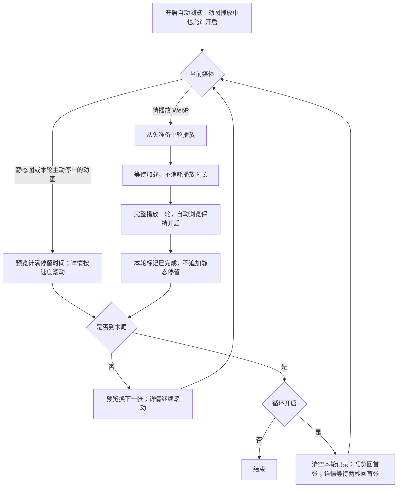
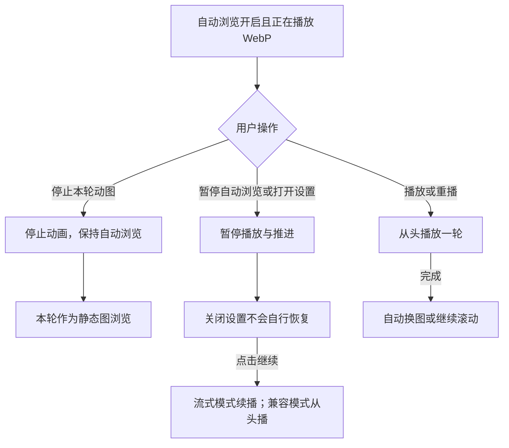
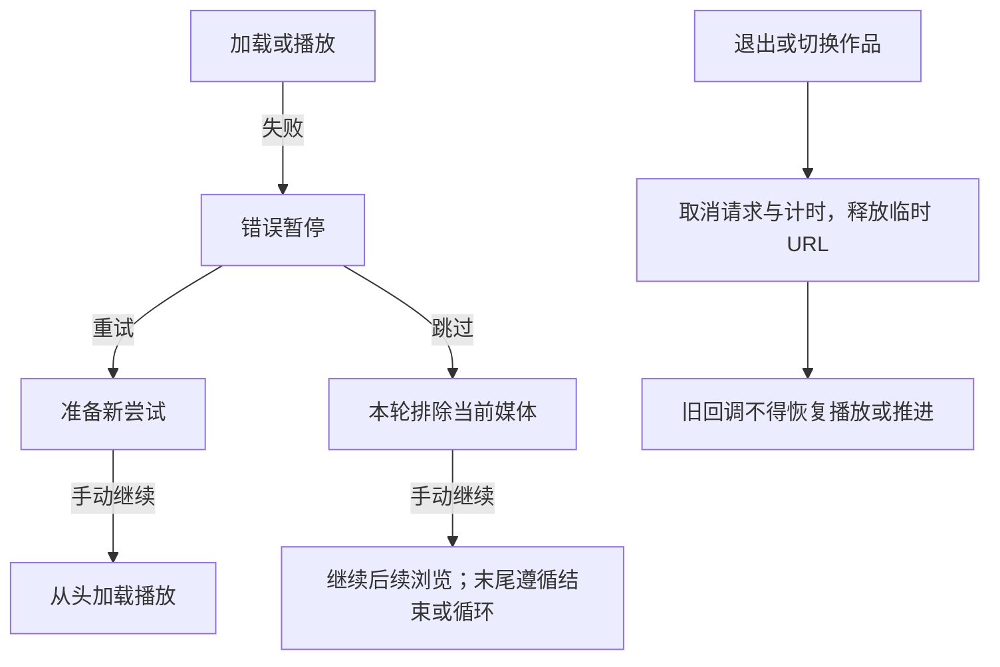

# 作品详情页自动浏览

## 入口与范围

作品详情通过图片长按菜单（桌面也可右键）提供「自动滚动」，顶部不再提供自动浏览模式选择。滚动从当前阅读位置继续，位于图片区以外时回到图片起点；启动时自动展开原来折叠的媒体，仍只挂载视口附近内容。自动轮播及其设置仅在点图进入的适配预览内部提供，保持整图适配和既有媒体顺序，不针对长图做额外移动或识别。

轮播仅包含现有适配预览支持的非视频媒体，少于两张时不可启动；纯视频作品不显示可用的自动浏览入口。轮播从预览内当前图片开始。旧全屏原文件预览、独立沉浸浏览、跨作品连播及阅读进度存档不在此功能范围。

## 控制与默认值

用户偏好页提供「作品初始展示数量」，滑块与数字输入支持 1–100 整数，默认 10。图片、动图、视频均计一项。设数量为 N，作品总数不超过 `N + floor(N × 25%)` 时自然全显，不提供收起；超过时初始显示前 N 项。容差无上限，例如 20/25、100/125 均全显。独立 Zustand store 使用 `pixishelf-artwork-detail-settings` 保存此浏览器偏好，完成恢复后再挂载列表；不跨设备同步，不保存作品展开状态。

右下角计数入口采用 Dock 式导航：点击同时显示竖直页码和左上弧形的展开/收起、回顶部图标。页码沿用账户的刻度间隔设置，关闭刻度仍保留功能图标；自然全显时隐藏展开/收起。完成操作、点击外部或 Escape 关闭。自动滚动控制条复用相同导航。列表末尾也提供展开/收起按钮。收起停止自动滚动并取消待执行跳转，定位到前 N 项末尾的展开入口；回顶部只暂停滚动，不改变展开状态。展开不写入 history；选页越界、预览返回越界和启动自动滚动仍可自动展开，列表保持虚拟化。重新进入或切换作品重置展开状态。

详情及适配预览右下角动图按钮的可见胶囊高 22 像素，点击热区至少 44 像素。详情自动滚动与适配预览自动轮播遇到已识别的 WebP 动图时会自动播放一轮；未开启自动浏览时及 GIF/APNG 仍手动播放。

WebP 手动播放和自动浏览默认通过 WASM/Canvas 流式播放，无需配置启用变量。手动播放遵循文件循环次数，在同一解码器内复用压缩输入，无须逐轮下载；暂停恢复海报，再次点击从头开始。自动浏览接管后从头播放一轮；手动结束不会推进自动浏览。首帧前不兼容时可回退并展示提示，GIF/APNG 仍沿用原播放器。

详情中的视频（包含单视频作品）由有效阅读视口中心选择当前媒体，同时最多一个自动播放。优先有声播放，浏览器拒绝后静音重试；仍失败时保留手动播放，资源错误不自动重试。离屏、后台、打开适配预览时暂停，重新可见可续播；手动暂停按媒体 ID 记到离开当前作品，虚拟列表重新挂载不清除该意图。可见性改变不重建播放器。自动滚动遇到视频时暂停并播放，需手动继续，播完不自动滚动；原始文件预览页不启用此策略。

启动后右下角显示半透明单行控制条，包含暂停/继续、当前张数、设置和退出（详情列表）；详情列表的张数入口复用原媒体快捷导航。播放中 4 秒无操作后，控制条以 240ms 动画收起为右侧小按钮，保留播放/等待图标和张数；点击展开不暂停播放，也可手动收起。键盘焦点仍在控制条内时不自动收起，减少动态效果偏好下取消收缩动画。

暂停、出错和结束时自动展开；正常播放不显示额外提示行。适配预览不再显示底部常驻手势说明；动图播放与自动浏览控制在右下角横向排列，保留不支持播放时的静态预览标记。详情页媒体上的动图播放按钮位于图片右下角，触摸区域至少 44 像素高。手机避开主导航与安全区。预览的设置浮层挂载在预览内部，等待加载时可从设置中选择重试或跳过。

| 设置         | 默认       | 调整                                   |
| ------------ | ---------- | -------------------------------------- |
| 滚动速度     | 50 像素/秒 | 慢/中/快 50/100/200；50–800，步长 50   |
| 单张停留     | 1.5 秒     | 慢/中/快 3/1.5/0.5；0.5–3，步长 0.5 秒 |
| 循环当前作品 | 关闭       | 手动开关                               |

自动浏览 store 只保存上述三项偏好；初始展示数量由独立详情偏好 store 保存。已有滚动速度会限制在新范围并取最近的 50 像素/秒档位；轮播间隔限制在 0.5–3 秒并取最近的 0.5 秒档位。每次进入详情仍需手动启动自动滚动或轮播。设置面板打开即暂停，修改后手动继续；继续轮播重新计满单张停留时间。

## 暂停、等待与结束

- 两种自动模式互斥。手动滚动、内容区触摸、换图、缩放、导航、其他媒体播放、打开设置/菜单或切后台立即暂停；WebP 播放按钮属于自动浏览协同控制，不触发手动暂停，不因关闭弹层、恢复前台或图片随后加载完成自行恢复。
- 浏览已启动且焦点不在输入框、控件或播放器时，空格切换暂停/继续。放大图片时必须缩小后才能继续轮播。
- 滚动等待有效阅读视口内的图片/静态海报显示就绪；轮播在当前图片显示就绪且翻页动画结束后计时。失败后暂停并提供重试和跳过，均需用户再点继续。
- 滚动到视频阅读位置时暂停；用户点继续后允许经过该视频，下一轮循环重新暂停。
- 自动滚动按阅读顺序停在已识别的 WebP 动图处，将其尽量居中，加载完成后播放完整一轮再继续；每张每轮只播放一次，末张播放完才结束，循环作品时重新播放。等待加载不消耗播放时长。静态和未识别的 WebP 仍按静态预览滚动，不自动请求动画原文件。
- WebP 自动播放期间不播放相邻视频。默认 WASM 流式路径在同图暂停、设置、缩放和切后台时保留当前帧及剩余时间；用户主动继续才恢复。仅兼容回退路径需完整加载后播放，暂停后从头开始。离屏、切图、切模式、关预览、退出及换作品释放进度。请求或解码错误暂停，重试/跳过仍需手动继续。
- 滚动终点是媒体区域底部，不是整个文档底部。最终图片须显示就绪，实际尺寸须可测量。默认到尾结束；开启循环后，滚动在底部停留两秒回首张，轮播在末张完成停留后回首张。
- 退出适配预览时立即取消轮播，按媒体 ID 映射回完整列表并定位，不将轮播转为页面自动滚动；若页面滚动暂停后进入预览且未改为轮播，返回时保留暂停控制条。退出自动浏览收起控制条并恢复原张数入口。

## 状态与实现边界

`useArtworkAutoBrowseStore` 统一管理作品、会话、模式、运行阶段、当前媒体、暂停原因和偏好，不使用新增 Context。`persist` 只保存偏好；挂载先恢复偏好再初始化会话，存储内容不能覆盖运行状态或动作。切换作品、离开详情清空运行状态并使旧会话失效。

执行 hook 持有 DOM、Swiper、帧与定时器；WebP 单轮完成由播放器统一报告，详情不再轮询 DOM 时长。连续滚动按帧时间差推进，保留小数累积并限制单帧最大增量；轮播使用可取消的单次定时器。用户输入与程序产生的滚动/翻页事件分开处理。媒体加载结果按资源版本区分，卸载或重试前的解码回调不能解除新一轮等待。

兼容路径通过现有媒体地址按需读取 WebP 原文件，在内存中生成循环次数为 1 的 Blob 副本，并汇总 ANMF 帧时长；不写回归档文件。图片元素加载成功后开始按总帧时长等待，临时 URL 确保每次从首帧播放。依据 [WebP 容器规范](https://developers.google.com/speed/webp/docs/riff_container)，0–10ms 帧延时由浏览器自行解释，因此临时副本统一将其改为常见的 100ms，并以同样时长计时。停止或卸载时取消请求、释放 Blob URL，旧请求不能恢复新会话的播放。实验性流式路径见下文。

适配预览提前加载前一张、后两张符合流量预算的图片。WebP/GIF 预加载的是静态海报；WebP 原文件仅在当前媒体手动播放或自动浏览单轮播放时请求。已确认的 WebP 动图在相邻页与当前页使用同一个播放器海报节点和 URL，不在切页时替换图片资源；海报解码完成后才允许轮播计时。节省流量模式、慢速网络和超出预算的媒体仍不主动预取。

不新增 API、数据库字段或网络访问范围，不改变媒体权限及隐私遮罩。流式播放使用私有 workspace 库及构建依赖；回滚使用原应用镜像，浏览器残留的偏好键不参与旧功能行为。

## 验证

状态测试覆盖互斥、持久化白名单、异常设置、视频继续、会话重置。执行 hook 测试使用可控时钟和布局，覆盖加载/动画等待、暂停恢复、末页与循环、低速小数累积、长帧限制及清理。原有详情测试继续保护折叠/虚拟化、媒体过滤、长按和关闭回定位。

自动浏览原始交付时，在本地真实浏览器中以隐私模式验证了桌面和手机布局、自动滚动、手动接管、轮播到尾、循环、设置浮层及关闭回定位。75 张图片的作品启动后自动展开，滚动到第 28 张时只挂载附近 7 张；混合视频和失败重试边界由自动化测试覆盖。

预加载修复补充了海报节点与 URL 保持不变、解码前不计时的组件回归测试。390 × 844 浏览器视口下，75 张作品的首张及连续轮播至第 12 张均确认后两张已加载；该检查不等同于安卓真机滑动验证。

WebP 自动滚动补充了单轮副本与帧时长解析、短帧延时归一化、损坏数据拒绝、加载等待、暂停重播、循环和失败跳过测试，以及取消请求和释放 URL 的组件测试。

## WebP 与自动浏览协同交互

自动浏览决定何时继续阅读，动图播放决定当前图的内部动画；两者可以同时开启。仅已识别的 WebP 参与单轮协同，静态及未识别 WebP 按静态图处理，GIF/APNG、视频与原站预览规则不变。

### 正常流程

### 用户操作

| 操作                                 | 结果                                                             |
| ------------------------------------ | ---------------------------------------------------------------- |
| 手动播放中开启自动浏览               | 接管当前播放，从头播放可计时的一轮，完成后继续                   |
| 自动浏览中点击播放或重播             | 保持自动浏览开启，从头播放一轮；覆盖当前图本轮静态处理标记       |
| 点击「停止本轮动图」                 | 回到海报，本轮不自动重播；预览重新计满静态停留时间，详情继续滚动 |
| 未开启或已暂停自动浏览时播放         | 只操作动图，不开启或恢复自动浏览                                 |
| 暂停自动浏览、打开设置、缩放或切后台 | 暂停推进；流式模式保留同图剩余时间，兼容模式继续时从头播放       |
| 切图、离屏、切换模式或导航           | 释放当前动图进度，旧完成通知失效                                 |
| 关闭设置、恢复前台、缩小图片         | 不自动恢复；用户明确点击继续                                     |
| 加载或解析失败                       | 错误暂停，保留海报；重试或跳过后仍需手动继续                     |
| 退出、关闭预览或切换作品             | 取消请求、计时与推进，释放 Blob URL，旧完成通知失效              |

### 状态、完成判定与验收

默认流式模式由 `@pixishelf/webp-player` 管理同源 Worker、libwebp WASM 和 Canvas。完整帧可用即绘制，缓冲不消耗展示时长；合法 EOF 和末帧时间同时满足才完成。实例键不包含普通 store revision。首帧前的能力、初始化、预算、ICC/EXIF 限制可回退一次，并提示「当前使用兼容播放：完整加载后开始，暂停后将从头播放」；鉴权、网络、损坏或已出帧后的错误不自动重播。规格、UML 和证据见[开发方案](../design/webp-streaming-player.md)。下述 Blob 计时机制仅适用于兼容路径。

控制条区分等待加载、正在播放动图、静态浏览、暂停、错误及结束。播放中始终允许暂停自动浏览；WebP 按钮不随控制条折叠消失。设置仍暂停自动浏览，不因修改设置或关闭面板自动恢复。

原生图片不提供可靠的播放结束事件：播放器在单轮 Blob 加载成功后按解析帧时长计时，完成通知每次尝试最多一次。会话、媒体资源版本和尝试编号隔离旧任务；暂停、重试、离开或资源变化取消计时。播放完成、用户停止动画与错误跳过分别记录，只存在当前会话；循环和重新开始清除本轮记录。回调引用变化不能重启请求或计时。

回归需同时覆盖播放器与两个执行器的真实联动（仅模拟网络、时间和布局），而非仅设置 DOM 状态；覆盖加载不计时、播放中开启、停止转静态、暂停恢复、末张/循环、错误重试/跳过、过期回调、StrictMode 与资源释放。真实 WebP 浏览器验收另行记录，不以模拟测试替代。无 API/数据库变更，不改写归档文件；虚拟列表 React #185 修复独立保留和验证。

2026-09-23 协同补全验证：主应用 `pnpm lint`、`pnpm typecheck`、`pnpm test`、提升权限的 `pnpm build` 均通过。全量测试 327 个文件、2,051 项通过，20 个 PostgreSQL 测试文件、129 项按现有环境条件跳过；Windows 符号链接测试使用提升权限执行。路径大小写检查与 `git diff --check` 通过。本次未完成真实作品的浏览器验收：本地应用服务未运行，生产页面需要登录；上述联动测试采用模拟网络、时钟和布局，不等同于生产作品 18939 或移动真机验收，也未执行生产部署。
