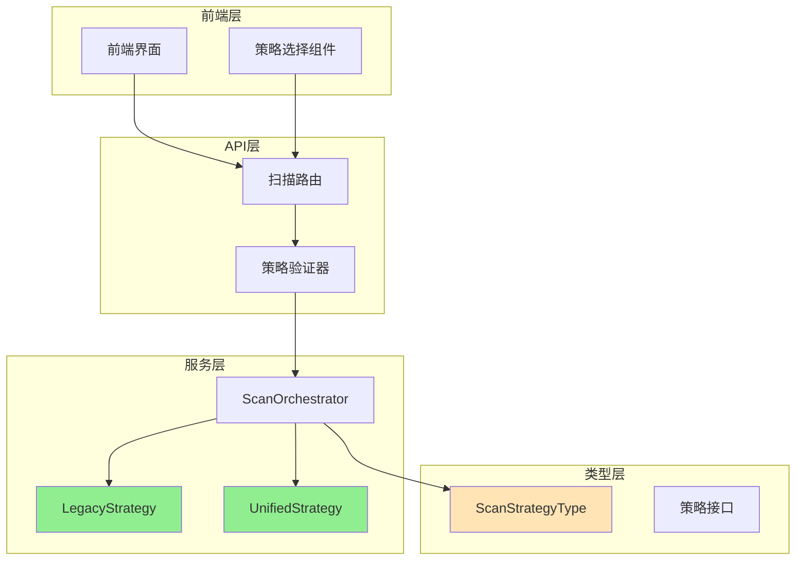
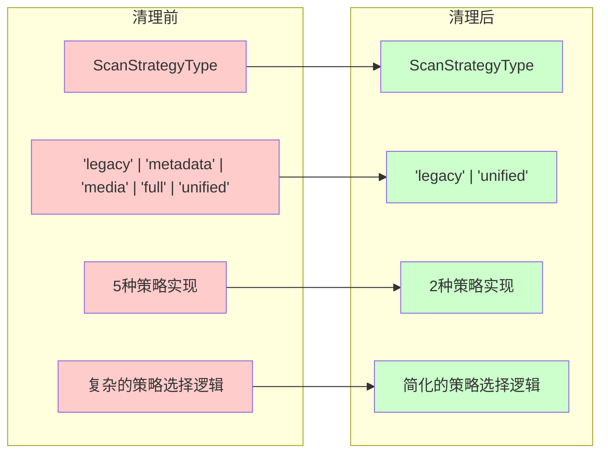
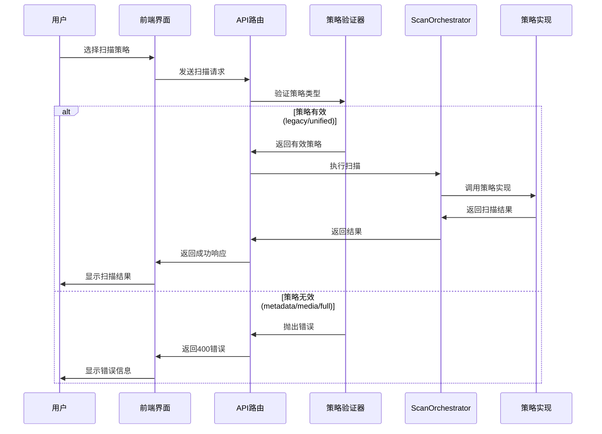

# 扫描策略清理 - 架构设计文档

## 设计概述

基于用户确认的决策点，设计移除 `metadata`、`media`、`full` 三种扫描策略的完整架构方案，只保留 `legacy` 和 `unified` 策略。

## 用户决策确认

- ✅ **默认策略**: `unified`
- ✅ **错误处理**: 返回 `400 Bad Request` 并说明策略不支持
- ✅ **兼容性**: 完全移除，不保留任何兼容性
- ✅ **配置迁移**: 自动迁移到默认策略

## 系统架构设计

### 整体架构图



### 清理前后对比



## 分层设计

### 1. 类型定义层

#### 修改前
```typescript
type ScanStrategyType = 'metadata' | 'media' | 'full' | 'legacy' | 'unified'
```

#### 修改后
```typescript
type ScanStrategyType = 'legacy' | 'unified'
```

#### 影响文件
- `packages/shared/src/types/metadata.ts`
- `packages/shared/dist/index.d.ts`

### 2. 策略实现层

#### 需要删除的文件
```
packages/api/src/services/scanner/
├── MetadataScanStrategy.ts  ❌ 删除
├── MediaScanStrategy.ts     ❌ 删除
├── FullScanStrategy.ts      ❌ 删除
├── LegacyStrategy.ts        ✅ 保留
└── UnifiedScanStrategy.ts   ✅ 保留
```

#### ScanOrchestrator 清理
```typescript
// 删除导入
- import { MetadataScanStrategy } from './MetadataScanStrategy'
- import { MediaScanStrategy } from './MediaScanStrategy'
- import { FullScanStrategy } from './FullScanStrategy'

// 简化策略注册
private initializeStrategies(): void {
  this.strategies.set('legacy', new LegacyStrategy(...))
  this.strategies.set('unified', new UnifiedScanStrategy(...))
  
  // 设置默认策略为 unified
  this.currentStrategy = this.strategies.get('unified')!
}
```

### 3. API路由层

#### 策略验证逻辑
```typescript
// 在 scan.ts 路由中添加策略验证
function validateScanStrategy(scanType: string): ScanStrategyType {
  const validStrategies: ScanStrategyType[] = ['legacy', 'unified']
  
  if (!validStrategies.includes(scanType as ScanStrategyType)) {
    throw new Error(`Unsupported scan strategy: ${scanType}. Supported strategies: ${validStrategies.join(', ')}`)
  }
  
  return scanType as ScanStrategyType
}
```

#### 错误处理
```typescript
// 返回 400 Bad Request
reply.code(400).send({
  statusCode: 400,
  error: 'Bad Request',
  message: `Scan strategy '${scanType}' is not supported. Available strategies: legacy, unified`
})
```

### 4. 前端界面层

#### 策略选择组件更新
```typescript
// 更新策略选项
const AVAILABLE_STRATEGIES: ScanStrategyType[] = ['legacy', 'unified']

// 策略显示名称
const STRATEGY_LABELS = {
  legacy: '传统扫描',
  unified: '统一扫描'
}

// 策略描述
const STRATEGY_DESCRIPTIONS = {
  legacy: '传统的扫描方式，稳定可靠',
  unified: '新的统一扫描方式，性能更好，推荐使用'
}
```

## 核心组件设计

### 1. 策略验证器

```typescript
export class StrategyValidator {
  private static readonly VALID_STRATEGIES: ScanStrategyType[] = ['legacy', 'unified']
  private static readonly DEFAULT_STRATEGY: ScanStrategyType = 'unified'
  
  static validate(strategy: string): ScanStrategyType {
    if (!this.VALID_STRATEGIES.includes(strategy as ScanStrategyType)) {
      throw new UnsupportedStrategyError(
        `Strategy '${strategy}' is not supported. Available: ${this.VALID_STRATEGIES.join(', ')}`
      )
    }
    return strategy as ScanStrategyType
  }
  
  static getDefault(): ScanStrategyType {
    return this.DEFAULT_STRATEGY
  }
  
  static migrateStrategy(oldStrategy: string): ScanStrategyType {
    const removedStrategies = ['metadata', 'media', 'full']
    if (removedStrategies.includes(oldStrategy)) {
      return this.DEFAULT_STRATEGY
    }
    return this.validate(oldStrategy)
  }
}
```

### 2. 配置迁移器

```typescript
export class ConfigMigrator {
  static migrateStrategyConfig(config: any): any {
    if (config.scanType && !['legacy', 'unified'].includes(config.scanType)) {
      const oldStrategy = config.scanType
      config.scanType = 'unified'
      
      console.warn(
        `Strategy '${oldStrategy}' is no longer supported. ` +
        `Automatically migrated to 'unified' strategy.`
      )
    }
    
    if (config.defaultStrategy && !['legacy', 'unified'].includes(config.defaultStrategy)) {
      const oldStrategy = config.defaultStrategy
      config.defaultStrategy = 'unified'
      
      console.warn(
        `Default strategy '${oldStrategy}' is no longer supported. ` +
        `Automatically migrated to 'unified' strategy.`
      )
    }
    
    return config
  }
}
```

## 数据流向图



## 异常处理策略

### 1. 策略不支持错误

```typescript
class UnsupportedStrategyError extends Error {
  constructor(strategy: string) {
    super(`Scan strategy '${strategy}' is not supported`)
    this.name = 'UnsupportedStrategyError'
  }
}
```

### 2. API错误响应格式

```typescript
interface StrategyErrorResponse {
  statusCode: 400
  error: 'Bad Request'
  message: string
  availableStrategies: ScanStrategyType[]
  suggestedStrategy: ScanStrategyType
}
```

### 3. 前端错误处理

```typescript
// 错误处理逻辑
if (error.response?.status === 400 && error.response?.data?.availableStrategies) {
  const { availableStrategies, suggestedStrategy } = error.response.data
  
  showErrorMessage(
    `所选策略不支持。可用策略：${availableStrategies.join('、')}。` +
    `建议使用：${suggestedStrategy}`
  )
  
  // 自动切换到建议策略
  setSelectedStrategy(suggestedStrategy)
}
```

## 接口契约定义

### 1. 策略验证接口

```typescript
interface IStrategyValidator {
  validate(strategy: string): ScanStrategyType
  getAvailableStrategies(): ScanStrategyType[]
  getDefaultStrategy(): ScanStrategyType
  isSupported(strategy: string): boolean
}
```

### 2. 配置迁移接口

```typescript
interface IConfigMigrator {
  migrateStrategy(oldStrategy: string): ScanStrategyType
  migrateConfig(config: any): any
  needsMigration(config: any): boolean
}
```

### 3. 扫描策略接口（保持不变）

```typescript
interface IScanStrategy {
  readonly name: ScanStrategyType
  readonly description: string
  execute(options: ExtendedScanOptions): Promise<ExtendedScanResult>
  validate(options: ExtendedScanOptions): ValidationResult
  getEstimatedDuration(options: ExtendedScanOptions): Promise<number>
}
```

## 性能优化设计

### 1. 策略选择优化

```typescript
// 使用 Map 替代 if-else 链
class OptimizedStrategySelector {
  private static readonly STRATEGY_MAP = new Map<ScanStrategyType, () => IScanStrategy>([
    ['legacy', () => new LegacyStrategy(...)],
    ['unified', () => new UnifiedScanStrategy(...)]
  ])
  
  static getStrategy(type: ScanStrategyType): IScanStrategy {
    const factory = this.STRATEGY_MAP.get(type)
    if (!factory) {
      throw new UnsupportedStrategyError(type)
    }
    return factory()
  }
}
```

### 2. 缓存策略实例

```typescript
class StrategyCacheManager {
  private static cache = new Map<ScanStrategyType, IScanStrategy>()
  
  static getStrategy(type: ScanStrategyType): IScanStrategy {
    if (!this.cache.has(type)) {
      this.cache.set(type, OptimizedStrategySelector.getStrategy(type))
    }
    return this.cache.get(type)!
  }
}
```

## 兼容性保证

### 1. API版本控制

```typescript
// 在响应头中标识API版本
reply.header('X-API-Version', '2.0')
reply.header('X-Supported-Strategies', 'legacy,unified')
```

### 2. 渐进式错误信息

```typescript
const ERROR_MESSAGES = {
  metadata: 'Metadata-only scanning has been merged into unified scanning for better performance.',
  media: 'Media-only scanning has been merged into unified scanning for better consistency.',
  full: 'Full scanning has been replaced by unified scanning with improved architecture.'
}
```

## 监控和日志

### 1. 策略使用统计

```typescript
class StrategyMetrics {
  private static usage = new Map<ScanStrategyType, number>()
  
  static recordUsage(strategy: ScanStrategyType): void {
    const count = this.usage.get(strategy) || 0
    this.usage.set(strategy, count + 1)
  }
  
  static getUsageStats(): Record<ScanStrategyType, number> {
    return Object.fromEntries(this.usage)
  }
}
```

### 2. 迁移日志

```typescript
class MigrationLogger {
  static logStrategyMigration(from: string, to: ScanStrategyType): void {
    console.info(`Strategy migration: ${from} -> ${to}`, {
      timestamp: new Date().toISOString(),
      fromStrategy: from,
      toStrategy: to,
      reason: 'Strategy no longer supported'
    })
  }
}
```

## 测试策略

### 1. 单元测试覆盖

- ✅ 策略验证器测试
- ✅ 配置迁移器测试
- ✅ 错误处理测试
- ✅ ScanOrchestrator 简化后测试

### 2. 集成测试

- ✅ API路由错误处理测试
- ✅ 前端策略选择测试
- ✅ 端到端扫描流程测试

### 3. 性能测试

- ✅ 策略选择性能对比
- ✅ 内存使用优化验证
- ✅ 响应时间基准测试

## 部署策略

### 1. 分阶段部署

1. **第一阶段**: 更新类型定义，保持向后兼容
2. **第二阶段**: 添加策略验证和错误处理
3. **第三阶段**: 删除策略实现文件
4. **第四阶段**: 更新前端界面
5. **第五阶段**: 清理测试和文档

### 2. 回滚方案

- 保留策略实现文件的备份
- 维护类型定义的版本历史
- 准备快速恢复脚本

## 质量保证

### 1. 代码质量检查

- ✅ TypeScript 编译无错误
- ✅ ESLint 规则通过
- ✅ 单元测试覆盖率 > 90%
- ✅ 集成测试全部通过

### 2. 功能验证

- ✅ `legacy` 策略正常工作
- ✅ `unified` 策略正常工作
- ✅ 删除策略返回正确错误
- ✅ 配置自动迁移正常

### 3. 性能验证

- ✅ 策略选择性能提升
- ✅ 内存使用优化
- ✅ API响应时间不变或改善

## 风险评估

### 高风险
- ❌ 无，因为只保留稳定的策略

### 中风险
- ⚠️ 前端界面需要同步更新
- ⚠️ 现有配置文件需要迁移

### 低风险
- ℹ️ 文档和示例需要更新
- ℹ️ 监控指标可能需要调整

## 成功标准

### 功能标准
- ✅ 只支持 `legacy` 和 `unified` 两种策略
- ✅ 删除策略的API调用返回400错误
- ✅ 配置文件自动迁移到 `unified`
- ✅ 前端界面只显示支持的策略

### 性能标准
- ✅ 策略选择性能提升 > 20%
- ✅ 内存使用减少 > 10%
- ✅ API响应时间不增加

### 质量标准
- ✅ 代码覆盖率 > 90%
- ✅ 所有测试通过
- ✅ 文档完整更新
- ✅ 无TypeScript编译错误

这个架构设计为下一阶段的任务分解提供了完整的技术方案和实施指导。