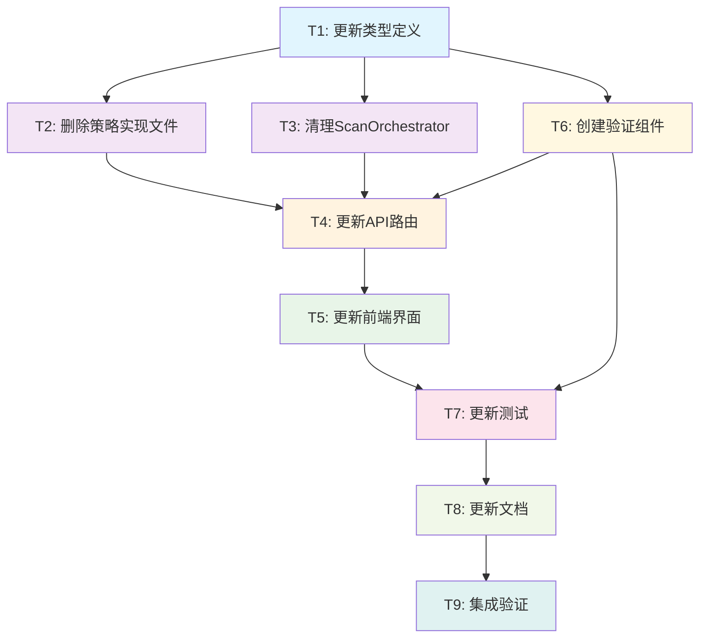

# 扫描策略清理 - 任务分解文档

## 任务概述

基于架构设计，将扫描策略清理工作分解为可独立执行的原子任务，确保每个任务都有明确的输入输出契约和验收标准。

## 任务依赖图

## 任务详细分解

### T1: 更新类型定义

#### 输入契约
- **前置依赖**: 无
- **输入数据**: 现有的 `ScanStrategyType` 定义
- **环境依赖**: TypeScript 编译环境

#### 输出契约
- **输出数据**: 更新后的类型定义文件
- **交付物**: 
  - `packages/shared/src/types/metadata.ts` (更新)
  - `packages/shared/dist/index.d.ts` (重新生成)
- **验收标准**:
  - ✅ `ScanStrategyType` 只包含 `'legacy' | 'unified'`
  - ✅ TypeScript 编译无错误
  - ✅ shared 包构建成功

#### 实现约束
- **技术栈**: TypeScript
- **接口规范**: 保持现有接口结构
- **质量要求**: 类型安全，无破坏性变更

#### 具体任务
1. 修改 `packages/shared/src/types/metadata.ts`
2. 更新 `ScanStrategyType` 类型定义
3. 重新构建 shared 包
4. 验证类型定义正确性

---

### T2: 删除策略实现文件

#### 输入契约
- **前置依赖**: T1 完成
- **输入数据**: 现有策略实现文件
- **环境依赖**: 文件系统访问权限

#### 输出契约
- **输出数据**: 清理后的策略文件结构
- **交付物**: 删除以下文件
  - `packages/api/src/services/scanner/MetadataScanStrategy.ts`
  - `packages/api/src/services/scanner/MediaScanStrategy.ts`
  - `packages/api/src/services/scanner/FullScanStrategy.ts`
- **验收标准**:
  - ✅ 指定文件已删除
  - ✅ 无残留的导入引用
  - ✅ Git 历史记录保留

#### 实现约束
- **技术栈**: 文件系统操作
- **接口规范**: 不影响其他文件
- **质量要求**: 确保删除完整，无遗漏

#### 具体任务
1. 备份要删除的文件
2. 删除 `MetadataScanStrategy.ts`
3. 删除 `MediaScanStrategy.ts`
4. 删除 `FullScanStrategy.ts`
5. 验证删除完整性

---

### T3: 清理ScanOrchestrator

#### 输入契约
- **前置依赖**: T1 完成
- **输入数据**: 现有 `ScanOrchestrator.ts` 文件
- **环境依赖**: TypeScript 编译环境

#### 输出契约
- **输出数据**: 清理后的 `ScanOrchestrator.ts`
- **交付物**: 更新的 `ScanOrchestrator.ts` 文件
- **验收标准**:
  - ✅ 移除对删除策略的导入
  - ✅ 简化 `initializeStrategies` 方法
  - ✅ 更新默认策略为 `unified`
  - ✅ 清理策略推荐逻辑
  - ✅ TypeScript 编译无错误

#### 实现约束
- **技术栈**: TypeScript
- **接口规范**: 保持 `IScanOrchestrator` 接口
- **质量要求**: 功能完整，性能不降低

#### 具体任务
1. 移除删除策略的导入语句
2. 简化 `initializeStrategies` 方法
3. 更新默认策略设置
4. 清理 `recommendStrategy` 方法
5. 更新 `checkStrategyAvailability` 方法
6. 验证编译和功能

---

### T4: 更新API路由

#### 输入契约
- **前置依赖**: T2, T3, T6 完成
- **输入数据**: 现有 API 路由文件
- **环境依赖**: Node.js 运行环境

#### 输出契约
- **输出数据**: 更新后的 API 路由
- **交付物**: 更新的 `packages/api/src/routes/scan.ts`
- **验收标准**:
  - ✅ 添加策略验证逻辑
  - ✅ 实现400错误响应
  - ✅ 配置自动迁移功能
  - ✅ API 测试通过

#### 实现约束
- **技术栈**: Fastify, TypeScript
- **接口规范**: 保持现有 API 接口
- **质量要求**: 错误处理完善，响应格式标准

#### 具体任务
1. 添加策略验证中间件
2. 实现错误响应格式
3. 添加配置迁移逻辑
4. 更新策略信息接口
5. 测试 API 功能

---

### T5: 更新前端界面

#### 输入契约
- **前置依赖**: T4 完成
- **输入数据**: 现有前端策略选择组件
- **环境依赖**: React 开发环境

#### 输出契约
- **输出数据**: 更新后的前端界面
- **交付物**: 更新的策略选择组件
- **验收标准**:
  - ✅ 只显示 `legacy` 和 `unified` 选项
  - ✅ 默认选择 `unified`
  - ✅ 错误处理正确显示
  - ✅ UI 测试通过

#### 实现约束
- **技术栈**: React, TypeScript
- **接口规范**: 保持现有组件接口
- **质量要求**: 用户体验良好，响应及时

#### 具体任务
1. 更新策略选项常量
2. 修改策略选择组件
3. 更新策略描述文本
4. 添加错误处理逻辑
5. 测试前端功能

---

### T6: 创建验证组件

#### 输入契约
- **前置依赖**: T1 完成
- **输入数据**: 策略验证需求
- **环境依赖**: TypeScript 编译环境

#### 输出契约
- **输出数据**: 策略验证组件
- **交付物**: 
  - `StrategyValidator.ts`
  - `ConfigMigrator.ts`
  - `UnsupportedStrategyError.ts`
- **验收标准**:
  - ✅ 策略验证功能正确
  - ✅ 配置迁移功能正确
  - ✅ 错误类型定义完整
  - ✅ 单元测试覆盖率 > 90%

#### 实现约束
- **技术栈**: TypeScript
- **接口规范**: 定义清晰的接口
- **质量要求**: 高内聚低耦合，易于测试

#### 具体任务
1. 创建 `StrategyValidator` 类
2. 创建 `ConfigMigrator` 类
3. 创建 `UnsupportedStrategyError` 类
4. 编写单元测试
5. 验证功能正确性

---

### T7: 更新测试

#### 输入契约
- **前置依赖**: T5, T6 完成
- **输入数据**: 现有测试文件
- **环境依赖**: 测试框架环境

#### 输出契约
- **输出数据**: 更新后的测试套件
- **交付物**: 更新的测试文件
- **验收标准**:
  - ✅ 删除无效策略的测试
  - ✅ 添加错误处理测试
  - ✅ 添加验证组件测试
  - ✅ 测试覆盖率 > 90%
  - ✅ 所有测试通过

#### 实现约束
- **技术栈**: Jest, TypeScript
- **接口规范**: 遵循现有测试模式
- **质量要求**: 测试全面，边界条件覆盖

#### 具体任务
1. 清理删除策略的测试
2. 更新 `ScanOrchestrator` 测试
3. 添加 API 路由测试
4. 添加前端组件测试
5. 添加验证组件测试
6. 运行完整测试套件

---

### T8: 更新文档

#### 输入契约
- **前置依赖**: T7 完成
- **输入数据**: 现有文档文件
- **环境依赖**: 文档编辑环境

#### 输出契约
- **输出数据**: 更新后的文档
- **交付物**: 更新的文档文件
- **验收标准**:
  - ✅ API 文档反映最新策略
  - ✅ 用户指南更新策略说明
  - ✅ 开发文档更新架构说明
  - ✅ README 更新使用示例

#### 实现约束
- **技术栈**: Markdown
- **接口规范**: 保持文档结构
- **质量要求**: 内容准确，表达清晰

#### 具体任务
1. 更新 API 文档
2. 更新用户指南
3. 更新开发文档
4. 更新 README 示例
5. 检查文档一致性

---

### T9: 集成验证

#### 输入契约
- **前置依赖**: T8 完成
- **输入数据**: 完整的清理后系统
- **环境依赖**: 完整的开发环境

#### 输出契约
- **输出数据**: 验证报告
- **交付物**: 集成测试报告
- **验收标准**:
  - ✅ 端到端测试通过
  - ✅ 性能基准测试通过
  - ✅ 兼容性测试通过
  - ✅ 用户验收测试通过

#### 实现约束
- **技术栈**: 全栈技术
- **接口规范**: 符合所有接口要求
- **质量要求**: 系统稳定，性能良好

#### 具体任务
1. 运行端到端测试
2. 执行性能基准测试
3. 验证 API 兼容性
4. 执行用户场景测试
5. 生成验证报告

## 任务执行计划

### 第一阶段：基础清理 (T1-T3)
- **时间估算**: 4-6 小时
- **风险等级**: 低
- **关键路径**: T1 → T2, T3

### 第二阶段：接口更新 (T4-T6)
- **时间估算**: 6-8 小时
- **风险等级**: 中
- **关键路径**: T6 → T4 → T5

### 第三阶段：质量保证 (T7-T9)
- **时间估算**: 4-6 小时
- **风险等级**: 低
- **关键路径**: T7 → T8 → T9

### 总体时间估算
- **最少时间**: 14 小时
- **预期时间**: 18 小时
- **最多时间**: 22 小时

## 风险控制

### 高风险任务
- **T4**: API 路由更新，可能影响现有功能
- **T5**: 前端界面更新，需要确保用户体验

### 风险缓解措施
1. **备份策略**: 每个任务开始前创建代码备份
2. **渐进验证**: 每个任务完成后立即验证
3. **回滚方案**: 准备快速回滚脚本
4. **并行开发**: 低风险任务可以并行执行

## 质量检查点

### 每个任务完成后
- ✅ TypeScript 编译无错误
- ✅ 相关测试通过
- ✅ 功能验证正确

### 阶段完成后
- ✅ 集成测试通过
- ✅ 性能无回退
- ✅ 文档同步更新

### 最终验收
- ✅ 所有验收标准满足
- ✅ 用户验收测试通过
- ✅ 生产环境部署就绪

## 成功标准

### 功能标准
- ✅ 系统只支持 `legacy` 和 `unified` 策略
- ✅ 删除策略的调用返回正确错误
- ✅ 配置自动迁移功能正常
- ✅ 前端界面正确显示可用策略

### 质量标准
- ✅ 代码覆盖率 > 90%
- ✅ 所有测试通过
- ✅ 性能不降低
- ✅ 文档完整准确

### 用户体验标准
- ✅ 策略选择简单明确
- ✅ 错误信息友好易懂
- ✅ 迁移过程透明无感
- ✅ 系统响应及时稳定

这个任务分解为下一阶段的具体实施提供了详细的执行指南和质量保证措施。