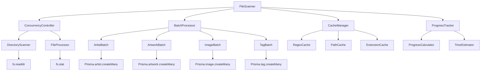
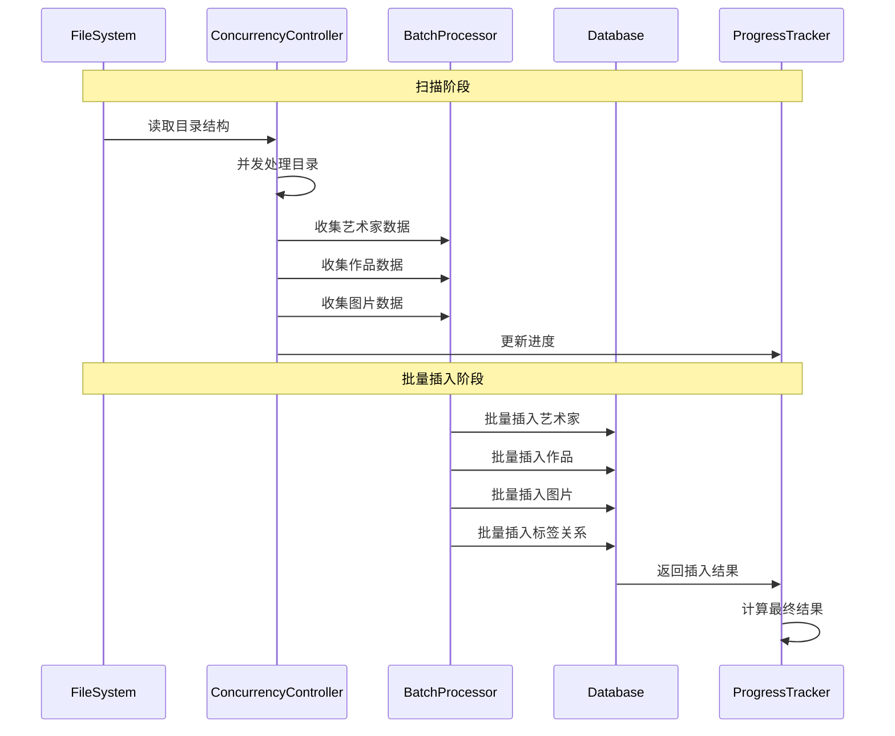

# 文件扫描器性能优化 - 架构设计

## 系统架构图



## 核心组件设计

### 1. ConcurrencyController (并发控制器)

```typescript
class ConcurrencyController {
  private readonly maxConcurrency: number
  private running: number = 0
  private queue: Array<{
    task: () => Promise<any>
    resolve: (value: any) => void
    reject: (error: any) => void
  }> = []

  constructor(maxConcurrency: number = os.cpus().length * 2) {
    this.maxConcurrency = maxConcurrency
  }

  async execute<T>(task: () => Promise<T>): Promise<T>
  private processQueue(): void
}
```

**职责**:
- 控制并发任务数量
- 管理任务队列
- 防止文件描述符耗尽

### 2. BatchProcessor (批量处理器)

```typescript
interface BatchData {
  artists: Map<string, ArtistData>
  artworks: Array<ArtworkData>
  images: Array<ImageData>
  tags: Map<string, TagData>
  artworkTags: Array<ArtworkTagData>
}

class BatchProcessor {
  private batchData: BatchData
  private readonly batchSize: number
  
  constructor(batchSize: number = 1000) {
    this.batchSize = batchSize
    this.initializeBatchData()
  }

  addArtist(artistData: ArtistData): void
  addArtwork(artworkData: ArtworkData): void
  addImage(imageData: ImageData): void
  addTag(tagData: TagData): void
  
  async flush(prisma: PrismaClient): Promise<BatchResult>
  private shouldFlush(): boolean
}
```

**职责**:
- 收集扫描过程中的所有数据
- 批量插入数据库
- 管理批次大小和内存使用

### 3. CacheManager (缓存管理器)

```typescript
class CacheManager {
  private regexCache: Map<string, RegExp> = new Map()
  private pathCache: Map<string, string> = new Map()
  private extensionCache: Set<string>
  
  constructor(supportedExtensions: string[]) {
    this.extensionCache = new Set(supportedExtensions)
    this.precompileRegexes()
  }

  getNameValidationRegex(): RegExp
  isValidExtension(ext: string): boolean
  normalizePath(path: string): string
  private precompileRegexes(): void
}
```

**职责**:
- 缓存预编译的正则表达式
- 缓存路径解析结果
- 优化重复计算

### 4. OptimizedScanner (优化扫描器)

```typescript
class OptimizedScanner {
  private concurrencyController: ConcurrencyController
  private batchProcessor: BatchProcessor
  private cacheManager: CacheManager
  private progressTracker: ProgressTracker

  async scanOptimized(options: ScanOptions): Promise<ScanResult> {
    // 单次遍历，并发处理，批量插入
    const scanTasks = await this.createScanTasks(options.scanPath)
    const results = await this.processConcurrently(scanTasks)
    const batchResult = await this.batchProcessor.flush(this.prisma)
    return this.buildScanResult(results, batchResult)
  }

  private async createScanTasks(rootPath: string): Promise<ScanTask[]>
  private async processConcurrently(tasks: ScanTask[]): Promise<TaskResult[]>
}
```

## 数据流向图



## 接口契约定义

### ScanTask 接口

```typescript
interface ScanTask {
  type: 'artist' | 'artwork' | 'image'
  path: string
  parentId?: number
  metadata?: any
}

interface TaskResult {
  success: boolean
  data?: any
  error?: string
  skipped?: boolean
  reason?: string
}
```

### BatchResult 接口

```typescript
interface BatchResult {
  artistsCreated: number
  artworksCreated: number
  imagesCreated: number
  tagsCreated: number
  errors: string[]
  duplicatesSkipped: number
}
```

### ProgressData 接口

```typescript
interface ProgressData {
  phase: ScanProgress['phase']
  totalTasks: number
  completedTasks: number
  currentTask: string
  estimatedTimeRemaining: number
  throughput: number // tasks per second
}
```

## 异常处理策略

### 1. 并发异常处理

```typescript
class ConcurrentErrorHandler {
  private errorThreshold: number = 0.1 // 10% 错误率阈值
  private errors: Array<{ task: string; error: Error; timestamp: number }> = []

  handleError(taskId: string, error: Error): boolean {
    this.errors.push({ task: taskId, error, timestamp: Date.now() })
    return this.shouldContinue()
  }

  private shouldContinue(): boolean {
    const recentErrors = this.getRecentErrors()
    return recentErrors.length / this.getTotalTasks() < this.errorThreshold
  }
}
```

### 2. 批量操作异常处理

```typescript
class BatchErrorHandler {
  async handleBatchError(
    operation: string,
    data: any[],
    error: Error
  ): Promise<{ success: any[]; failed: any[] }> {
    // 如果批量操作失败，尝试逐个处理
    const results = { success: [], failed: [] }
    
    for (const item of data) {
      try {
        await this.processSingle(operation, item)
        results.success.push(item)
      } catch (singleError) {
        results.failed.push({ item, error: singleError })
      }
    }
    
    return results
  }
}
```

## 性能监控设计

### 1. 性能指标收集

```typescript
interface PerformanceMetrics {
  startTime: number
  endTime?: number
  totalFiles: number
  processedFiles: number
  throughput: number // files per second
  memoryUsage: {
    heapUsed: number
    heapTotal: number
    external: number
  }
  concurrencyStats: {
    maxConcurrent: number
    avgConcurrent: number
    queueLength: number
  }
}
```

### 2. 实时监控

```typescript
class PerformanceMonitor {
  private metrics: PerformanceMetrics
  private intervalId?: NodeJS.Timeout

  startMonitoring(): void {
    this.intervalId = setInterval(() => {
      this.collectMetrics()
      this.checkThresholds()
    }, 1000)
  }

  private collectMetrics(): void {
    this.metrics.memoryUsage = process.memoryUsage()
    this.metrics.throughput = this.calculateThroughput()
  }

  private checkThresholds(): void {
    if (this.metrics.memoryUsage.heapUsed > this.memoryThreshold) {
      this.triggerGarbageCollection()
    }
  }
}
```

## 设计原则确认

### 1. 单一职责原则
- 每个组件负责特定的功能
- ConcurrencyController 只管并发
- BatchProcessor 只管批量操作
- CacheManager 只管缓存

### 2. 开闭原则
- 通过接口定义扩展点
- 支持不同的并发策略
- 支持不同的批量处理策略

### 3. 依赖倒置原则
- 依赖抽象而非具体实现
- 通过依赖注入提供灵活性

### 4. 性能优先原则
- 减少不必要的对象创建
- 最小化内存分配
- 优化热路径代码