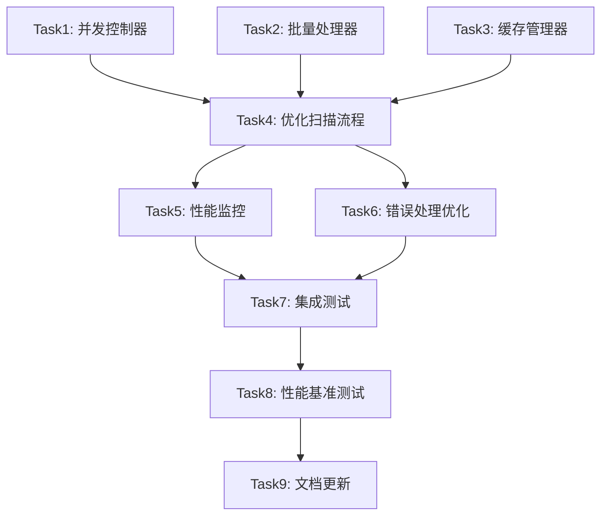

# 文件扫描器性能优化 - 任务拆分

## 任务依赖图

## 原子任务定义

### Task1: 实现并发控制器

**输入契约**:
- 前置依赖: 无
- 输入数据: 最大并发数配置
- 环境依赖: Node.js 环境

**输出契约**:
- 输出数据: ConcurrencyController 类
- 交付物: 
  - `src/services/scanner/ConcurrencyController.ts`
  - 单元测试文件
- 验收标准:
  - [ ] 支持可配置的最大并发数
  - [ ] 正确管理任务队列
  - [ ] 防止文件描述符耗尽
  - [ ] 单元测试覆盖率 > 90%

**实现约束**:
- 技术栈: TypeScript
- 接口规范: 提供 execute<T>(task: () => Promise<T>): Promise<T> 方法
- 质量要求: 线程安全，内存高效

**依赖关系**:
- 后置任务: Task4
- 并行任务: Task2, Task3

---

### Task2: 实现批量处理器

**输入契约**:
- 前置依赖: 无
- 输入数据: Prisma 客户端实例，批量大小配置
- 环境依赖: 数据库连接

**输出契约**:
- 输出数据: BatchProcessor 类
- 交付物:
  - `src/services/scanner/BatchProcessor.ts`
  - `src/services/scanner/types.ts` (批量数据类型)
  - 单元测试文件
- 验收标准:
  - [ ] 支持艺术家、作品、图片、标签的批量插入
  - [ ] 自动处理重复数据
  - [ ] 支持可配置的批量大小
  - [ ] 内存使用可控
  - [ ] 单元测试覆盖率 > 90%

**实现约束**:
- 技术栈: TypeScript + Prisma
- 接口规范: 提供 addXxx() 和 flush() 方法
- 质量要求: 事务安全，错误恢复

**依赖关系**:
- 后置任务: Task4
- 并行任务: Task1, Task3

---

### Task3: 实现缓存管理器

**输入契约**:
- 前置依赖: 无
- 输入数据: 支持的文件扩展名列表
- 环境依赖: Node.js 环境

**输出契约**:
- 输出数据: CacheManager 类
- 交付物:
  - `src/services/scanner/CacheManager.ts`
  - 单元测试文件
- 验收标准:
  - [ ] 预编译正则表达式缓存
  - [ ] 文件扩展名快速检查
  - [ ] 路径规范化缓存
  - [ ] 内存使用优化
  - [ ] 单元测试覆盖率 > 90%

**实现约束**:
- 技术栈: TypeScript
- 接口规范: 提供 getNameValidationRegex(), isValidExtension() 等方法
- 质量要求: 高性能，低内存占用

**依赖关系**:
- 后置任务: Task4
- 并行任务: Task1, Task2

---

### Task4: 重构优化扫描流程

**输入契约**:
- 前置依赖: Task1, Task2, Task3
- 输入数据: 原始 FileScanner 类
- 环境依赖: 完整的项目环境

**输出契约**:
- 输出数据: 优化后的 FileScanner 类
- 交付物:
  - 重构后的 `src/services/scanner.ts`
  - 新增的辅助类文件
- 验收标准:
  - [ ] 保持原有 API 接口不变
  - [ ] 集成并发控制器
  - [ ] 集成批量处理器
  - [ ] 集成缓存管理器
  - [ ] 单次遍历优化
  - [ ] 功能完全兼容原版本

**实现约束**:
- 技术栈: TypeScript + 现有技术栈
- 接口规范: 保持 ScanOptions, ScanProgress, ScanResult 不变
- 质量要求: 向后兼容，性能提升显著

**依赖关系**:
- 前置任务: Task1, Task2, Task3
- 后置任务: Task5, Task6

---

### Task5: 实现性能监控

**输入契约**:
- 前置依赖: Task4
- 输入数据: 优化后的扫描器
- 环境依赖: Node.js 性能监控 API

**输出契约**:
- 输出数据: PerformanceMonitor 类
- 交付物:
  - `src/services/scanner/PerformanceMonitor.ts`
  - 性能指标类型定义
  - 单元测试文件
- 验收标准:
  - [ ] 实时收集性能指标
  - [ ] 内存使用监控
  - [ ] 吞吐量计算
  - [ ] 并发度统计
  - [ ] 性能报告生成

**实现约束**:
- 技术栈: TypeScript + Node.js Performance API
- 接口规范: 提供 startMonitoring(), getMetrics() 方法
- 质量要求: 低开销，准确测量

**依赖关系**:
- 前置任务: Task4
- 后置任务: Task7
- 并行任务: Task6

---

### Task6: 优化错误处理

**输入契约**:
- 前置依赖: Task4
- 输入数据: 优化后的扫描器
- 环境依赖: 现有错误处理机制

**输出契约**:
- 输出数据: 增强的错误处理机制
- 交付物:
  - `src/services/scanner/ErrorHandler.ts`
  - 错误恢复策略
  - 单元测试文件
- 验收标准:
  - [ ] 并发错误处理
  - [ ] 批量操作错误恢复
  - [ ] 错误率阈值控制
  - [ ] 详细错误报告
  - [ ] 优雅降级机制

**实现约束**:
- 技术栈: TypeScript
- 接口规范: 兼容现有错误处理接口
- 质量要求: 健壮性，可恢复性

**依赖关系**:
- 前置任务: Task4
- 后置任务: Task7
- 并行任务: Task5

---

### Task7: 集成测试

**输入契约**:
- 前置依赖: Task5, Task6
- 输入数据: 完整的优化后系统
- 环境依赖: 测试数据库，测试文件结构

**输出契约**:
- 输出数据: 集成测试套件
- 交付物:
  - `tests/integration/scanner-performance.test.ts`
  - 测试数据生成脚本
  - 测试报告
- 验收标准:
  - [ ] 功能一致性测试通过
  - [ ] 并发安全性测试通过
  - [ ] 大数据量测试通过
  - [ ] 错误恢复测试通过
  - [ ] 内存泄漏测试通过

**实现约束**:
- 技术栈: Jest + TypeScript
- 接口规范: 使用现有测试框架
- 质量要求: 全面覆盖，自动化执行

**依赖关系**:
- 前置任务: Task5, Task6
- 后置任务: Task8

---

### Task8: 性能基准测试

**输入契约**:
- 前置依赖: Task7
- 输入数据: 原版本和优化版本的扫描器
- 环境依赖: 基准测试环境，大型测试数据集

**输出契约**:
- 输出数据: 性能对比报告
- 交付物:
  - `benchmarks/scanner-performance.js`
  - 性能对比报告
  - 优化建议文档
- 验收标准:
  - [ ] 扫描速度提升 3-5 倍
  - [ ] 内存使用控制在 2 倍以内
  - [ ] 并发处理稳定性验证
  - [ ] 不同规模数据集测试
  - [ ] 性能回归检测

**实现约束**:
- 技术栈: Node.js Benchmark 工具
- 接口规范: 标准化的基准测试格式
- 质量要求: 准确测量，可重复执行

**依赖关系**:
- 前置任务: Task7
- 后置任务: Task9

---

### Task9: 文档更新

**输入契约**:
- 前置依赖: Task8
- 输入数据: 完整的优化系统和测试结果
- 环境依赖: 文档生成工具

**输出契约**:
- 输出数据: 更新的技术文档
- 交付物:
  - 更新的 API 文档
  - 性能优化指南
  - 部署和配置说明
  - 故障排除指南
- 验收标准:
  - [ ] API 文档准确完整
  - [ ] 性能配置说明清晰
  - [ ] 示例代码可执行
  - [ ] 故障排除覆盖常见问题
  - [ ] 文档格式统一规范

**实现约束**:
- 技术栈: Markdown + JSDoc
- 接口规范: 遵循项目文档规范
- 质量要求: 准确性，可读性

**依赖关系**:
- 前置任务: Task8
- 后置任务: 无

## 总体时间估算

| 任务 | 预估时间 | 复杂度 | 风险等级 |
|------|----------|--------|----------|
| Task1 | 4-6 小时 | 中等 | 低 |
| Task2 | 6-8 小时 | 高 | 中 |
| Task3 | 2-4 小时 | 低 | 低 |
| Task4 | 8-12 小时 | 高 | 高 |
| Task5 | 3-5 小时 | 中等 | 低 |
| Task6 | 4-6 小时 | 中等 | 中 |
| Task7 | 6-8 小时 | 中等 | 中 |
| Task8 | 4-6 小时 | 中等 | 低 |
| Task9 | 2-3 小时 | 低 | 低 |

**总计**: 39-58 小时

## 风险评估

### 高风险任务
- **Task4 (重构扫描流程)**: 涉及核心逻辑重构，可能影响现有功能

### 中风险任务
- **Task2 (批量处理器)**: 数据库操作复杂，需要处理各种边界情况
- **Task6 (错误处理)**: 需要考虑各种异常场景
- **Task7 (集成测试)**: 测试覆盖面广，可能发现意外问题

### 风险缓解策略
- 增量开发和测试
- 保留原版本作为回退方案
- 详细的单元测试和集成测试
- 性能监控和报警机制