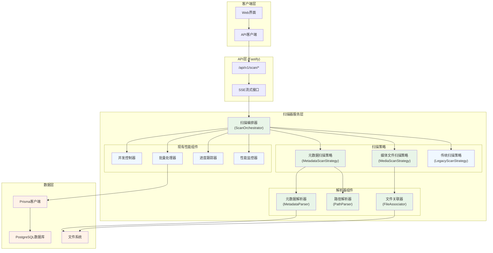
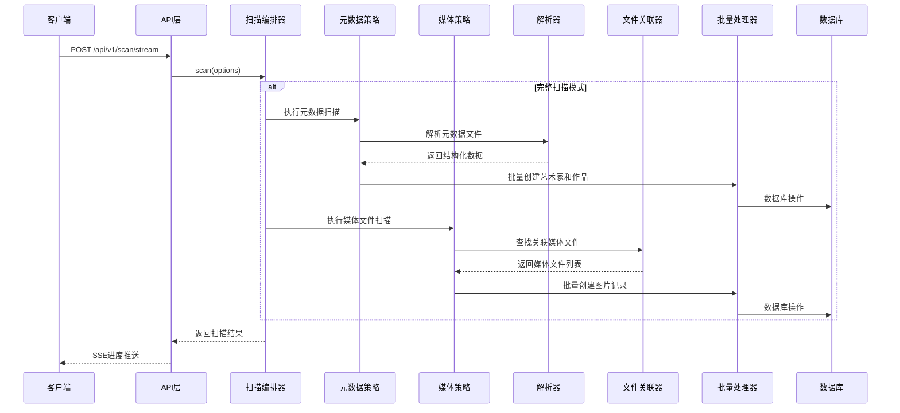

# 扫描器重构 - 系统架构设计

## 系统架构图



## 分层设计

### 1. API层 (保持不变)
- **职责**: 提供RESTful API和SSE接口
- **组件**: 现有的scan路由和SSE实现
- **变更**: 无，保持完全兼容

### 2. 服务层 (核心重构)

#### 2.1 扫描编排器 (ScanOrchestrator)
**职责**: 
- 统一扫描流程编排
- 策略选择和切换
- 性能组件协调
- 进度统一管理

**接口设计**:
```typescript
interface IScanOrchestrator {
  scan(options: ScanOptions): Promise<ScanResult>
  getSupportedStrategies(): string[]
  setStrategy(strategy: ScanStrategyType): void
}
```

#### 2.2 扫描策略 (Strategy Pattern)

##### 元数据扫描策略 (MetadataScanStrategy)
**职责**: 
- 扫描和解析元数据文件
- 提取结构化作品信息
- 建立艺术家-作品关系

**流程**:
1. 递归扫描目录查找 `*-meta.txt` 文件
2. 解析元数据文件内容
3. 验证必填字段
4. 批量创建艺术家和作品记录

##### 媒体文件扫描策略 (MediaScanStrategy)
**职责**:
- 扫描媒体文件
- 关联到对应作品
- 更新作品统计信息

**流程**:
1. 基于数据库中的作品信息
2. 扫描对应目录的媒体文件
3. 通过ID匹配关联文件
4. 批量创建图片记录

##### 传统扫描策略 (LegacyScanStrategy)
**职责**:
- 保持现有扫描逻辑
- 向后兼容支持
- 渐进式迁移

#### 2.3 解析器组件

##### 元数据解析器 (MetadataParser)
**职责**: 解析元数据文件格式

**接口设计**:
```typescript
interface IMetadataParser {
  parse(filePath: string): Promise<ArtworkMetadata>
  validate(metadata: ArtworkMetadata): ValidationResult
  getRequiredFields(): string[]
}

interface ArtworkMetadata {
  id: string
  title: string
  user: string
  userId: string
  description?: string
  tags?: string[]
  url?: string
  originalUrl?: string
  thumbnailUrl?: string
  xRestrict?: string
  ai?: boolean
  size?: string
  bookmark?: number
  date?: Date
}
```

##### 路径解析器 (PathParser)
**职责**: 从目录路径提取信息

**接口设计**:
```typescript
interface IPathParser {
  parseArtistInfo(dirPath: string): ArtistInfo
  parseArtworkInfo(dirPath: string): ArtworkInfo
  getRelativePath(fullPath: string, basePath: string): string
}

interface ArtistInfo {
  name: string
  id?: string
}

interface ArtworkInfo {
  title?: string
  relativePath: string
}
```

##### 文件关联器 (FileAssociator)
**职责**: 关联元数据和媒体文件

**接口设计**:
```typescript
interface IFileAssociator {
  findMediaFiles(metadataPath: string, artworkId: string): Promise<MediaFile[]>
  validateAssociation(metadataFile: string, mediaFiles: MediaFile[]): boolean
}

interface MediaFile {
  path: string
  name: string
  extension: string
  size: number
  artworkId: string
  pageNumber?: number
}
```

### 3. 数据层 (保持不变)
- **数据库模型**: 复用现有Prisma模型
- **数据访问**: 通过现有BatchProcessor
- **文件系统**: 直接访问本地文件系统

## 核心组件设计

### 1. 扫描编排器实现

```typescript
export class ScanOrchestrator {
  private strategies: Map<ScanStrategyType, IScanStrategy>
  private currentStrategy: IScanStrategy
  private performanceComponents: PerformanceComponents
  
  constructor(
    private prisma: PrismaClient,
    private logger: FastifyInstance['log'],
    private options: ScanOrchestratorOptions
  ) {
    this.initializeStrategies()
    this.initializePerformanceComponents()
  }
  
  async scan(options: ScanOptions): Promise<ScanResult> {
    // 1. 选择扫描策略
    this.selectStrategy(options.scanType)
    
    // 2. 初始化性能组件
    await this.initializePerformanceTracking()
    
    // 3. 执行扫描
    const result = await this.currentStrategy.execute(options)
    
    // 4. 性能报告
    await this.generatePerformanceReport()
    
    return result
  }
  
  private selectStrategy(scanType: ScanStrategyType): void {
    switch (scanType) {
      case 'metadata':
        this.currentStrategy = this.strategies.get('metadata')!
        break
      case 'media':
        this.currentStrategy = this.strategies.get('media')!
        break
      case 'full':
        // 组合策略：先元数据，后媒体文件
        this.currentStrategy = new CompositeScanStrategy([
          this.strategies.get('metadata')!,
          this.strategies.get('media')!
        ])
        break
      case 'legacy':
      default:
        this.currentStrategy = this.strategies.get('legacy')!
        break
    }
  }
}
```

### 2. 元数据解析器实现

```typescript
export class MetadataParser implements IMetadataParser {
  private readonly requiredFields = ['ID', 'User', 'UserID', 'Title']
  
  async parse(filePath: string): Promise<ArtworkMetadata> {
    const content = await fs.readFile(filePath, 'utf-8')
    const metadata = this.parseContent(content)
    
    const validationResult = this.validate(metadata)
    if (!validationResult.isValid) {
      throw new MetadataValidationError(validationResult.errors)
    }
    
    return metadata
  }
  
  private parseContent(content: string): ArtworkMetadata {
    const lines = content.split('\n').map(line => line.trim())
    const metadata: Partial<ArtworkMetadata> = {}
    
    let currentKey = ''
    let currentValue = ''
    
    for (const line of lines) {
      if (line === '') {
        if (currentKey && currentValue) {
          this.setMetadataField(metadata, currentKey, currentValue)
          currentKey = ''
          currentValue = ''
        }
      } else if (!currentKey) {
        currentKey = line
      } else {
        currentValue += (currentValue ? '\n' : '') + line
      }
    }
    
    // 处理最后一个字段
    if (currentKey && currentValue) {
      this.setMetadataField(metadata, currentKey, currentValue)
    }
    
    return metadata as ArtworkMetadata
  }
  
  private setMetadataField(metadata: Partial<ArtworkMetadata>, key: string, value: string): void {
    switch (key.toUpperCase()) {
      case 'ID':
        metadata.id = value
        break
      case 'TITLE':
        metadata.title = value
        break
      case 'USER':
        metadata.user = value
        break
      case 'USERID':
        metadata.userId = value
        break
      case 'DESCRIPTION':
        metadata.description = value || undefined
        break
      case 'TAGS':
        metadata.tags = this.parseTags(value)
        break
      case 'URL':
        metadata.url = value
        break
      case 'ORIGINAL':
        metadata.originalUrl = value
        break
      case 'THUMBNAIL':
        metadata.thumbnailUrl = value
        break
      case 'XRESTRICT':
        metadata.xRestrict = value
        break
      case 'AI':
        metadata.ai = value.toLowerCase() === 'yes'
        break
      case 'SIZE':
        metadata.size = value
        break
      case 'BOOKMARK':
        metadata.bookmark = parseInt(value) || 0
        break
      case 'DATE':
        metadata.date = new Date(value)
        break
    }
  }
  
  private parseTags(tagsString: string): string[] {
    if (!tagsString) return []
    
    return tagsString
      .split(/\s+/)
      .map(tag => tag.trim())
      .filter(tag => tag.length > 0)
      .map(tag => tag.startsWith('#') ? tag.substring(1) : tag)
  }
  
  validate(metadata: ArtworkMetadata): ValidationResult {
    const errors: string[] = []
    
    for (const field of this.requiredFields) {
      const value = metadata[field.toLowerCase() as keyof ArtworkMetadata]
      if (!value) {
        errors.push(`Required field '${field}' is missing`)
      }
    }
    
    return {
      isValid: errors.length === 0,
      errors
    }
  }
}
```

### 3. 文件关联器实现

```typescript
export class FileAssociator implements IFileAssociator {
  private supportedExtensions = ['.jpg', '.jpeg', '.png', '.gif', '.webp', '.bmp', '.tiff']
  
  async findMediaFiles(metadataPath: string, artworkId: string): Promise<MediaFile[]> {
    const directory = path.dirname(metadataPath)
    const files = await fs.readdir(directory)
    
    const mediaFiles: MediaFile[] = []
    
    for (const file of files) {
      const filePath = path.join(directory, file)
      const stat = await fs.stat(filePath)
      
      if (stat.isFile() && this.isMediaFile(file) && this.isAssociatedFile(file, artworkId)) {
        const mediaFile = await this.createMediaFile(filePath, artworkId)
        mediaFiles.push(mediaFile)
      }
    }
    
    return mediaFiles.sort((a, b) => (a.pageNumber || 0) - (b.pageNumber || 0))
  }
  
  private isMediaFile(filename: string): boolean {
    const ext = path.extname(filename).toLowerCase()
    return this.supportedExtensions.includes(ext)
  }
  
  private isAssociatedFile(filename: string, artworkId: string): boolean {
    // 匹配格式: {artworkId}_p{pageNumber}.{ext}
    const pattern = new RegExp(`^${artworkId}_p\\d+\\.\\w+$`)
    return pattern.test(filename)
  }
  
  private async createMediaFile(filePath: string, artworkId: string): Promise<MediaFile> {
    const filename = path.basename(filePath)
    const stat = await fs.stat(filePath)
    
    // 提取页码
    const pageMatch = filename.match(/_p(\d+)\./)
    const pageNumber = pageMatch ? parseInt(pageMatch[1]) : 0
    
    return {
      path: filePath,
      name: filename,
      extension: path.extname(filename),
      size: stat.size,
      artworkId,
      pageNumber
    }
  }
  
  validateAssociation(metadataFile: string, mediaFiles: MediaFile[]): boolean {
    // 验证至少有一个关联的媒体文件
    return mediaFiles.length > 0
  }
}
```

## 数据流向图



## 接口契约定义

### 1. 扫描选项接口

```typescript
interface ScanOptions {
  scanPath: string
  scanType?: ScanStrategyType  // 新增：扫描类型
  forceUpdate?: boolean
  supportedExtensions?: string[]
  onProgress?: (progress: ScanProgress) => void
}

type ScanStrategyType = 'metadata' | 'media' | 'full' | 'legacy'
```

### 2. 扫描结果接口 (保持兼容)

```typescript
interface ScanResult {
  scannedDirectories: number
  foundImages: number
  newArtworks: number
  newImages: number
  removedArtworks?: number
  errors: string[]
  skippedDirectories?: Array<{ path: string; reason: string }>
  // 新增字段
  metadataFiles?: number
  processedMetadata?: number
  skippedMetadata?: Array<{ path: string; reason: string }>
}
```

### 3. 扫描策略接口

```typescript
interface IScanStrategy {
  readonly name: string
  readonly description: string
  
  execute(options: ScanOptions): Promise<ScanResult>
  validate(options: ScanOptions): ValidationResult
  getEstimatedDuration(options: ScanOptions): Promise<number>
}
```

## 异常处理策略

### 1. 异常分类

```typescript
// 元数据相关异常
class MetadataValidationError extends Error {
  constructor(public errors: string[]) {
    super(`Metadata validation failed: ${errors.join(', ')}`)
  }
}

class MetadataParseError extends Error {
  constructor(public filePath: string, cause: Error) {
    super(`Failed to parse metadata file: ${filePath}`)
    this.cause = cause
  }
}

// 文件关联异常
class FileAssociationError extends Error {
  constructor(public metadataPath: string, public artworkId: string) {
    super(`No media files found for artwork: ${artworkId}`)
  }
}

// 策略选择异常
class UnsupportedStrategyError extends Error {
  constructor(public strategyType: string) {
    super(`Unsupported scan strategy: ${strategyType}`)
  }
}
```

### 2. 错误恢复策略

1. **元数据解析失败**: 跳过该文件，记录错误，继续处理其他文件
2. **必填字段缺失**: 尝试从路径信息补充，失败则跳过
3. **文件关联失败**: 仅创建作品记录，不创建图片记录
4. **数据库操作失败**: 使用现有的批量处理错误恢复机制

## 性能优化策略

### 1. 复用现有优化组件
- **并发控制器**: 控制文件扫描并发度
- **批量处理器**: 优化数据库操作
- **缓存管理器**: 缓存解析结果
- **性能监控器**: 监控扫描性能

### 2. 新增优化策略
- **元数据缓存**: 缓存已解析的元数据文件
- **路径解析缓存**: 缓存路径解析结果
- **文件关联缓存**: 缓存文件关联关系
- **增量扫描支持**: 仅处理变更的文件

### 3. 内存管理
- **流式处理**: 大文件分块处理
- **及时释放**: 处理完成后立即释放内存
- **内存监控**: 监控内存使用情况

## 配置管理

### 1. 扫描器配置

```typescript
interface ScannerConfig {
  // 现有配置
  enableOptimizations: boolean
  maxConcurrency: number
  
  // 新增配置
  defaultScanStrategy: ScanStrategyType
  metadataFilePattern: string
  requiredMetadataFields: string[]
  supportedMetadataFormats: string[]
  enableMetadataCache: boolean
  metadataCacheSize: number
  enableFileAssociationCache: boolean
  fileAssociationCacheSize: number
}
```

### 2. 环境变量支持

```bash
# 扫描策略配置
SCANNER_DEFAULT_STRATEGY=full
SCANNER_METADATA_PATTERN=*-meta.txt
SCANNER_REQUIRED_FIELDS=ID,User,UserID,Title

# 缓存配置
SCANNER_ENABLE_METADATA_CACHE=true
SCANNER_METADATA_CACHE_SIZE=1000
SCANNER_ENABLE_FILE_CACHE=true
SCANNER_FILE_CACHE_SIZE=5000
```

## 向后兼容性保证

### 1. API接口兼容
- 保持现有API路径和参数不变
- 扩展可选参数，不影响现有调用
- 保持响应格式兼容

### 2. 配置兼容
- 现有配置继续有效
- 新增配置提供默认值
- 渐进式配置迁移

### 3. 数据兼容
- 不修改现有数据库表结构
- 新增字段使用可选字段
- 支持现有数据的处理

### 4. 行为兼容
- 默认使用传统扫描策略
- 通过配置启用新功能
- 保持现有性能特征

## 扩展性设计

### 1. 策略扩展
- 插件化策略注册
- 自定义策略开发接口
- 策略组合和链式调用

### 2. 解析器扩展
- 多格式元数据支持
- 自定义解析器注册
- 解析器优先级配置

### 3. 数据源扩展
- 远程数据源支持
- 数据库数据源支持
- API数据源支持

### 4. 输出格式扩展
- 多种报告格式
- 自定义输出处理器
- 数据导出功能