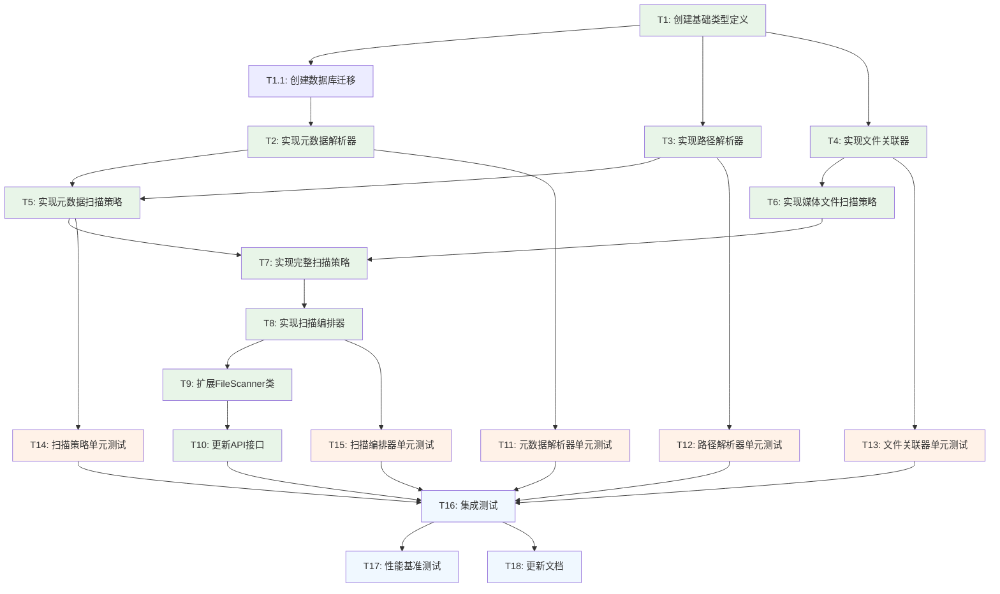

# 扫描器重构 - 原子任务拆分

## 任务依赖图

## 原子任务详细定义

### T1: 创建基础类型定义

**输入契约**:
- 前置依赖: 无
- 输入数据: DESIGN文档中的接口定义
- 环境依赖: TypeScript开发环境

**输出契约**:
- 输出数据: 完整的TypeScript类型定义文件
- 交付物: `packages/shared/src/types/metadata.ts`
- 验收标准: 
  - 所有接口定义完整
  - TypeScript编译通过
  - 类型导出正确

**实现约束**:
- 技术栈: TypeScript
- 接口规范: 遵循现有项目的类型定义规范
- 质量要求: 类型定义准确，注释完整

**依赖关系**:
- 后置任务: T2, T3, T4
- 并行任务: 无

**预估工时**: 2-3小时

---

### T1.1: 创建数据库迁移

**输入契约**:
- 前置依赖: T1 (基础类型定义)
- 输入数据: 扩展后的Prisma schema设计
- 环境依赖: Prisma CLI工具

**输出契约**:
- 输出数据: 数据库迁移文件
- 交付物: `packages/api/prisma/migrations/xxx_add_metadata_fields/migration.sql`
- 验收标准:
  - 迁移文件正确生成
  - 新增字段定义准确
  - 索引创建正确
  - 迁移可以成功执行

**实现约束**:
- 技术栈: Prisma + PostgreSQL
- 接口规范: 遵循Prisma迁移规范
- 质量要求: 迁移安全，支持回滚

**依赖关系**:
- 前置任务: T1
- 后置任务: T2, T5, T6
- 并行任务: T3, T4

**预估工时**: 1-2小时

---

### T2: 实现元数据解析器

**输入契约**:
- 前置依赖: T1 (基础类型定义)
- 输入数据: 元数据文件格式规范
- 环境依赖: Node.js文件系统API

**输出契约**:
- 输出数据: 可解析元数据文件的解析器类
- 交付物: `packages/api/src/services/scanner/MetadataParser.ts`
- 验收标准:
  - 能够解析指定格式的元数据文件
  - 能够验证必填字段
  - 能够处理格式错误
  - 能够解析标签字符串

**实现约束**:
- 技术栈: TypeScript + Node.js
- 接口规范: 实现IMetadataParser接口
- 质量要求: 容错性强，错误处理完善

**依赖关系**:
- 前置任务: T1
- 后置任务: T5, T11
- 并行任务: T3, T4

**预估工时**: 4-6小时

---

### T3: 实现路径解析器

**输入契约**:
- 前置依赖: T1 (基础类型定义)
- 输入数据: 目录路径结构规范
- 环境依赖: Node.js path模块

**输出契约**:
- 输出数据: 可解析目录路径信息的解析器类
- 交付物: `packages/api/src/services/scanner/PathParser.ts`
- 验收标准:
  - 能够从路径提取艺术家信息
  - 能够从路径提取作品信息
  - 能够计算相对路径
  - 能够处理各种路径格式

**实现约束**:
- 技术栈: TypeScript + Node.js
- 接口规范: 实现IPathParser接口
- 质量要求: 路径解析准确，支持多种格式

**依赖关系**:
- 前置任务: T1
- 后置任务: T5, T12
- 并行任务: T2, T4

**预估工时**: 3-4小时

---

### T4: 实现文件关联器

**输入契约**:
- 前置依赖: T1 (基础类型定义)
- 输入数据: 文件关联规则
- 环境依赖: Node.js文件系统API

**输出契约**:
- 输出数据: 可关联元数据和媒体文件的关联器类
- 交付物: `packages/api/src/services/scanner/FileAssociator.ts`
- 验收标准:
  - 能够根据作品ID匹配媒体文件
  - 能够解析文件名中的页码
  - 能够按页码排序文件
  - 能够验证文件关联关系

**实现约束**:
- 技术栈: TypeScript + Node.js
- 接口规范: 实现IFileAssociator接口
- 质量要求: 文件匹配准确，排序正确

**依赖关系**:
- 前置任务: T1
- 后置任务: T6, T13
- 并行任务: T2, T3

**预估工时**: 3-4小时

---

### T5: 实现元数据扫描策略

**输入契约**:
- 前置依赖: T2 (元数据解析器), T3 (路径解析器)
- 输入数据: 扫描策略接口定义
- 环境依赖: 现有的批量处理器和并发控制器

**输出契约**:
- 输出数据: 元数据扫描策略实现
- 交付物: `packages/api/src/services/scanner/MetadataScanStrategy.ts`
- 验收标准:
  - 能够扫描指定目录的元数据文件
  - 能够批量创建艺术家和作品记录
  - 能够处理重复数据
  - 能够提供进度反馈

**实现约束**:
- 技术栈: TypeScript + Prisma
- 接口规范: 实现IScanStrategy接口
- 质量要求: 性能优化，错误处理完善

**依赖关系**:
- 前置任务: T2, T3
- 后置任务: T7, T14
- 并行任务: T6

**预估工时**: 5-7小时

---

### T6: 实现媒体文件扫描策略

**输入契约**:
- 前置依赖: T4 (文件关联器)
- 输入数据: 数据库中的作品信息
- 环境依赖: 现有的批量处理器和并发控制器

**输出契约**:
- 输出数据: 媒体文件扫描策略实现
- 交付物: `packages/api/src/services/scanner/MediaScanStrategy.ts`
- 验收标准:
  - 能够基于作品信息扫描媒体文件
  - 能够批量创建图片记录
  - 能够更新作品统计信息
  - 能够提供进度反馈

**实现约束**:
- 技术栈: TypeScript + Prisma
- 接口规范: 实现IScanStrategy接口
- 质量要求: 性能优化，数据一致性保证

**依赖关系**:
- 前置任务: T4
- 后置任务: T7, T14
- 并行任务: T5

**预估工时**: 4-6小时

---

### T7: 实现完整扫描策略

**输入契约**:
- 前置依赖: T5 (元数据扫描策略), T6 (媒体文件扫描策略)
- 输入数据: 组合策略接口定义
- 环境依赖: 已实现的扫描策略

**输出契约**:
- 输出数据: 完整扫描策略实现（组合策略）
- 交付物: `packages/api/src/services/scanner/FullScanStrategy.ts`
- 验收标准:
  - 能够按顺序执行元数据和媒体文件扫描
  - 能够处理策略间的数据传递
  - 能够统一进度反馈
  - 能够处理任一策略的失败

**实现约束**:
- 技术栈: TypeScript
- 接口规范: 实现IScanStrategy接口
- 质量要求: 策略协调准确，错误处理完善

**依赖关系**:
- 前置任务: T5, T6
- 后置任务: T8, T14
- 并行任务: 无

**预估工时**: 3-4小时

---

### T8: 实现扫描编排器

**输入契约**:
- 前置依赖: T7 (完整扫描策略)
- 输入数据: 所有扫描策略实现
- 环境依赖: 现有的性能组件

**输出契约**:
- 输出数据: 扫描编排器实现
- 交付物: `packages/api/src/services/scanner/ScanOrchestrator.ts`
- 验收标准:
  - 能够根据配置选择扫描策略
  - 能够协调现有性能组件
  - 能够提供统一的扫描接口
  - 能够处理策略切换和降级

**实现约束**:
- 技术栈: TypeScript + 现有性能组件
- 接口规范: 实现IScanOrchestrator接口
- 质量要求: 架构清晰，扩展性强

**依赖关系**:
- 前置任务: T7
- 后置任务: T9, T15
- 并行任务: 无

**预估工时**: 4-5小时

---

### T9: 扩展FileScanner类

**输入契约**:
- 前置依赖: T8 (扫描编排器)
- 输入数据: 现有FileScanner类
- 环境依赖: 现有扫描器代码

**输出契约**:
- 输出数据: 扩展后的FileScanner类
- 交付物: 更新 `packages/api/src/services/scanner.ts`
- 验收标准:
  - 保持现有API接口不变
  - 集成新的扫描编排器
  - 支持新的配置选项
  - 保持现有性能特征

**实现约束**:
- 技术栈: TypeScript
- 接口规范: 保持现有接口兼容
- 质量要求: 向后兼容，性能不降级

**依赖关系**:
- 前置任务: T8
- 后置任务: T10
- 并行任务: 无

**预估工时**: 3-4小时

---

### T10: 更新API接口

**输入契约**:
- 前置依赖: T9 (扩展FileScanner类)
- 输入数据: 现有API路由
- 环境依赖: Fastify框架

**输出契约**:
- 输出数据: 扩展后的API接口
- 交付物: 更新 `packages/api/src/routes/scan.ts`
- 验收标准:
  - 支持新的扫描类型参数
  - 保持现有API行为不变
  - 提供向后兼容的默认行为
  - API文档更新

**实现约束**:
- 技术栈: TypeScript + Fastify
- 接口规范: RESTful API规范
- 质量要求: 接口设计清晰，文档完整

**依赖关系**:
- 前置任务: T9
- 后置任务: T16
- 并行任务: 无

**预估工时**: 2-3小时

---

### T11: 元数据解析器单元测试

**输入契约**:
- 前置依赖: T2 (元数据解析器)
- 输入数据: 测试用例设计
- 环境依赖: Jest测试框架

**输出契约**:
- 输出数据: 完整的单元测试套件
- 交付物: `packages/api/src/services/scanner/__tests__/MetadataParser.test.ts`
- 验收标准:
  - 测试覆盖率 ≥ 90%
  - 覆盖正常流程和异常情况
  - 测试数据完整
  - 所有测试通过

**实现约束**:
- 技术栈: TypeScript + Jest
- 接口规范: 遵循项目测试规范
- 质量要求: 测试用例全面，断言准确

**依赖关系**:
- 前置任务: T2
- 后置任务: T16
- 并行任务: T12, T13, T14, T15

**预估工时**: 3-4小时

---

### T12: 路径解析器单元测试

**输入契约**:
- 前置依赖: T3 (路径解析器)
- 输入数据: 测试用例设计
- 环境依赖: Jest测试框架

**输出契约**:
- 输出数据: 完整的单元测试套件
- 交付物: `packages/api/src/services/scanner/__tests__/PathParser.test.ts`
- 验收标准:
  - 测试覆盖率 ≥ 90%
  - 覆盖各种路径格式
  - 边界条件测试
  - 所有测试通过

**实现约束**:
- 技术栈: TypeScript + Jest
- 接口规范: 遵循项目测试规范
- 质量要求: 路径测试用例丰富

**依赖关系**:
- 前置任务: T3
- 后置任务: T16
- 并行任务: T11, T13, T14, T15

**预估工时**: 2-3小时

---

### T13: 文件关联器单元测试

**输入契约**:
- 前置依赖: T4 (文件关联器)
- 输入数据: 测试用例设计
- 环境依赖: Jest测试框架

**输出契约**:
- 输出数据: 完整的单元测试套件
- 交付物: `packages/api/src/services/scanner/__tests__/FileAssociator.test.ts`
- 验收标准:
  - 测试覆盖率 ≥ 90%
  - 覆盖文件匹配逻辑
  - 排序功能测试
  - 所有测试通过

**实现约束**:
- 技术栈: TypeScript + Jest
- 接口规范: 遵循项目测试规范
- 质量要求: 文件操作测试安全

**依赖关系**:
- 前置任务: T4
- 后置任务: T16
- 并行任务: T11, T12, T14, T15

**预估工时**: 3-4小时

---

### T14: 扫描策略单元测试

**输入契约**:
- 前置依赖: T5, T6, T7 (所有扫描策略)
- 输入数据: 测试用例设计
- 环境依赖: Jest测试框架 + 测试数据库

**输出契约**:
- 输出数据: 完整的单元测试套件
- 交付物: `packages/api/src/services/scanner/__tests__/ScanStrategies.test.ts`
- 验收标准:
  - 测试覆盖率 ≥ 85%
  - 覆盖各种扫描策略
  - 数据库操作测试
  - 所有测试通过

**实现约束**:
- 技术栈: TypeScript + Jest + Prisma
- 接口规范: 遵循项目测试规范
- 质量要求: 数据库测试隔离

**依赖关系**:
- 前置任务: T5, T6, T7
- 后置任务: T16
- 并行任务: T11, T12, T13, T15

**预估工时**: 4-6小时

---

### T15: 扫描编排器单元测试

**输入契约**:
- 前置依赖: T8 (扫描编排器)
- 输入数据: 测试用例设计
- 环境依赖: Jest测试框架

**输出契约**:
- 输出数据: 完整的单元测试套件
- 交付物: `packages/api/src/services/scanner/__tests__/ScanOrchestrator.test.ts`
- 验收标准:
  - 测试覆盖率 ≥ 90%
  - 覆盖策略选择逻辑
  - 组件协调测试
  - 所有测试通过

**实现约束**:
- 技术栈: TypeScript + Jest
- 接口规范: 遵循项目测试规范
- 质量要求: 集成测试和单元测试分离

**依赖关系**:
- 前置任务: T8
- 后置任务: T16
- 并行任务: T11, T12, T13, T14

**预估工时**: 3-4小时

---

### T16: 集成测试

**输入契约**:
- 前置依赖: T10 (API接口更新), T11-T15 (所有单元测试)
- 输入数据: 端到端测试场景
- 环境依赖: 完整的测试环境

**输出契约**:
- 输出数据: 完整的集成测试套件
- 交付物: `packages/api/src/__tests__/scanner-integration.test.ts`
- 验收标准:
  - 端到端流程测试通过
  - API接口测试通过
  - 兼容性测试通过
  - 性能基准测试通过

**实现约束**:
- 技术栈: TypeScript + Jest + Supertest
- 接口规范: 遵循项目集成测试规范
- 质量要求: 测试环境隔离，数据清理

**依赖关系**:
- 前置任务: T10, T11, T12, T13, T14, T15
- 后置任务: T17, T18
- 并行任务: 无

**预估工时**: 4-6小时

---

### T17: 性能基准测试

**输入契约**:
- 前置依赖: T16 (集成测试)
- 输入数据: 性能测试数据集
- 环境依赖: 性能测试环境

**输出契约**:
- 输出数据: 性能测试报告
- 交付物: `benchmarks/scanner-refactor-performance.js`
- 验收标准:
  - 性能指标满足验收标准
  - 与现有实现的对比报告
  - 性能回归检查通过
  - 内存使用分析报告

**实现约束**:
- 技术栈: Node.js + 性能测试工具
- 接口规范: 遵循项目性能测试规范
- 质量要求: 测试数据真实，指标准确

**依赖关系**:
- 前置任务: T16
- 后置任务: 无
- 并行任务: T18

**预估工时**: 3-4小时

---

### T18: 更新文档

**输入契约**:
- 前置依赖: T16 (集成测试)
- 输入数据: 实现的功能和API
- 环境依赖: 文档编写环境

**输出契约**:
- 输出数据: 更新的项目文档
- 交付物: 
  - 更新 `README.md`
  - 更新 `docs/config-usage-examples.md`
  - 创建 `docs/scanner_refoctor/USER_GUIDE.md`
- 验收标准:
  - API文档准确完整
  - 配置文档清晰易懂
  - 使用示例可执行
  - 故障排除指南实用

**实现约束**:
- 技术栈: Markdown
- 接口规范: 遵循项目文档规范
- 质量要求: 文档准确，示例可用

**依赖关系**:
- 前置任务: T16
- 后置任务: 无
- 并行任务: T17

**预估工时**: 3-4小时

## 任务执行顺序

### 第一批次 (并行执行)
- T1: 创建基础类型定义

### 第二批次 (串行执行)
- T1.1: 创建数据库迁移

### 第三批次 (并行执行)
- T2: 实现元数据解析器
- T3: 实现路径解析器
- T4: 实现文件关联器

### 第四批次 (并行执行)
- T5: 实现元数据扫描策略
- T6: 实现媒体文件扫描策略

### 第五批次 (串行执行)
- T7: 实现完整扫描策略

### 第六批次 (串行执行)
- T8: 实现扫描编排器

### 第七批次 (串行执行)
- T9: 扩展FileScanner类

### 第八批次 (串行执行)
- T10: 更新API接口

### 第九批次 (并行执行)
- T11: 元数据解析器单元测试
- T12: 路径解析器单元测试
- T13: 文件关联器单元测试
- T14: 扫描策略单元测试
- T15: 扫描编排器单元测试

### 第十批次 (串行执行)
- T16: 集成测试

### 第十一批次 (并行执行)
- T17: 性能基准测试
- T18: 更新文档

## 总体时间估算

### 核心开发任务 (T1-T10, 包含T1.1)
- 最少时间: 32小时
- 最多时间: 46小时
- 平均时间: 39小时

### 测试任务 (T11-T16)
- 最少时间: 19小时
- 最多时间: 27小时
- 平均时间: 23小时

### 完善任务 (T17-T18)
- 最少时间: 6小时
- 最多时间: 8小时
- 平均时间: 7小时

### 总计
- **最少总时间**: 57小时 (约7个工作日)
- **最多总时间**: 81小时 (约10个工作日)
- **平均总时间**: 69小时 (约8.5个工作日)

## 风险评估

### 高风险任务
1. **T5: 实现元数据扫描策略** - 复杂度高，涉及多个组件集成
2. **T8: 实现扫描编排器** - 架构核心，影响整体设计
3. **T16: 集成测试** - 依赖所有前置任务，容易受阻

### 中风险任务
1. **T2: 实现元数据解析器** - 需要处理多种格式和异常情况
2. **T9: 扩展FileScanner类** - 需要保持向后兼容性
3. **T14: 扫描策略单元测试** - 涉及数据库操作测试

### 低风险任务
1. **T1: 创建基础类型定义** - 相对简单，依赖少
2. **T3: 实现路径解析器** - 逻辑清晰，测试容易
3. **T18: 更新文档** - 独立任务，风险低

## 质量保证措施

### 代码质量
1. **TypeScript严格模式**: 启用所有严格类型检查
2. **ESLint规则**: 遵循项目代码规范
3. **代码审查**: 关键任务需要代码审查
4. **单元测试**: 每个组件都有对应的单元测试

### 测试质量
1. **测试覆盖率**: 核心组件覆盖率 ≥ 90%
2. **边界测试**: 覆盖各种边界条件和异常情况
3. **集成测试**: 端到端流程测试
4. **性能测试**: 确保性能不回归

### 文档质量
1. **API文档**: 准确描述所有接口
2. **配置文档**: 清晰说明所有配置选项
3. **使用示例**: 提供可执行的示例代码
4. **故障排除**: 常见问题和解决方案

## 成功标准

### 功能成功标准
- 所有任务按计划完成
- 所有测试通过
- 功能验收标准满足
- 性能验收标准满足

### 质量成功标准
- 代码质量符合项目标准
- 测试覆盖率达到要求
- 文档完整准确
- 无重大技术债务

### 时间成功标准
- 总开发时间不超过预估的120%
- 关键里程碑按时完成
- 高风险任务提前识别和处理
- 项目按期交付