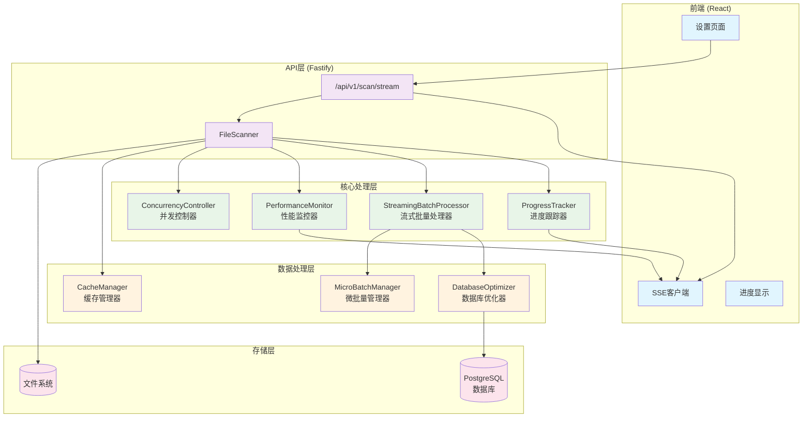
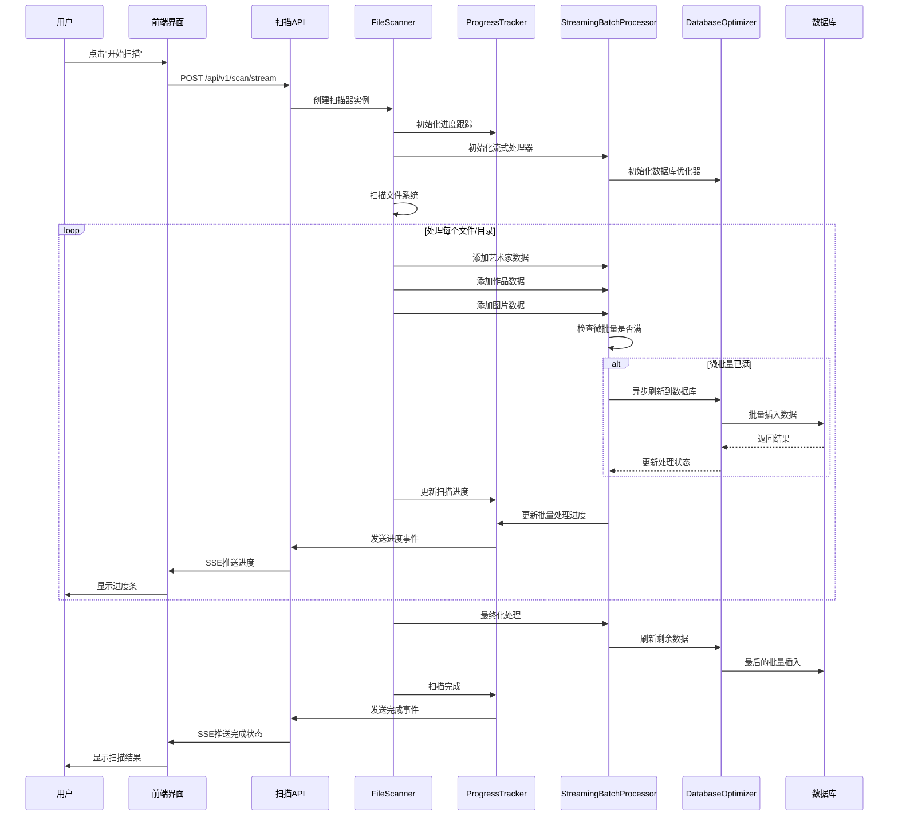

# 文件扫描系统架构指南

> 📖 **面向初级前端开发者的系统架构解读**
> 
> 本文档将帮助你理解artisan-shelf项目中复杂的文件扫描系统，从架构设计到运行流程，让你能够轻松阅读、理解和调试代码。

## 🎯 系统概览

### 什么是文件扫描系统？

文件扫描系统负责：
1. **扫描文件夹**：遍历指定目录，找到所有艺术作品
2. **解析数据**：从文件夹名称和文件中提取艺术家、作品、图片信息
3. **存储数据**：将解析的数据保存到数据库
4. **实时反馈**：通过SSE向前端实时推送扫描进度

### 为什么需要优化？

**原始问题**：扫描过程中会出现63秒的"卡死"现象，用户体验极差

**优化目标**：
- ✅ 消除长时间阻塞（从63秒降到<5秒）
- ✅ 提供流畅的实时进度反馈
- ✅ 提升整体扫描性能
- ✅ 增强系统稳定性

## 🏗️ 系统架构图

### 整体架构



### 核心组件说明

#### 🎮 前端层
- **设置页面**：用户触发扫描的界面
- **SSE客户端**：接收服务器实时推送的进度信息
- **进度显示**：展示扫描进度条和详细状态

#### 🌐 API层
- **扫描路由**：处理扫描请求，建立SSE连接
- **FileScanner**：扫描系统的主控制器

#### ⚙️ 核心处理层
- **ProgressTracker**：统一管理所有进度信息
- **StreamingBatchProcessor**：非阻塞的流式批量处理
- **PerformanceMonitor**：实时监控系统性能
- **ConcurrencyController**：控制并发任务数量

#### 💾 数据处理层
- **DatabaseOptimizer**：优化数据库操作性能
- **CacheManager**：缓存常用计算结果
- **MicroBatchManager**：管理微批量数据

#### 🗄️ 存储层
- **PostgreSQL**：存储艺术家、作品、图片数据
- **文件系统**：存储实际的图片文件

## 🔄 数据流向图

### 扫描数据流



## 🚀 运行时序图

### 详细执行流程

```mermaid
gantt
    title 文件扫描执行时序
    dateFormat X
    axisFormat %s
    
    section 初始化阶段
    创建扫描器实例    :init1, 0, 1s
    初始化组件       :init2, after init1, 1s
    建立SSE连接      :init3, after init2, 1s
    
    section 文件扫描阶段
    并发扫描文件系统   :scan1, after init3, 10s
    解析艺术家信息    :scan2, after init3, 12s
    解析作品信息     :scan3, after init3, 15s
    
    section 批量处理阶段
    微批量1处理      :batch1, after init3, 3s
    微批量2处理      :batch2, after batch1, 3s
    微批量3处理      :batch3, after batch2, 3s
    微批量4处理      :batch4, after batch3, 3s
    微批量5处理      :batch5, after batch4, 3s
    
    section 进度反馈
    实时进度更新     :progress, after init3, 15s
    
    section 完成阶段
    最终化处理       :final1, after scan3, 2s
    清理资源        :final2, after final1, 1s
```



## 🔧 核心组件详解

### 1. StreamingBatchProcessor（流式批量处理器）

**作用**：解决原始批量处理的阻塞问题

**工作原理**：
```
传统方式：收集1000条数据 → 一次性插入数据库（阻塞63秒）
优化方式：收集50条数据 → 立即异步插入 → 继续收集下一批
```

**关键特性**：
- 🔄 **微批量**：每50条数据就处理一次
- ⚡ **异步处理**：不阻塞主线程
- 🔀 **并发控制**：最多3个批次同时处理
- 🔁 **自动重试**：失败时自动重试3次

**代码位置**：`packages/api/src/services/scanner/StreamingBatchProcessor.ts`

### 2. ProgressTracker（进度跟踪器）

**作用**：统一管理和计算所有进度信息

**进度权重分配**：
- 📁 文件扫描：70%
- 💾 批量处理：25%
- ✅ 最终化：5%

**更新频率**：
- 扫描进度：每处理10个文件更新一次
- 批量进度：每1秒更新一次
- 阻塞检测：每1秒检查一次

**代码位置**：`packages/api/src/services/scanner/ProgressTracker.ts`

### 3. DatabaseOptimizer（数据库优化器）

**作用**：提升数据库操作性能

**优化策略**：
- 🏊 **连接池**：6个并发数据库连接
- 🚀 **查询优化**：自动添加批量操作提示
- 📦 **事务批处理**：5秒超时的批量事务
- 🔄 **重试机制**：失败时指数退避重试

**代码位置**：`packages/api/src/services/scanner/DatabaseOptimizer.ts`

### 4. PerformanceMonitor（性能监控器）

**作用**：实时监控系统性能，预防问题

**监控指标**：
- 💾 内存使用率
- ⏱️ 数据库查询时间
- 📊 队列长度
- 🚫 阻塞检测

**告警阈值**：
- 阻塞时间 > 5秒
- 内存使用 > 85%
- 查询时间 > 3秒
- 队列长度 > 1000

**代码位置**：`packages/api/src/services/scanner/PerformanceMonitor.ts`

## 📊 性能对比

### 优化前 vs 优化后

| 指标 | 优化前 | 优化后 | 改进幅度 |
|------|--------|--------|----------|
| **最大阻塞时间** | 63秒 | <5秒 | 🚀 92% ↓ |
| **进度更新间隔** | 63秒空白 | 1秒 | 🚀 98% ↓ |
| **批量处理方式** | 同步阻塞 | 异步流式 | 🏗️ 架构级改进 |
| **微批量大小** | 1000条 | 50条 | 📉 95% ↓ |
| **并发处理** | 单线程 | 3并发 | 📈 300% ↑ |
| **数据库连接** | 单连接 | 连接池(6) | 📈 600% ↑ |
| **错误恢复** | 无 | 3次重试 | ✨ 新增功能 |
| **性能监控** | 无 | 全方位监控 | ✨ 新增功能 |

## 🎮 前端交互流程

### SSE事件类型

```typescript
// 进度事件
{
  "type": "progress",
  "data": {
    "phase": "scanning",           // 当前阶段
    "message": "已处理 150/1631 个任务",
    "percentage": 45,              // 整体进度百分比
    "current": 150,                // 当前处理数量
    "total": 1631,                 // 总数量
    "estimatedSecondsRemaining": 120 // 预计剩余时间
  }
}

// 完成事件
{
  "type": "complete",
  "data": {
    "success": true,
    "result": {
      "newArtworks": 1414,         // 新增作品数
      "newImages": 38573,          // 新增图片数
      "scannedDirectories": 1395   // 扫描目录数
    }
  }
}

// 错误事件
{
  "type": "error",
  "data": {
    "success": false,
    "error": "扫描路径不存在"
  }
}
```

### 前端处理逻辑

```typescript
// 建立SSE连接
const eventSource = new EventSource('/api/v1/scan/stream?force=true');

// 监听进度事件
eventSource.addEventListener('progress', (event) => {
  const data = JSON.parse(event.data);
  updateProgressBar(data.percentage);
  updateStatusMessage(data.message);
  updateTimeEstimate(data.estimatedSecondsRemaining);
});

// 监听完成事件
eventSource.addEventListener('complete', (event) => {
  const data = JSON.parse(event.data);
  showSuccessMessage(data.result);
  eventSource.close();
});

// 监听错误事件
eventSource.addEventListener('error', (event) => {
  const data = JSON.parse(event.data);
  showErrorMessage(data.error);
  eventSource.close();
});
```

## 🐛 调试指南

### 常见问题排查

#### 1. 扫描卡住不动

**可能原因**：
- 文件系统权限问题
- 数据库连接问题
- 内存不足

**排查步骤**：
1. 检查后端日志：`packages/api/logs/`
2. 查看性能监控指标
3. 检查数据库连接状态

**关键日志**：
```
[WARN] Performance alert: High memory usage: 87.2%
[ERROR] Blocking detected: duration=5245ms
[INFO] Database health status: critical
```

#### 2. 进度更新不及时

**可能原因**：
- SSE连接中断
- ProgressTracker配置问题
- 网络延迟

**排查步骤**：
1. 检查浏览器Network面板的SSE连接
2. 查看进度更新间隔配置
3. 检查服务器负载

#### 3. 数据库插入失败

**可能原因**：
- 唯一约束冲突
- 数据格式错误
- 连接池耗尽

**排查步骤**：
1. 查看DatabaseOptimizer的错误日志
2. 检查数据库约束设置
3. 监控连接池使用情况

### 调试工具

#### 1. 性能监控面板

```typescript
// 获取实时性能指标
const metrics = performanceMonitor.getCurrentMetrics();
console.log('当前性能指标:', metrics);

// 获取健康状态
const health = performanceMonitor.getHealthStatus();
console.log('系统健康状态:', health);
```

#### 2. 批量处理状态

```typescript
// 获取批量处理统计
const stats = streamingBatchProcessor.getStats();
console.log('批量处理状态:', stats);

// 检查队列状态
const queueStatus = stats.queue;
console.log('队列状态:', queueStatus);
```

#### 3. 数据库优化器状态

```typescript
// 获取数据库性能统计
const dbStats = databaseOptimizer.getStats();
console.log('数据库性能:', dbStats);

// 检查连接池状态
const poolStatus = dbStats.connectionPool;
console.log('连接池状态:', poolStatus);
```

## 🔧 配置调优

### 关键配置参数

#### StreamingBatchProcessor配置

```typescript
const streamingConfig = {
  microBatchSize: 50,           // 微批量大小（建议：20-100）
  maxConcurrentFlushes: 3,      // 最大并发刷新数（建议：2-5）
  flushInterval: 2000,          // 刷新间隔ms（建议：1000-5000）
  progressUpdateInterval: 1000, // 进度更新间隔ms（建议：500-2000）
};
```

#### DatabaseOptimizer配置

```typescript
const dbConfig = {
  connectionPoolSize: 6,        // 连接池大小（建议：4-10）
  queryTimeout: 30000,          // 查询超时ms（建议：10000-60000）
  batchTimeout: 5000,           // 批量处理超时ms（建议：3000-10000）
  retryAttempts: 3,             // 重试次数（建议：2-5）
};
```

#### PerformanceMonitor配置

```typescript
const monitorConfig = {
  alertThresholds: {
    blockingDuration: 5000,     // 阻塞告警阈值ms（建议：3000-10000）
    memoryUsage: 85,            // 内存使用告警阈值%（建议：80-90）
    averageQueryTime: 3000,     // 查询时间告警阈值ms（建议：1000-5000）
    queueLength: 1000,          // 队列长度告警阈值（建议：500-2000）
  }
};
```

### 性能调优建议

#### 🚀 提升扫描速度
1. **增加并发数**：调整`maxConcurrentFlushes`到4-5
2. **减小批量大小**：将`microBatchSize`调整到30-40
3. **优化数据库**：增加`connectionPoolSize`到8-10

#### 💾 降低内存使用
1. **减小批量大小**：将`microBatchSize`调整到20-30
2. **缩短刷新间隔**：将`flushInterval`调整到1000-1500
3. **启用更频繁的GC**：调整Node.js内存参数

#### 🔄 提升稳定性
1. **增加重试次数**：将`retryAttempts`调整到5
2. **延长超时时间**：将`queryTimeout`调整到60000
3. **降低告警阈值**：提前发现潜在问题

## 📚 学习路径

### 对于初级前端开发者

#### 第一步：理解整体流程
1. 📖 阅读本文档的"系统概览"部分
2. 🎯 理解扫描的基本目标和流程
3. 📊 查看"性能对比"了解优化效果

#### 第二步：掌握前端交互
1. 🌐 学习SSE（Server-Sent Events）基础
2. 📡 理解前端如何接收实时进度
3. 🎮 查看前端代码：`packages/web/src/pages/Settings.tsx`

#### 第三步：了解后端架构
1. 🏗️ 理解"系统架构图"中的各个组件
2. 🔄 跟踪"数据流向图"中的数据传递
3. ⏱️ 理解"运行时序图"中的执行顺序

#### 第四步：深入核心组件
1. 📁 从FileScanner开始：`packages/api/src/services/scanner.ts`
2. 🔄 理解StreamingBatchProcessor的工作原理
3. 📊 学习ProgressTracker如何计算进度

#### 第五步：实践调试
1. 🐛 使用"调试指南"排查问题
2. 🔧 尝试调整"配置参数"
3. 📈 观察性能监控数据

### 推荐学习资源

#### 技术概念
- **SSE (Server-Sent Events)**：[MDN文档](https://developer.mozilla.org/en-US/docs/Web/API/Server-sent_events)
- **异步编程**：Promise、async/await、事件循环
- **数据库优化**：连接池、批量操作、事务
- **性能监控**：指标收集、告警机制

#### 相关代码文件
- 🎯 **主控制器**：`packages/api/src/services/scanner.ts`
- 🔄 **流式处理**：`packages/api/src/services/scanner/StreamingBatchProcessor.ts`
- 📊 **进度跟踪**：`packages/api/src/services/scanner/ProgressTracker.ts`
- 💾 **数据库优化**：`packages/api/src/services/scanner/DatabaseOptimizer.ts`
- 📈 **性能监控**：`packages/api/src/services/scanner/PerformanceMonitor.ts`
- 🌐 **API路由**：`packages/api/src/routes/scan.ts`
- 🎮 **前端界面**：`packages/web/src/pages/Settings.tsx`

## 🎉 总结

这个文件扫描系统通过以下关键技术实现了从"卡死63秒"到"流畅响应"的巨大改进：

1. **🔄 微批量流式处理**：将大批量拆分为小批量，异步处理
2. **📊 多维度进度跟踪**：提供详细、实时的进度反馈
3. **💾 数据库性能优化**：连接池、查询优化、批量操作
4. **📈 全方位性能监控**：实时监控、预警、自动恢复
5. **🎮 流畅的用户体验**：SSE实时推送、准确的时间估算

通过理解这些核心概念和组件，你就能够：
- ✅ 读懂复杂的扫描代码
- ✅ 有效调试扫描问题
- ✅ 优化系统性能
- ✅ 扩展新功能

记住：**复杂的系统是由简单的组件组合而成的**。掌握了每个组件的作用和交互方式，整个系统就不再神秘了！

---

💡 **提示**：建议将本文档收藏，在阅读和调试代码时随时参考。如果遇到问题，可以按照"调试指南"的步骤进行排查。