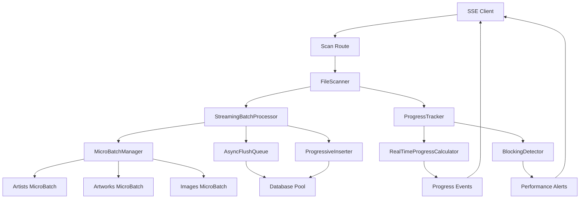
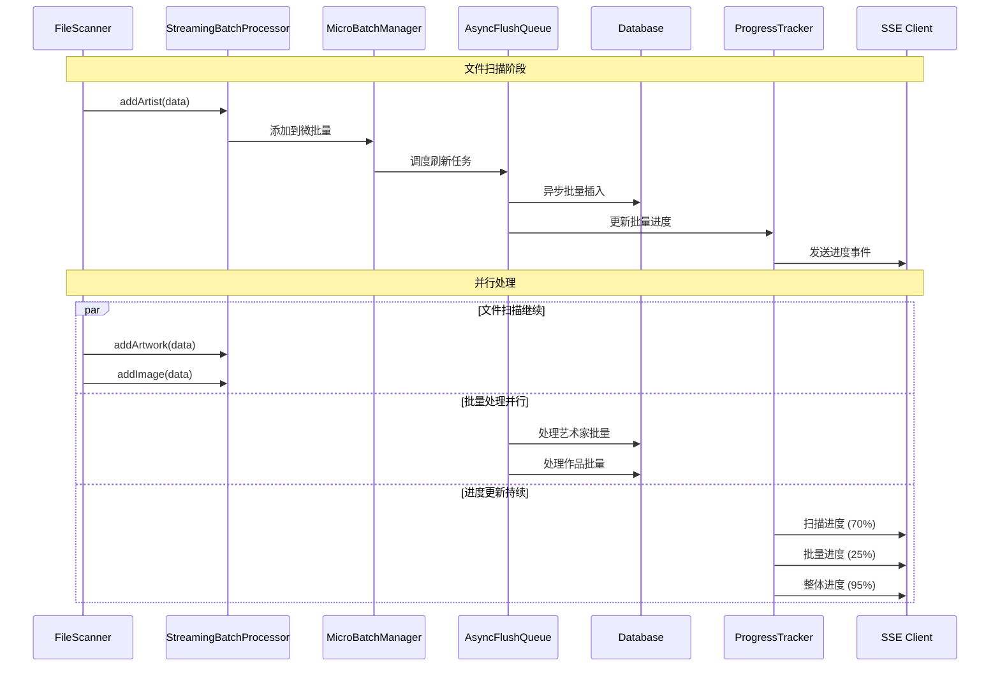

# SSE扫描阻塞优化 - 架构设计

## 系统架构图



## 核心优化策略

### 1. 流式批量处理 (Streaming Batch Processing)

#### 问题
当前批量处理是**阻塞式**的：
```typescript
// 当前实现 - 阻塞
if (this.batchProcessor.shouldFlush()) {
  await this.batchProcessor.flush() // 🔥 阻塞63秒
}
```

#### 解决方案
实现**非阻塞流式处理**：
```typescript
// 新实现 - 流式
if (this.streamingBatchProcessor.shouldStartMicroFlush()) {
  this.streamingBatchProcessor.startMicroFlush() // 🚀 非阻塞
}
```

#### 核心设计

**MicroBatch 策略**:
```typescript
interface MicroBatchConfig {
  microBatchSize: 50        // 微批量大小
  maxConcurrentFlushes: 3   // 最大并发刷新数
  flushInterval: 2000       // 刷新间隔(ms)
  progressUpdateInterval: 1000 // 进度更新间隔
}
```

**StreamingBatchProcessor 架构**:
```typescript
class StreamingBatchProcessor {
  private microBatches: Map<string, MicroBatch> = new Map()
  private flushQueue: AsyncQueue<FlushTask> = new AsyncQueue()
  private progressTracker: ProgressTracker
  
  // 非阻塞添加数据
  addData(type: EntityType, data: any): void {
    const microBatch = this.getMicroBatch(type)
    microBatch.add(data)
    
    if (microBatch.shouldFlush()) {
      this.scheduleFlush(type, microBatch)
    }
  }
  
  // 异步调度刷新
  private scheduleFlush(type: EntityType, microBatch: MicroBatch): void {
    const flushTask = new FlushTask(type, microBatch.getData())
    this.flushQueue.enqueue(flushTask)
  }
  
  // 后台处理刷新队列
  private async processFlushQueue(): Promise<void> {
    while (this.flushQueue.hasItems()) {
      const tasks = this.flushQueue.dequeue(this.config.maxConcurrentFlushes)
      await Promise.allSettled(tasks.map(task => this.executeFlush(task)))
    }
  }
}
```

### 2. 渐进式进度更新 (Progressive Progress Updates)

#### 问题
当前进度更新在批量处理期间中断：
```typescript
// 当前问题
21:40:44 - 进度更新: 已处理 700/1631 个任务 (38%)
// 63秒空白期
21:41:47 - 进度更新: 批量插入数据... (38%)
```

#### 解决方案
实现**多维度进度跟踪**：

```typescript
interface DetailedProgress {
  // 文件扫描进度
  scanning: {
    processed: number
    total: number
    percentage: number
  }
  
  // 批量处理进度
  batching: {
    artists: { processed: number, total: number }
    artworks: { processed: number, total: number }
    images: { processed: number, total: number }
    tags: { processed: number, total: number }
  }
  
  // 整体进度
  overall: {
    phase: 'scanning' | 'batching' | 'finalizing'
    percentage: number
    estimatedRemaining: number
  }
}
```

**RealTimeProgressCalculator**:
```typescript
class RealTimeProgressCalculator {
  private scanningWeight = 0.7   // 扫描占70%
  private batchingWeight = 0.25  // 批量处理占25%
  private finalizingWeight = 0.05 // 最终化占5%
  
  calculateOverallProgress(detailed: DetailedProgress): number {
    const scanProgress = detailed.scanning.percentage * this.scanningWeight
    const batchProgress = this.calculateBatchProgress(detailed.batching) * this.batchingWeight
    const finalProgress = detailed.overall.phase === 'finalizing' ? this.finalizingWeight : 0
    
    return scanProgress + batchProgress + finalProgress
  }
  
  private calculateBatchProgress(batching: DetailedProgress['batching']): number {
    const weights = { artists: 0.1, artworks: 0.2, images: 0.6, tags: 0.1 }
    
    return Object.entries(batching).reduce((total, [type, progress]) => {
      const typeProgress = progress.total > 0 ? progress.processed / progress.total : 0
      return total + (typeProgress * weights[type as keyof typeof weights])
    }, 0) * 100
  }
}
```

### 3. 异步队列管理 (Async Queue Management)

#### AsyncFlushQueue 设计
```typescript
class AsyncFlushQueue {
  private queue: FlushTask[] = []
  private processing: Set<string> = new Set()
  private maxConcurrent: number
  
  enqueue(task: FlushTask): void {
    this.queue.push(task)
    this.processNext()
  }
  
  private async processNext(): Promise<void> {
    if (this.processing.size >= this.maxConcurrent) return
    
    const task = this.queue.shift()
    if (!task) return
    
    const taskId = this.generateTaskId(task)
    this.processing.add(taskId)
    
    try {
      await this.executeTask(task)
      this.updateProgress(task)
    } finally {
      this.processing.delete(taskId)
      this.processNext() // 处理下一个任务
    }
  }
}
```

### 4. 阻塞检测机制 (Blocking Detection)

#### BlockingDetector 设计
```typescript
class BlockingDetector {
  private lastProgressTime: number = Date.now()
  private blockingThreshold: number = 5000 // 5秒阈值
  private onBlockingDetected?: (duration: number) => void
  
  updateProgress(): void {
    this.lastProgressTime = Date.now()
  }
  
  startMonitoring(): void {
    setInterval(() => {
      const now = Date.now()
      const duration = now - this.lastProgressTime
      
      if (duration > this.blockingThreshold) {
        this.onBlockingDetected?.(duration)
      }
    }, 1000)
  }
}
```

## 数据流向图



## 接口契约定义

### StreamingBatchProcessor 接口
```typescript
interface IStreamingBatchProcessor {
  // 数据添加接口
  addArtist(data: ArtistData): void
  addArtwork(data: ArtworkData): void
  addImage(data: ImageData): void
  addTag(data: TagData): void
  
  // 进度回调接口
  onProgress(callback: (progress: DetailedProgress) => void): void
  
  // 状态查询接口
  getStats(): BatchingStats
  isProcessing(): boolean
  
  // 控制接口
  pause(): void
  resume(): void
  finalize(): Promise<BatchResult>
}
```

### 进度事件接口
```typescript
interface ProgressEvent {
  type: 'scanning' | 'batching' | 'finalizing'
  timestamp: number
  data: {
    scanning?: ScanningProgress
    batching?: BatchingProgress
    overall: OverallProgress
  }
}

interface ScanningProgress {
  processed: number
  total: number
  rate: number // files per second
  estimatedRemaining: number // seconds
}

interface BatchingProgress {
  artists: EntityProgress
  artworks: EntityProgress
  images: EntityProgress
  tags: EntityProgress
  activeFlushes: number
  queueLength: number
}

interface EntityProgress {
  processed: number
  total: number
  inQueue: number
  processing: number
}
```

## 性能优化策略

### 1. 内存管理优化
```typescript
class MemoryOptimizedMicroBatch {
  private data: any[] = []
  private maxSize: number = 50
  
  add(item: any): boolean {
    if (this.data.length >= this.maxSize) {
      return false // 触发刷新
    }
    this.data.push(item)
    return true
  }
  
  flush(): any[] {
    const result = this.data
    this.data = [] // 立即释放内存
    return result
  }
}
```

### 2. 数据库连接池优化
```typescript
interface DatabaseConfig {
  maxConnections: 10
  batchTimeout: 5000
  retryAttempts: 3
  connectionTimeout: 30000
}
```

### 3. 错误恢复机制
```typescript
class ErrorRecoveryManager {
  async handleBatchError(
    task: FlushTask, 
    error: Error
  ): Promise<void> {
    if (this.isRetryableError(error)) {
      await this.retryWithBackoff(task)
    } else {
      await this.fallbackToSingleInserts(task)
    }
  }
}
```

## 兼容性保证

### API 接口兼容
```typescript
// 保持现有接口不变
export interface ScanOptions {
  scanPath: string
  supportedExtensions?: string[]
  forceUpdate?: boolean
  onProgress?: (progress: ScanProgress) => void // 保持兼容
}

// 内部增强进度信息
interface EnhancedScanProgress extends ScanProgress {
  detailed?: DetailedProgress // 可选的详细信息
}
```

### 渐进式升级策略
```typescript
class FileScanner {
  private useStreamingBatch: boolean = true
  
  constructor(prisma: PrismaClient, logger: Logger, options?: {
    enableStreaming?: boolean
  }) {
    this.useStreamingBatch = options?.enableStreaming ?? true
    
    if (this.useStreamingBatch) {
      this.batchProcessor = new StreamingBatchProcessor(...)
    } else {
      this.batchProcessor = new BatchProcessor(...) // 保持向后兼容
    }
  }
}
```

## 监控和调试

### 性能指标收集
```typescript
interface StreamingMetrics {
  microBatchStats: {
    averageFlushTime: number
    flushesPerSecond: number
    queueLength: number
  }
  progressStats: {
    updateFrequency: number
    blockingEvents: number
    maxBlockingDuration: number
  }
  memoryStats: {
    peakUsage: number
    averageUsage: number
    gcEvents: number
  }
}
```

### 调试接口
```typescript
interface DebugInterface {
  getCurrentState(): SystemState
  getQueueStatus(): QueueStatus
  getPerformanceReport(): PerformanceReport
  enableVerboseLogging(): void
}
```

## 质量门控

### 性能要求
- ✅ 进度更新间隔 < 5秒
- ✅ 最大阻塞时间 < 10秒
- ✅ 内存使用增长 < 20%
- ✅ 整体扫描时间不增加

### 功能要求
- ✅ 扫描结果100%一致
- ✅ 错误处理机制完整
- ✅ 取消机制正常工作
- ✅ API接口完全兼容

### 可靠性要求
- ✅ 异常恢复机制
- ✅ 数据一致性保证
- ✅ 资源泄漏防护
- ✅ 并发安全保证