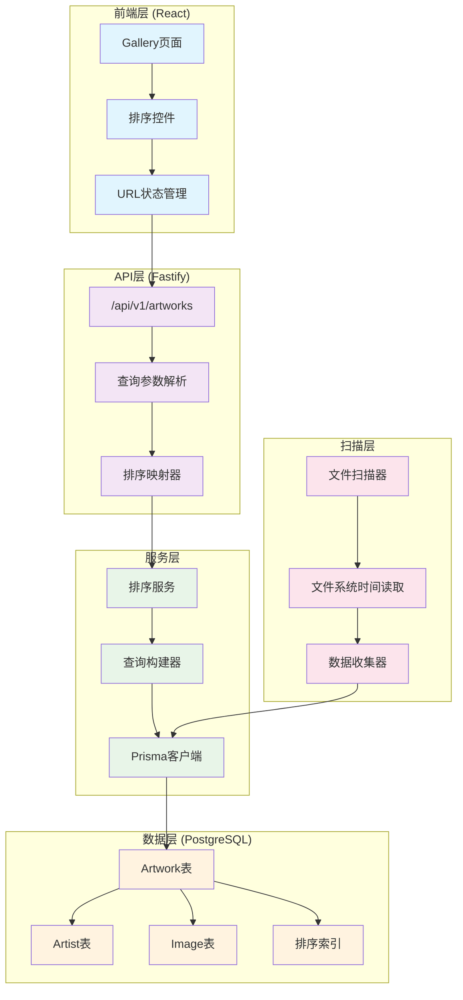
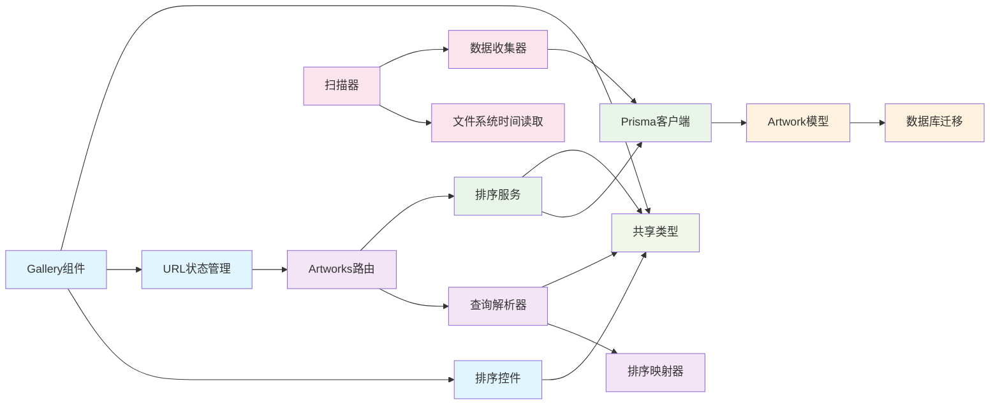
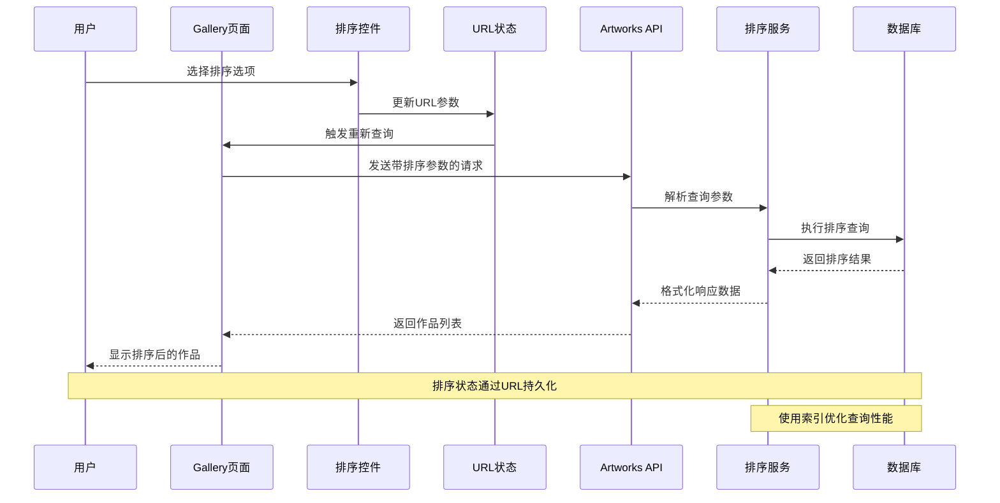

# DESIGN_artwork_sorting.md

## 系统架构设计

### 整体架构图



### 分层设计和核心组件

#### 1. 前端层 (React)

**Gallery页面组件**
- 职责：作品列表展示和用户交互
- 输入：URL参数（page, pageSize, tags, search, sortBy）
- 输出：渲染的作品网格和分页控件

**排序控件组件**
```typescript
interface SortControlProps {
  value: SortOption
  onChange: (sortBy: SortOption) => void
  className?: string
}

const SortControl: React.FC<SortControlProps> = ({ value, onChange, className }) => {
  // 下拉选择器实现
}
```

**URL状态管理**
```typescript
const useSortState = () => {
  const [searchParams, setSearchParams] = useSearchParams()
  
  const sortBy = (searchParams.get('sortBy') as SortOption) || 'newest'
  
  const setSortBy = (newSortBy: SortOption) => {
    const newParams = new URLSearchParams(searchParams)
    if (newSortBy === 'newest') {
      newParams.delete('sortBy') // 默认值不需要在URL中
    } else {
      newParams.set('sortBy', newSortBy)
    }
    newParams.set('page', '1') // 重置到第一页
    setSearchParams(newParams)
  }
  
  return { sortBy, setSortBy }
}
```

#### 2. API层 (Fastify)

**查询参数解析器**
```typescript
interface ParsedArtworksQuery {
  page: number
  pageSize: number
  tags?: string[]
  search?: string
  sortBy: SortOption
}

const parseArtworksQuery = (query: any): ParsedArtworksQuery => {
  return {
    page: Math.max(1, parseInt(query.page) || 1),
    pageSize: Math.min(100, Math.max(1, parseInt(query.pageSize) || 20)),
    tags: query.tags ? query.tags.split(',').map(t => t.trim()).filter(Boolean) : undefined,
    search: query.search?.trim() || undefined,
    sortBy: (query.sortBy as SortOption) || 'newest'
  }
}
```

**排序映射器**
```typescript
type PrismaOrderBy = {
  [key: string]: 'asc' | 'desc' | PrismaOrderBy
}

const sortMappings: Record<SortOption, PrismaOrderBy> = {
  'newest': { directoryCreatedAt: 'desc' },
  'title_asc': { title: 'asc' },
  'title_desc': { title: 'desc' },
  'artist_asc': { artist: { name: 'asc' } },
  'artist_desc': { artist: { name: 'desc' } },
  'images_desc': { imageCount: 'desc' },
  'images_asc': { imageCount: 'asc' },
  'source_date_desc': { sourceDate: 'desc' },
  'source_date_asc': { sourceDate: 'asc' }
}

const mapSortOption = (sortBy: SortOption): PrismaOrderBy => {
  return sortMappings[sortBy] || sortMappings['newest']
}
```

#### 3. 服务层

**排序服务**
```typescript
class SortService {
  constructor(private prisma: PrismaClient) {}
  
  async getArtworks(query: ParsedArtworksQuery): Promise<ArtworksResponse> {
    const { page, pageSize, tags, search, sortBy } = query
    const skip = (page - 1) * pageSize
    
    // 构建查询条件
    const whereClause = this.buildWhereClause(tags, search)
    
    // 构建排序条件
    const orderBy = mapSortOption(sortBy)
    
    // 执行查询
    const [total, artworks] = await Promise.all([
      this.prisma.artwork.count({ where: whereClause }),
      this.prisma.artwork.findMany({
        where: whereClause,
        include: {
          images: { take: 1, orderBy: { sortOrder: 'asc' } },
          artist: true,
          artworkTags: { include: { tag: true } }
        },
        orderBy,
        skip,
        take: pageSize
      })
    ])
    
    // 格式化响应
    return this.formatResponse(artworks, total, page, pageSize)
  }
  
  private buildWhereClause(tags?: string[], search?: string) {
    // 现有的查询条件构建逻辑
  }
  
  private formatResponse(artworks: any[], total: number, page: number, pageSize: number) {
    // 现有的响应格式化逻辑
  }
}
```

#### 4. 数据层 (PostgreSQL)

**数据库模型更新**
```prisma
model Artwork {
  id                  Int       @id @default(autoincrement())
  title               String
  description         String?
  sourceDate          DateTime? // 作品创建时间
  directoryCreatedAt  DateTime? // 目录创建时间
  imageCount          Int       @default(0) // 图片数量冗余字段
  images              Image[]
  artist              Artist?   @relation(fields: [artistId], references: [id])
  artistId            Int?
  artworkTags         ArtworkTag[]
  createdAt           DateTime  @default(now())
  updatedAt           DateTime  @updatedAt

  @@index([title, description])
  @@index([sourceDate])         // 作品创建时间索引
  @@index([directoryCreatedAt]) // 目录创建时间索引
  @@index([imageCount])         // 图片数量索引
  @@unique([artistId, title], name: "unique_artist_title")
}
```

**数据库迁移脚本**
```sql
-- 添加新字段
ALTER TABLE "Artwork" ADD COLUMN "sourceDate" TIMESTAMP(3);
ALTER TABLE "Artwork" ADD COLUMN "directoryCreatedAt" TIMESTAMP(3);
ALTER TABLE "Artwork" ADD COLUMN "imageCount" INTEGER NOT NULL DEFAULT 0;

-- 创建索引
CREATE INDEX "Artwork_sourceDate_idx" ON "Artwork"("sourceDate");
CREATE INDEX "Artwork_directoryCreatedAt_idx" ON "Artwork"("directoryCreatedAt");
CREATE INDEX "Artwork_imageCount_idx" ON "Artwork"("imageCount");

-- 初始化现有数据
UPDATE "Artwork" SET "directoryCreatedAt" = "createdAt" WHERE "directoryCreatedAt" IS NULL;
UPDATE "Artwork" SET "sourceDate" = "createdAt" WHERE "sourceDate" IS NULL;

UPDATE "Artwork" SET "imageCount" = (
  SELECT COUNT(*) FROM "Image" WHERE "Image"."artworkId" = "Artwork"."id"
);
```

#### 5. 扫描层

**文件系统时间读取器**
```typescript
class FileSystemTimeReader {
  async getDirectoryCreatedTime(dirPath: string): Promise<Date> {
    try {
      const stats = await fs.stat(dirPath)
      // 优先使用 birthtime（创建时间），回退到 ctime（状态变更时间）
      return stats.birthtime && stats.birthtime.getTime() > 0 
        ? stats.birthtime 
        : stats.ctime
    } catch (error) {
      // 如果无法获取文件系统时间，使用当前时间
      return new Date()
    }
  }
}
```

**数据收集器增强**
```typescript
class EnhancedDataCollector {
  constructor(
    private fsTimeReader: FileSystemTimeReader,
    private batchProcessor: BatchProcessor
  ) {}
  
  async collectArtworkData(artworkPath: string, artistName: string): Promise<void> {
    // 获取目录创建时间
    const directoryCreatedAt = await this.fsTimeReader.getDirectoryCreatedTime(artworkPath)
    
    // 收集图片信息
    const imagePaths = await this.getImagePaths(artworkPath)
    const imageCount = imagePaths.length
    
    // 解析元数据
    const metadata = await this.parseMetadata(artworkPath)
    const descriptionLength = metadata.description?.length || 0
    
    // 添加到批量处理器
    this.batchProcessor.addArtwork({
      title: path.basename(artworkPath),
      description: metadata.description,
      artistName,
      directoryCreatedAt, // 新增字段
      imageCount,         // 新增字段
      descriptionLength   // 新增字段
    })
  }
}
```

### 模块依赖关系图



### 接口契约定义

#### 1. API接口契约

**请求接口**
```typescript
// GET /api/v1/artworks
interface ArtworksQueryParams {
  page?: string          // 页码，默认1
  pageSize?: string      // 页大小，默认20，最大100
  tags?: string          // 标签过滤，逗号分隔
  search?: string        // 搜索关键词
  sortBy?: SortOption    // 排序选项，默认'newest'
}

type SortOption = 
  | 'newest'           // 按最新添加（默认）
  | 'title_asc'        // 按名称升序
  | 'title_desc'       // 按名称降序
  | 'artist_asc'       // 按艺术家名称升序
  | 'artist_desc'      // 按艺术家名称降序
  | 'images_desc'      // 按图片数量降序
  | 'images_asc'       // 按图片数量升序
  | 'source_date_desc' // 按作品创建时间降序
  | 'source_date_asc'  // 按作品创建时间升序
```

**响应接口**
```typescript
// 响应格式保持不变，确保向后兼容
interface ArtworksResponse {
  items: Artwork[]
  total: number
  page: number
  pageSize: number
}

interface Artwork {
  id: number
  title: string
  description?: string
  artist?: Artist
  images: Image[]
  tags: string[]
  imageCount: number     // 新增：图片总数
  createdAt: string
  updatedAt: string
}
```

#### 2. 组件接口契约

**排序控件接口**
```typescript
interface SortControlProps {
  value: SortOption
  onChange: (sortBy: SortOption) => void
  disabled?: boolean
  className?: string
  size?: 'sm' | 'md' | 'lg'
}

interface SortOption {
  value: string
  label: string
  group?: string  // 用于分组显示
}
```

#### 3. 服务接口契约

**排序服务接口**
```typescript
interface ISortService {
  getArtworks(query: ParsedArtworksQuery): Promise<ArtworksResponse>
  getSortOptions(): SortOptionDefinition[]
  validateSortOption(sortBy: string): boolean
}

interface SortOptionDefinition {
  value: SortOption
  label: string
  description: string
  group: 'time' | 'name' | 'count'
  prismaOrderBy: PrismaOrderBy
}
```

### 数据流向图



### 异常处理策略

#### 1. API层异常处理
```typescript
// 排序参数验证
const validateSortOption = (sortBy: string): SortOption => {
  const validOptions = Object.keys(sortMappings) as SortOption[]
  if (validOptions.includes(sortBy as SortOption)) {
    return sortBy as SortOption
  }
  // 无效排序选项时回退到默认值
  return 'newest'
}

// 数据库查询异常处理
try {
  const result = await sortService.getArtworks(query)
  return reply.send(result)
} catch (error) {
  server.log.error({ error, query }, 'Failed to fetch sorted artworks')
  return reply.code(500).send({ 
    error: 'Failed to fetch artworks',
    message: 'An error occurred while sorting artworks'
  })
}
```

#### 2. 前端异常处理
```typescript
// 排序状态异常恢复
const useSortState = () => {
  const [searchParams, setSearchParams] = useSearchParams()
  
  const sortBy = useMemo(() => {
    const paramValue = searchParams.get('sortBy')
    // 验证排序参数有效性
    if (paramValue && isValidSortOption(paramValue)) {
      return paramValue as SortOption
    }
    return 'newest' // 默认值
  }, [searchParams])
  
  // 错误边界处理
  const setSortBy = useCallback((newSortBy: SortOption) => {
    try {
      const newParams = new URLSearchParams(searchParams)
      if (newSortBy === 'newest') {
        newParams.delete('sortBy')
      } else {
        newParams.set('sortBy', newSortBy)
      }
      newParams.set('page', '1')
      setSearchParams(newParams)
    } catch (error) {
      console.error('Failed to update sort state:', error)
      // 回退到页面刷新
      window.location.reload()
    }
  }, [searchParams, setSearchParams])
  
  return { sortBy, setSortBy }
}
```

#### 3. 数据库异常处理
```typescript
// 文件系统时间获取异常处理
class FileSystemTimeReader {
  async getDirectoryCreatedTime(dirPath: string): Promise<Date> {
    try {
      const stats = await fs.stat(dirPath)
      const createdTime = stats.birthtime && stats.birthtime.getTime() > 0 
        ? stats.birthtime 
        : stats.ctime
      
      // 验证时间有效性
      if (createdTime.getTime() > Date.now()) {
        // 未来时间异常，使用当前时间
        return new Date()
      }
      
      return createdTime
    } catch (error) {
      // 文件系统访问失败，使用当前时间
      console.warn(`Failed to get directory created time for ${dirPath}:`, error)
      return new Date()
    }
  }
}

// 数据库迁移异常处理
const migrateArtworkData = async (prisma: PrismaClient) => {
  try {
    // 分批处理，避免内存溢出
    const batchSize = 100
    let offset = 0
    let hasMore = true
    
    while (hasMore) {
      const artworks = await prisma.artwork.findMany({
        where: { directoryCreatedAt: null },
        take: batchSize,
        skip: offset
      })
      
      if (artworks.length === 0) {
        hasMore = false
        break
      }
      
      // 批量更新
      await Promise.all(artworks.map(async (artwork) => {
        try {
          const imageCount = await prisma.image.count({
            where: { artworkId: artwork.id }
          })
          
          await prisma.artwork.update({
            where: { id: artwork.id },
            data: {
              directoryCreatedAt: artwork.createdAt,
              imageCount,
              descriptionLength: artwork.description?.length || 0
            }
          })
        } catch (error) {
          console.error(`Failed to migrate artwork ${artwork.id}:`, error)
          // 继续处理其他记录
        }
      }))
      
      offset += batchSize
    }
  } catch (error) {
    console.error('Failed to migrate artwork data:', error)
    throw error
  }
}
```

## 设计验证

### 架构一致性检查
- ✅ 与现有Fastify + Prisma + React架构保持一致
- ✅ 遵循现有的分层设计模式
- ✅ 复用现有的错误处理和日志记录机制
- ✅ 保持API的RESTful设计风格

### 性能设计验证
- ✅ 数据库索引设计合理，支持高效排序查询
- ✅ 冗余字段减少复杂关联查询的性能开销
- ✅ 分页查询避免大数据集的内存问题
- ✅ 前端状态管理避免不必要的API调用

### 可扩展性验证
- ✅ 排序选项易于扩展，只需更新映射配置
- ✅ 新的排序字段可以通过数据库迁移安全添加
- ✅ 前端组件设计支持动态排序选项
- ✅ API接口设计支持未来的排序功能扩展